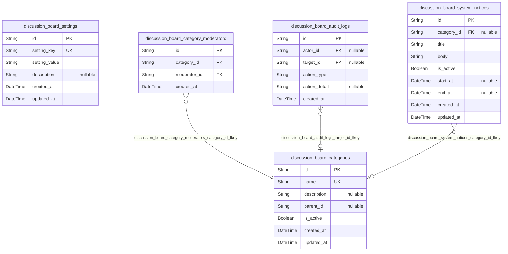
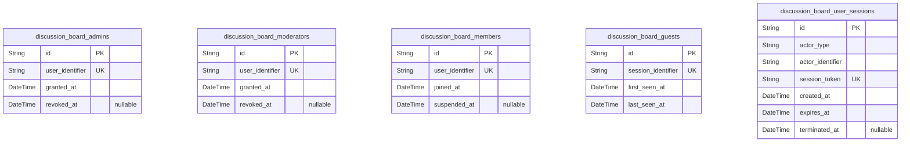
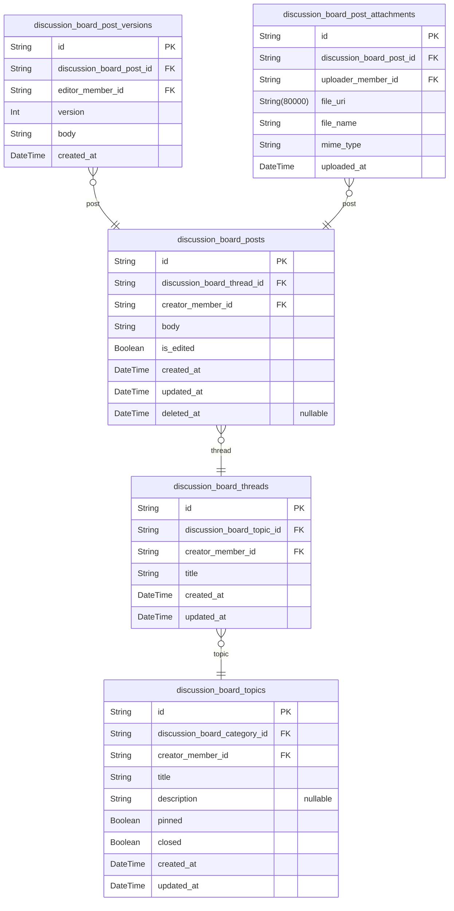
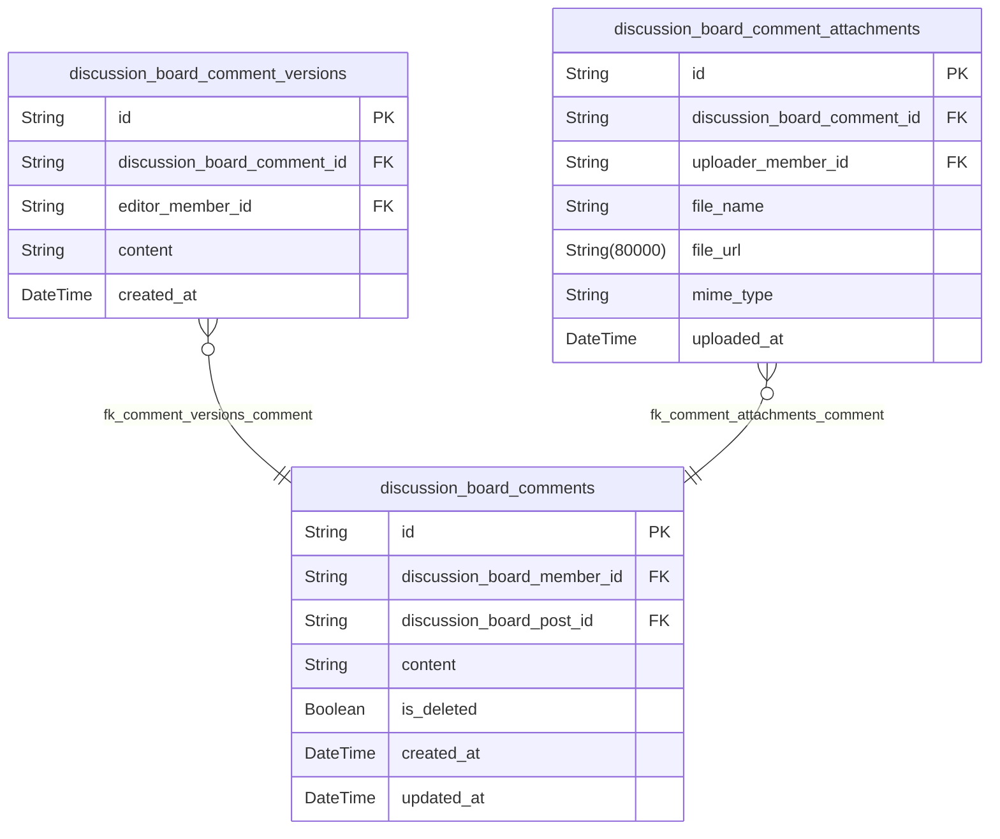
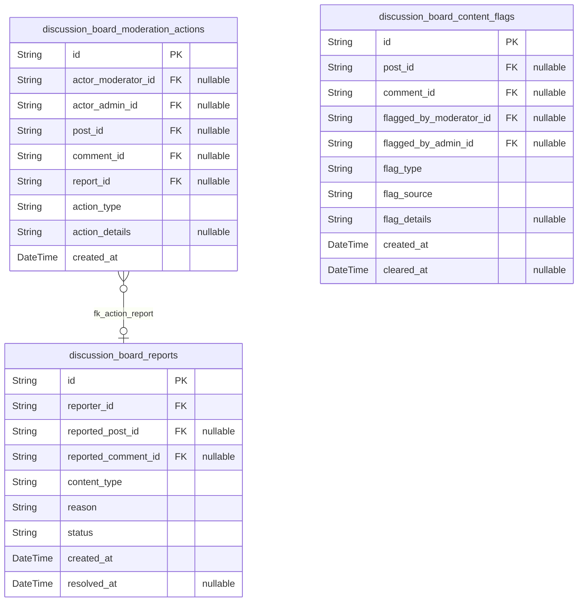
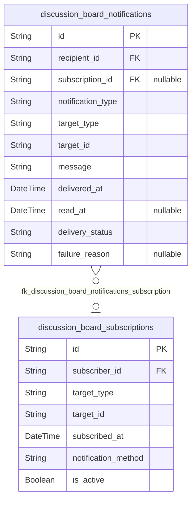
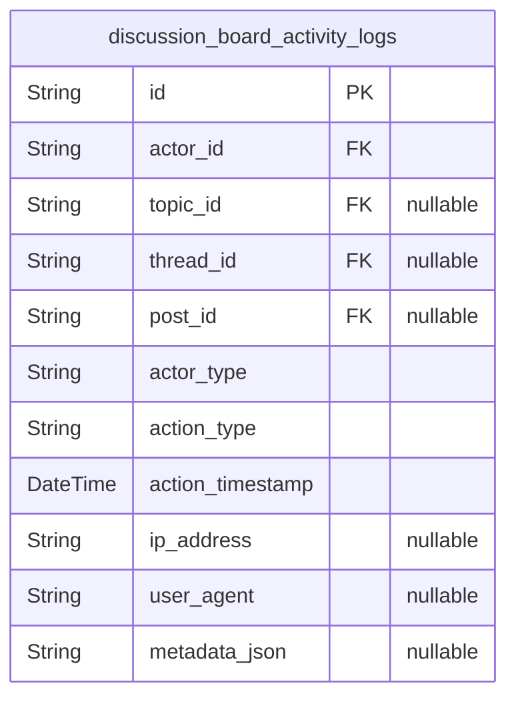
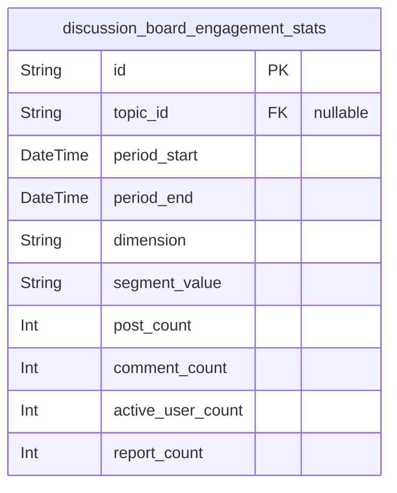

# Prisma Markdown

> Generated by [`prisma-markdown`](https://github.com/samchon/prisma-markdown)

- [Systematic](#systematic)
- [Actors](#actors)
- [Articles](#articles)
- [Comments](#comments)
- [Moderation](#moderation)
- [Notifications](#notifications)
- [Analytics](#analytics)
- [default](#default)

## Systematic

### `discussion_board_categories`

Discussion Board Category - Implements category management and administration from requirements.

Properties as follows:

- `id`: Primary Key.
- `name`: Category name. Unique, used to group topics.
- `description`: Optional details about the category's use or scope.
- `parent_id`: Self-reference for hierarchy. Null for top-level categories.
- `is_active`: Is the category currently enabled for participation?
- `created_at`: Creation timestamp for this category row.
- `updated_at`: Last updated timestamp for this row.

### `discussion_board_settings`

Discussion Board persistent settings table for board-level options and toggles.

Properties as follows:

- `id`: Primary Key.
- `setting_key`: Setting key, e.g., 'registration_open'. Must be unique.
- `setting_value`: Value of the setting. Text-based for flexibility.
- `description`: Optional description of what this setting controls.
- `created_at`: Creation timestamp for this setting row.
- `updated_at`: Last updated timestamp for this row.

### `discussion_board_category_moderators`

Junction table mapping moderators to categories for M:N relationship per requirements. Each assignment is unique per (category_id, moderator_id).

Properties as follows:

- `id`: Primary Key.
- `category_id`: Reference to discussion_board_categories.id.
- `moderator_id`: Reference to discussion_board_moderators.id (from Actors schema).
- `created_at`: Assignment event creation timestamp.

### `discussion_board_audit_logs`

System auditing log for key events (config changes, assignments, bans, etc.). Append-only. Used for compliance and troubleshooting.

Properties as follows:

- `id`: Primary Key.
- `actor_id`: ID (UUID) of actor (admin/moderator/member/user) who performed the event. Null for system actions.
- `target_id`: Generic target object id affected by the action. Null if not applicable.
- `action_type`: Type of action performed (e.g., 'assign_moderator').
- `action_detail`: Additional details or context for the event. Null if not given.
- `created_at`: Event timestamp for the audit log entry.

### `discussion_board_system_notices`

System notices/messages for all or selected users (e.g., banners, important updates, system-wide or per-category, possibly scheduled).

Properties as follows:

- `id`: Primary Key.
- `category_id`: Optional reference to discussion_board_categories.id. Null means global notice.
- `title`: Notice headline/title.
- `body`: Message content for the notice.
- `is_active`: Is the notice currently displayed/shown?
- `start_at`: Optional start date for scheduling visible time. Null = always until end_at.
- `end_at`: Optional end date for scheduling end of visibility. Null = indefinite.
- `created_at`: Creation time for audit/history.
- `updated_at`: Last updated time.

## Actors

### `discussion_board_admins`

Discussion Board Admins - This implements the requirement for full-platform control and high-level configuration as described in roles and permissions requirements. 

Admins manage the system's configuration, assign or revoke moderation privileges, configure categories, and have access to analytics, audit logs, and sensitive management features. Maintains 3NF compliance by isolating admin-specific data from other actor roles. For example, when a new admin is registered or an existing member is promoted, a single record is created here with responsible actor and relevant timestamps. 

Key relationships: Typically references a user identity core record (external) and logs role-specific metadata. 
Special behaviors: Only records in this table may alter board configuration or perform overarching system management actions.

Properties as follows:

- `id`: Primary Key. Unique identifier for each admin actor instance.
- `user_identifier`: User identifier - Implements the admin mapping aspect from requirements. The business user (system-wide or external reference, e.g., email or UID) that this admin role is assigned to. Ensures normalization by storing a single atomic identifier. For example, the platform user's UUID or SSO ID. Cannot be null.
- `granted_at`: Grant timestamp - Represents when admin privileges were assigned. This supports audit trails, ensuring full actor traceability. For example, when a user is promoted, this is set to current timestamp.
- `revoked_at`: Revocation timestamp - If admin rights are rescinded, this records when. Normalization ensures separation from business data—no status flags, just event time. For example, set when admin demotion is processed. Nullable (current if null).

### `discussion_board_moderators`

Discussion Board Moderators - Fulfills the requirement for stewardship, moderation, and enforcement powers outlined in the business requirements. 

Stores data on platform-approved moderators who manage flagged content, enforce rules, and resolve user reports. Maintains 3NF: Contains only moderator-specific role/temporal status info, not general user info.

Usage: When an admin appoints a user as moderator, this model is updated. Example: moderator is temporarily promoted, tracked by granted/revoked timestamps.

Key relationships: Should reference the user identity core record (external). Special behaviors: Only these users may moderate board content. Moderator history allows for temporary appointments and role audits.

Properties as follows:

- `id`: Primary Key. Unique identifier for the moderator role assignment.
- `user_identifier`: User identifier - Implements role actor mapping. Identifies which user has moderator privilege. Ensures a flexible mapping to central user/auth system. Example: contains user UUID. Non-nullable.
- `granted_at`: Role grant timestamp - Implements time-based access control for moderators. Defines when privilege started. Ensures normalized audit trail: e.g., moderating user granted the role on this date.
- `revoked_at`: Role revocation timestamp - Supports time-boxed moderator roles and historical traceability for audit. Null if moderator powers still active. Example: removed when privilege is lost or user is demoted. Nullable.

### `discussion_board_members`

Discussion Board Members - This captures all active registered users per system requirements. Implements business requirement for authenticated users with member privileges who can post, comment, report, and otherwise participate fully on the board.

Is strictly 3NF: contains only what is unique/relevant to the member role, not detailed user data or computed features. For example, a new member record is created upon registration or promotion from guest status.

Key relationships: May reference external user directory/identity tables.
Special behaviors: Additional flags/elevation handled via role-specific models (admin, moderator, etc.). Only users listed here may create threads or comments.

Properties as follows:

- `id`: Primary Key. Unique identifier for registered member record.
- `user_identifier`: User identifier - Implements member-account mapping to platform-wide or external user. Ensures atomic mapping to user identity. Example: could be user UUID, email, SSO subject. Non-nullable.
- `joined_at`: Join timestamp - When the member registered on the board. Enables user analytics/audit logging. For example, set to creation date for analytics use.
- `suspended_at`: Suspension timestamp - If the member is barred from participation, logs when suspension took effect. Normalized: retains only the timestamp, not pre-calculated status. Null if active.

### `discussion_board_guests`

Discussion Board Guests - Implements the requirement for unauthenticated users who may browse (but not act) on public content, as per business requirements. 

Stores session-level tracking for guests (cookies, tokens, or temporary IDs) to distinguish unique visitors, support analytics, or inform onboarding flows (e.g., one-time announcements).

3NF: No computed access flags, just raw identity and time stamps. Example: new guest detected (session/cookie assignment) creates a record here for behavior tracking until registration.

Key relationships: Standalone design, with possible linkage to analytics/log tables.
Special behaviors: Only guests here are treated as unique browsers for basic auditing—no personal data unless promoted to member.

Properties as follows:

- `id`: Primary Key. Unique ID for the tracked guest session.
- `session_identifier`: Session identifier - Implements tracking of guest/visitor session via cookie/token/UUID. Ensures atomicity and normalizes identification for auditing/analytics. For example, a one-time session ID. Required for all guest sessions.
- `first_seen_at`: First seen timestamp - When this guest was first detected by the system. For session analysis/onboarding optimization. Non-nullable.
- `last_seen_at`: Last seen timestamp - Last activity by this guest before exit or registration. Helps track unique visitors and session duration; normalized storage. Non-nullable.

### `discussion_board_user_sessions`

Discussion Board User Sessions - Fulfills the cross-role requirement for persistent login/session tracking to support authentication, session management, and traceability, as required by the technical/API documentation.

Manages every authenticated or tracked session (admin, moderator, member, or guest), enabling token-based authentication, session expiry, user-actor analytics, and auto-logout on privilege changes. Maintains 3NF: holds only direct session facts, not computed fields or summaries. Example: a user logs in, a session is created here with user and session info, plus expiry fields for security/audit logging.

Key relationships: Should reference user identifier (admin, moderator, member) or guest session. No other foreign keys—designed for compatibility with all actor types.

Special behaviors: Only these records define active sessions. Session termination/expiry and forced logout for security is enforced by updating or nulling the termination timestamp. Role/applicable features determined externally (not here).

Properties as follows:

- `id`: Primary Key. Unique identifier for the user/guest session.
- `actor_type`: Actor type - Group discriminator (e.g., 'admin', 'moderator', 'member', 'guest'). Implements cross-role session context, as required by session management documentation. Ensures normalization by direct storage; no duplication of other user data. Example: 'moderator'. Non-nullable.
- `actor_identifier`: Actor identifier - Implements session-to-user/guest linkage (contains user_identifier or session_identifier as per actor_type). Normalizes reference to actor record, following atomic data principles. Non-nullable.
- `session_token`: Session token - Stores opaque session token (e.g., JWT, UUID, cookie) for authentication. Supports per-session tracking for forced logouts, API/request scoping. Normalization: only token string, never computed status. Example: a unique token generated at login. Non-nullable.
- `created_at`: Session creation timestamp - For session timeline, auditing, and active user tracking. Example: when login completes or guest arrives. Non-nullable.
- `expires_at`: Session expiry timestamp - When session is set to expire; enables auto-logout, security enforcement, and short/long session analytics. Non-nullable.
- `terminated_at`: Termination timestamp (logout/kicked/timeout) - Supports hard logouts, token revocation, audit trails for suspicious/revoked sessions. Normalized: timestamp only, nullable if not terminated yet. For example, updated on manual logout, role loss, or session timeout. Nullable.

## Articles

### `discussion_board_topics`

Topics on the discussion board - Implements the requirements for topic and thread management from the Features & Workflow documentation, supporting the creation and organization of main discussion areas. This model allows users to see a list of topics, and admins/moderators to manage (pin, close, delete) topics. Maintains 3NF compliance by keeping only atomic, non-aggregated data with referential integrity for creator, category, and status. Key relationships: category (to discussion_board_categories) and creator (to discussion_board_members). Special behaviors: topics may be pinned, closed, or deleted; closure restricts new posts at thread level.

Properties as follows:

- `id`: Primary Key. Unique identifier for each topic.
- `discussion_board_category_id`: Category association – References the parent category's [discussion_board_categories.id](#discussion_board_categories) for hierarchical topic organization.
- `creator_member_id`: Creator member – References the member's [discussion_board_members.id](#discussion_board_members) who created the topic, needed for audit trail and permissions enforcement.
- `title`: Topic title - Short text for headline display. Atomic, normalized.
- `description`: Topic description - Provides summary or guidelines for the topic. Optional, can be null for brief topics.
- `pinned`: Indicates if topic is pinned.
- `closed`: Indicates if topic is closed.
- `created_at`: Timestamp of topic creation.
- `updated_at`: Timestamp of last update to the topic.

### `discussion_board_threads`

Threads within a topic - Implements threaded sub-discussions for separate conversations under one topic. Each thread belongs to a topic, and to a creator member. Fully normalized. Closure of parent topic invalidates new threads/posts.

Properties as follows:

- `id`: Primary Key. Unique identifier for each thread.
- `discussion_board_topic_id`: Parent topic – References [discussion_board_topics.id](#discussion_board_topics), linking thread to its top-level area.
- `creator_member_id`: Thread starter – References the member's [discussion_board_members.id](#discussion_board_members) who created the thread.
- `title`: Thread title - User-provided, atomic.
- `created_at`: Timestamp when thread created.
- `updated_at`: Timestamp of last update/modification.

### `discussion_board_posts`

Atomic posts in discussion threads - Implements posting and commenting functionality. Each post is an individual contribution to a thread and references its creator and thread. Designed for atomic, normalized content. Soft-deletion handled by deleted_at. No aggregation of comment count/etc.

Properties as follows:

- `id`: Primary Key. Unique identifier for each post.
- `discussion_board_thread_id`: Parent thread – References [discussion_board_threads.id](#discussion_board_threads).
- `creator_member_id`: Post author – References [discussion_board_members.id](#discussion_board_members).
- `body`: Post body - Markdown/atomic text. Not calculated.
- `is_edited`: Edit status - True if post edited. Atomic flag, 3NF compliant.
- `created_at`: Time of post creation.
- `updated_at`: Time of last update.
- `deleted_at`: Deletion timestamp if soft-deleted. Nullable.

### `discussion_board_post_versions`

Snapshots of post revisions (version history/audit) - Implements snapshot-based architecture for post edit tracking, supporting rollback and audit history. Each entry stores a snapshot of the post content and incrementing version number. No aggregation. Each version is linked to an editor and to the associated post.

Properties as follows:

- `id`: Primary Key. Unique, immutable identifier for each versioned snapshot.
- `discussion_board_post_id`: Target post – References [discussion_board_posts.id](#discussion_board_posts).
- `editor_member_id`: Editor responsible for this version – References [discussion_board_members.id](#discussion_board_members).
- `version`: Version number - Starts at 1, increments per edit.
- `body`: Snapshot of post content.
- `created_at`: Timestamp when version created.

### `discussion_board_post_attachments`

Attachment files for posts - Stores pure file/link metadata with reference to its post. Files are stored externally as URIs. Soft deletes handled via post or by removing external file, not by field aggregation. Each attachment links to both the post and uploader member.

Properties as follows:

- `id`: Primary Key. Unique identifier for each attachment.
- `discussion_board_post_id`: Associated post – References [discussion_board_posts.id](#discussion_board_posts).
- `uploader_member_id`: Uploader – References [discussion_board_members.id](#discussion_board_members).
- `file_uri`: Location of the attachment file (external or CDN URI). Atomic, normalized.
- `file_name`: Original file name. Plain text, atomic.
- `mime_type`: Attachment MIME type. E.g., 'image/png'.
- `uploaded_at`: Timestamp when file uploaded. Atomic event.

## Comments

### `discussion_board_comments`

Comment Entity - This implements the persistent storage of all user-submitted comments in discussions, derived principally from the Posting and Commenting, Reporting, and Moderation requirements. Enables business: Members (authenticated users) can add comments to posts or threads, drive participation, and trigger moderation/reporting workflows. Maintains 3NF compliance by storing only basic comment data here, with version history and attachments managed by related tables. For example, a member posts a reply under a thread; this comment is stored here, and all edits spawn version records in discussion_board_comment_versions. Key relationships: References creator/member, post/thread, and version history. Special behaviors: Enforces logical deletion (soft delete), role-based permissions, and audit trails via related domain tables.

Properties as follows:

- `id`: Primary Key. Unique identifier for this comment entity instance, required for versioning, audit, and referencing from attachments, reports, or moderation actions.
- `discussion_board_member_id`: Belonged member's [discussion_board_members.id](#discussion_board_members) Identifies the member who created the comment. This links each comment to a registered member in the Actors domain. Ensures only authenticated users can create comments. For example, when 'JaneDoe' comments on a thread, discussion_board_member_id references her unique member id.
- `discussion_board_post_id`: Target post's [discussion_board_posts.id](#discussion_board_posts) Associates comment with its parent post. Maintains comment thread context. For example, when commenting on a specific post in a topic, this points to the post id.
- `content`: Current visible content of the comment - Implements base comment storage per Posting and Commenting requirements. Contains the editable text body at its most recent version. Ensures normalization by separating version history. For example, shows the latest text for all viewing users. Prohibited from containing calculation or aggregation data. Constraints: non-empty, max length per business rule.
- `is_deleted`: Soft delete flag - Supports moderation requirements and audit regulation. Indicates whether the comment is logically deleted (hidden but not physically removed). Preserves normalization; logical deletions marked here while historical data and audit remain intact. For example, when a comment is removed for moderation, it is flagged true here but retained for review purposes.
- `created_at`: Timestamp when the comment was created - Fulfills audit trail, reporting, and workflow timing requirements. Captures creation date and time for version order and temporal queries. For example, used in sorting threads by newest activity. Non-nullable, set at insert; not updatable.
- `updated_at`: Timestamp for most recent update - Implements last-change tracking per Posting/Moderation requirements. Records when this comment was last edited (directly, not via version). Distinct from versioning. For example, indicates if and when a comment was updated. Non-nullable; system-managed.

### `discussion_board_comment_versions`

Comment Version Entity - Implements comment versioning as mandated by audit, edit history, and moderation transparency requirements. Business purpose: Captures every revision of a comment, supporting features like rollback, moderator review, or version diff display. Maintains 3NF by isolating mutable historic data from the main comments table. For example, if a member edits a comment three times, each version is preserved here for audit and possible reversion. Key relationships: Each record links to its parent comment and the editing member. Special constraints: Must maintain strict sequential ordering, cannot be orphaned.

Properties as follows:

- `id`: Primary Key. Distinct identifier for this version entity. Guarantees auditibility and reference from moderation or analytics tables.
- `discussion_board_comment_id`: Parent comment's [discussion_board_comments.id](#discussion_board_comments) Defines which logical comment this version belongs to. Maintains strict referential integrity – cannot exist unless parent exists. Example: all edits to Comment A reference its id.
- `editor_member_id`: Editing member's [discussion_board_members.id](#discussion_board_members) Records who performed this edit (original author or admin/moderator on behalf). Supports moderation requirements and rollback logic. For example, if a post is edited by moderator, reference shows the responsible party.
- `content`: Full content snapshot for this version - Implements versioning per Editing/Audit requirements. Holds exact comment text at time of this revision. Maintains normalization by never storing aggregated history or derived summaries. For example, supports diff view between versions. Constraints: non-nullable, limited to max allowed text size.
- `created_at`: Timestamp for when the version was created - Satisfies audit and sequencing needs. Critical for ordering comment versions and reconstructing edit history. Non-nullable; fixed at version creation. System-managed; not modifiable after insertion.

### `discussion_board_comment_attachments`

Comment Attachment Entity - Implements comment file/media upload and management in line with Posting and Commenting functional requirements and audit expectations. Business purpose: Enables the association of external files (e.g., images, documents) with user comments. Maintains normalization by separating binary/meta file data from core comment or version entities. For example, a user attaches a PNG file when commenting – info here links the file and describes its purpose/type. Key relationships: References parent comment and the uploading member. May link to moderation, abuse workflows. Behavior notes: Attachment deletion upon comment removal is logical, not physical, until moderation review completes.

Properties as follows:

- `id`: Primary Key. Unique identifier for each comment attachment; referenced from comment or moderation action records.
- `discussion_board_comment_id`: Parent comment's [discussion_board_comments.id](#discussion_board_comments) Links the attachment to the specific comment it accompanies. Preserves referential integrity, cascade deletes if comment is deleted. For example, when removing a comment, related attachments are flagged for review or logical deletion.
- `uploader_member_id`: Uploading member's [discussion_board_members.id](#discussion_board_members) Identifies which member uploaded this attachment, fulfilling moderation and reporting needs. For example, provides traceability in the event of abuse or copyright complaints.
- `file_name`: Original filename as uploaded - Implements user experience and file management requirements. Captured to show download/display name. Normalized, atomic string, no file data or MIME-type here. Example: 'user-guide.pdf'.
- `file_url`: URL or URI where file is stored - Implements file referencing and download logic. Contains the safe-accessible storage or CDN link for retrieval and scanning. For example: 'https://cdn.example.com/upload/abc1234.pdf'. Must be a valid URI. Completely normalized – no aggregate content, no calculations, no stored binaries.
- `mime_type`: MIME type of attachment content - Implements compatibility and validation coverage. Stores attachment's content-type for serving/display and content policy enforcement. For example: 'image/png', 'application/pdf'. Required, non-nullable. Ensures only atomic media/meta data is present.
- `uploaded_at`: Timestamp for file upload - Fulfills audit and tracking for moderation or download logs. Set immediately upon successful upload. Not modifiable, required. Used for reporting and analytics. Example: display upload date/time on comment view or for anti-abuse workflow.

## Moderation

### `discussion_board_reports`

Reports of inappropriate or abusive content - Tracks user reports of posts or comments that may violate guidelines. Maintains strict 3NF by separating each report as an atomic record. Polymorphic reference resolved by two nullable foreign keys: one for post and one for comment.

Properties as follows:

- `id`: Primary Key. Unique identifier for each report instance.
- `reporter_id`: Reporter user's [discussion_board_members.id](#discussion_board_members). Identifies who made the report. Ensures normalized reference to member entity.
- `reported_post_id`: The ID of the discussion_board_posts being reported. Null unless content_type is 'post'.
- `reported_comment_id`: The ID of the discussion_board_comments being reported. Null unless content_type is 'comment'.
- `content_type`: Indicates what type of content is being reported, e.g., 'post' or 'comment'.
- `reason`: Explanation/reason for reporting content. Implements the user-provided reason requirement.
- `status`: Current moderation status of the report (e.g., 'pending', 'reviewed', 'resolved').
- `created_at`: Timestamp when report was created.
- `resolved_at`: Timestamp when report was resolved (null if unresolved).

### `discussion_board_moderation_actions`

Actions taken by moderators or admins regarding content moderation - Each moderation action references either a moderator or an admin (never both); action may target a post or a comment, resolved via separate nullable foreign keys.

Properties as follows:

- `id`: Primary Key. Unique identifier for each moderation action event.
- `actor_moderator_id`: Moderator user's [discussion_board_moderators.id](#discussion_board_moderators). Null unless a moderator acted.
- `actor_admin_id`: Admin user's [discussion_board_admins.id](#discussion_board_admins). Null unless an admin acted.
- `post_id`: The ID of the discussion_board_posts being moderated. Null unless the action targets a post.
- `comment_id`: The ID of the discussion_board_comments being moderated. Null unless the action targets a comment.
- `report_id`: If action relates directly to a report, this field links to the discussion_board_reports entry. Nullable for stand-alone moderation.
- `action_type`: Describes the moderation action performed (e.g., 'delete', 'edit', 'warn', 'ban').
- `action_details`: Additional details (eg, reason, notes, evidence).
- `created_at`: Timestamp when moderation action was performed.

### `discussion_board_content_flags`

Flags attached to posts or comments for moderation - Polymorphic reference is two separate nullable FKs (post and comment). Flagged by a moderator, admin, or system; these are represented by two nullable FKs for human actors.

Properties as follows:

- `id`: Primary Key. Unique identifier for each content flag instance.
- `post_id`: ID of post being flagged. Nullable; set if flag is on a post.
- `comment_id`: ID of comment being flagged. Nullable; set if flag is on a comment.
- `flagged_by_moderator_id`: Moderator user's [discussion_board_moderators.id](#discussion_board_moderators). Nullable.
- `flagged_by_admin_id`: Admin user's [discussion_board_admins.id](#discussion_board_admins). Nullable.
- `flag_type`: Nature of flag (e.g., 'spam', 'abuse', 'automation', 'duplicate').
- `flag_source`: Source/origin of flag, e.g. 'manual', 'automation', 'external'.
- `flag_details`: Additional notes about why flag was set (free form, optional).
- `created_at`: Timestamp when flag was created. Implements audit trace per EARS specs.
- `cleared_at`: Timestamp when flag was cleared/resolved (null if still active).

## Notifications

### `discussion_board_subscriptions`

Discussion board subscription management - This implements the requirements for user subscriptions to topics or threads, as stated in 'Notification and Subscription' and 'Workflow Summary' in the requirements document. 

Business purpose: Allows users (members) to subscribe to specific topics or threads to receive notifications about new posts, comments, or updates. This facilitates personalized engagement and information delivery. 

Normalization: This table is fully normalized (3NF), with references only to users and content being tracked (topics/threads). All event/counter data is derived elsewhere and NOT stored here. For example, a member subscribes to a thread and chooses to receive email notifications for new comments. 

Key relationships: Connects to user/member accounts and references content entities like topics or threads through polymorphic association. 
Special behaviors: One user may have multiple subscriptions (to different threads or topics); uniqueness is typically enforced per (user, target_type, target_id) tuple.

Properties as follows:

- `id`: Primary Key. Unique identifier for each subscription record.
- `subscriber_id`: Subscribed user's [discussion_board_members.id](#discussion_board_members) (or similar actor/user id from the actors module) - Links the subscription to the specific member who will receive notifications.
- `target_type`: Type of subscribed entity (e.g., 'topic', 'thread'). Implements the polymorphic requirement allowing users to subscribe to both topics and threads as described in features. Ensures normalization by not duplicating data between entity types. For example, value may be 'topic' or 'thread'.
- `target_id`: Identifier for the target entity the subscription belongs to (may refer to either a topic or thread depending on target_type). This allows polymorphic associations without denormalization. For example, the UUID of the thread or topic being followed.
- `subscribed_at`: Timestamp when the subscription was created. Implements audit and tracking requirement. Ensures atomicity of event recording. For example, when the user first clicks 'subscribe' on a discussion.
- `notification_method`: Preferred notification delivery method for this subscription (e.g., 'email', 'in-app'). Implements flexible business logic for user notification preferences. Complies with normalization as all methods remain atomic here. For example, a member may choose 'email' for some threads but 'in-app' for others.
- `is_active`: Whether the subscription is currently active. Implements toggling or pause of notifications per subscription, as required for user experience. Ensures no derived or pre-calculated values. For example, users may mute certain subscriptions by setting this to false.

### `discussion_board_notifications`

Notification delivery and tracking for the discussion board - Implements requirements from the 'Notification and Subscription' and related workflow/acceptance criteria, supporting delivery and audit of in-app and external notifications.

Business purpose: Tracks each notification event sent to a user, related to activity on a subscribed topic/thread or board event. Enables notification rendering, read/unread status, preference handling, and delivery outcomes. 

Normalization: Table is normalized (3NF) by separating notification content, recipient, and status; no denormalized aggregates present. For example, a member gets notified of a reply to a subscribed thread, and the read status is managed here. 

Key Relationships: References a recipient member, may reference the subscription (optional), and stores only atomic notification delivery details. 
Special behaviors: Read/unread logic, delivery status, and failure reasons may be updated; past notification events are retained for audit.

Properties as follows:

- `id`: Primary Key. Unique identifier for each notification.
- `recipient_id`: Recipient user's [discussion_board_members.id](#discussion_board_members) (or similar actor/user id from actors module). Links the notification event to a specific member account.
- `subscription_id`: (Optional) Reference to the [discussion_board_subscriptions.id](#discussion_board_subscriptions) for the relevant subscription (if the notification was triggered by a subscription). Null when notification arises independently of a user's explicit subscription.
- `notification_type`: Type/category of notification (e.g., 'new_post', 'reply', 'mention', 'system'). Implements requirement for multi-purpose notifications in features/workflow. Ensures atomicity and supports rendering. For example, 'reply' for a reply to a user's comment.
- `target_type`: Type of the entity the notification is about (e.g., 'topic', 'thread', 'post', etc.). Implements generalization of event sources in notifications. Ensures normalized mapping for polymorphic references. For example, value may be 'thread' or 'topic'.
- `target_id`: Identifier of the target entity (thread, topic, post, etc.) that this notification concerns. Implements polymorphic association as per requirements analysis. Ensures each notification event is atomic. For example, the UUID of the reply post discussed in notification.
- `message`: Notification message content to show the user (in-app or as short text/email). Implements audit and notification requirements by recording the actual notification content. Atomic and not pre-rendered; for example, 'You have a new reply in Thread X.'
- `delivered_at`: Timestamp when the notification was sent/delivered to the user. Implements delivery tracking and audit requirement. Compliant with normalization (not pre-aggregated). For example, when an email or in-app event is triggered.
- `read_at`: Timestamp when the notification was read/opened by the user. Optional (null if unread). Implements read/unread features and audit trail. For example, when the user first clicks on the notification.
- `delivery_status`: Status of the notification delivery (e.g., 'delivered', 'failed', 'pending'). Implements feedback loop and business requirement for retry or diagnostics. For example, 'failed' if the user's email bounced.
- `failure_reason`: Optional reason for failure if delivery_status is 'failed'. Implements troubleshooting and analytics requirements - always nullable. For example, 'invalid email address' or 'unsubscribed'.

## Analytics

### `discussion_board_activity_logs`

Discussion Board Activity Log - This implements the tracking/audit trail requirement from the analytics and audit reporting sections. 

Records every significant user or system action relevant for site analytics, moderation audit, and user engagement metrics. Maintains 3NF normalization by storing atomic events (each row is a single action: view, post, report, moderation action, etc), separating factual event data from analytics summaries. For example, when a member views a post or a moderator hides a comment, an entry is created here with all relevant metadata.

Key relationships: references user/actor (from Actors domain), topic/thread/post (from Articles domain) when applicable.
Special behaviors: immutable log (never update/delete except per retention policy); supports security, compliance, and analytics.

Properties as follows:

- `id`: Primary Key. Unique log entry identifier
- `actor_id`: The actor's [discussion_board_members.id](#discussion_board_members), [discussion_board_moderators.id](#discussion_board_moderators), etc. Foreign key to user who performed the action - references the appropriate user/role table, depending on actor_type. Enables linking analytics to specific users or roles.
- `topic_id`: The affected [discussion_board_topics.id](#discussion_board_topics): references the discussion topic if the activity relates to a whole topic. Nullable if the activity is not scoped to a topic.
- `thread_id`: The affected [discussion_board_threads.id](#discussion_board_threads): references the thread if the activity is about a particular thread. Nullable if the activity is about the whole topic or other entity.
- `post_id`: The affected [discussion_board_posts.id](#discussion_board_posts). Nullable if the activity is not directly about a post (could be a view, report, thread creation, etc).
- `actor_type`: Role type of actor performing the action ("member", "moderator", "admin", "guest"). Implements requirement to distinguish actions by role for security and analytics reporting. Ensures normalization by storing as a flag/enumeration; for example: used to partition engagement heatmaps by user type.
- `action_type`: Type of activity ("view_topic", "view_post", "post_created", "comment_created", "report_submitted", "moderation_action", etc). Implements the requirement to classify the kind of interaction for analytics/audit. Ensures normalization (atomic non-calculated field). Used when aggregating engagement stats.
- `action_timestamp`: Timestamp when the activity occurred. Atomic, required field for temporal analytics and ordering. Implements requirements for audit logging and report building.
- `ip_address`: IP address of the actor (if available). Implements legal compliance and security/audit requirements for analytics. Allows for location-based reporting and abuse detection. Ensures normalization by being a standalone attribute. Nullable if not collected (e.g. system action).
- `user_agent`: User agent string of the request origin (browser/device details). Implements device analytics and troubleshooting. Separate atomic data for normalization. Nullable if not recorded (e.g. system job, API).
- `metadata_json`: Extensible JSON metadata for activity-specific detail (e.g. moderation reason, previous/after details on edits, report evidence, etc). Implements the extensibility requirement from requirements analysis. Stays normalized by being a single atomic JSON dump, not denormalized fields. Allows platform extension without schema change.

## default

### `discussion_board_engagement_stats`

Discussion Board Engagement Stats - Implements the requirement for summarized analytics/statistical reporting to admins and moderators, as specified in the requirements under analytics and dashboards.

Stores pre-calculated, periodically updated aggregate data for dashboard efficiency: e.g., daily/weekly/monthly active users, post/comment counts, report rates. Maintains normalization for atomic periods (scope is always a specific interval, such as day/week/month); each row is a summary for one period, dimension, and optional segment (e.g., by topic, role, etc).

Key relationships: Segments relate to users by role/type, topics, or system-wide. Populated by background jobs. Usage example: Admin views stats dashboard; values come from here instead of slow full log scans.
Special behaviors: must be marked material=true as it contains denormalized/pre-aggregated values.

Properties as follows:

- `id`: Primary Key. Unique stat record identifier
- `topic_id`: Segmented stat's [discussion_board_topics.id](#discussion_board_topics). Nullable when stats are aggregated across all topics or for site-wide metrics.
- `period_start`: Start timestamp of the analysis period (e.g., beginning of day, week, etc). Normalized: atomic, not calculated. For example, 2025-07-29 00:00:00 for daily period.
- `period_end`: End timestamp of the analysis period (inclusive/exclusive; as defined). Implements requirement for temporal analytics. Normalized: atomic field. For example, 2025-07-29 23:59:59 for daily aggregate.
- `dimension`: Type of dimension for stats: e.g., "site", "topic", "role", "device_type". Implements requirement to segment analytics by various attributes; normalized and not calculated. Used e.g. to report active Moderators in a week.
- `segment_value`: Value of the dimension segment (e.g., topic UUID string, "admin", "moderator", "member", "guest", "all"). May be a topic ID, a role name, etc. Implements requirement for multidimensional reporting; normalized as atomic segment. Example: reporting posts per role per day.
- `post_count`: Summed total of posts in the segment and period. Denormalized, thus only in materialized view. Implements requirement for rapid dashboard reporting of volume metrics; e.g., total new posts sitewide per day.
- `comment_count`: Summed total of comments created in this period/segment. Same requirements/context as post_count. Ensures denormalized aggregation is in the analytics-derived table, not original comments table.
- `active_user_count`: Number of unique active users (by actor/role/dimension) in the current period segment. Implements requirement for retention/engagement dashboard values. Denormalized, so only here. Used for key stats such as DAU/WAU/MAU.
- `report_count`: Count of abuse reports handled/raised for the segment in the period. Implements moderation workload analysis; denormalized for reporting. Used in analytics dashboard.
