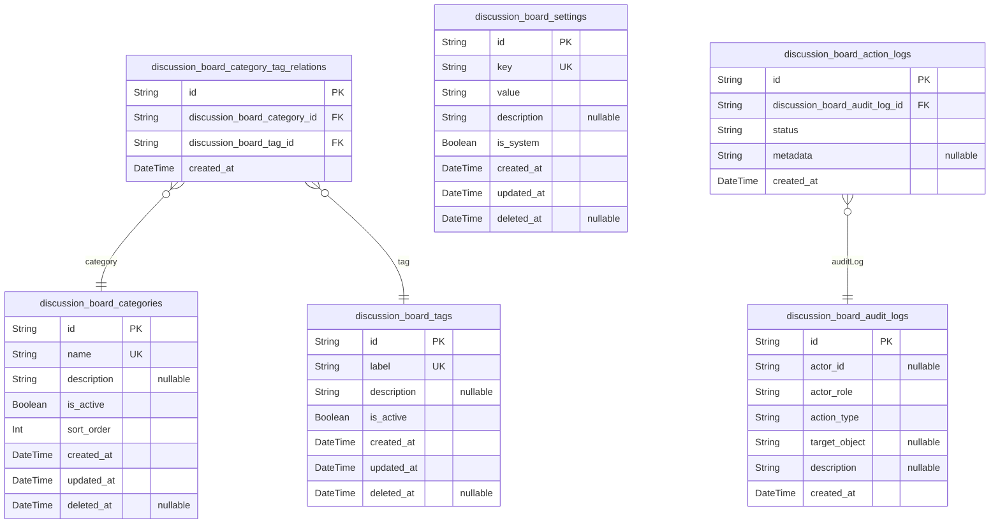
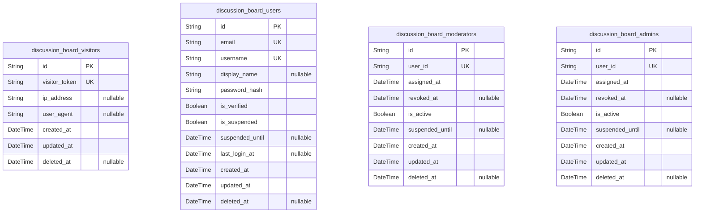
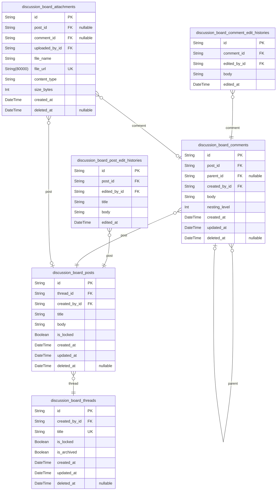
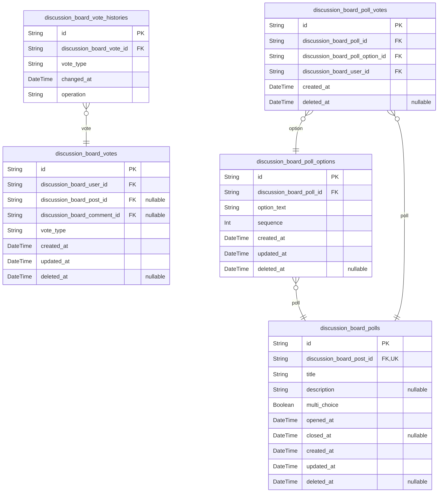
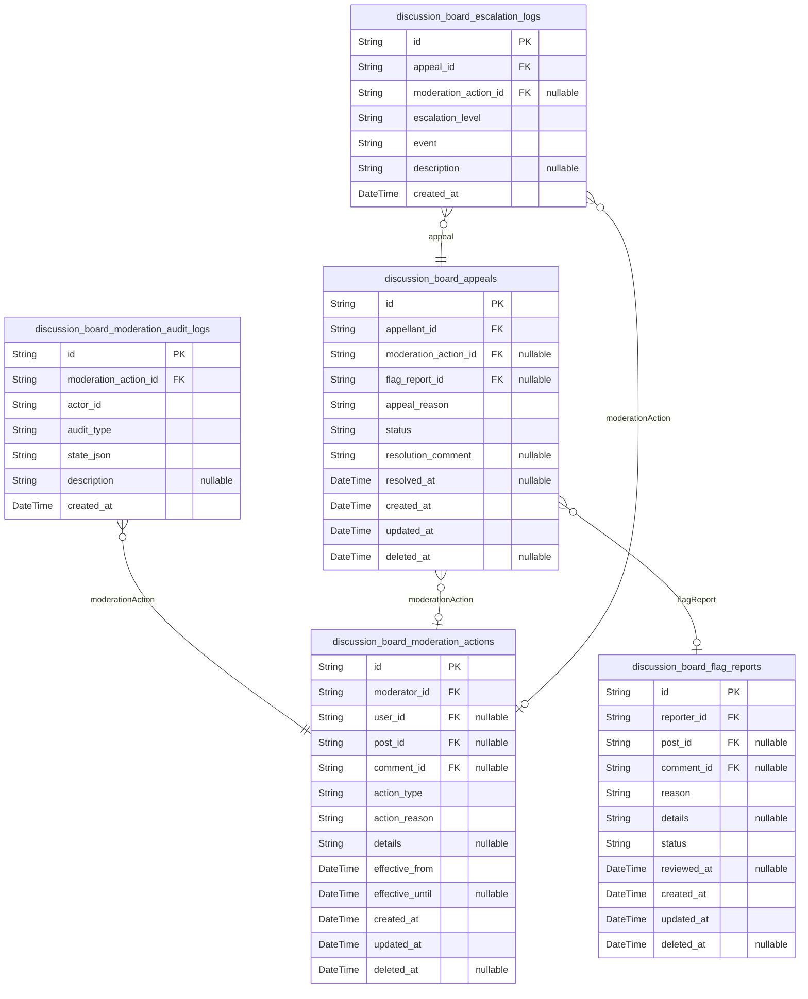
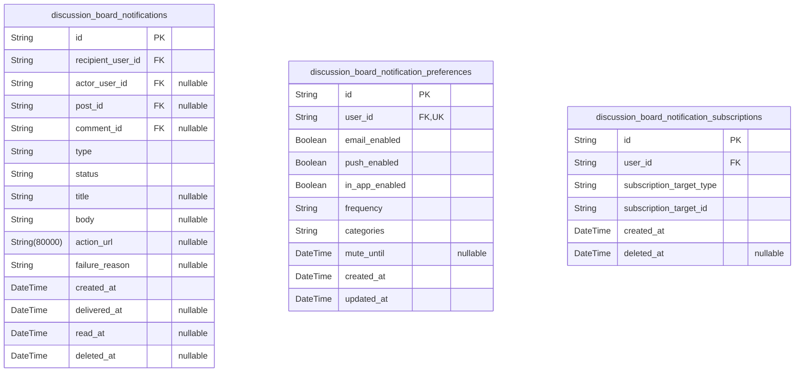
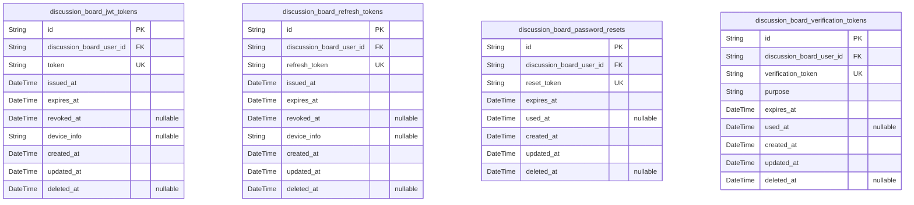
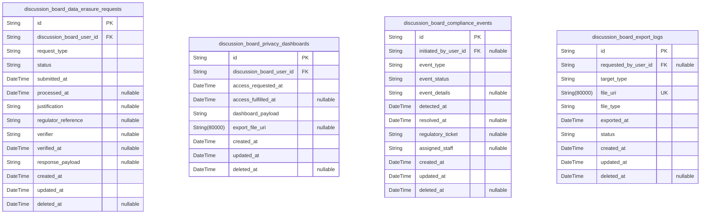

# Prisma Markdown

> Generated by [`prisma-markdown`](https://github.com/samchon/prisma-markdown)

- [Systematic](#systematic)
- [Actors](#actors)
- [Content](#content)
- [Voting](#voting)
- [Moderation](#moderation)
- [Notifications](#notifications)
- [Session](#session)
- [Compliance](#compliance)

## Systematic

### `discussion_board_categories`

Represents discussion categories within the board (e.g. Politics,
Economics, Society). Used for organizing posts and threads into topical
groups. Supports CRUD and independent administration. Categories can have
multiple tags via discussion_board_category_tag_relations. Frequently
referenced by posts for content classification.

Properties as follows:

- `id`: Primary Key.
- `name`: Category display name. Unique and user-facing (e.g. 'Politics').
- `description`: Human-readable description for moderators and users.
- `is_active`: Whether this category is currently active and visible to users.
- `sort_order`: Manual sort order for displaying categories.
- `created_at`: Timestamp when category was created.
- `updated_at`: Timestamp when category was last updated.
- `deleted_at`: Timestamp for soft deletion; null means not deleted.

### `discussion_board_tags`

Vocabulary of tags that can be assigned to categories and posts. Tags
enable faceted search, topic suggestions, and content filtering. Tags are
managed independently; supports CRUD and list operations. Tags can be
assigned to many categories (see
discussion_board_category_tag_relations).

Properties as follows:

- `id`: Primary Key.
- `label`: Tag label as seen by users. Must be unique (case-insensitive).
- `description`: Optional human-readable description for users/moderators.
- `is_active`: Whether the tag can currently be assigned.
- `created_at`: Timestamp when tag was registered.
- `updated_at`: Timestamp when tag was last updated.
- `deleted_at`: Timestamp for soft deletion; null = not deleted.

### `discussion_board_category_tag_relations`

Junction table for many-to-many relation between categories and tags.
Allows a category to have multiple tags and vice versa. Only stores
references; maintains referential integrity and disables duplicates.
Managed internally; users assign tags to categories via admin/control
panels.

Properties as follows:

- `id`: Primary Key.
- `discussion_board_category_id`: Linked category's [discussion_board_categories.id](#discussion_board_categories)
- `discussion_board_tag_id`: Linked tag's [discussion_board_tags.id](#discussion_board_tags)
- `created_at`: Timestamp when this association was created.

### `discussion_board_settings`

Holds global/system-wide configuration values (e.g., max post length,
flags thresholds, maintenance flags). Settings are key-value, with
standard metadata, allowing dynamic system reconfiguration without code
deployments. Supports secure audit of changes.

Properties as follows:

- `id`: Primary Key.
- `key`
  > Unique identifier for this setting (e.g. 'max_post_length',
  > 'flag_threshold').
- `value`
  > Serialized config value for interpretation by the app (stringified JSON
  > for complex data if needed).
- `description`: Human-intelligible explanation of this setting.
- `is_system`: Whether this setting is system-level (vs business-level).
- `created_at`: Timestamp when setting was registered.
- `updated_at`: Timestamp when setting was last updated.
- `deleted_at`: Timestamp for soft deletion.

### `discussion_board_audit_logs`

Audit log for all major platform actions: configuration changes, role
changes, moderation decisions, and critical system events. Each record
includes metadata and references to the actor where possible (e.g., user,
moderator, admin). Used for legal, compliance, and business/technical
auditing.

Properties as follows:

- `id`: Primary Key.
- `actor_id`
  > Optional reference to the acting user (visitor, user, moderator, or
  > admin), if applicable. Null for system actions.
- `actor_role`
  > Role of acting entity at time of action ('visitor', 'user', 'moderator',
  > 'admin', or 'system').
- `action_type`
  > Type/category of action performed (e.g., 'config_update',
  > 'role_assignment', 'moderation', 'login').
- `target_object`
  > Subject entity/object of the action. E.g., which setting, user, post,
  > etc. (Flexible string).
- `description`: Human-readable description, suited for compliance reviews.
- `created_at`: Action event timestamp; represents when it occurred.

### `discussion_board_action_logs`

Detailed per-action log entries as a subsidiary to the audit log. Used
for lower-level action tracing, debugging, and advanced compliance. Each
action log entry references audit logs and provides granular metadata
(status, payloads, errors, etc.). Not independently user-facing; supports
system/compliance tracing.

Properties as follows:

- `id`: Primary Key.
- `discussion_board_audit_log_id`
  > Reference to the master audit log entry {@link
  > discussion_board_audit_logs.id}
- `status`: Outcome of the action (e.g., 'success', 'fail', 'partial', or custom).
- `metadata`
  > Serialized contextual metadata (JSON). As detailed as needed for
  > compliance or debugging.
- `created_at`: Timestamp at which the action log was recorded.

## Actors

### `discussion_board_visitors`

Tracks anonymous or unauthenticated actors (visitors) for auditing,
analytics, and potential future privilege escalation. Each record
represents an individual visitor session or unique actor basis. Enables
future anonymous posting privileges, per-visitor fraud detection, and
regulatory compliance. No PII captured unless elevated. Provides soft
deletion for retention management.

Properties as follows:

- `id`: Primary Key.
- `visitor_token`
  > Opaque, non-reversible unique token identifying a visitor. Used for
  > session tracking and fraud detection. Never linked to PII.
- `ip_address`
  > IP address used to access the service. Used only for security, fraud
  > detection, and audit; deleted/pseudonymized per policy.
- `user_agent`
  > User agent string or device fingerprint as received. Used for analytic
  > and anti-abuse measures.
- `created_at`: Timestamp when the visitor record was created.
- `updated_at`: Timestamp when the visitor record was last updated.
- `deleted_at`: Timestamp when the visitor record was soft-deleted (if applicable).

### `discussion_board_users`

Core registered and authenticated user actors. Each represents a member
with standard posting, commenting, voting, and flagging privileges. Email
and username must be unique. Contains authentication and profile
metadata. Subject to verification, suspension, and role escalation.
Provides soft deletion for compliance.

Properties as follows:

- `id`: Primary Key.
- `email`: User email address, used for login and communication. Must be unique.
- `username`: Unique username chosen by the user; displayed as handle on posts/comments.
- `display_name`: User's display name or nickname for personalized experience.
- `password_hash`: Secure password hash for authentication. Raw passwords are never stored.
- `is_verified`: Whether the user's email has been verified.
- `is_suspended`: Whether the user is currently suspended from activity.
- `suspended_until`
  > If suspended, date-time until which user cannot interact. Null if not
  > suspended.
- `last_login_at`: Date-time of the user's last successful login.
- `created_at`: Timestamp when the user record was created.
- `updated_at`: Timestamp when the user record was last updated.
- `deleted_at`: Timestamp when the user record was soft-deleted (if applicable).

### `discussion_board_moderators`

Table of actors with assigned moderator status. Moderators are registered
users with elevated permissions for content and user management.
Assignment/removal is managed by admins; assignment events are logged
externally. Includes privileged status and active window. Independent
management supports auditing of promotion/demotion and moderator-specific
attributes. Provides soft deletion for compliance.

Properties as follows:

- `id`: Primary Key.
- `user_id`
  > Associated user actor's id promoted to moderator role. Duplicates user
  > data for audit separation and role-specific attributes.
- `assigned_at`: Timestamp when moderator role was assigned.
- `revoked_at`
  > Timestamp moderator privileges were revoked, if ever. Null if currently
  > active.
- `is_active`: Whether the moderator is currently active (not revoked or suspended).
- `suspended_until`: Moderator-specific suspension window, if applicable.
- `created_at`: Timestamp when the moderator record was created.
- `updated_at`: Timestamp when the moderator record was last updated.
- `deleted_at`: Timestamp when the moderator record was soft-deleted (if applicable).

### `discussion_board_admins`

Platform/system administrators with the highest permissions. This table
tracks all admin actors, with status, assignment, suspension, and audit
fields. Admin management is independent for audit/control.
Assignment/removal is always by root/admin. No calculated fields.
Provides soft deletion for regulatory compliance.

Properties as follows:

- `id`: Primary Key.
- `user_id`
  > Associated user actor's id with admin role. Allows admin-specific
  > privileges, assignment/revocation audit, and separation of admin status.
- `assigned_at`: Timestamp when admin status/role was granted.
- `revoked_at`
  > Timestamp when admin privileges were revoked, if ever. Null if currently
  > active.
- `is_active`: Whether the admin is currently active (not revoked or suspended).
- `suspended_until`: Admin-specific suspension window, if applicable.
- `created_at`: Timestamp when the admin record was created.
- `updated_at`: Timestamp when the admin record was last updated.
- `deleted_at`: Timestamp when the admin record was soft-deleted (if applicable).

## Content

### `discussion_board_threads`

Discussion threads serve as the top-level grouping mechanism for related
posts and comments. Each thread represents a distinct discussion topic or
theme, acting as the root node for all hierarchical content beneath it.
Threads can be locked or archived for moderation purposes. Supports
search by title, status, and created_by user. Soft deletion is supported
for compliance.

Properties as follows:

- `id`: Primary Key.
- `created_by_id`
  > Creator's [discussion_board_users.id](#discussion_board_users). References the user who
  > started the thread.
- `title`: Title of the discussion thread, used for identification and search.
- `is_locked`: Whether the thread is currently locked for further posting or commenting.
- `is_archived`: Whether the thread has been archived. Archived threads are read-only.
- `created_at`: Timestamp when the thread was created.
- `updated_at`: Timestamp when the thread was last updated.
- `deleted_at`
  > When present, indicates the thread was soft deleted (hidden from general
  > view).

### `discussion_board_posts`

Posts are the primary content units within discussion threads. Each post
belongs to a thread, can reference an author (user), and is subject to
edit history tracking. Each post may be flagged, commented on, or
moderated. Soft deletion is standard for user and regulatory compliance.

Properties as follows:

- `id`: Primary Key.
- `thread_id`
  > Target thread's [discussion_board_threads.id](#discussion_board_threads). Indicates thread
  > this post belongs to.
- `created_by_id`
  > Author's [discussion_board_users.id](#discussion_board_users). Indicates the user who
  > submitted this post.
- `title`: Post title, used for identification within thread and for search.
- `body`: Rich text body of the post content.
- `is_locked`: Whether this post is locked for editing or commenting.
- `created_at`: Timestamp when the post was created.
- `updated_at`: Timestamp when the post was last updated.
- `deleted_at`: Soft delete timestamp; if set, post is not visible to regular users.

### `discussion_board_post_edit_histories`

Edit history (snapshot) table for posts. Stores previous versions of each
post for audit, compliance, or moderation review. Each record is linked
to the original post and contains the full previous snapshot of the
post's contents. Append-only by design.

Properties as follows:

- `id`: Primary Key.
- `post_id`
  > Target post's [discussion_board_posts.id](#discussion_board_posts) for which the snapshot is
  > stored.
- `edited_by_id`
  > Reference to the user who performed the edit. {@link
  > discussion_board_users.id}
- `title`: Snapshot of post title at the time of edit.
- `body`: Snapshot of the post body at the time of edit.
- `edited_at`: Timestamp when this edit was made.

### `discussion_board_comments`

Comments are user responses to posts or, recursively, to other comments
(nested up to 5 levels). Each comment belongs to a post and may
optionally have a parent comment. Comments are independently manageable
with full edit and moderation support. Soft deletion is required for
auditability.

Properties as follows:

- `id`: Primary Key.
- `post_id`
  > Parent post [discussion_board_posts.id](#discussion_board_posts) to which this comment
  > belongs.
- `parent_id`
  > Direct parent comment [discussion_board_comments.id](#discussion_board_comments) for nested
  > commenting (nullable for top-level comments).
- `created_by_id`: Author's [discussion_board_users.id](#discussion_board_users) for this comment.
- `body`: Text content of the comment.
- `nesting_level`: Level of nesting for this comment (max 5; 0 = top-level).
- `created_at`: Timestamp when comment was created.
- `updated_at`: Timestamp when comment was last updated.
- `deleted_at`
  > Soft delete timestamp (hidden from public but retained for
  > moderation/audit).

### `discussion_board_comment_edit_histories`

Edit history (snapshot) table for comments. Records all previous versions
of a comment for audit/audit-log compliance. Each record links to the
original comment and editor. Append-only by design.

Properties as follows:

- `id`: Primary Key.
- `comment_id`
  > Target comment's [discussion_board_comments.id](#discussion_board_comments) to which the
  > snapshot belongs.
- `edited_by_id`: User who performed the comment edit. [discussion_board_users.id](#discussion_board_users)
- `body`: Snapshot body at edit moment.
- `edited_at`: Edit timestamp for this snapshot record.

### `discussion_board_attachments`

Attachments hold metadata for files or media uploaded to posts/comments.
Each attachment references either a post or a comment, but not both at
once. Files may include images, documents, or media. Managed through
parent content. Soft deletion is applied for compliance and moderation
needs.

Properties as follows:

- `id`: Primary Key.
- `post_id`
  > Associated post [discussion_board_posts.id](#discussion_board_posts); nullable in case
  > attachment is for a comment instead.
- `comment_id`
  > Associated comment [discussion_board_comments.id](#discussion_board_comments); nullable if
  > attached to a post instead.
- `uploaded_by_id`: Uploader's [discussion_board_users.id](#discussion_board_users). User who added the file.
- `file_name`: Original file name as uploaded by the user.
- `file_url`: Permanent URL of the uploaded file or media for access.
- `content_type`: MIME type of the file for validation and access control.
- `size_bytes`: Size of the file in bytes.
- `created_at`: Timestamp when the attachment was uploaded.
- `deleted_at`: Soft deletion marker for compliance/moderation; nullable.

## Voting

### `discussion_board_votes`

Stores individual user votes (upvotes or downvotes) on posts and
comments. Each vote is linked to an actor (user), a post or comment, and
is independently managed for deduplication and analytics. Used for
engagement, business logic, and permission enforcement. Related to {@link
discussion_board_posts}, [discussion_board_comments](#discussion_board_comments), {@link
discussion_board_users}.

Properties as follows:

- `id`: Primary Key.
- `discussion_board_user_id`
  > Voter's [discussion_board_users.id](#discussion_board_users). Indicates the user who
  > performed this vote.
- `discussion_board_post_id`
  > Voted post's [discussion_board_posts.id](#discussion_board_posts). Nullable if vote is on a
  > comment.
- `discussion_board_comment_id`
  > Voted comment's [discussion_board_comments.id](#discussion_board_comments). Nullable if vote is
  > on a post.
- `vote_type`
  > Indicates whether the vote is +1 (upvote) or -1 (downvote). Only accept
  > 'up' or 'down'.
- `created_at`: Vote creation timestamp.
- `updated_at`: Vote last update timestamp.
- `deleted_at`: Vote soft-delete timestamp; null if active.

### `discussion_board_vote_histories`

Captures a full, append-only audit trail of all vote state changes
(creation, update, delete). Each record points to its corresponding vote
and records the historical data for compliance and analytics. Used for
audit, restoration, and compliance investigation workflows. Related to
[discussion_board_votes](#discussion_board_votes).

Properties as follows:

- `id`: Primary Key.
- `discussion_board_vote_id`
  > Tracked vote [discussion_board_votes.id](#discussion_board_votes). Links the history record
  > to the current or former vote.
- `vote_type`: Historical vote value in this change record ('up' or 'down').
- `changed_at`: Timestamp of state change (created/updated/deleted).
- `operation`: Indicates change type: 'create', 'update', or 'delete'.

### `discussion_board_polls`

Poll metadata attached to posts or threads. Used to allow users to vote
in single- or multiple-choice poll scenarios. Stores poll attributes and
lifecycle. Related to [discussion_board_posts](#discussion_board_posts), {@link
discussion_board_poll_options}, [discussion_board_poll_votes](#discussion_board_poll_votes).

Properties as follows:

- `id`: Primary Key.
- `discussion_board_post_id`
  > The post to which this poll is attached {@link
  > discussion_board_posts.id}. Each poll is linked to a post.
- `title`: Poll title or question visible to users.
- `description`: Optional poll description.
- `multi_choice`: True if poll allows multiple option selections per voter.
- `opened_at`: Poll open time (can start accepting votes).
- `closed_at`: Poll closing time (null if open-ended).
- `created_at`: Poll creation timestamp.
- `updated_at`: Last modification time.
- `deleted_at`: Poll soft-delete marker (null if active).

### `discussion_board_poll_options`

Options/choices available to voters within a given poll. These are
subsidiary to polls and only manageable via the parent poll. Required for
selection and validation. Related to [discussion_board_polls](#discussion_board_polls).

Properties as follows:

- `id`: Primary Key.
- `discussion_board_poll_id`
  > Parent poll [discussion_board_polls.id](#discussion_board_polls). The poll this option
  > belongs to.
- `option_text`: Text shown to users as an option/answer.
- `sequence`: Display order for poll options (1-based).
- `created_at`: Poll option creation time.
- `updated_at`: Last updated time for this option.
- `deleted_at`: Poll option soft-delete marker.

### `discussion_board_poll_votes`

Links user selections in polls to options, enabling many-to-many
relationships. Each record indicates a single user's choice for a poll
option. Ensures only valid and allowed selections are recorded. Used for
poll result counting. Related to [discussion_board_poll_options](#discussion_board_poll_options),
[discussion_board_polls](#discussion_board_polls), [discussion_board_users](#discussion_board_users).

Properties as follows:

- `id`: Primary Key.
- `discussion_board_poll_id`: Poll being answered [discussion_board_polls.id](#discussion_board_polls).
- `discussion_board_poll_option_id`: Selected option [discussion_board_poll_options.id](#discussion_board_poll_options).
- `discussion_board_user_id`: User who voted [discussion_board_users.id](#discussion_board_users).
- `created_at`: Vote cast time.
- `deleted_at`: Vote soft-delete marker.

## Moderation

### `discussion_board_flag_reports`

Contains all user and system-generated content flag reports, representing
instance of objection or report on posts or comments for moderator queue.
Supports independent flag actions and cross-content search for moderation
workflows. Related entities: moderation actions and appeals. Stance:
"primary" because each report may be managed, investigated, or triaged
independently, regardless of content parent.

Properties as follows:

- `id`: Primary Key.
- `reporter_id`
  > Reporting user's [discussion_board_users.id](#discussion_board_users). References the user
  > who flagged content.
- `post_id`
  > Flagged post's [discussion_board_posts.id](#discussion_board_posts). Nullable if the report
  > is on a comment.
- `comment_id`
  > Flagged comment's [discussion_board_comments.id](#discussion_board_comments). Nullable if the
  > report refers to a post.
- `reason`
  > User-provided or system reason (category) for flagging the content, e.g.
  > 'abuse', 'spam', 'misinformation'.
- `details`: Optional extended textual justification for the report.
- `status`
  > Current review status for the report ('pending', 'triaged', 'dismissed',
  > 'accepted', 'escalated').
- `reviewed_at`
  > The timestamp when the report was reviewed by a moderator; null if not
  > yet reviewed.
- `created_at`: Time when the flag report was submitted.
- `updated_at`: Last time the report record was updated (e.g. status changes, triage).
- `deleted_at`: Soft-delete timestamp. Null if active.

### `discussion_board_moderation_actions`

Represents all actionable decisions performed by human moderators or
automated systems, including those on posts, comments, users, or IPs.
Stores the action type, moderator reference, context, reason, and effect.
Enables independent audit across parent contexts and supports historical
review.

Properties as follows:

- `id`: Primary Key.
- `moderator_id`: Responsible moderator's [discussion_board_moderators.id](#discussion_board_moderators).
- `user_id`
  > Affected user's [discussion_board_users.id](#discussion_board_users). Null unless moderation
  > action targets a user directly (e.g., warning, suspension).
- `post_id`
  > Moderated post's [discussion_board_posts.id](#discussion_board_posts). Null unless this
  > action is for a post.
- `comment_id`
  > Moderated comment's [discussion_board_comments.id](#discussion_board_comments). Null unless
  > this action is for a comment.
- `action_type`
  > Enumeration: kind of moderation ('warn', 'mute', 'remove', 'edit',
  > 'restrict', 'restore', 'escalate').
- `action_reason`
  > Human- or system-written reason for moderator action, for compliance
  > traceability.
- `details`: Long-form description or notes about the moderation action.
- `effective_from`: When the moderation action took effect.
- `effective_until`
  > When the moderation action concludes (for temporary
  > restrictions/warnings), null if not time-bound.
- `created_at`: Timestamp when the moderation action was taken.
- `updated_at`: Timestamp of last update to the moderation action record.
- `deleted_at`: Soft-delete timestamp; null if active.

### `discussion_board_moderation_audit_logs`

Historical record (append-only snapshot) of all moderation, triage, and
review actions for compliance, reporting, and forensic analysis. Each
record is timestamped and stores the full state for audit trail
integrity. Rarely directly manipulated—serves audit and investigation.

Properties as follows:

- `id`: Primary Key.
- `moderation_action_id`
  > Related moderation action's {@link
  > discussion_board_moderation_actions.id}.
- `actor_id`
  > Person (or system) responsible for the action, references moderator,
  > admin, or automated user. Redundant for historical snapshot integrity.
- `audit_type`
  > Kind of audit event ('action_taken', 'escalated', 'reverted',
  > 'appeal_handled', 'policy_update').
- `state_json`
  > Full JSON snapshot of the moderation or flag report state after this
  > event.
- `description`
  > Narrative (English) describing the event for future compliance/audit
  > review.
- `created_at`: Timestamp when the audit log was created (event occurred).

### `discussion_board_appeals`

Represents end-user or affected entity appeals against
moderation/flag/report actions. Enables users to formally request review,
reversal, or clarification of specific moderation events. Managed as
independent first-class entities and supports multiple appeals per
incident or actor. Stance: 'primary' due to independent API endpoints and
review processes.

Properties as follows:

- `id`: Primary Key.
- `appellant_id`
  > Appealing user's [discussion_board_users.id](#discussion_board_users). May reference a
  > moderator or admin in rare cases.
- `moderation_action_id`
  > Related moderation action's {@link
  > discussion_board_moderation_actions.id}. Null if appeal relates to a flag
  > report rather than a prior action.
- `flag_report_id`
  > Related flag report's [discussion_board_flag_reports.id](#discussion_board_flag_reports). Null
  > unless appeal targets a moderation action on a flag, not a content
  > moderation event.
- `appeal_reason`: User-provided narrative and justification for the appeal.
- `status`
  > Appeal lifecycle status: ('pending', 'reviewed', 'resolved', 'denied',
  > 'escalated').
- `resolution_comment`
  > Moderator/admin comment or justification for granting/denying the appeal,
  > if applicable.
- `resolved_at`: Timestamp of final resolution. Null if still active or under review.
- `created_at`: Timestamp when the appeal was initially filed.
- `updated_at`: Last updated timestamp for the appeal.
- `deleted_at`: Soft-delete timestamp. Null if active.

### `discussion_board_escalation_logs`

Workflow subsidiary: records detailed logs of escalation events,
including chain-of-command handover, reason, target, and final outcomes.
Always tied to foundational moderation or appeal entities—never as
independent records. Supports internal reporting, audit, and escalated
workflow trace. Managed through parent entities only.

Properties as follows:

- `id`: Primary Key.
- `appeal_id`: Reference to the related [discussion_board_appeals.id](#discussion_board_appeals).
- `moderation_action_id`
  > Reference to related [discussion_board_moderation_actions.id](#discussion_board_moderation_actions) —
  > escalation of a specific moderation action.
- `escalation_level`
  > Level/stage (e.g., 'soft_review', 'team_review', 'legal_review',
  > 'admin_review').
- `event`: Short name ('escalated', 'delegated', 'finalized', 'withdrawn').
- `description`: Human-readable details for internal reporting.
- `created_at`: Timestamp of escalation log record.

## Notifications

### `discussion_board_notifications`

Notification delivery instances: Each record represents a discrete
notification, either user-facing or system-triggered, intended for a
specific recipient. Supports associations with sending actor, linked
post/comment (if reference exists), notification type, status
(unread/read/delivered), and failure/audit fields. User can independently
mark as read/archived. Related to [discussion_board_users](#discussion_board_users),
potentially to posts/comments via foreign keys. Business logic
distinguishes among notification types (reply, mention, moderator action,
system alert, etc.).

Properties as follows:

- `id`: Primary Key.
- `recipient_user_id`
  > Target recipient's [discussion_board_users.id](#discussion_board_users). User who receives
  > the notification.
- `actor_user_id`
  > Optional actor that generated the notification. References {@link
  > discussion_board_users.id}; null for system events.
- `post_id`
  > Linked post, if notification relates to a discussion post. References
  > [discussion_board_posts.id](#discussion_board_posts). Nullable.
- `comment_id`
  > Linked comment, if notification relates to a post comment. References
  > [discussion_board_comments.id](#discussion_board_comments). Nullable.
- `type`
  > Type of notification (e.g., reply, mention, flag, mod_action,
  > system_alert, poll_close, etc.) - used to drive business and UI logic.
- `status`
  > Delivery/read status: one of 'unread', 'read', 'delivered', 'archived',
  > 'failed'. Used to filter in notification center and trigger UX badges.
- `title`
  > Short notification title or summary (for display in notification center
  > previews).
- `body`
  > Notification content/body, typically short and context-focused. HTML/text
  > allowed per business policy.
- `action_url`
  > Link or URI for user action (e.g., "go to post", "view comment"). Null if
  > system/informational only.
- `failure_reason`
  > Reason for delivery failure (if status is 'failed'). May contain
  > business-level reason or error code. Null if delivered/successful.
- `created_at`: Notification creation timestamp (when notification was generated).
- `delivered_at`
  > When notification was (attempted to be) delivered (e.g., pushed, sent,
  > shown). Nullable if not delivered yet.
- `read_at`
  > When recipient read the notification (set by user interaction, system, or
  > push). Null if not yet read.
- `deleted_at`: Soft-deletion timestamp. Null if not (soft-)deleted.

### `discussion_board_notification_preferences`

Per-user notification preference settings: Each record applies to a
specific user and defines delivery channel choices (in-app, email, push),
frequency, and opt-in/out preferences for each notification
type/category. Managed independently by the user. Critical for respecting
user contact permissions and compliance requirements.

Properties as follows:

- `id`: Primary Key.
- `user_id`
  > Notification preference owner's [discussion_board_users.id](#discussion_board_users).
  > References the user this preference set belongs to.
- `email_enabled`
  > Whether the user enables email notifications for this category (true:
  > allowed, false: suppressed).
- `push_enabled`: Whether the user enables push notifications for this category.
- `in_app_enabled`
  > Whether the user enables in-app notifications for this category
  > (notification center, banners, etc.).
- `frequency`
  > Notification delivery frequency: e.g., 'immediate', 'digest_daily',
  > 'digest_weekly'. Directs scheduling for batch or real-time delivery.
- `categories`
  > CSV or JSON-encoded list of notification categories/types this preference
  > applies to. (e.g., 'reply,mention,mod_action').
- `mute_until`
  > Suppress notifications for all categories until this datetime. Null if
  > not muted.
- `created_at`: Creation timestamp for this preference record.
- `updated_at`: Last updated timestamp for this preferences record.

### `discussion_board_notification_subscriptions`

Represents persistent notification subscriptions: Each record describes a
user following a topic, category, or post/thread
(subscription_target_type/target_id). Enables delivery of notifications
whenever the subscribed entity (category, thread, post, etc.) is updated
or triggers an event. Users can manage these subscriptions independently,
and unsubscribe at any time.

Properties as follows:

- `id`: Primary Key.
- `user_id`
  > Subscribing user's [discussion_board_users.id](#discussion_board_users). The user who
  > follows or subscribes to event delivery.
- `subscription_target_type`
  > Type of entity being followed (e.g., 'post', 'thread', 'category', 'tag',
  > 'user') for polymorphic delivery.
- `subscription_target_id`
  > Entity ID being followed/subscribed (FK to target entity, not enforced
  > here due to polymorphism).
- `created_at`: Timestamp when subscription was created.
- `deleted_at`
  > If present, marks a soft delete (unsubscribed). Still retained for
  > compliance/audit.

## Session

### `discussion_board_jwt_tokens`

Stores all active JWT access tokens for authenticated sessions. Each
token links to a user and device/session metadata, and includes issued,
expiration, and revocation timestamps for full audit traceability.
Enables support for single-session, multi-device, and session revocation.
References [discussion_board_users.id](#discussion_board_users). No authentication logic
present here.

Properties as follows:

- `id`: Primary Key.
- `discussion_board_user_id`
  > Authenticated user's [discussion_board_users.id](#discussion_board_users) to whom the token
  > was issued.
- `token`: JWT access token string (opaque, signed/encoded).
- `issued_at`: Datetime when token was generated, for audit trace and session tracking.
- `expires_at`: Datetime when this token should expire and become invalid.
- `revoked_at`: Datetime when this session/token was revoked (null if still valid).
- `device_info`
  > Optional device/session metadata (browser, OS, IP, or user agent as
  > string).
- `created_at`: Datetime when this record was created.
- `updated_at`: Datetime when this record was last updated.
- `deleted_at`: Soft-delete timestamp for audit compliance. Null if active.

### `discussion_board_refresh_tokens`

Tracks refresh tokens used for obtaining new access tokens in session
management. Each token is linked to a user and supports revocation or
expiry for device-specific logout flows. Only one active refresh token
per device/session per user per audit and compliance rule. References
[discussion_board_users.id](#discussion_board_users).

Properties as follows:

- `id`: Primary Key.
- `discussion_board_user_id`: Token owner's [discussion_board_users.id](#discussion_board_users).
- `refresh_token`: Opaque token string for session refresh (secure random, not JWT).
- `issued_at`: Datetime when refresh token was created for auditing lifecycle.
- `expires_at`: Datetime this refresh token expires.
- `revoked_at`
  > Datetime when refresh token was revoked (manual or on logout). Null if
  > active.
- `device_info`
  > Optional device/session metadata for context or audit (device/browser/IP
  > info).
- `created_at`: Datetime when this record was created.
- `updated_at`: Datetime when this record was last updated.
- `deleted_at`: Soft-delete timestamp. Null if active.

### `discussion_board_password_resets`

Supports password reset flows by tracking all issued reset tokens, their
status, and their relationship to a user. Allows only single-use,
time-limited tokens, enforced via expiry and one-time use flags. Each row
is fully auditable for compliance. Links to {@link
discussion_board_users.id}.

Properties as follows:

- `id`: Primary Key.
- `discussion_board_user_id`
  > Owner user requesting password reset; references {@link
  > discussion_board_users.id}.
- `reset_token`: Single-use password reset token string (secure, unique, non-repeating).
- `expires_at`: Datetime when reset link or token expires and may not be reused.
- `used_at`: Datetime when this token was actually used (null if not yet used).
- `created_at`: Datetime when this record was created.
- `updated_at`: Datetime when this record was last updated.
- `deleted_at`: Soft-delete timestamp for audit compliance. Null if active.

### `discussion_board_verification_tokens`

Stores and tracks verification codes/tokens for email or other
out-of-band verification events during registration and sensitive
operations. Each token may be single-use or multi-purpose (e.g., sign-up
email, MFA, email update), linked to a user for audit and reissuance
tracking. Each has timing and usage audit state. Tied to {@link
discussion_board_users.id}.

Properties as follows:

- `id`: Primary Key.
- `discussion_board_user_id`
  > Reference to the user for whom this verification event is tracked. {@link
  > discussion_board_users.id}.
- `verification_token`: Token string/code sent for registration/email verification/MFA.
- `purpose`
  > Purpose of this token (e.g. 'email_verification', 'password_reset',
  > 'mfa').
- `expires_at`: Datetime when verification event expires.
- `used_at`: Datetime when code was used for verification, else null if unused.
- `created_at`: Datetime when this record was created.
- `updated_at`: Datetime when this record was last updated.
- `deleted_at`: Soft-delete timestamp for audit. Null if not deleted.

## Compliance

### `discussion_board_data_erasure_requests`

Records each user-initiated request for data erasure (GDPR/CCPA Right to
be Forgotten). Tracks requestor, status, type, justification,
verification, and regulator responses. Allows for compliance with
required audit trail and deletion verification. Relates to {@link
discussion_board_users}.

Properties as follows:

- `id`: Primary Key.
- `discussion_board_user_id`
  > Belonged user's [discussion_board_users.id](#discussion_board_users). Foreign key for
  > tracking which user's data is to be erased. Mandatory for audit and
  > traceability.
- `request_type`
  > Type of erasure (full account, post-only, comment-only, partial, or
  > specific legal request). Used for regulatory reporting.
- `status`
  > Current erasure process state (pending, processing, completed, rejected).
  > Must be explicitly set for record integrity.
- `submitted_at`: Timestamp when the erasure request was submitted.
- `processed_at`: When the erasure request was fully processed, if applicable.
- `justification`
  > User-provided or legally required reason for data erasure. Supports
  > compliance with regulatory requirements.
- `regulator_reference`
  > External regulatory agency reference or ticket if applicable (e.g. DPA
  > reference number).
- `verifier`
  > Compliance staff or automated process validating the request. For audit
  > tracking.
- `verified_at`: When request was verified for eligibility. May be null if auto-approved.
- `response_payload`
  > Structured response content to the requester, used for compliance
  > communication and documentation.
- `created_at`: Timestamp when the record was created.
- `updated_at`: Timestamp when the record was last updated.
- `deleted_at`
  > When the record was soft-deleted (may be null for active records). Soft
  > delete required for audit compliance.

### `discussion_board_privacy_dashboards`

Aggregated privacy metrics, summaries, and user-facing data exports for
compliance dashboards (GDPR/CCPA Art. 15/20, right to
access/portability). Used to generate machine-readable exports, audit
logs, and summary tables for regulatory response. Not for regular use,
only on user request or regulatory demand.

Properties as follows:

- `id`: Primary Key.
- `discussion_board_user_id`
  > The user whose data this privacy dashboard summarizes. Belongs to {@link
  > discussion_board_users.id}.
- `access_requested_at`: When the user requested privacy data access/export.
- `access_fulfilled_at`
  > When data export was completed and made available. For regulatory
  > deadlines.
- `dashboard_payload`
  > JSON-encoded or structured summary of user's privacy data, data sources,
  > erasure history, etc. Used for export and compliance evidence.
- `export_file_uri`
  > URI link to generated download or export file for portability. May be
  > null prior to file generation.
- `created_at`: Timestamp when the dashboard record was created.
- `updated_at`: Timestamp when dashboard was last updated or re-generated.
- `deleted_at`: When the record was soft-deleted (may be null).

### `discussion_board_compliance_events`

Captures all compliance-triggered actions, incidents, investigation
cases, regulatory requests (not business-as-usual logs). Used for
recordkeeping, reporting to DPAs (Data Protection Authorities), and
internal compliance audits. Not a general audit or syslog table.

Properties as follows:

- `id`: Primary Key.
- `initiated_by_user_id`
  > Optional: User who triggered the compliance event, if applicable (e.g.,
  > making a legal or privacy request). Nullable, since not all events come
  > from users.
- `event_type`
  > Nature of the compliance event (e.g., regulator_inquiry,
  > data_breach_report, DPIA_completed, erasure_executed, legal_hold).
- `event_status`
  > Current status (open, closed, in_review, escalated, resolved), allowing
  > distinct compliance tracking.
- `event_details`
  > Detailed event content, investigation summary, or protocol steps. Often
  > used for audit export; supports full text search.
- `detected_at`: When the compliance event started or was detected/received.
- `resolved_at`: When event was closed or resolved, if finalized.
- `regulatory_ticket`
  > Regulator's case/ticket number or external ID, if available, for
  > traceability.
- `assigned_staff`
  > Compliance staff member or system process handling the event. May be null
  > if auto-processed or pending assignment.
- `created_at`: Timestamp when this event record was created.
- `updated_at`: Record last updated timestamp.
- `deleted_at`: Soft-deleted timestamp (null when active).

### `discussion_board_export_logs`

Tracks all exports and downloads of compliance, audit, or user privacy
data (for regulatory evidence). Includes target type (user, regulator,
legal), file info, requester, and status for traceability. Provides
evidence for meeting data export/portability requirements. Distinct from
privacy dashboards as this logs every generated file event.

Properties as follows:

- `id`: Primary Key.
- `requested_by_user_id`
  > The user (or staff) requesting the export file. FK to {@link
  > discussion_board_users.id}. Nullable to support external/automated
  > exports.
- `target_type`
  > Export target: user, regulator, admin, legal, etc. Used to segment export
  > type for audit.
- `file_uri`: Download URI for the exported data/logs file.
- `file_type`
  > MIME type or descriptor of file (e.g. application/json, application/pdf,
  > csv, xml, etc.).
- `exported_at`: When export was generated.
- `status`: Export status (pending, available, expired, failed).
- `created_at`: Timestamp when the export log was created.
- `updated_at`: Timestamp when this record was last updated.
- `deleted_at`: Soft-deleted timestamp (null for active/log-retained).
