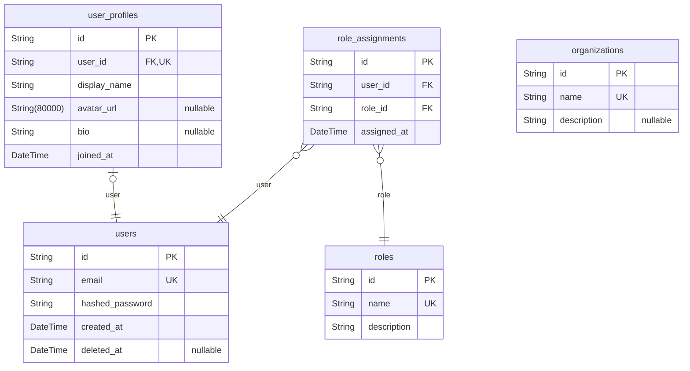
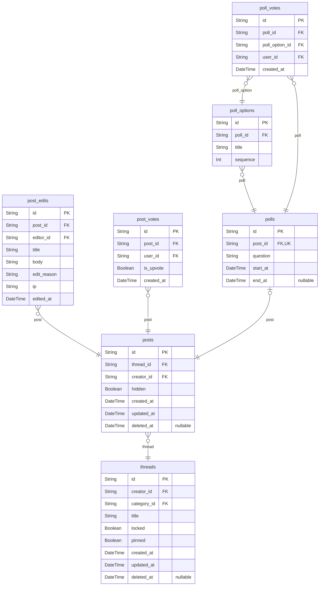
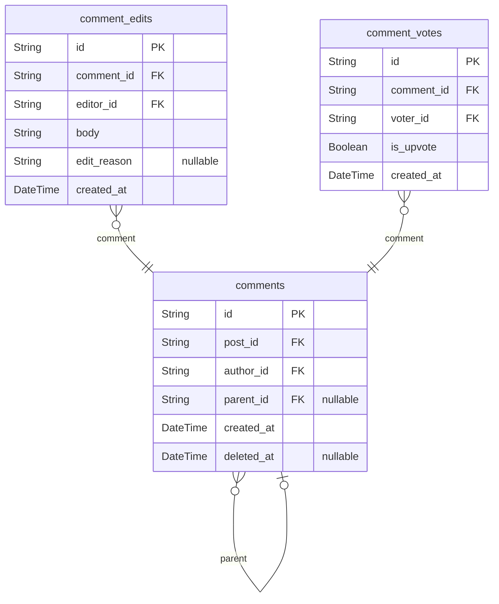
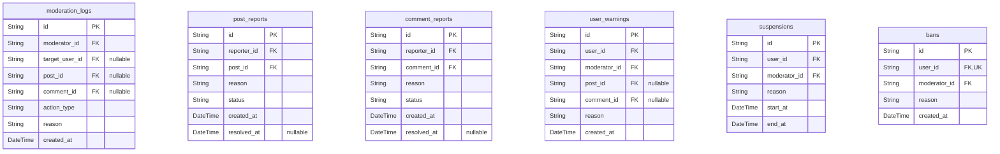
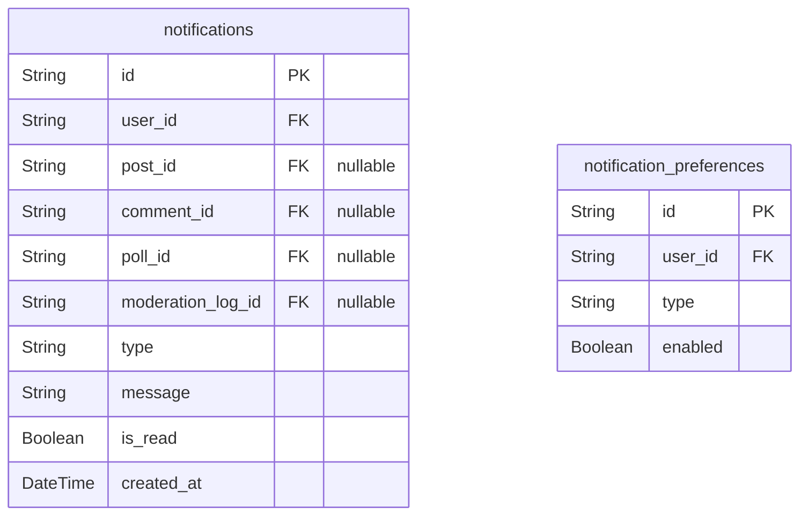
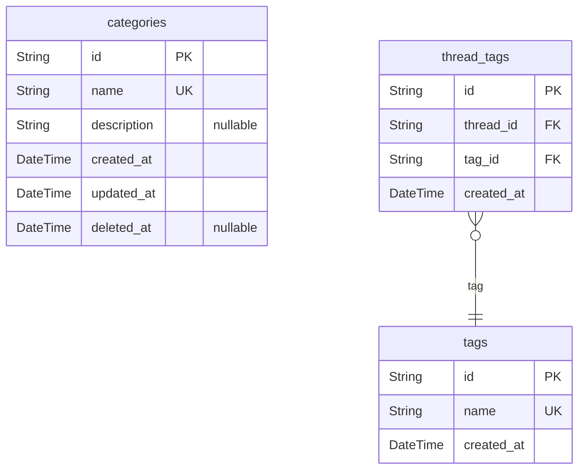
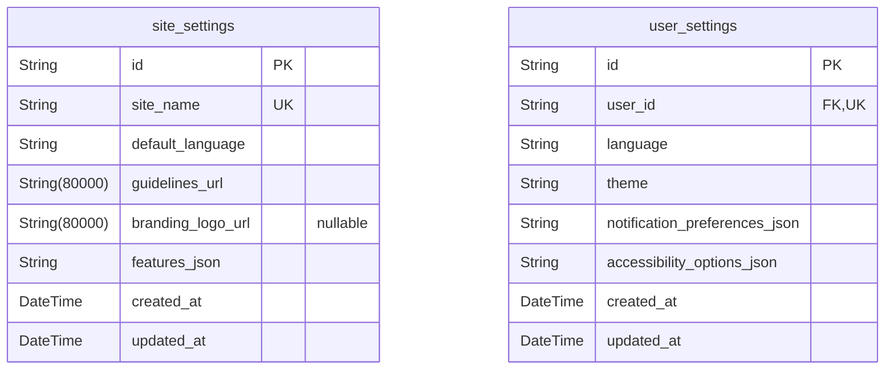

# Prisma Markdown

> Generated by [`prisma-markdown`](https://github.com/samchon/prisma-markdown)

- [Core](#core)
- [ThreadsPosts](#threadsposts)
- [Comments](#comments)
- [Moderation](#moderation)
- [Notifications](#notifications)
- [CategoriesTags](#categoriestags)
- [Settings](#settings)

## Core

### `users`

[User account entity] - This implements the core requirement of registering, identifying, and authenticating individuals using the platform (see Section 3 of the requirements for 'Registration', Section 8 for 'User Authentication'). 

Provides a unique account for each community member—serves as the root identity for all activities. Maintains 3NF by storing only atomic, non-derivable data (no calculated or aggregated fields). For example, every post, comment, or vote will reference this account. 

Key relationships: linked 1:1 to [user_profiles](#user_profiles), has many [role_assignments](#role_assignments), referenced by all domain models (posts, comments, etc.).
Special behaviors: Unique constraint on 'email', soft deletion tracked by 'deleted_at'.

Properties as follows:

- `id`: Primary Key. Unique identifier for each user account.
- `email`
  > [User email address] - Implements requirement for unique, contactable identifier (see registration/authentication).
  >
  > Used to identify accounts and enable password reset or notifications. Maintains normalization by storing only in users. For example, Jane registers with jane@email.com.
  > Constraint: Unique per user, validated on registration.
- `hashed_password`
  > [Hashed user password] - Implements authentication and security requirements.
  >
  > Securely stores the password for login. Maintains normalization by separating secrets from profile info. For example, Jane's original password is never stored—only the hash is.
  > Constraint: Must be properly hashed, never in plaintext.
- `created_at`
  > [Account creation time] - For audit and registration timing (see technical/security requirements).
  >
  > Records when the user joined. For example, audit trails.
  > Constraint: Always present.
- `deleted_at`
  > [Account deletion timestamp] - For soft deletions and GDPR compliance (see privacy/data rules).
  >
  > Allows disabling account while preserving data for audit/compliance. For example, deactivated users do not appear active but records remain.
  > Constraint: Nullable; null means account is active.

### `user_profiles`

[Detailed user profile] - Implements profile pages/activity history from requirements Section 4. 

Stores additional, non-auth authentication data and makes it available for profile display. Maintains normalization by 1:1 relation with [users](#users). For example, display name, bio, avatar. 

Key relationships: 1:1 with users (foreign key unique), referenced by posts, comments for rendering user identity. 
Special behavior: Foreign key required, unique constraint enforces true 1:1.

Properties as follows:

- `id`: Primary Key. Unique identifier for the profile record.
- `user_id`
  > Owner user's [users.id](#users).
  >
  > Every profile is attached to a real user account; ensures traceability and enforces integrity. For example, used to load Jane's profile page.
- `display_name`
  > [Display name] - Implements public identity and social/discussion requirements.
  >
  > Username shown on posts/comments—distinct from authentication email. Normalized by keeping only in profile, not user table. For example: 'PoliticoMark' is Jane's visible name.
  > Constraint: Required; must be non-null.
- `avatar_url`
  > [Avatar image URL] - Profile personalization from future enhancements and UI requirements.
  >
  > Holds a link to the user's profile image, increasing engagement and personalization. For example, shows small image next to comments/posts.
  > Constraint: Can be null (optional feature).
- `bio`
  > [Short biography] - Implements richer profiles and transparency.
  >
  > Brief description shown in profiles or tooltips. Maintains normalization; optional per user. For example, 'Economist based in Seoul.'
  > Constraint: Null if unused.
- `joined_at`
  > [Profile creation date] - For display and transparency, matches registration time but kept separate for auditing.
  >
  > Shows community tenure; not used for auth or core logic. Example: 'Member since Jan 2025.'
  > Constraint: Always required.

### `roles`

[Role definitions] - Implements all access/permission and business rule requirements (see Sections 3, 7). 

Defines system roles ('user', 'moderator', 'admin'). Keeps role data normalized, separate from assignments. For example, easy to reference for RBAC logic or permissions management.

Key relationships: Referenced by [role_assignments](#role_assignments). 
Special behaviors: Unique role name constraint.

Properties as follows:

- `id`: Primary Key. Unique identifier for the role record.
- `name`
  > [Role name] - Implements RBAC mapping (user, moderator, admin).
  >
  > Used by logic to determine permissions. Maintains normalization by referencing a single source-of-truth for role types. For example, only valid values are assigned in [role_assignments](#role_assignments).
  > Constraint: Unique per role, non-null.
- `description`
  > [Role description] - Implements requirement for transparency and clarity of permissions.
  >
  > Explains function of each role (used for admin UI/help/reference).
  > Constraint: Required.

### `role_assignments`

[User role mapping] - Implements role management and permission enforcement as required for moderation/admin workflow (see Sections 3, 7). 

Assigns users to roles for RBAC. Normalized structure (no duplication)—can change role for user without data redundancy. For example, Jane is promoted to moderator by admin.

Key relationships: Many-to-one with users, many-to-one with roles. Special behaviors: Composite unique constraint (user_id, role_id) prevents duplicate assignments.

Properties as follows:

- `id`: Primary Key. Unique identifier for each assignment record.
- `user_id`
  > Assigned user's [users.id](#users).
  >
  > Ensures each mapping references a valid user.
- `role_id`
  > Assigned role's [roles.id](#roles).
  >
  > Ensures each mapping is to a valid, single role.
- `assigned_at`: [Assignment timestamp] - Tracks when the role was granted for auditing and transparency (business rules section 7 and security requirements). For example, used in moderator logs. Always required.

### `organizations`

[Organizations/teams entity] - Implements requirement for future scalability (e.g., group moderation, org-based permissions—see future enhancements). 

Allows users to be grouped for custom roles, moderation teams, or special permissions. Maintains normalization by keeping organizational data separate from users and roles.

Key relationships: Can be assigned as parent in future model design. 
Special behaviors: Unique constraint on name.

Properties as follows:

- `id`: Primary Key. Unique identifier for each organization.
- `name`
  > [Organization name] - Implements group labeling and lookup for RBAC extension or SSO.
  >
  > Names are unique. For example, 'European Economists Forum'. Keeps structure normalized for assignments.
  > Constraint: Required and unique.
- `description`
  > [Description] - Adds context for admins and users.
  >
  > Gives a summary or mission statement. For UI display/help.
  > Constraint: Can be null.

## ThreadsPosts

### `threads`

[Thread Entity] - This implements the core discussion grouping requirement (see Requirements: Posting & Content Creation, Categories, Tagging, and Threaded Discussions). 

Each thread represents a single ongoing discussion (topic) in the forum, under which many posts (initial post and subsequent replies) are organized. A thread is always associated with a category, has a creator, and can have many tags (relationship with thread_tags) but stores only atomic details itself.

Maintains full 3NF by storing only normalized, atomic data; all content beyond identifiers and metadata is stored in posts. Example: 'Should universal basic income be implemented?'.

Key relationships: links to users (creator), categories, posts, and thread_tags. Special behaviors: threads can be locked or pinned by moderators/admins for elevated visibility or to prevent further replies.

Properties as follows:

- `id`: Primary Key. Unique identifier for the thread.
- `creator_id`: Creator's [users.id](#users) - Who started the thread. Implements creator relationship.
- `category_id`: Category's [categories.id](#categories) - Categorizes the thread. Maintains link to a single category.
- `title`: Title of the thread - Implements requirement for labeling discussion topics. Used for listing/browsing. Normalized as atomic text. Example: 'Economic effects of trade wars'.
- `locked`: Whether the thread is currently locked. Implements moderation rules for preventing further posts (see moderation control requirements). Only moderators and admins can lock threads. Always normalized, never pre-calculated.
- `pinned`: Whether the thread is pinned for visibility. Implements requirement for increased prominence of important or ongoing discussions. Only moderators/admins can pin. Follows normalization: atomic flag value only.
- `created_at`: Thread creation timestamp - Implements requirement for audit trails and chronological ordering. Atomic; never a calculated value. Example usage: sorting latest threads.
- `updated_at`: Timestamp of last thread update. Implements requirement for UI freshness/recency and sorting. Example: Sort threads by recent activity. Atomic, normalized value.
- `deleted_at`: Deletion timestamp (nullable for soft deletes). Implements rule to keep data for audit/evidence and allow content recovery per moderation workflow.

### `posts`

[Post Entity] - Implements the posting requirement from the board (see Core Features: Posting, Commenting). 

Each post represents a top-level contribution in a thread (either the main subject or any reply). Contains only atomic, normalized information; edited content is versioned in related post_edits. All posts belong to a thread and a creator.

Full 3NF: Only references to related content, not calculated/aggregated counts. Example: A user's answer or viewpoint in a thread.

Relationships: links to threads, users (creator), post_edits, post_votes, comments. Special: Moderators/admins can mark posts as 'hidden' for moderation. Soft deletion via deleted_at.

Properties as follows:

- `id`: Primary Key. Unique identifier for the post.
- `thread_id`: Thread's [threads.id](#threads) - post's parent thread.
- `creator_id`: Post author's [users.id](#users).
- `hidden`: Whether the post is hidden from normal view (moderation). Implements moderation workflow: Admins/moderators can hide (not delete) posts for violations. Atomic, normalized flag only.
- `created_at`: Creation timestamp, for ordering and audit trails. Always atomic and normalized.
- `updated_at`: Timestamp of last post update (excluding content edits). Used for bumping threads or tracking last activity. Atomic only.
- `deleted_at`: Soft deletion timestamp. Null if not deleted. Implements auditability, business rules for retention. Never pre-calculated; nullable atomic value only.

### `post_edits`

[Post Edit Snapshot Entity] - Implements snapshot/versioning for post content, as required for audit trail, dispute resolution, and to maintain historical versions following the snapshot pattern. 

Each record in post_edits represents a single state (version) of a post's content (including the body and title at that time). Used for evidence in disputes or moderation. Never stores calculated/pre-calculated summaries.

Fully normalized: Only references and atomic edit/version details. Example: Editing a typo in a post creates a new post_edits record. One-to-many: each post can have many snapshot versions.

Relationships: Belongs to one post; linked to user who made the edit (must match post creator for regular edits; admin for forced edits).
Special: Each edit includes reason, edit timestamp, and IP. Content is stored here for full edit history; hidden/removed on moderation may be reflected by edit reason.

Properties as follows:

- `id`: Primary Key. Unique identifier for the edit/version.
- `post_id`: Belonged post's [posts.id](#posts) - which post this edit snapshot belongs to.
- `editor_id`: User's [users.id](#users) who made the edit. Generally same as post creator unless admin/mod overrides.
- `title`: Snapshot title at edit time. Maintains 3NF by storing actual text as it was. Example: If user corrects a typo, the new title is stored here.
- `body`: Snapshot of post content at edit time. Implements audit-trail snapshotting. Maintains atomicity (no summaries/derivatives).
- `edit_reason`: Reason for editing. Supports moderation, requirement for transparency and evidence. Atomic field for transparency: e.g., 'typo', 'clarification', 'admin removal'.
- `ip`: IP address of editor for audit purposes. Implements security requirements, normalized as atomic field.
- `edited_at`: Timestamp when this version was created. Implements audit trail, moderation, and transparency requirements. Example: '2023-06-21T15:20Z'.

### `post_votes`

[Post Vote Entity] - Implements the voting mechanism (see Core Features: Upvoting/Downvoting, Reputation) following strict normalization. Each row is a single user's vote (up or down) on a post. Vote type is atomic boolean (+1/-1), never aggregated (no total_votes field here).

Maintains 3NF: No derived or summary fields. Enforcement of single vote per user per post by unique index. Example: User upvotes a post and can change/withdraw vote (update/delete record).

Relationships: Links to post, voting user. Used for generating totals elsewhere (e.g., in a materialized view).

Properties as follows:

- `id`: Primary Key. Unique per post-user vote.
- `post_id`: Targeted post's [posts.id](#posts).
- `user_id`: Voting user's [users.id](#users). Only registered users can vote.
- `is_upvote`: Whether the vote is an upvote (true) or downvote (false). Implements voting rules. Always atomic.
- `created_at`: Timestamp of the voting action for audit and future analysis. Maintains strict 3NF, only records the event itself. Example: For calculating most-upvoted posts in a timeframe.

### `polls`

[Poll Entity] - Implements Optional Enhancement for polls as described in Core Features. Each poll is attached to a post and consists only of atomic details (question, start/end dates). Never stores aggregate/summary data.

Fits 3NF: Each poll belongs to a single post, and poll options are modeled in a separate table. Example: A user asks, 'Which economic policy do you support?' and attaches a poll. 

Relationships: Links to post, poll_options.

Properties as follows:

- `id`: Primary Key. Unique for each poll.
- `post_id`: Associated post's [posts.id](#posts). One poll per post. Enforces 1:1 with unique.
- `question`: Poll question presented to users. Atomic, normalized text field fulfilling poll requirement. Example: 'Which policy do you support?'.
- `start_at`: Poll opening time. Implements scheduling and audit. Atomic value, not derived.
- `end_at`: Poll closing time. Implements business requirements on vote window. Nullable for open-ended polls, atomic only.

### `poll_options`

[Poll Option Entity] - Implements requirement for polling with multiple choices. Each option belongs to a single poll and stores only atomic text (the option) and sequence order for UI.

Strict normalization: Does not store summary or count. Each record is a possible answer choice for the poll. Example: Option A, Option B, etc.

Key relationships: Belongs to one poll. Used in poll_votes to record user selections.

Properties as follows:

- `id`: Primary Key. Unique for each poll option.
- `poll_id`: Parent poll's [polls.id](#polls).
- `title`: Visible text for this option. Implements requirement for user-readable poll options. Example: 'Flat Tax'. Atomic only, normalized.
- `sequence`: Order in which the option should appear. Implements user interface requirement for poll ordering. Example: 1,2,3, etc. Atomic value.

### `poll_votes`

[Poll Vote Entity] - Records each user's response to a poll by referencing a poll_option. Implements business rules described in Core Features: Polls, voting once per poll, strict normalization.

3NF: Each row = one user's vote for one option in one poll; no aggregated vote totals are stored here. Example: User picks 'Flat Tax' in a poll, a new poll_votes record is created. Users can vote once per poll; enforced by unique index.

Relationships: poll_option, poll, user.

Properties as follows:

- `id`: Primary Key. Unique (per user per poll) record of a user's poll response.
- `poll_id`: Poll's [polls.id](#polls). Denormalized for query efficiency (redundant with poll_option.poll_id but necessary for unique index enforcement). Atomic reference only.
- `poll_option_id`: Voted option's [poll_options.id](#poll_options).
- `user_id`: Voting user's [users.id](#users). Only registered users can vote.
- `created_at`: Timestamp when the poll vote occurred. Maintains normalization by marking individual vote event atomically. For example, used in audit logs and tracking timing of poll participation.

## Comments

### `comments`

Comment entity - This implements the threaded commenting requirement from the requirements document (Section 04_core_features.md: 'Commenting & Threaded Discussions'). 

Allows users to add responses to posts and other comments, forming threaded discussions. Maintains 3NF by keeping only atomic data (author, content reference, parent info, audit fields, etc.), and separates mutable details into comment_edits. For example, Mary replies to a Post with her own comment, or Jim replies to Mary, creating a reply chain. 

Key relationships: Connects to posts (each comment belongs to a post), users (each comment is authored), and optionally a parent comment (for threading). 
Special behaviors: Soft-delete (deleted_at), supports many children (threading), only references IDs (not containing any derived/post or user data), no calculated vote counts (these are for materialized views only).

Properties as follows:

- `id`: Primary Key. Uniquely identifies a comment.
- `post_id`: Belonged post's [posts.id](#posts) - Links this comment to the parent post per requirement: comments must always be on a specific post. Maintains 3NF by not duplicating post information.
- `author_id`: Author's [users.id](#users) - Who wrote this comment. Enforces the business rule that every comment must have a responsible user. Maintains 3NF by reference only.
- `parent_id`: Parent comment's [comments.id](#comments) - For a reply, references the immediate parent comment for proper threading. Null if top-level comment. Maintains 3NF by not storing redundant tree paths.
- `created_at`: Comment creation timestamp - Implements the auditability requirement (Section: Technical Requirements). For example: Jane posts a comment at 2025-02-01T10:00. Always set; never null.
- `deleted_at`: Soft-delete timestamp - Implements moderation/archival business rules (Section 07). Notifies when a comment is marked deleted (cannot be permanently removed for evidence). Example: Moderator deletes a hateful comment, but its historical data is retained. Nullable.

### `comment_edits`

Comment edit snapshot - This implements the moderation and edit-history requirement (Section 06_content_moderation_and_rules.md and audit trail rules in Section 07). 

Every time a comment is edited, a new comment_edits record is created, preserving prior versions for evidence and moderation review. Keeps comment content out of the main comments table for full normalization. For example: User Alice fixes a typo, and both old and new versions are traceable. 

Key relationships: Each edit links to its parent comment, and to the editor (which can differ from author for moderator edits). 
Special behaviors: Each edit is immutable and timestamped. No edit in-place; updates always create a new row. Never stores calculated fields (such as vote counts).

Properties as follows:

- `id`: Primary Key. Each edit uniquely identified.
- `comment_id`: Belonged comment's [comments.id](#comments) - Each edit is attached to a single comment. Normalized by only referencing IDs.
- `editor_id`: Editor's [users.id](#users) - Who made this particular edit (could be author or moderator). Normalized by reference only.
- `body`: Comment textual content - Implements the content snapshot requirement (full history). Atomic field, no embedded formatting. E.g., old and new versions stored here across multiple edits.
- `edit_reason`: Edit reason/annotation (optional) - Documents 'why' an edit was made (e.g., fixed typo, removed language, moderator note). Maintains normalization as it's always atomic. Nullable, e.g., empty if the author made a trivial fix.
- `created_at`: Edit creation timestamp - When the edit was made. Used for audit trails. Always set.

### `comment_votes`

Comment voting entity - Implements upvote/downvote system and voting business rules (Section 04_core_features.md 'Voting System').

Tracks each user's vote (up or down) on a comment. Maintains 3NF by putting only the atomic information (is_upvote flag, timestamp, no denormalized vote totals), not storing voter/comment details beyond IDs. For example, Bob upvotes a comment, and his action is recorded uniquely (no duplicate votes allowed per user per comment).

Key relationships: Each vote is linked to a comment and the user who voted.
Special behaviors: Each (user_id, comment_id) pair is unique; can't vote twice on the same comment; votes can be retracted or changed.

Properties as follows:

- `id`: Primary Key. Unique for each vote action.
- `comment_id`: Target comment's [comments.id](#comments) - The comment being upvoted or downvoted. Maintains 3NF by referencing only IDs.
- `voter_id`: Voting user's [users.id](#users) - Identifies who voted. Normalized reference, never embeds user info.
- `is_upvote`: Indicates upvote (true) or downvote (false) - Implements the atomic voting choice. E.g.: If true, user upvotes, if false, downvotes. Always required.
- `created_at`: Timestamp of cast vote - When the vote occurred. Ensures traceability and audit trails. Not nullable.

## Moderation

### `moderation_logs`

[Moderation Action Logging] - This implements content moderation workflow auditability from the requirements document (see 06_content_moderation_and_rules.md and 07_basic_business_rules.md). 

Logs every moderation action (such as content removals, warnings, suspensions, and bans) with timestamp, involved moderator, user, reason, and affected entity. Maintains full 3NF normalization by separating each action as an atomic event. For example, every time a moderator removes a post or suspends a user, a record is created here for transparency.

Key relationships: references the user who took the action, the affected user (if applicable), and optionally the post or comment.
Special behaviors: never deleted; always append-only; provides audit trail for admins' review.

Properties as follows:

- `id`: Primary Key. Unique identifier for each moderation log entry.
- `moderator_id`: Moderator's [users.id](#users) who performed this action. Implements action traceability per moderation rules.
- `target_user_id`: Target user's [users.id](#users) affected by this action (e.g., warned, suspended). Nullable if not applicable (e.g., content-only actions).
- `post_id`: Related post's [posts.id](#posts) if the moderation concerns a post. Nullable for user-only actions.
- `comment_id`: Related comment's [comments.id](#comments) if the moderation concerns a comment. Nullable for user-only or post-only actions.
- `action_type`: [Action type] - Implements requirement for detailed moderation workflow logging. Indicates type (removal, warning, suspension, ban, reinstatement, etc). Ensures normalization by representing as atomic type string. Example: 'post_removal', 'user_warned'.
- `reason`: [Moderator's rationale] - Documents reason for moderation, implements transparency requirement. Ensures each instance is justified atomically. Example: 'Hate speech', 'Off-topic'.
- `created_at`: [Moderation action time] - Date and time of moderation. Implements auditability and immutability. Example: '2024-05-10T13:22'.

### `post_reports`

[Post Reporting] - Implements user-driven content flagging (see 04_core_features.md, 06_content_moderation_and_rules.md, and 07_basic_business_rules.md). 

Logs when any user flags (reports) a post for moderator review, in support of community self-moderation. Each report is individually stored for full 3NF normalization, allowing one post to be reported multiple times by multiple users for different reasons. For example, three users flag a post as spam—each gets their own report record.

Key relationships: references the reporting user and the reported post.
Special behaviors: report status updated as moderators review/resolve.

Properties as follows:

- `id`: Primary Key. Unique identifier for each report.
- `reporter_id`: User's [users.id](#users) who created this report. Implements report traceability.
- `post_id`: Reported post's [posts.id](#posts). Implements requirement to link report atomically to the post.
- `reason`: [Report reason] - Implements report requirement for capturing reporter's rationale (spam, harassment, off-topic, etc). Enforces atomic 3NF storage. Example: 'Spam'.
- `status`: [Moderation status] - Indicates current status (pending, resolved, dismissed). Required for handling workflow and audit. Example: 'pending'.
- `created_at`: [Report created timestamp] - Time of report creation. Ensures audit trail. For example: '2024-05-10T15:05'.
- `resolved_at`: [Report resolution timestamp] - Set when moderator addresses report. Nullable for open cases. Maintains 3NF by storing only atomic values. Example: '2024-05-11T08:33'.

### `comment_reports`

[Comment Reporting] - User report of comments for moderation (requirements: 04_core_features.md, 06_content_moderation_and_rules.md, 07_basic_business_rules.md).

Represents each individual user report of a comment, allowing many users to independently report the same comment. Maintains strict 3NF by ensuring each report is an atomic fact, never aggregated in regular tables. For example, if five users all flag a comment as inappropriate, five rows are created.

Key relationships: references reporting user and reported comment. Used by moderation dashboard and workflow.
Special behaviors: supports status tracking for moderation progress.

Properties as follows:

- `id`: Primary Key. Unique ID for each comment report.
- `reporter_id`: User's [users.id](#users) who is reporting the comment. Implements the atomic, normalized user-report relationship.
- `comment_id`: Reported comment's [comments.id](#comments). Fulfills normalization: per-comment, per-user.
- `reason`: [Report reason] - Captures reporter's rationale (e.g. spam, incivility, off-topic). Maintains atomic fact in normalized schema. Example: 'Personal attack'.
- `status`: [Moderation status] - Indicates workflow position (pending, resolved, dismissed). Required per business rule for status tracking. Example: 'pending'.
- `created_at`: [Report creation time] - Timestamp for when report is made. Example: '2024-05-12T11:00'
- `resolved_at`: [Report resolution time] - When a moderator resolves this case. Nullable if not yet resolved. Maintains normalization by allowing null.

### `user_warnings`

[User Warnings] - Implements escalation workflow (requirements 06_content_moderation_and_rules.md and 07_basic_business_rules.md).

Each warning is an atomic record of moderator-initiated warnings to users, satisfying transparency and auditability rules. Allows a user to be warned multiple times, each linked to an incident or report, strictly normalized to avoid duplicate info. For example, a user may receive multiple warnings over time, each representing a separate reason or event.

Key relationships: links to warned user and moderator; optionally related to a post or comment (if warning concerns them).
Special behaviors: referenced when escalating to suspensions/bans, or for moderator review.

Properties as follows:

- `id`: Primary Key. Warning entry identifier.
- `user_id`: Warned user's [users.id](#users). Implements normalized warning-event mapping.
- `moderator_id`: Moderator's [users.id](#users) who issued the warning. Ensures accountability for each warning.
- `post_id`: Related post's [posts.id](#posts). Nullable: warnings may be generic or for comment instead. Ensures strict normalization. Example: user warned for specific post.
- `comment_id`: Related comment's [comments.id](#comments). Nullable for global/user-only warnings. Prevents duplication.
- `reason`: [Warning reason] - Moderator rationale for the warning. Implements logging and audit rules. Example: 'Incivility in debate'.
- `created_at`: [Warning issue timestamp] - Date/time of warning. Ensures each warning is individually atomic. For example: '2024-05-13T17:51'.

### `suspensions`

[User Suspensions] - Implements temporary lockouts (see requirements: 06_content_moderation_and_rules.md, 07_basic_business_rules.md).

Represents every event where a user is temporarily suspended for rule violations. Strictly normalized, with each suspension an individual record. For example, if a user is suspended twice for different offenses, two rows exist. Used for time-bound access restriction and future enforcement decisions.

Key relationships: user being suspended, moderator enforcing the suspension. Suspension duration is captured as start and end timestamp.
Special behaviors: upon expiration, user regains access automatically.

Properties as follows:

- `id`: Primary Key. Suspension event identifier.
- `user_id`: Suspended user's [users.id](#users). Implements 3NF by maintaining atomic mapping for each suspension event.
- `moderator_id`: Moderator's [users.id](#users) issuing the suspension. Implements accountability and audit as required.
- `reason`: [Suspension reason] - Documented rationale for suspension. Fully normalized, no aggregation. For example: 'Repeated hate speech'.
- `start_at`: [Start timestamp] - Suspension begin time. Normalized as atomic timestamp. Example: '2024-05-13T10:00'.
- `end_at`: [End timestamp] - Scheduled suspension end. Allows multiple, time-bound suspensions per user. Example: '2024-05-17T10:00'.

### `bans`

[User Permanent Bans] - Implements permanent user blocking (06_content_moderation_and_rules.md and 07_basic_business_rules.md).

Each record reflects an independently-actioned permanent ban of a user, ensuring strict 3NF normalization (never duplicate or composite info). Used whenever an admin or moderator issues a platform-wide ban on a user.

Key relationships: links user being banned and moderator/admin applying the ban. Used for site access enforcement, transparency, and appeals process auditing.
Special behaviors: records timestamp and reason for appeal review and auditing. Ban can be reversed by new record (not field mutation).

Properties as follows:

- `id`: Primary Key. Unique ban event identifier.
- `user_id`: Banned user's [users.id](#users). Implements linkage per normalized, 1:1 event schema. Enables history tracking.
- `moderator_id`: Moderator or admin's [users.id](#users) who banned the user. Records accountability per audit requirements.
- `reason`: [Ban reason] - Moderator/admin's rationale for ban. Ensures documented, normalized justification. Example: 'Severe harassment'.
- `created_at`: [Ban timestamp] - Time of ban event, stored as atomic fact as per normalization requirements. Example: '2024-05-09T19:20'.

## Notifications

### `notifications`

[Notification Delivery Record] - This implements the requirement for notifying users about platform events such as replies, mentions, moderator actions, votes, and system alerts (from requirements 'notifications', 'core features', 'moderation', and 'user roles'). 

Delivers individual notification events for users, providing an auditable record of all notifications sent to a user. Maintains 3NF compliance by only storing atomic, non-redundant info about notification events—reference target users, origin entities, and optional linking to related post/comment/other entities, with all aggregation handled separately in materialized views if needed. For example, a user receives a notification when their post is replied to, or they're mentioned in a comment.

Key relationships: [users](#users), [posts](#posts), [comments](#comments), [moderation_logs](#moderation_logs), [polls](#polls).
Special behaviors: Notifications are immutable (no update on delivery data), can be marked as read, and may reference various possible event sources through foreign keys.

Properties as follows:

- `id`: [Primary Key] - Implements unique notification ID. Ensures each notification is individually addressable, prevents duplication, and supports normalization. For example, used to mark a specific notification as read or to fetch details for a user.
- `user_id`: [User receiving notification] - References the recipient user's [users.id](#users). Implements core requirement to notify specific users. Normalized as a reference; for example, Daniel receives a notification when their post is upvoted.
- `post_id`: [Related Post] - References the post [posts.id](#posts) if the notification is about a post (reply, vote, mention, etc). Not always present (nullable). For example, a notification about a mention in a post.
- `comment_id`: [Related Comment] - References comment [comments.id](#comments) if the notification is about a comment (reply, mention, etc). Fulfills notification requirement for comment-related actions. Nullable. For example, a notification about a reply to the user's comment.
- `poll_id`: [Related Poll] - References [polls.id](#polls) if notification pertains to a poll. Implements notification requirement for poll votes/closures/etc. Nullable. Example: 'Your poll has closed.'
- `moderation_log_id`: [Related Moderation Action] - Links moderation actions for notifications of warnings, content removals, etc. Implements moderation notification requirement. Nullable. For example, a user is notified that their post was removed by a moderator.
- `type`: [Notification type] - Implements notification type requirement (reply, mention, vote, moderator_action, system, poll, etc). Business meaning: Encodes what kind of system or user event triggered the notification. Ensures normalization by distinguishing types as atomic strings, never as redundant flag fields. For example: 'post_reply', 'comment_mention', 'upvote', 'user_warning', 'system_alert'.
- `message`: [Notification message] - Implements business rule to communicate reason/context with notification. Stores the user-friendly string visible in UI. Ensures normalization by providing the message per-notification (updates in system messages do not propagate). For example: 'Your post was replied to by Alice.'
- `is_read`: [Read Status] - Implements requirement to let users manage/read/unread notifications. Indicates if user has marked this notification as read. Ensures normalization by not summarizing across users. For example, the notification appears as unread until user checks it.
- `created_at`: [Creation timestamp] - Implements audit/event traceability. Records when the notification was generated. Ensures normalization as each notification event's time is unique. For example: Used to show '5 minutes ago' in notification list.

### `notification_preferences`

[Notification Preferences per User] - This implements requirements for customizable notification settings (from 'user roles', 'privacy and data protection', and 'core features').

Stores atomic settings allowing each user to opt in/out of specific notification types. Maintains normalization by recording one setting row per (user_id, type). For example, a user disables email notifications for upvotes but keeps them enabled for mentions.

Key relationships: [users](#users).
Special behaviors: Can add extensibility for channel preferences (email, web, etc) in future, but each row remains atomic for (user_id, type[, channel]).

Properties as follows:

- `id`: [Primary Key] - Unique notification preference entry per user and type. Enables normalization and row addressability. For example, updating a user's preference for 'post_reply' notifications.
- `user_id`: [Settings for User] - References [users.id](#users). Implements per-user setting aspect of the notification preferences requirement. Normalized; enables a user to have their own settings, without duplicating for all users. For example, Alice configures her notification preferences on her account page.
- `type`: [Notification type] - Implements per-type notification setting requirement. Stores the kind of notification the preference controls (e.g., 'post_reply', 'comment_mention', etc). Ensures normalization by using an atomic string per type, not a repeated group or array. For example: Alice disables 'upvote' notifications only.
- `enabled`: [Whether enabled] - Implements the requirement for enabling/disabling a specific notification type. Business meaning: true if the user wants this notification, false to suppress. Ensures normalization by one flag per (user, type) pair. Example: User has enabled = false for 'poll_closed' notification.

## CategoriesTags

### `categories`

Categories - Implements the requirement to organize the board’s discussion threads by topic area (political, economic, etc.) from the requirements document (Core Features, Section 1 and 2). 

This table allows administrators and moderators to create and manage categories for structured navigation and content discovery. Each thread belongs to a category, supporting 3NF by keeping category data atomic and separated. For example, the category 'Economics' would have its own record used by multiple threads.  

Key relationships: threads will have a foreign key to categories. No duplication; all atomic, normalized fields. 
Special behaviors: Only admins and moderators can edit categories.

Properties as follows:

- `id`: Primary Key. Unique identifier for the category.
- `name`
  > Category name - Implements the need for clear topical organization (UI and core features).
  >
  > Stores the display name for the category. Ensures normalization by storing only atomic values; for example, 'Politics'. Must be unique.
- `description`
  > Category description - Implements the need to explain what topics belong here (UI and business rules).
  >
  > Stores a plain text description, helping users understand the scope of this category. For example, 'Discuss news and analysis related to current economic policy.' This is normalized: no calculated fields, just a single atomic description.
- `created_at`
  > Creation timestamp - Implements the requirement for auditing and possible moderation actions.
  >
  > Marks the date/time this category was created, supporting tracking and history. Fully normalized and atomic by nature.
- `updated_at`
  > Last modification timestamp - Implements auditing and moderation requirements.
  >
  > Tracks when the category was last updated. Fully normalized and atomic; useful for moderators and admins to see recent changes.
- `deleted_at`
  > Soft deletion timestamp - Implements the requirement to retain evidence for audit trail (business rules, content moderation).
  >
  > If not null, the category is considered removed but retained for historical integrity.  Fully normalized and supports audit processes. For example, if a category is retired, its deleted_at is set, not a physical delete.

### `tags`

Tags - Implements the requirement for users and moderators to add searchable, filterable labels to threads (search and filtering section, core features).

Helps categorize and facilitate discovery of threads by specific subtopics (e.g. 'Inflation', 'Election 2024'). Fully normalized: each tag is uniquely defined, atomic, and referenced by threads through a junction table. For example, a tag 'Policy' will be used on many threads.

Key relationships: thread_tags for M:N mapping from threads to tags. No duplication; all atomic, normalized fields.
Special behaviors: Only unique tags allowed.

Properties as follows:

- `id`: Primary Key. Unique identifier for the tag.
- `name`
  > Tag name - Implements the search/filter attribute for threads (search & filtering requirement).
  >
  > Atomic label for a tag, e.g., 'Inflation'. Ensures 3NF: only atomic names, uniqueness enforced, used for searching/filtering.
- `created_at`
  > Creation timestamp - Implements tracking and moderation requirements for new tags.
  >
  > Marks when the tag was created (for audit or moderation). Normalized, atomic, and non-duplicative.

### `thread_tags`

Thread Tags - Implements the requirement for a many-to-many relationship between threads and tags, organizing label application for search and filtering, as specified in core features.

Resolves the M:N cardinality between threads and tags in normalized 3NF form: each assignment is a unique pair (no duplication, all atomic). This enables tagging any thread with any tag without redundancy at source data. For example, the thread 'Election Impact' can have both the 'Elections' and 'Economy' tags applied through separate records here. 

Key relationships: Foreign keys to both threads (not present in this file, but referenced in full schema) and tags. No duplicates (unique constraint).

Properties as follows:

- `id`: Primary Key. Unique identifier for the thread-tag pair.
- `thread_id`
  > Associated thread - Foreign key to threads.id.
  >
  > Implements assigning this tag to a specific thread. Enforces normalization and referential integrity by only storing atomic thread references. Required (not nullable), many-to-one from thread_tags to threads. Ensures each assignment is explicit.
- `tag_id`
  > Associated tag - Foreign key to tags.id.
  >
  > Connects the thread-tag assignment to a specific tag. Enforces normalization and referential integrity by only storing atomic tag references. Required (not nullable), many-to-one from thread_tags to tags. Ensures correct, explicit assignment of tags.
- `created_at`
  > Assignment creation timestamp - Auditing when this tag was applied to the thread (business rules).
  >
  > Normalized, atomic field for history tracking/audit.

## Settings

### `site_settings`

[Site-wide settings] - This implements the requirement for centralized, system-wide configuration from the requirements document (see 'Technical Requirements', 'Business Rules', and 'Core Features'). 

Provides a single source of truth for global site configuration such as community guidelines, feature toggles, branding, and moderation policies. Maintains 3NF compliance by storing only atomic, non-redundant settings at the site level; does not mix per-user preferences here. For example, editing site name, default language, or enabling/disabling voting. 

Key relationships: Does not reference other tables (site-wide scope). Used at runtime for fetching current configuration, and can be updated only by admins. 
Special behaviors: Only one active record should exist (enforced in business logic). Typically cacheable for performance.

Properties as follows:

- `id`: Primary Key. Unique identifier for the site settings record.
- `site_name`: [Name of the discussion board] - Implements the branded display requirement.
- `default_language`: [Default language code] - Implements internationalization and accessibility requirement. Example: 'en-US'.
- `guidelines_url`: [URL to site rules/guidelines] - Implements requirements around transparency and easy rule access.
- `branding_logo_url`: [Logo image URL] - Implements the visual branding requirement.
- `features_json`: [Feature toggles JSON] - Stores enabled/disabled status for core and optional features, such as voting, comments, or notifications. Ensures normalization by storing complex feature switches as serialized config.
- `created_at`: [Creation timestamp] - Tracks when the site settings were created.
- `updated_at`: [Update timestamp] - Indicates last updated for auditing purposes.

### `user_settings`

[User-specific settings] - This implements the per-user customization requirement from the requirements document (see 'User Profiles', 'Notification Preferences', and 'Accessibility').

Allows each user to specify preferences such as language, theme, notification frequency, and accessibility options. Maintains 3NF by linking each record to exactly one user, storing only non-derived, atomic values. For example, a user can choose 'dark mode', set notification types, or change language. 

Key relationships: Each record references one [users.id](#users) to scope settings to a user. 
Special behaviors: Only one record per user enforced by unique index. Admins can update or reset settings if needed; settings are loaded at user login/session.

Properties as follows:

- `id`: Primary Key. Unique identifier for user settings record.
- `user_id`: Belonged user's [users.id](#users) - Identifies the user to whom these settings apply.
- `language`: [User interface language] - Implements internationalization for user accessibility. Example: 'en-US'.
- `theme`: [Site theme preference] - Implements accessibility and personalization (e.g. 'light', 'dark').
- `notification_preferences_json`: [Serialized notification preferences] - Implements customizable notification delivery, stored as normalized JSON.
- `accessibility_options_json`: [Accessibility options] - Implements per-user accessibility requirements for UI features.
- `created_at`: [Creation timestamp] - Tracks when user settings were created.
- `updated_at`: [Update timestamp] - Tracks last user settings update for auditing and support.
