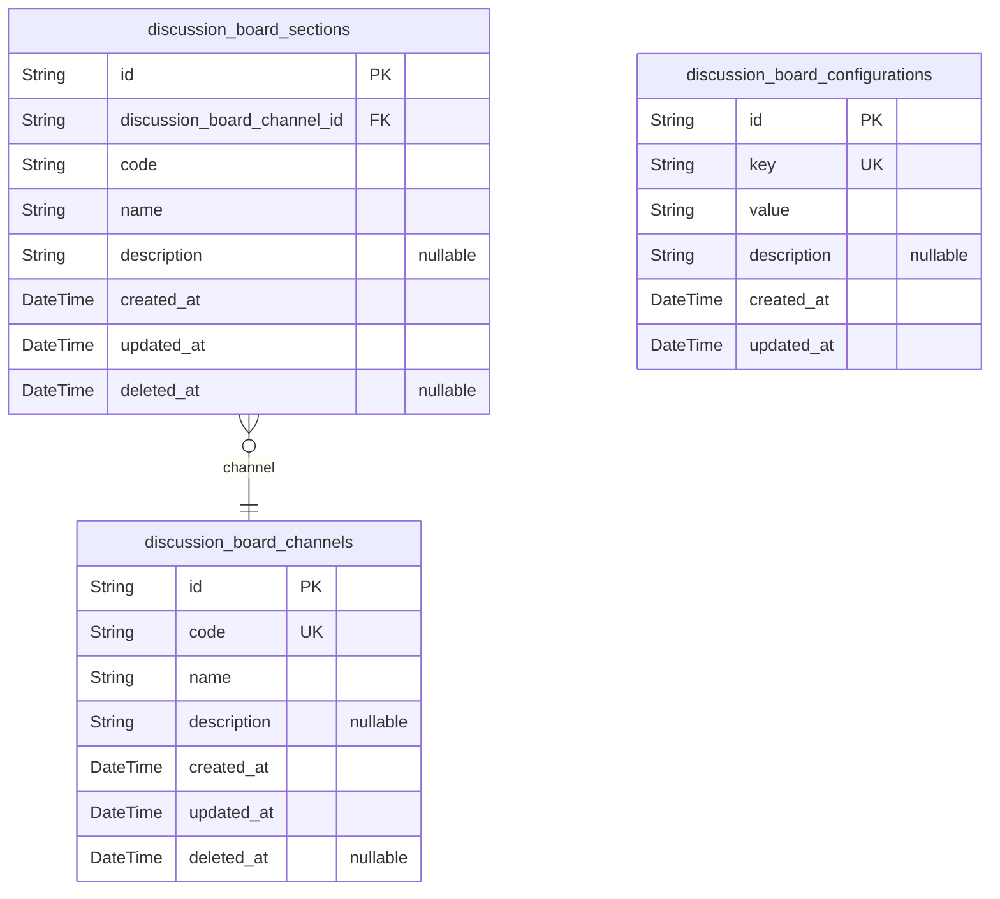
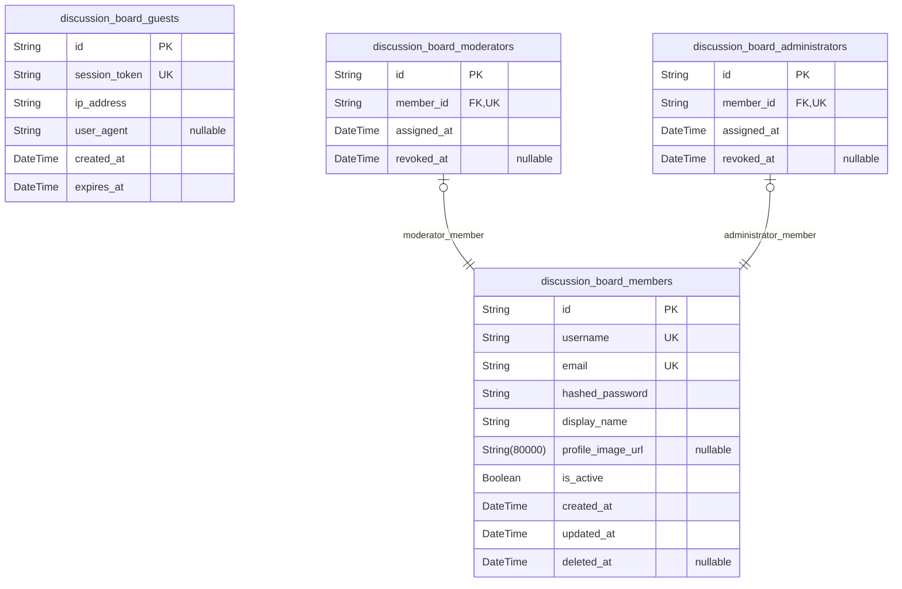
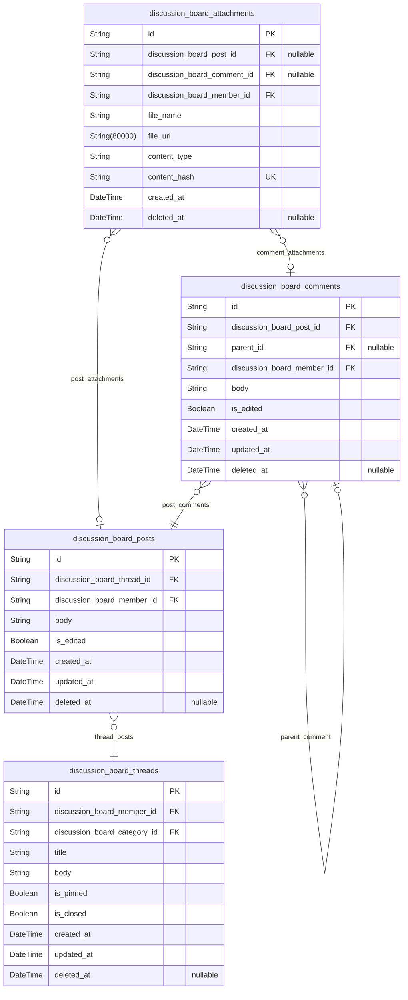
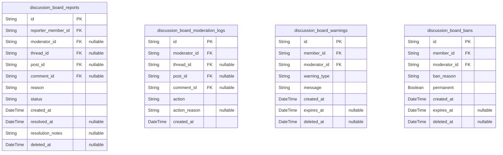
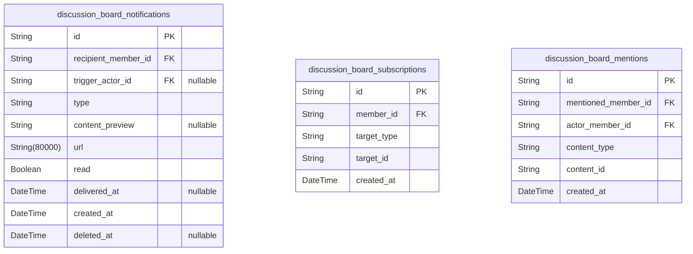
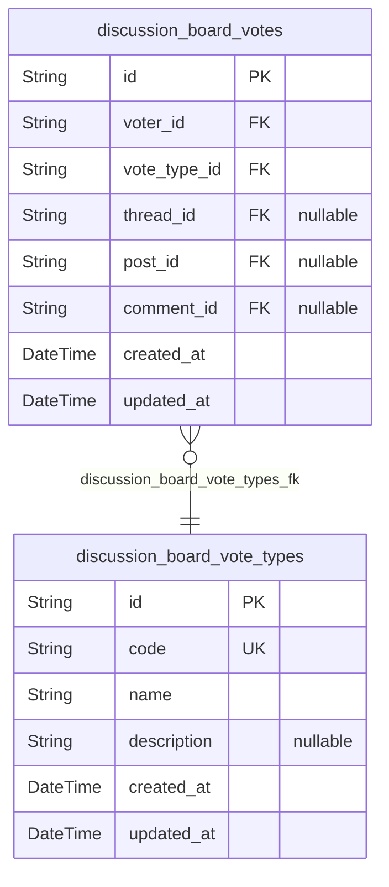
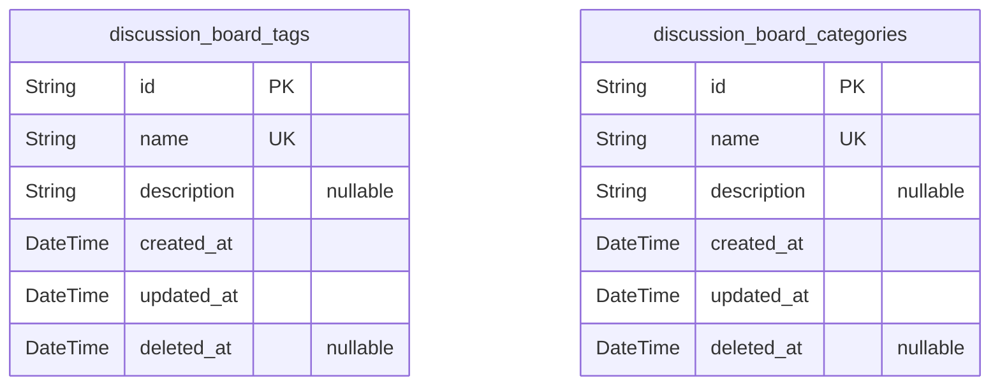
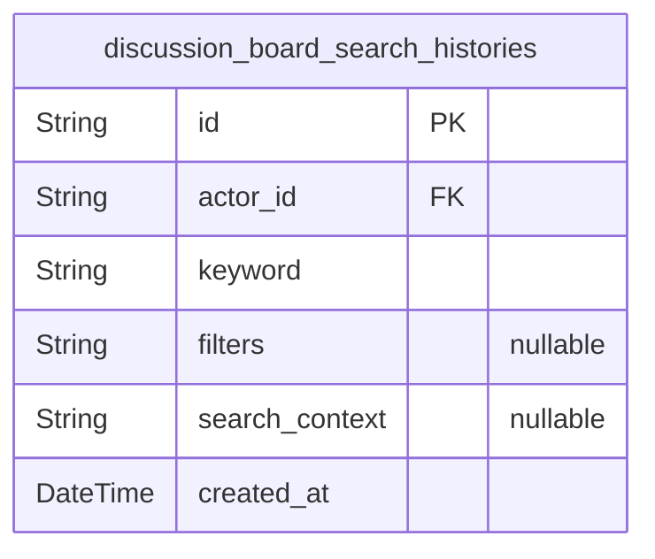

# Prisma Markdown

> Generated by [`prisma-markdown`](https://github.com/samchon/prisma-markdown)

- [Systematic](#systematic)
- [Actors](#actors)
- [Articles](#articles)
- [Moderation](#moderation)
- [Notifications](#notifications)
- [Votes](#votes)
- [Categories](#categories)
- [Search](#search)

## Systematic

### `discussion_board_channels`

Discussion board channels - Implements the channel partitioning and top-level division requirement for the discussion platform (see section 3 of requirements analysis: Features & User Journeys, Thread & Post creation, browsing/search, multi-tiered access). This table allows the forum to be segmented into overarching channels (e.g., Politics, Economics) under which sections and discussions can be organized. Maintains strict 3NF compliance by storing only atomic, non-derived properties. For example, enables the board to have a "Politics" or "Economics" channel, each with their own categories and threads. Key relationships: referenced by sections and as entry points for content organization. Special behaviors: channel code is unique, soft deletion supported for reversibility.

Properties as follows:

- `id`: Primary Key. Unique channel identifier for internal reference, used throughout the board's system for relationships and indexing.
- `code`: Code for the channel - Implements unique channel addressing as required by multi-channel design. Used for URLs or internal routing (e.g., 'pol', 'eco'). Ensures normalization by not repeating names; links to sections and system routing. Example: 'eco'.
- `name`: Human-readable channel name - The full descriptive name for display and selection (e.g., 'Politics', 'Economics'). Ensures atomic representation of the channel label. Directly surfaced in admin/UI selection.
- `description`: Channel description - Implements requirement for discoverability and clarity. Shown in listings, aids in search and context for users. Purely informational; maintaining normalization by not repeating section/category descriptions. Example: 'Discussion of global economic issues.'.
- `created_at`: Timestamp when channel was created - Implements auditability requirement. Maintains normalization by recording only creation event. Used for admin/audit views. Example: '2024-07-22T20:32:00Z'.
- `updated_at`: Last update timestamp - Auditing/moderation conformity. Used for system logs and reflecting latest channel changes per non-functional security and audit requirements.
- `deleted_at`: Soft delete timestamp for channel - Implements requirement for reversibility and audit trail of admin/mod actions. Null if not deleted. Used to support undo and regulatory compliance. Example: '2025-07-20T15:01:00Z' or null.

### `discussion_board_sections`

Discussion board sections - Implements the requirement for sub-division within channels (see feature requirements: Thread & Post Creation, Section/Forum hierarchy). Each section exists within a channel, allowing granular organization (e.g., 'Legislation', 'Global Markets'). 3NF compliance maintained by isolating only section attributes in this entity. For example, a section 'Legislation' under 'Politics' channel. Sections directly reference their parent channel. Key relationships: belongs to a channel, parent to threads/posts (handled in other components). Special behaviors: unique section code within a channel, soft deletion supported.

Properties as follows:

- `id`: Primary Key. Unique section identifier (UUID). Used as the reference for all section-level operations and relations.
- `discussion_board_channel_id`: Belonged channel's [discussion_board_channels.id](#discussion_board_channels) - Associates this section with a parent channel. Enforces 1:N relationship. Required, not nullable. Example: points 'Legislation' under 'Politics' channel.
- `code`: Unique section code within channel - Used for routing and management (e.g., 'legis', 'markets'). Unique per channel. Maintains normalization; not repeated in other entities. Example: 'legis'.
- `name`: Section name - Implements user-facing display and admin management. Pure atomic value. Example: 'Legislation'. Used in UI, filtering, and management tools.
- `description`: Section description - Supports user discoverability, as required for guided navigation. Example: 'Debate on government legislation.' Maintains normalization by avoiding duplication across sections/channels.
- `created_at`: Section creation timestamp - Implements record traceability as per audit requirements. Used for admin views. Example: '2024-07-22T20:44:00Z'.
- `updated_at`: Last modified timestamp for the section - For audit/compliance and UI sorting as per non-functional requirements.
- `deleted_at`: Soft delete timestamp - Implements reversibility of moderation/admin actions. Null if never deleted. Purely for compliance and undo.

### `discussion_board_configurations`

Discussion board configuration key-values - Implements the requirement for tunable system-wide settings and feature flags (see administrative/technical requirements). This enables administrators to control platform behavior dynamically (e.g., posting limits, enabled feature toggles, UI settings) without code deployments. 3NF enforced by storing atomic key-value pairs, not embedding configuration across multiple tables. For example, can store 'max_post_length', 'allow_guest_voting', etc. Relationships: none (global settings); referenced at runtime. Special behaviors: keys are unique, values are simple strings/JSON-serializable.

Properties as follows:

- `id`: Primary Key. Unique configuration row identifier.
- `key`: Configuration setting key - Implements the global configuration requirement. Used as the identifier for lookups/updates. Example: 'max_post_length'. Uniqueness enforced platform-wide. Maintains normalization by not repeating in multiple places.
- `value`: Configuration value - Implements the actual set value for the configuration key. May be JSON or string. Atomic data element. Example: '10000', '{"enable":true}'.
- `description`: Description of what this configuration controls - Provides admin-facing understanding of each configuration. Example: 'Sets the maximum number of characters allowed in a post.' Used in admin dashboards only. Maintains normalization and documentation integrity.
- `created_at`: Configuration created at - Traceability and audit, per system and compliance requirements. Example: '2024-07-22T20:56:00Z'.
- `updated_at`: Timestamp for last update to this configuration - For audit trails and system config management.

## Actors

### `discussion_board_guests`

Discussion Board Guest Account - This implements the requirement for unauthenticated user sessions, supporting view-only access (see F01, F06 in requirements). This model stores anonymous session metadata to support audit logging, moderation traceability, and potentially soft-identification for abuse prevention. Maintains 3NF by storing only session-atomic data rather than duplicating member or device data. Example: tracking a guest's session for read-only content viewing, reporting, or rate limiting. Key relationships: none (guests are not linked to posts, only tracked passively). Special behaviors: Guests can browse public threads but cannot interact or author posts/comments. No business relationships to members or content entities directly. Session expiration and enrichment handled in application layer, not schema.

Properties as follows:

- `id`: Primary Key. Unique identifier for the guest session.
- `session_token`: Session token for tracking guest user's browsing session. Implements anonymous identification requirement for viewing, rate limiting, and audit scenarios. Ensures normalization by separating guest activity from member identities. Example: "guest_ae892ded9b5e2da4". Immutable per guest session.
- `ip_address`: IP address associated with the guest session. Implements audit and abuse mitigation requirements (see security section). Ensures each session can be traced for moderation or abuse prevention. Example: "203.0.113.42". May be anonymized or truncated per privacy rules.
- `user_agent`: User agent string from the guest's browser/device. Implements security and analytics requirement. Normalized: atomic per browsing session, no aggregation. Example: "Mozilla/5.0 (Macintosh; Intel Mac OS X 10.15; rv:91.0) Gecko/20100101 Firefox/91.0".
- `created_at`: Timestamp when guest session started. Implements audit and moderation traceability. Ensures normalization by not storing calculated or truncated intervals. Example usage: session start logging, abuse pattern analysis.
- `expires_at`: Expiration timestamp for guest session validity. Implements security requirement for limiting the duration of anonymous access (see non-functional requirements). Ensures 3NF by storing atomic time values only. Example: 24 hours from session creation.

### `discussion_board_members`

Discussion Board Member Account - Implements the core requirement for registered, authenticated users who participate in discussions (see F02, F03, F07, and user journeys). This model stores essential profile, authentication, and state information for each member, maintaining strict 3NF separation from moderator/admin roles and content. Used for identity, interaction, notification, and access control. Example: A member creates threads, replies, votes, or reports content. Key relationships: Moderators and administrators are separately modeled for role escalation; foreign keys reference only when action escalation or logs are needed. Special behaviors: Member-level fields only (role-based logic handled in application and foreign models). Password policies, hashing, and verification are outside scope (handled by auth provider interface).

Properties as follows:

- `id`: Primary Key. Unique identifier for the member account.
- `username`: Member's unique public username. Implements profile, notification, and search functionality. Example: "democracyFan_21". Ensures normalization as user identity is atomic and required.
- `email`: Email address for system notifications, password recovery, and authentication purposes. Implements F07 notification delivery and F02/F03 account validation. Example: "jane.doe@email.com". Unique per member; normalization by storing as standalone atomic value.
- `hashed_password`: Storage for password hash (never raw password). Required for credential validation compliance. Ensures normalization—authentication security separated from business logic. Example: argon2id hash string; never stored or retrieved as raw passwords.
- `display_name`: Display name for friendly presentation in forums. Implements member-facing UI requirement; can be changed by user. Example: "Jane D." Normalized: separate from username and email for privacy/configurability.
- `profile_image_url`: Optional URI to member's profile image. Implements UX profile presentation requirements. Example: "https://cdn.site.com/profiles/member-42.jpg". Null if not set. Ensures data normalization—only one atomic string per member.
- `is_active`: Whether the member account is active (able to log in/interact). Implements moderation/suspension workflows. Example: false for banned or deactivated members. Ensures normalization by storing state per member without embedding logic.
- `created_at`: Timestamp of member registration. Implements registration timestamp recording requirement (see audit trail & engagement KPIs). Example usage: tracking new sign-ups per day.
- `updated_at`: Timestamp when member information was last updated. Implements audit/update history in line with privacy and recoverability requirements. Updated per profile or credential change. Ensures normalization—no aggregated edit history kept here.
- `deleted_at`: Timestamp for soft deletion (member removal by request or mod action). Implements reversibility and audit trail per requirements. Example usage: member invokes right to erasure; row remains for audit, but does not appear in UX. Null if active.

### `discussion_board_moderators`

Discussion Board Moderator Role - Implements the requirement for elevated content moderation privileges (see F04, F08, F07). This model enables escalation of accounts to moderator status and tracks their moderator-specific attributes. Normalized structure: distinct from base member data (which they extend via foreign key), ensuring single source of truth for credentials and user identity. Example: a moderator reviews reports, edits/hides comments, and pins threads. Key relationships: 1:1 with member; foreign key to `discussion_board_members.id` for role escalation. Special behaviors: All moderator-only fields (e.g., assignment to forums) go here; never duplicate member/account data. Action logs are tracked in moderation tables, not here.

Properties as follows:

- `id`: Primary Key. Unique identifier for the moderator role assignment.
- `member_id`: Target member's [discussion_board_members.id](#discussion_board_members) - Uniquely identifies which registered member has been assigned moderator role. Implements role escalation logic (see authorization specs).
- `assigned_at`: Timestamp when member was assigned moderator role. Supports audit trail and moderator onboarding tracking in line with security specs. Ensures normalization; never stores calculated tenure.
- `revoked_at`: Timestamp when moderator role was revoked. Null if currently active. Implements moderation audit and access control reversibility (see non-functional requirements). Ensures role status transitions are atomic and auditable.

### `discussion_board_administrators`

Discussion Board Administrator Role - Implements the specification for system-wide managerial privileges and site configuration (see requirements F05, F04, admin user journeys). Tracks which member accounts hold administrative access, supporting assignment, audit, and privilege escalation. Normalized by linking only to member entity (no duplicate account data). Example: an administrator assigns roles, configures settings, and oversees all board operations. Key relationships: 1:1 with member, foreign key to `discussion_board_members.id`. Special behaviors: All admin-only fields (escalation, audit, assignment) managed here; their content activity is handled via base member model. Role logs and audits are stored elsewhere.

Properties as follows:

- `id`: Primary Key. Unique identifier for the administrator role assignment.
- `member_id`: Target member's [discussion_board_members.id](#discussion_board_members) - Identifies registered user escalated to administrator role. Implements principal site configuration authority and reversible privilege assignment. Ensures referential integrity with users table.
- `assigned_at`: Timestamp when member was assigned administrator role. Implements admin audit trail (see requirements) and onboarding reporting. Ensures normalization by non-redundant, per-assignment timestamps only.
- `revoked_at`: Timestamp when admin role was revoked. Null if currently active. Fulfills audit and security reversibility requirements for admin privileges.

## Articles

### `discussion_board_threads`

Discussion Thread - This implements requirements F01, F02, F06 from the requirements analysis: Allows members to initiate new topical discussions and enables all users to view public threads. Business explanation: A thread is the main top-level discussion unit containing posts. Maintains 3NF compliance by storing only thread metadata and references to posts, categories, tags, and creator. For example, members start new threads; everyone can browse them; threads can be searched or filtered. Key relationships: references to discussion_board_members (creator), discussion_board_categories, possible cross-linking with tags, posts. Special behaviors: Title full-text search, thread must be open or closed (soft-delete for moderation, not hard delete).

Properties as follows:

- `id`: Primary Key. Uniquely identifies each thread record.
- `discussion_board_member_id`: Creator's [discussion_board_members.id](#discussion_board_members). Links the thread to the member who created it.
- `discussion_board_category_id`: Category's [discussion_board_categories.id](#discussion_board_categories). Links the thread to its topic category.
- `title`: Thread Title - Implements F01, F02, F06. The descriptive title of the discussion, used for search, browsing, and filtering. Ensures normalization by separating the thread's identity from post content. For example: '2025 National Budget Analysis'. Cannot be null.
- `body`: Thread Body - Implements F01, F02. The initial content of the thread (opening post). Provides context for members and is indexed for full-text search. For example: An analysis or question posed for discussion. Cannot be null.
- `is_pinned`: Pinned Flag - Implements moderation requirement F04. Indicates if moderators/admins have pinned this thread for visibility. Ensures normalization by using an atomic boolean rather than flagging / status field. For example: a thread is pinned to top for community reference.
- `is_closed`: Closed Flag - Implements moderation requirement for restricting new posts (F04). Indicates if no further posts/comments can be added. Ensures normalization by using atomic flag. For example: Off-topic/completed threads may be closed by a moderator. Cannot be null.
- `created_at`: Creation Timestamp - Records when the thread was created. Required for audit, sorting, and moderation. Ensures atomic representation of time.
- `updated_at`: Update Timestamp - Records last update to thread metadata (not posts/comments). Maintains normalization by tracking only thread-level changes.
- `deleted_at`: Soft-delete Timestamp - Implements F04 for reversible moderation actions. If set, the thread is considered deleted but can be restored. Fulfills business need for reversible actions. Nullable as not all threads are deleted.

### `discussion_board_posts`

Discussion Board Post - Implements F02, F03 from requirements analysis: Enables members to add content within threads (as root or reply posts). Business explanation: A post is either the thread's opening message or a subsequent reply (can be a 'main' post or be used for splitting off sub-topics). Maintains 3NF: post content, author, thread are atomic. For example: User A posts detailed argument in thread. Key relationships: linked to thread, author (member), and can have attachments. Special behaviors: Soft-delete for moderation, no calculated fields, auditing via timestamps.

Properties as follows:

- `id`: Primary Key. Uniquely identifies each post record.
- `discussion_board_thread_id`: Parent Thread's [discussion_board_threads.id](#discussion_board_threads). Associates this post with its parent discussion thread. Required for all posts.
- `discussion_board_member_id`: Creator's [discussion_board_members.id](#discussion_board_members). Refers to the member who authored this post.
- `body`: Post Body - Main content of the post, implements F02, F03. Users express ideas, arguments, or questions here. Ensures normalization (atomic post content, not mixed thread data). For example: A member writes a reply in a debate. Cannot be null.
- `is_edited`: Edit Flag - Indicates if the content was changed after creation. Maintains auditability in line with business rules. For example: Post shows 'edited' tag if changed.
- `created_at`: Creation Timestamp - When the post was created. Used for sort, moderation audit.
- `updated_at`: Update Timestamp - When post content last updated. For moderation and client freshness.
- `deleted_at`: Soft-delete Timestamp - Implements F04 moderation rule for reversible deletions. Nullable.

### `discussion_board_comments`

Discussion Board Comment - Implements F03, F04, F08 from requirements. Allows members to add nested commentary on posts, supporting deep discussion. Maintains 3NF by referencing post, parent comment, and author atomically. For example: Members can reply to posts or create deeply threaded comments. Key relationships: references discussion_board_posts, self (parent_id), and discussion_board_members. Special behaviors: Soft-delete for moderation, edit tracking, supports full-text search for moderation/retrieval.

Properties as follows:

- `id`: Primary Key. Uniquely identifies each comment.
- `discussion_board_post_id`: Parent Post's [discussion_board_posts.id](#discussion_board_posts). Links the comment to the post it references. Required.
- `parent_id`: Parent Comment's [discussion_board_comments.id](#discussion_board_comments). Supports nested (threaded) comments. Nullable for root-level comments.
- `discussion_board_member_id`: Comment Creator's [discussion_board_members.id](#discussion_board_members). Identifies the member who wrote the comment. Required.
- `body`: Comment Body - Implements F03, F08. Contains the textual or media commentary, normalized to separate from parent entities. For example: Member writes 'I disagree with this point...' in reply to a post or another comment. Cannot be null.
- `is_edited`: Edit Flag - True if content was modified after creation. Maintains clarity for users reading historical comments.
- `created_at`: Creation Timestamp - When the comment was submitted. Used for sorting, moderation, audits.
- `updated_at`: Update Timestamp - When the comment was last edited. Supports moderation audit trails.
- `deleted_at`: Soft-delete Timestamp - For moderation reversibility. Nullable.

### `discussion_board_attachments`

Discussion Board Attachment - Implements F02 (posts) and F03 (comments) for supporting attached files with user submissions. Normalizes file references; each attachment belongs to either a post or a comment, never both. For example: a member uploads a PDF or image to support a post or a comment. Maintains 3NF by holding only attachment-specific metadata and foreign key to the parent object. Key relationships: optional links to discussion_board_posts or discussion_board_comments (one, never both). Special behaviors: Soft-delete for moderation, uniqueness enforced on content hash for deduplication.

Properties as follows:

- `id`: Primary Key. Uniquely identifies each attachment record.
- `discussion_board_post_id`: Attached Post's [discussion_board_posts.id](#discussion_board_posts). If not null, the attachment is linked to a post. Nullable to support comment attachments.
- `discussion_board_comment_id`: Attached Comment's [discussion_board_comments.id](#discussion_board_comments). If not null, this attachment is linked to a comment. Nullable to support post attachments.
- `discussion_board_member_id`: Uploader's [discussion_board_members.id](#discussion_board_members). Tracks the member who uploaded the attachment. Required.
- `file_name`: Attachment File Name - Stores the original name of the uploaded file. Normalizes metadata storage. For example: 'research-data-2025.pdf'. Cannot be null.
- `file_uri`: Attachment File URI - Points to the file's storage location (S3, CDN, etc). Maintains atomic data management without storing file content. For example: 'https://cdn.site.com/files/1234.pdf'. Cannot be null.
- `content_type`: Mime Content Type - Describes file format for retrieval. For example: 'application/pdf', 'image/png'. Maintains normalization. Cannot be null.
- `content_hash`: Content Hash - Implements uniqueness; stores file SHA-256 or similar fingerprint for deduplication. For example: 'ab12cd34...'. Cannot be null.
- `created_at`: Upload Timestamp - Records when attachment was added. For audit/tracing. Cannot be null.
- `deleted_at`: Soft-delete Timestamp - Implements F04 for reversible moderation actions. Nullable as not all attachments are deleted.

## Moderation

### `discussion_board_reports`

Discussion Board Reports - Implements reporting/flagging requirements (Requirement F08) from the requirements doc. Allows members to flag content for moderator review. Fully normalized (3NF): one row per report, atomic fields for each responsibility. Used for moderation triage and compliance audit trails. Key relationships: member who reported, target content (thread/post/comment), assigned moderator/action. Audit trail and status tracking. Example: a member reports a spam comment. Special: supports soft delete, flexible target fields.

Properties as follows:

- `id`: Primary Key. Unique identifier for the report record.
- `reporter_member_id`: Reporter member's [discussion_board_members.id](#discussion_board_members). Indicates who submitted this report.
- `moderator_id`: Assigned/reviewing moderator's [discussion_board_moderators.id](#discussion_board_moderators). Nullable until a moderator claims the report.
- `thread_id`: Reported thread [discussion_board_threads.id](#discussion_board_threads) (used if this is a thread report, otherwise null).
- `post_id`: Reported post [discussion_board_posts.id](#discussion_board_posts) (used if this is a post report, otherwise null).
- `comment_id`: Reported comment [discussion_board_comments.id](#discussion_board_comments) (used if this is a comment report, otherwise null).
- `reason`: Reason for reporting - Required; textual explanation why this was flagged (e.g., 'spam', 'offensive'). 3NF: atomic motivation, not free-form moderation notes.
- `status`: Moderation/report workflow state (e.g., 'pending','under_review','resolved','dismissed'). Used for state-machine mod UI compliance. Required.
- `created_at`: Report creation timestamp for audit/ordering.
- `resolved_at`: When this report was resolved/closed. Nullable until action taken.
- `resolution_notes`: Moderator notes upon resolution (optional, used for moderation audit/comms). Nullable.
- `deleted_at`: Soft-delete timestamp (nullable unless deleted); for GDPR/audit compliance.

### `discussion_board_moderation_logs`

Discussion Board Moderation Logs - Implements moderation trace/audit requirements (Requirement F04, NFR logging/traceability) from requirements doc. One record per discrete mod action. Fully normalized (3NF): atomic action, FK moderator and content, no duplication. Used for post-event review and role compliance. Example: hiding a thread for ToS breach. Key: links moderator, atomic action, and target (any of thread/post/comment, or null for cross-content actions). Special: always immutable after write—permanent record.

Properties as follows:

- `id`: Primary Key. Unique identifier for moderation log record.
- `moderator_id`: Moderator who took this action - [discussion_board_moderators.id](#discussion_board_moderators).
- `thread_id`: Target thread [discussion_board_threads.id](#discussion_board_threads) (nullable if this is not on a thread).
- `post_id`: Target post [discussion_board_posts.id](#discussion_board_posts) (nullable if not applicable).
- `comment_id`: Target comment [discussion_board_comments.id](#discussion_board_comments) (nullable unless a comment).
- `action`: Action performed (e.g., 'hide','delete','warn','edit'). Each log is a single event. Required.
- `action_reason`: Reason/justification for action. Optional/free-form for additional transparency in logs. Nullable.
- `created_at`: Timestamp when the moderation event occurred. Required.

### `discussion_board_warnings`

Discussion Board Warnings - Implements formal user warning tracking (Req F04: user management). Each record logs a warning from moderator to member. 3NF: member, moderator, rationale separated and atomic. Drives escalation/ban logic. Key relations: target member and acting moderator FKs. Example: warning for spam/harassment. Soft delete and optional expiry supported.

Properties as follows:

- `id`: Primary Key. Unique identifier for warning record.
- `member_id`: Warned member's [discussion_board_members.id](#discussion_board_members). Target of the warning.
- `moderator_id`: Moderator who issued the warning [discussion_board_moderators.id](#discussion_board_moderators).
- `warning_type`: Type/category of warning (e.g., 'spam','harassment'). Atomic, avoids mixing categorization with rationale. Required.
- `message`: Moderator's message to member. Human-facing rationale, not for system logic. Required.
- `created_at`: When the warning was issued. Required for escalation logic/audit trail.
- `expires_at`: Optional expiry time (if the warning has an expiration). Nullable for permanent warnings.
- `deleted_at`: Soft delete timestamp (nullable unless deleted/expired for GDPR).

### `discussion_board_bans`

Discussion Board Bans - Implements user exclusion/ban process (Req F04: removal/escalation). Each row is a single ban event (either permanent or temporary). Fully normalized: reason, scope, timeline atomic and FK relations. Used for automated and manual enforcement of community guidelines. Key: member, moderator, fully documented scope/dates. Example: ban after multiple warnings. Nullable expires_at for permanent bans. Audit trail and soft-delete compliant.

Properties as follows:

- `id`: Primary Key. Unique identifier for the ban record.
- `member_id`: Banned member [discussion_board_members.id](#discussion_board_members). Target user.
- `moderator_id`: Moderator who imposed the ban [discussion_board_moderators.id](#discussion_board_moderators).
- `ban_reason`: Explanation for the ban (e.g., 'multiple ToS violations'). Atomic, required.
- `permanent`: Is this ban permanent? true if no expires_at, else false. Required.
- `created_at`: Timestamp when the ban was imposed. Audit/fairness use. Required.
- `expires_at`: When this ban expires (null = permanent). For enforcement automation.
- `deleted_at`: Soft-delete timestamp (nullable unless lifted/expired for GDPR/audit).

## Notifications

### `discussion_board_notifications`

Discussion Board Notification Entity - This implements F07 (Notifications) from the requirements document.

This table stores notification events for users, representing a discrete alert or message triggered by activity (such as replies, mentions, moderation actions, or subscriptions) intended for a user. Maintains 3NF by only storing atomic, event-specific data. For example, when a member is mentioned in a reply, a new notification is generated referencing the relevant post. Key relationships: links recipients (members) and actors who trigger events. Special behaviors: Soft-deletion, delivery, and read-tracking.

Properties as follows:

- `id`: Primary Key. Unique identifier for each notification event.
- `recipient_member_id`: Recipient's [discussion_board_members.id](#discussion_board_members) - The member who receives the notification. Implements user notifications (F07).
- `trigger_actor_id`: Initiator's [discussion_board_members.id](#discussion_board_members) - The user who performed the action triggering the notification (e.g., commenter, moderator). Nullable for system notifications.
- `type`: Type/Category of the notification (e.g., reply, mention, moderation, subscription). Implements notification type from requirements F07.
- `content_preview`: Short text preview of the event that caused the notification (e.g., comment excerpt, post title). Atomic, non-derived data to comply with 3NF.
- `url`: Link to the resource/content associated with the notification (thread, comment, moderation action). Normalized as a URI for direct navigation. Implements context from functional requirements (F07).
- `read`: Flag indicating if the notification has been read by the user. Enables accurate UX state and compliance with UX requirements.
- `delivered_at`: Timestamp when notification delivery was completed (in-app or email). For audit trails and delivery tracking.
- `created_at`: Datetime when the notification was generated. For ordering, filtering, and audit trails.
- `deleted_at`: Soft-deletion timestamp for compliance, reversibility, and audit support. Null if active, set when deleted.

### `discussion_board_subscriptions`

Discussion Board Subscription Entity - Implements F07 (Notifications) and supports content follow/subscription flows. Tracks which members subscribe to which content (thread, section, tag, etc.), enabling notification delivery when followed content has new events. Maintains 3NF by only storing atomic member-to-content relations. Uniqueness enforced for (member, target type, target ID) per business rules.

Properties as follows:

- `id`: Primary Key. Unique identifier for each subscription relationship.
- `member_id`: Member [discussion_board_members.id](#discussion_board_members) - The user subscribing to the resource. Implements personalized notification flows.
- `target_type`: Type of resource being followed (e.g., thread, section, tag). Defines polymorphic subscription nature per requirements analysis and user journeys.
- `target_id`: ID of the resource being followed (foreign key to thread/section/tag tables, not materialized in this file). Strictly normalized so only atomic linking occurs here.
- `created_at`: Datetime when subscription was created. For sorting/filtering and retention/audit requirements.

### `discussion_board_mentions`

Discussion Board Mention Entity - Implements F07 (Notifications) for '@mention' events as documented in requirements. Each record is an instance of a member being mentioned (e.g., via '@username') in a post, comment, or thread. Strictly atomic: links mention actor, target, and referenced content only. Used to drive mention notifications and auditing. Uniqueness constraint ensures single mentions per content context.

Properties as follows:

- `id`: Primary Key. Unique identifier for each mention event.
- `mentioned_member_id`: Target's [discussion_board_members.id](#discussion_board_members) - The user who was mentioned. Implements target for mention notifications.
- `actor_member_id`: Mentioner's [discussion_board_members.id](#discussion_board_members) - The user who performed the mention action. Traceability for originator.
- `content_type`: Type of content where the mention occurred (e.g., post, comment, thread), supporting polymorphic relations as per requirements.
- `content_id`: ID of the content (post/comment/thread) where the mention was made. Enforces normalization as only atomic foreign link.
- `created_at`: Datetime mention was created. For chronological and notification tracking.

## Votes

### `discussion_board_vote_types`

Vote Type Entity - This implements the requirements for supporting different voting mechanisms (e.g., upvote, downvote, like, etc.) as needed for features like voting threads, posts, or comments (from RA Section 3: F03 and Features 2.2). 

Business explanation: This table contains specific types of votes allowed in the system. Keeps the vote action design extensible and normalized. Maintains 3NF by separating static vote-type data from actual votes or users. For example, 'upvote' and 'downvote' are two types stored here and referenced by individual votes.

Key relationships: Referenced by [discussion_board_votes.vote_type_id](#discussion_board_votes) to indicate what kind of vote each vote is. Used by various voting features for content items.
Special behaviors: System integrity—vote records must always reference a valid type.

Properties as follows:

- `id`: Primary Key. Unique identifier for each vote type entry.
- `code`: Vote type code - Implements code for programmatic referencing (e.g., 'upvote', 'downvote'). Ensures normalization by storing type semantics here. Example: 'upvote'. Unique per vote type.
- `name`: Vote type display name - Human-friendly name for the vote type (e.g., 'Upvote', 'Downvote'). Keeps display strings separate from logic. Example: 'Upvote'.
- `description`: Description of the vote type - Explains what this vote type represents or when to use it. Example: 'Indicates positive reception from users.' Maintains normalization by isolating type explanations here. Nullable for simpler types.
- `created_at`: Creation timestamp. Tracks when this vote type was added to the system. Required for audit trails. 3NF-compliant field.
- `updated_at`: Last update time. For auditability and change tracking, required for compliance and good record-keeping. 3NF-compliant.

### `discussion_board_votes`

Vote Entity - This implements the requirement to record user votes on threads, posts, or comments (from RA Section 3: F03 and Features 2.2). 

Business explanation: Each record is a single vote by a user on a specific content item (thread/post/comment) using a particular vote type. This model maintains full normalization by separating votes from users and content. For example, a user upvotes a post or downvotes a comment—each as a row in this table.

Key relationships: Foreign keys reference Actors (voter), Articles (the item being voted), and Vote Types. Enables features like upvote/downvote on content and ensures referential integrity. Critical for voting UX and analytics. All votes reference existing vote types and voters.
Special behaviors: Uniqueness enforcement (voter cannot cast same-type vote on same item twice), full audit trail (created_at, updated_at).

Properties as follows:

- `id`: Primary Key. Unique identifier for each vote entry.
- `voter_id`: Voter's [discussion_board_members.id](#discussion_board_members) (or another Actor-role table). Indicates who cast the vote. This is a required reference for all votes and enables construction of voting histories and restriction enforcement (e.g., one vote per user per item).
- `vote_type_id`: Vote type's [discussion_board_vote_types.id](#discussion_board_vote_types) field. Defines what kind of vote this is (e.g., upvote, downvote).
- `thread_id`: Target thread's [discussion_board_threads.id](#discussion_board_threads) field, if the vote is cast on a thread. Nullable because not all votes are on threads (some on posts/comments).
- `post_id`: Target post's [discussion_board_posts.id](#discussion_board_posts) field, if the vote is cast on a post. Nullable because not all votes are on posts (some on threads/comments).
- `comment_id`: Target comment's [discussion_board_comments.id](#discussion_board_comments) field, if the vote is cast on a comment. Nullable because not all votes are on comments (some on threads/posts).
- `created_at`: Vote timestamp. Shows when this vote was cast. For full accountability, auditing, and analysis. 3NF-compliant.
- `updated_at`: When this vote record was last updated (such as in correcting a misvote). For audit log compliance and analytics. 3NF-compliant.

## Categories

### `discussion_board_tags`

Discussion Board Tag entity - This implements the requirement for thread and post tagging (see Features & User Journeys and Functional Requirements F06, F01). 

Business explanation: Allows categorization and searchability of threads and posts by enabling tags/keywords, which foster better content discovery and flexible filtering. Maintains 3NF compliance by separating tag definitions from application (thread/post linkage handled elsewhere). For example, a thread about 'Monetary Policy' might have tags like 'macroeconomics', 'inflation', and 'central banks'.

Key relationships: May be referenced by posts/threads in other domains via M:N link tables. 
Special behaviors: Tag names must be unique per board; search-optimized via GIN index.

Properties as follows:

- `id`: Primary Key. Unique identifier for the tag record.
- `name`: Tag Name - Implements requirement F06 for content search/filter. This is the unique, human-readable tag label (e.g., 'inflation'). Ensures normalization by keeping tag vocabulary distinct and atomic. For example, used for content discovery filters. Constraint: unique within context.
- `description`: Tag Description - Implements search UX and accessibility requirements. Human-readable annotation of tag purpose or scope (e.g., 'Discussion about macroeconomic inflation topics'). Supports normalization by not duplicating explanatory text elsewhere. For example, shown on tag hover in UI. Optional.
- `created_at`: Creation timestamp - Implements audit/traceability requirement. When was the tag added to the system? Ensures normalization/audit compliance; enables tag lifecycle reviews. Example: '2024-07-22T14:17:31.291Z'.
- `updated_at`: Last update timestamp - Implements audit trail/maintenance requirements. Normalization maintained by only storing atomic state (not deltas/versions). Example usage: UI can display last modified date for moderators.
- `deleted_at`: Soft delete timestamp - Implements reversible deletion (non-functional requirement). Allows safe tag removal (not physical deletion) for audit/compliance. Null if active, else indicates deletion time. For example, avoid losing historical tagging data. Optional.

### `discussion_board_categories`

Discussion Board Category entity - This implements the requirement to organize threads/posts into broad categories or sections, as outlined in the Features/User Journeys and F01/F06 (topic discovery and advanced search).

Business explanation: Supports a forum-like taxonomy (e.g., 'Politics', 'Economics', 'Law & Policy'). Enables self-service navigation, structuring, and filtering by higher-level groups, separated from tags (finer granularity). Maintains 3NF compliance by holding only the atomic category definition; actual assignment to threads handled by M:N link in another model.

Key relationships: Referenced by threads/posts elsewhere (not here). May support parent-child relationships for subcategories in an extension.
Special behaviors: Names must be unique within site/context. Used in site menus and search filters.

Properties as follows:

- `id`: Primary Key. Unique identifier for the category record.
- `name`: Category Name - Implements requirement for categorization and navigation (F01, F06). Unique, human-readable category label (e.g., 'Economics', 'Legislation'). Ensures normalization by avoiding duplication; referenced for browsing/search. Example: in UI category menus.
- `description`: Category Description - Implements usability/accessibility requirement. Defines purpose/scope for category (e.g., 'Topics about national or global economic policy'). Normalization by not storing detailed explanation in other tables. Optional.
- `created_at`: Creation timestamp - For audit/traceability (requirement: audit trail, non-functional). When was this category created? Normalization: one atomic value per record. Example: in site admin panel.
- `updated_at`: Last update timestamp - For maintenance/audit requirements. When was this category last updated? Normalization: only current value, not change list. Example: for admins to track changes.
- `deleted_at`: Soft delete timestamp - Implements requirement for reversible deletion. Null if active; if set, category is marked deleted (not removed). Maintains normalization by separating lifecycle from business fields. Example: archival for audit/compliance.

## Search

### `discussion_board_search_histories`

Discussion Board Search Histories - This implements user search history tracking as derived from requirements F06 (Search/filter topics and posts) and F07 (Receive notifications) in the specifications. 

This model records every search performed by users on the discussion board, logging keywords, filters, and search contexts for analytics and user experience enhancement. Maintains 3NF compliance by separating search event tracking from user/account/profile data. For example, allows reconstructing a user's recent search queries or admins to audit search trends.

Key relationships: References the user who initiated the search (foreign key to guest or member or moderator or administrator). Can later link to search recommendations or history-based notifications. 
Special behaviors: Should not store actual post/thread content or denormalized search results—only search intent and metadata. Used for analytics, recommendation, and privacy review.

Properties as follows:

- `id`: Primary Key. Uniquely identifies each search history entry.
- `actor_id`: The user (guest, member, moderator, or admin) who executed the search. Target model's [discussion_board_guests.id](#discussion_board_guests), [discussion_board_members.id](#discussion_board_members), [discussion_board_moderators.id](#discussion_board_moderators), or [discussion_board_administrators.id](#discussion_board_administrators). Implements audit and personalization requirements.
- `keyword`: The search keyword or terms entered by the user. Implements functional requirement F06. Ensures normalization by storing only the atomic input. Example: 'election reform', 'inflation trends'. Not nullable.
- `filters`: Serialized representation of structured search filters (e.g., tags, categories, date ranges). Implements F06 advanced search capability. Example: '{"tags":["economy"],"date":"2025-07"}'. Optional, as user searches may not use filters.
- `search_context`: Context of search (e.g., section, channel, or specific UI location where initiated). Implements analytics/audit utility. Example: 'thread_list', 'homepage', 'admin_panel'. Optional for maximal flexibility.
- `created_at`: Timestamp when the search was executed. Implements audit trail and behavioral analytics requirements. Maintains normalization by separating event time from event content. Not nullable. Example: '2025-07-22T14:17:31.291Z'.
