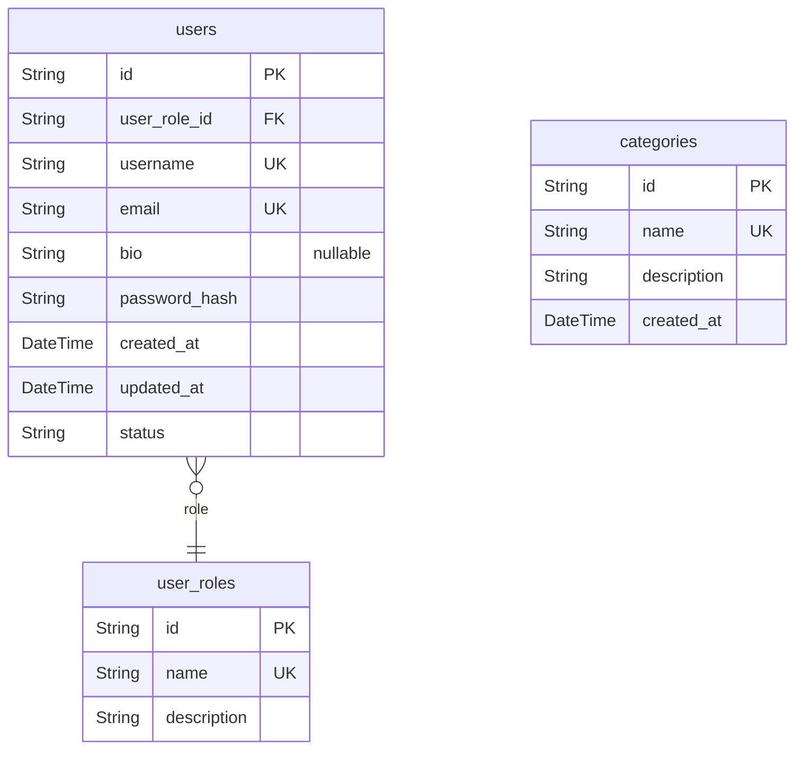
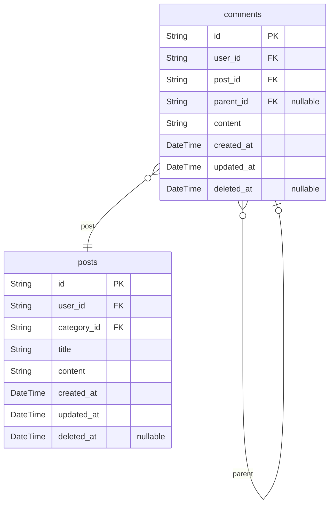
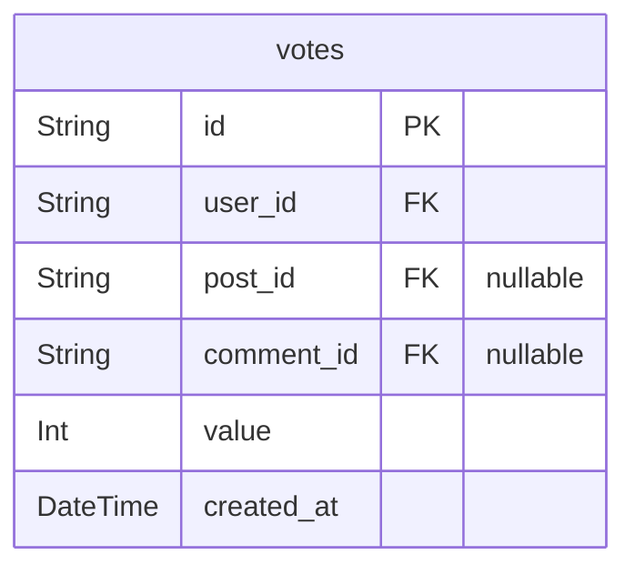

# Prisma Markdown

> Generated by [`prisma-markdown`](https://github.com/samchon/prisma-markdown)

- [Core](#core)
- [Posts](#posts)
- [Votes](#votes)

## Core

### `users`

User information - This implements the 'User' entity from the requirements analysis document (03_data_structure_and_business_rules.md). 

Represents registered members of the discussion board. Each user record holds public profile data and permissions (role and status). For example, Alice with email alice@email.com can be a regular user, moderator, or admin.

Key relationships: references user_roles for permission, and relates to posts, comments, and votes they create.
Special behaviors: emails are unique; passwords are stored securely; role assignment required.

Properties as follows:

- `id`
  > Primary Key.
  > Unique identifier for each user.
- `user_role_id`
  > Role of the user. Target model's [user_roles.id](#user_roles).
  > Determines user permissions such as regular member, moderator, or administrator.
- `username`: Username visible on the platform - Implements profile display requirement. Must be unique and public. For example, 'politicoFan88'.
- `email`: User's email address - Used for login and notifications. Must be unique. For example, 'user@example.com'.
- `bio`: Optional short biography - Lets users share info about themselves. For example, 'Economics student, debate enthusiast.'
- `password_hash`: Hashed password - Implements security requirement. Stores a hashed version of the user password for authentication. Example: long hash string. Not public.
- `created_at`: Account creation timestamp - Implements auditability. For example, '2024-06-09T10:00:00+09:00'.
- `updated_at`: Timestamp of last profile update - Implements history/auth traceability. For example, '2024-07-01T12:30:00+09:00'.
- `status`: Account status - Implements moderation/authentication rules. For example, 'active', 'suspended', or 'banned'.

### `user_roles`

User role definitions - This implements the role structure outlined in user roles section of the requirements analysis document (02_key_features_and_user_roles.md).

Defines different permissions and capabilities for users. For example, 'member', 'moderator', 'administrator'.

Key relationships: referenced by users table; no direct link to posts or comments.
Special behaviors: role 'name' must be unique.

Properties as follows:

- `id`: Primary Key. Unique identifier for user role.
- `name`: Role label - Implements user roles requirement. Example: 'member', 'moderator', 'administrator'. Must be unique.
- `description`: Role description - Gives context about permissions and duties; e.g., 'Can moderate comments and suspend users' for moderators.

### `categories`

Discussion categories - This covers the 'Category' entity from the requirements document (03_data_structure_and_business_rules.md).

Represents the main topic divisions organizing posts. For example, 'Politics', 'Economics', 'International Affairs'.

Key relationships: referenced by posts; managed by administrators.
Special behaviors: unique name required, can be suggested by users but created by admin.

Properties as follows:

- `id`: Primary Key. Unique identifier for category.
- `name`: Category name - Implements content organization and navigation requirement. For example, 'Politics'. Must be unique per category.
- `description`: Category description - Explains scope. For example, 'Discussion about domestic and international political systems, governance, and related events.'
- `created_at`: Timestamp when the category was added - Implements audit trail. Example: '2024-06-09T09:00:00+09:00'.

## Posts

### `posts`

Post entity - This implements the 'Post' entity from the requirements document (see Data Structure and Business Rules, section 1, and Example Scenario). 

Represents discussion topics or articles submitted by users. Provides a core construct to enable users to initiate threads, share analysis, and start community debates. For example, a user posts a discussion about inflation in the 'Economics' category. 

Key relationships: Each post belongs to one user (author) and one category. Each post can have many comments and votes. 
Special behaviors: A post must be assigned to a category, may be edited/deleted by its author, and is visible to all users. Vote tally and creation metadata are key for surfacing relevant content.

Properties as follows:

- `id`: Primary Key. Unique identifier for each post.
- `user_id`: Author's [users.id](#users) - Links each post to its authoring user account. Enforces the association between posts and registered users. Required for accountability and profile-related features.
- `category_id`: Category's [categories.id](#categories) - Associates the post with a topic/category, used for board structure and navigation. Enforces the requirement that every post has a topical context.
- `title`: Title of the post - Implements the requirement that each post has a headline/subject. Business meaning: summary/subject line visible in post lists and thread views. For example, 'Economic Impact of Inflation in 2025'.
- `content`: Body content of the post - Implements the rule that posts have main text where users express opinions, share news, analysis, etc. For example, a 400-word analysis of current economic events. Allows rich content or text.
- `created_at`: Creation timestamp - Implements transparency and audit requirements by recording when the post was created. Business use: shows recency in lists, allows moderation tracking.
- `updated_at`: Last edited timestamp - Allows tracking of post edits for evidence/history. Enforces business constraint of allowing users to edit posts within the permitted window. For example, updated_at is changed when a user fixes a typo.
- `deleted_at`: Soft deletion timestamp - Implements moderation rules (see Moderation and User Roles). Posts are not hard deleted but marked with this field if removed for rule violations or by user request. For example, moderators mark spam here for audit/history.

### `comments`

Comment entity - This implements the 'Comment' entity from the requirements (see Data Structure and Business Rules section 1, and Example Scenario).

Represents replies to posts or other comments, allowing for nested conversations and community discussion. For example, a user comments on a post about inflation, or replies to another comment with their opinion.

Key relationships: Each comment is written by a user and is attached either directly to a post or as a nested reply to another comment. Each comment can have multiple votes. Replies form a hierarchy.
Special behaviors: Only registered users can comment. Comments may be deleted/edited by their author within constraints. Vote tally supports surfacing relevant replies. Threaded (self-referential) relations supported.

Properties as follows:

- `id`: Primary Key. Unique identifier for each comment.
- `user_id`: Author's [users.id](#users) - Indicates the owner/author of the comment. Enforces accountability, links to profile and reputation system. Required for audit and moderation.
- `post_id`: Parent post's [posts.id](#posts) - The post that this comment is in response to. Implements the association between comments and discussions. Required unless it's a reply to another comment only.
- `parent_id`: Parent comment's [comments.id](#comments) - Implements threaded/nested replies, allowing for comment hierarchies. Enables conversations to branch. Nullable for top-level comments (direct responses to posts).
- `content`: Comment body - Implements the rule that each comment consists of user-written text/content. Used for replies, opinions, and ongoing discussion. For example, 'I agree and here’s why...'.
- `created_at`: Creation timestamp - Implements audit/history requirement for comment posting, tracking the date and time for moderation and display ordering. For example, enables 'most recent first' sorting.
- `updated_at`: Last edited timestamp - Implements edit history tracking for evidence and transparency. If a user updates their comment, this records when.
- `deleted_at`: Soft deletion timestamp - Implements moderation controls by marking comments removed (not hard deleted) for evidence/history. Used if comment violates rules, is self-removed, or by moderator action.

## Votes

### `votes`

Vote records - This implements the voting/feedback requirements section described in the requirements analysis, enabling users to provide positive or negative feedback on posts and comments in the discussion board. 

Business purpose: Allows users to upvote or downvote content, surfacing high-quality posts and comments, while discouraging low-quality contributions. Only registered users can cast votes and only one vote per content item per user is allowed, enforcing fairness and preventing manipulation. Used to calculate real-time content ranking and trust metrics.

Key relationships: Votes always belong to a user and point to either a post or a comment. The voted target is mutually exclusive: each row references either a post or a comment, but never both. 

Special behaviors: Unique constraint ensures one vote per user per post or comment. Cascade deletion if the user or voted content is removed, to maintain data integrity.

Properties as follows:

- `id`: Primary Key. Unique identifier for each vote record.
- `user_id`: Voter's user reference - Links each vote to the user who cast it. Implements the requirement that only registered users can vote. Business meaning: Tracks voting history and enforces unique voting constraints. Example: User 'U' upvotes a comment, linking the vote to 'U's user_id.
- `post_id`: Target post's reference - References the post being voted on, if the vote relates to a post (and not a comment). Implements mutual exclusivity rule and enables vote tallies for posts. Example: Voting on a thread increases the tally on the referenced post. Constraint: Only one of post_id or comment_id is non-null per row.
- `comment_id`: Target comment's reference - References the comment being voted on, if applicable. Implements mutual exclusivity rule as with posts. Example: Voting on a reply records the vote linked to this comment. Only one of post_id or comment_id is set per vote record.
- `value`: Vote value - Implements the upvote/downvote requirement. Stores +1 for upvote, -1 for downvote. Business meaning: This value is aggregated to produce content rankings. Example: A +1 value indicates an upvote from a user.
- `created_at`: Vote timestamp - Implements auditing requirements for vote tracking. Stores the date and time the vote was made. Used for analytics and to enforce time-based voting limits, if ever required by policy.
