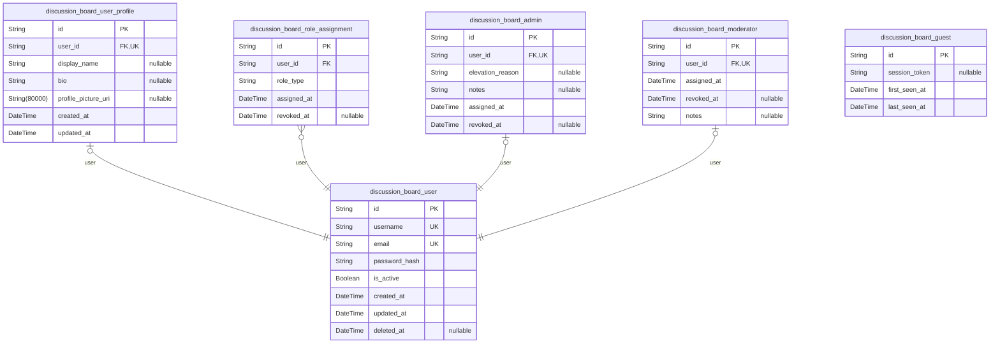
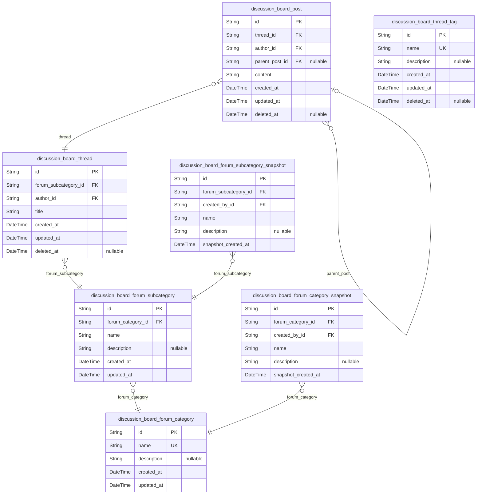
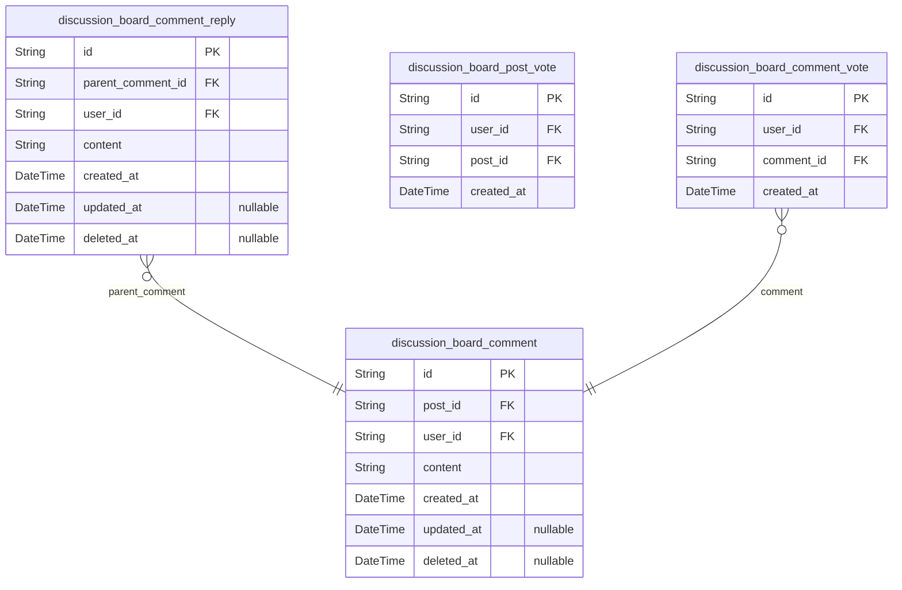
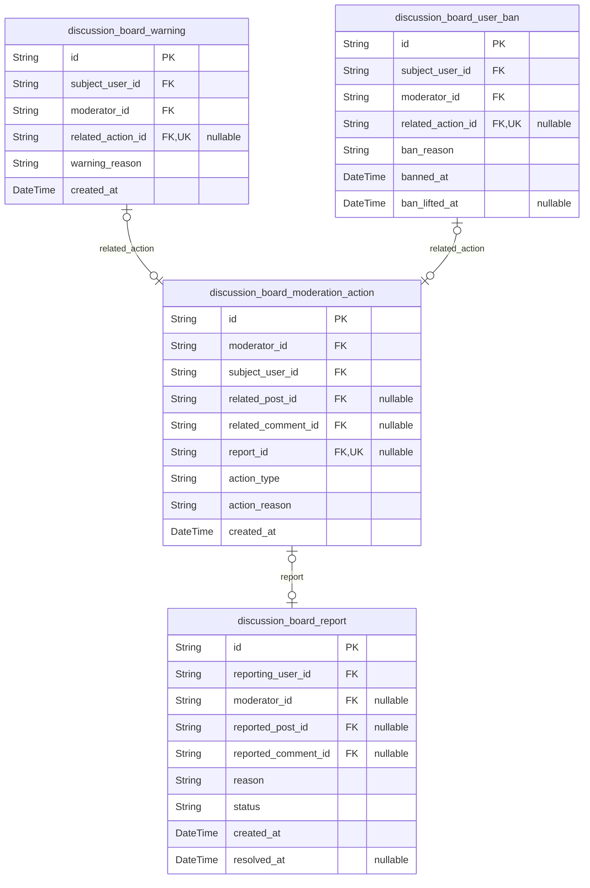
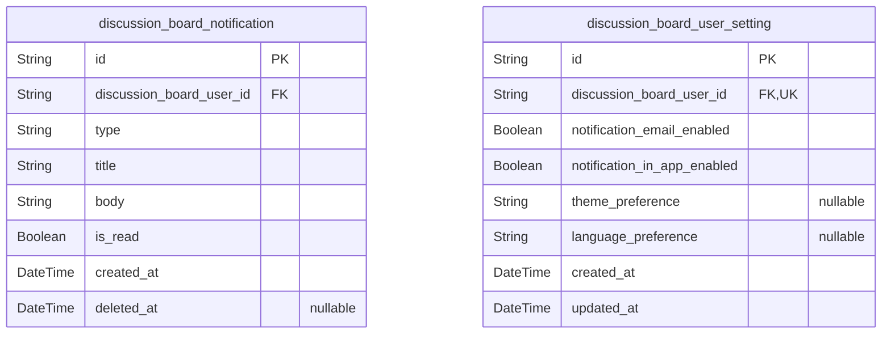
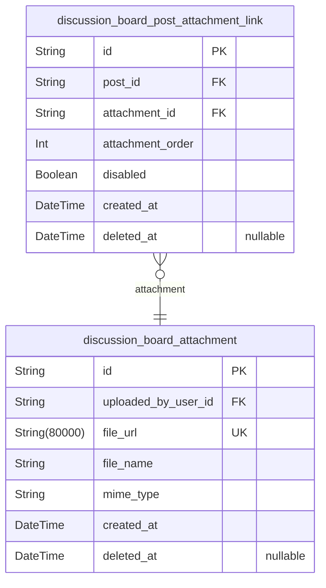

# Prisma Markdown

> Generated by [`prisma-markdown`](https://github.com/samchon/prisma-markdown)

- [CoreDiscussionBoard](#corediscussionboard)
- [ForumStructure](#forumstructure)
- [CommentingAndVotes](#commentingandvotes)
- [ModerationAndReports](#moderationandreports)
- [NotificationsAndSettings](#notificationsandsettings)
- [ContentAndAttachments](#contentandattachments)

## CoreDiscussionBoard

### `discussion_board_user`

[User Core Record] - This implements the 'User Registration and Login' and 'User Roles & Permissions' requirements from the requirements analysis document.

This model represents the base registered user of the discussion board. It stores the essential authentication and identification information required for account-based access to discussion board features, and forms the foundation for linking to user profiles, role assignments, and actions. Maintains 3NF by separating core user identity from profile data, roles, and activity logs. For example, use this model to register, log in, and associate subsequent profile and permissions data.

Key relationships: One-to-one with discussion_board_user_profile; one-to-many with discussion_board_role_assignment, discussion_board_notification; one-to-many with posts, comments, reports, votes, and moderation actions via foreign keys.
Special behaviors: Email is unique per user; soft delete is supported with 'deleted_at'.

Properties as follows:

- `id`: [Primary Key] - Implements unique identification for each user. Guarantees user-level uniqueness and supports referential integrity for all relations. Required for all business operations that target a user entity.
- `username`
  > [Username] - Implements the username requirement for display and mentions.
  > A unique, human-friendly identifier used for display and tagging within the board. Maintains normalization by being atomic and not reused across users. For example, '@policyDebater'. Must be unique (enforced below).
- `email`: [User Email] - For registration, authentication, and notifications. Implements the core user communication channel required by 'User Registration and Login.' Normalized atomic value. Enforced unique (see uniqueIndexes).
- `password_hash`: [Password Hash] - Securely stores the user's password in a one-way hashed format. Implements authentication requirement. Maintains normalization; no computed/derived data.
- `is_active`: [Active Status] - Indicates whether the user's account is currently active. Used to implement onboarding, activation, or ban-flow business logic. Atomic boolean; supports role and moderation workflows.
- `created_at`: [Creation Timestamp] - Records when the user entity was created. Maintains full audit compliance and supports query for registration trends.
- `updated_at`: [Last Update Timestamp] - Tracks last profile/account update, enabling modification history and change tracking.
- `deleted_at`: [Soft Delete Timestamp] - Null unless the account is deleted. Implements reversible account deactivation for moderation and GDPR compliance.

### `discussion_board_user_profile`

[User Profile] - Implements part of 'User Registration/Profile' and 'Customizable User Profiles.'

Contains customizable and optional profile data (display name, bio, profile pic URI) separate from core user credentials. Ensures normalized split between authentication and profile info (3NF), supports GDPR compliance. For example, updating profile image, displaying bio, showing user info in posts.

Key relationships: One-to-one with discussion_board_user (user_id is unique), allows fast joins to user details.
Special behaviors: user_id is unique; will cascade null on user delete where appropriate.

Properties as follows:

- `id`: [Primary Key] - Unique profile record for atomic, normalized user profile data. Referential integrity for profile-specific fields.
- `user_id`: [User FK] - References the core user entity for profile linkage. Maintains strict 1:1 mapping; cannot be null.
- `display_name`: [Display Name] - Optional user display alias, separate from username. Implements profile customization feature.
- `bio`: [User Bio] - Optional user biography for richer profile info. Normalized atomic field.
- `profile_picture_uri`: [Profile Picture URI] - Optional link to user's avatar/profile image. Supports external and internal URLs.
- `created_at`: [Created] - When the profile was created. Enables history queries.
- `updated_at`: [Updated] - Last profile update.

### `discussion_board_role_assignment`

[Role Assignment] - Implements 'User Roles & Permissions' and multi-role support.

Links users to their roles (member/moderator/admin/guest). Normalized to support multiple or historical role assignments per user, role revocation, start/end dates.
Maintains 3NF by splitting user/role join logic out of user objects. For example, assigning 'Moderator' to a user, revoking privileges, or auditing user roles over time.

Key relationships: Many-to-one with discussion_board_user; role_type ENUM differentiates role types; may associate with admin/moderator/guest tables for additional data.
Special behaviors: No direct role fields on user; supports composite unique constraint for (user_id, role_type, assigned_at).

Properties as follows:

- `id`: [Primary Key] - Unique identifier for each role assignment instance. Essential for audit trail and normalization.
- `user_id`: [User FK] - References the user who is assigned this role. Enables role tracking and permission checks.
- `role_type`: [Role Type] - Implements which role (member/admin/moderator/guest) is assigned. ENUM-validated at app level; 3NF compliant.
- `assigned_at`: [Assigned Timestamp] - When this role assignment began.
- `revoked_at`: [Revoked Timestamp] - If role was revoked, the time it ended. Null if active.

### `discussion_board_admin`

[Admin Role Record] - Implements 'Admin' from 'User Roles & Permissions' for escalated platform control.

This table supports storing escalated admin metadata for users with admin-level privileges. Strictly separated from core user data for 3NF, containing only admin-relevant metadata (e.g., elevation reasons, assignment notes). For example, maintain dates for admin role assignment, internal comments for accountability.

Key relationships: Many-to-one with discussion_board_user; join to role assignments for correspondence.
Special behaviors: Only users with an active 'admin' role in discussion_board_role_assignment should have a record here. Admin status should be revoked in both this table and in role_assignment.

Properties as follows:

- `id`: [Primary Key] - Unique identifier for each admin metadata record. Atomic ID for 3NF structure.
- `user_id`: [Admin User FK] - The user who is an admin. Restricted to 1:1 mapping with user.
- `elevation_reason`: [Elevation Reason] - Reason for admin assignment; supports audit trail and Justification Policy.
- `notes`: [Admin Notes] - Misc. admin-related notes, e.g., contact channels, policies.
- `assigned_at`: [Elevation Date] - When admin permission was granted.
- `revoked_at`: [Revocation Date] - When admin permission ended; null if currently active.

### `discussion_board_moderator`

[Moderator Role Record] - Implements 'Moderator' from 'User Roles & Permissions' for specialized content moderation privileges.

Holds moderator-specific metadata for users, cleanly separated from core user and admin records (3NF). Contains moderator onboarding info, special notes, and change history. For example, shows who assigned moderator status, start/end moderation tenure, and relevant notes.

Key relationships: One-to-one with discussion_board_user; cross-references role assignments.
Special behaviors: Only users with active 'moderator' role in discussion_board_role_assignment may appear here.

Properties as follows:

- `id`: [Primary Key] - Unique record for moderator metadata. Required for atomic 3NF storage.
- `user_id`: [Moderator User FK] - References the user with moderator permission (strict 1:1 mapping).
- `assigned_at`: [Moderator Assignment Date] - Start of moderation privileges.
- `revoked_at`: [End Date] - Date/Time moderator status was revoked, if applicable.
- `notes`: [Moderator Notes] - Comments, onboarding reasons, or specialist qualifications.

### `discussion_board_guest`

[Guest Record] - Implements the 'Guest' (unregistered user) role as referenced in role documentation.

Records minimal info about unregistered (guest) users when tracking certain interactions or access history. Normalized (3NF) by only storing atomic guest identity data, not storing calculated fields or multiple info types.

Key relationships: None typically mandatory, but can support analytic or audit features.
Special behaviors: Does not link to user logins - guests never authenticate; never assigned to posts/comments directly.

Properties as follows:

- `id`: [Primary Key] - Unique atomic identifier for guest record.
- `session_token`: [Guest Session Token] - Optionally store a guest's browser/session key for basic tracking.
- `first_seen_at`: [First Seen] - Timestamp when guest was first detected.
- `last_seen_at`: [Last Seen] - Most recent guest activity. Supports analytics/audit.

## ForumStructure

### `discussion_board_forum_category`

Forum Categories - This implements the requirement for organizing the discussion board into major topics (see Requirements Analysis: 'Discussion Board Structure'). 

Business purpose: Provides high-level grouping for all threads, such as 'Global Politics' or 'National Economy', fostering content discoverability and topic-focused discussions. Maintains 3NF normalization by only storing atomic category data and not duplicating subcategory/thread details here. For example, 'Economics' or 'International Relations' as discrete categories.

Key relationships: References subcategories and, indirectly, threads via subcategories.
Special behaviors: Unique category name enforced, cannot be deleted if any subcategories exist.

Properties as follows:

- `id`: Primary key for the forum category - Implements unique identification for each category. Guarantees entity uniqueness and referential integrity.
- `name`: Category name - Implements naming requirement for clear topic organization. Business meaning: the display name of the forum category (e.g., 'International Politics'). Ensures normalization by preventing redundancy; this is not duplicated elsewhere. Example usage: navigation menus, filters. Unique constraint applies.
- `description`: Category description - Implements display and discoverability requirements. Business meaning: short summary shown on category landing pages. Keeps all descriptive text atomic per category. Example: 'Discussions about international political events.'
- `created_at`: Creation timestamp - Implements audit trail for when the category was created. Used for ordering or analytics, always atomic.
- `updated_at`: Last update timestamp - Tracks when category details were modified. Supports history/audit without duplicating state elsewhere.

### `discussion_board_forum_subcategory`

Forum Subcategories - Implements the requirement for organizing forums into specific subtopics (see Requirements Analysis: 'Discussion Board Structure'). 

Business purpose: Allows finer content filtering within major topics, such as 'East Asian Affairs' under the 'Global Politics' category.
Maintains 3NF normalization by storing atomic subcategory data and referencing parent category via foreign key.

Usage example: Users browse 'US Economy' under parent 'National Economy'.
Key relationships: Belongs to one category, has many threads.
Special behaviors: Unique (category_id, name) constraint, deletion blocked if threads exist.

Properties as follows:

- `id`: Primary key for the forum subcategory - Uniquely identifies each subcategory. Supports relational integrity with threads and categories.
- `forum_category_id`: Foreign key to parent discussion_board_forum_category - Models subcategory-to-category relationship (M:1). Enforces subcategories always belong to a category. Reference integrity required.
- `name`: Subcategory name - Atomic label for filtering and display. Example: 'Fiscal Policy'.
- `description`: Subcategory description for UI and search. Atomic, optional. Example: 'Discussions on government spending.'
- `created_at`: Timestamp of subcategory creation for audit and display.
- `updated_at`: Timestamp of last updates for the subcategory.

### `discussion_board_thread`

Discussion Threads - This implements the requirement for organizing conversations within subcategories (Requirements Analysis: 'Discussion Board Structure', 'Posting and Replies').

Business purpose: Stores the root entity for discussion chains. Maintains 3NF by keeping thread-specific atomic data and relating to subcategory and author.

Usage: 'Are tariffs helping?' thread in 'Trade Policy'.
Key relationships: Belongs to a subcategory; has many posts and participants.
Special behaviors: Title must be unique within subcategory, author cannot be null, soft delete by nullable deleted_at.

Properties as follows:

- `id`: Thread primary key - Unique identity for conversations. Prevents duplication and supports referencing in posts, tags, notifications.
- `forum_subcategory_id`: Foreign key to parent subcategory - Implements parent-child relationship, enforcing thread grouping. Required.
- `author_id`: FK to user who created the thread (discussion_board_user) - Ensures each thread has an author; supports audit trail and permissions.
- `title`: Thread title - Implements clear navigation and search features. Must be atomic; no calculated summaries. Example: 'What drives inflation?'.
- `created_at`: Thread creation timestamp - For sorting and audit, atomic per thread.
- `updated_at`: Last edited timestamp.
- `deleted_at`: Soft delete timestamp - Nullable. If set, thread is hidden but retained for potential recovery and moderation review.

### `discussion_board_post`

Posts (Thread Starters and Replies) - Implements Requirements Analysis 'Posting and Replies', supporting new topics and detailed contributions.

Business purpose: The core content unit, either as thread starter (original post) or reply to an existing thread. Maintains normalization: each post contains only atomic content data, references the thread and its author, and optionally a parent_post for hierarchical replies (threaded discussions). No summary/aggregates are stored here—must use a materialized view for those.

Usage: A detailed argument about tax policy, appearing as a reply in a thread.
Key relationships: Each post belongs to a thread, is authored by a user, may reference a parent post.
Special behaviors: Soft-deletion via deleted_at, supports threaded structure through parent_post_id (nullable).

Properties as follows:

- `id`: Post primary key - Uniquely identifies this contribution in the board. Enables referential integrity with votes/comments/etc.
- `thread_id`: FK to discussion_board_thread - Each post bound to a particular discussion thread.
- `author_id`: FK to discussion_board_user - User who wrote the post.
- `parent_post_id`: Self-referential FK for threaded replies - Optional; allows hierarchical reply trees.
- `content`: Post content body - Implements the full rich text for the user's contribution. Atomic, not summarized, not calculated. E.g., original submission or reply.
- `created_at`: Post creation time - Supports audit and display ordering.
- `updated_at`: Last modification timestamp.
- `deleted_at`: Soft delete timestamp for moderation; nullable.

### `discussion_board_thread_tag`

Thread Tags - Implements Requirements Analysis ('Tagging & Categorization') for improved topic filtering and discoverability.

Business purpose: Stores atomic tag labels and enables M:N assignment of tags to threads through a separate junction table (not defined here). 3NF compliance maintained—tags have no computed relations.

Usage: Tags like 'elections', 'macroeconomics'.
Key relationships: Used in thread_tag assignment (via a junction table), displayable in tag filters.
Special behaviors: Unique tag name enforced, deleted_at for soft-removal. No denormalized fields.

Properties as follows:

- `id`: Tag primary key - Ensures each tag is unique and can be safely assigned/reused.
- `name`: Tag name - Human readable, atomic topic label. E.g., 'regulation'. Unique constraint.
- `description`: Optional tag summary for tooltips/search. E.g., 'Threads about market regulations'.
- `created_at`: Tag creation time for sorting/audit.
- `updated_at`: Last updated time to support tagging moderation or analytics.
- `deleted_at`: Soft delete handling for archiving or moderation, not removal from historical context.

### `discussion_board_forum_category_snapshot`

Forum Category Snapshots - Implements the snapshot pattern to preserve point-in-time historical states of forum categories (in support of audit trails and rollback features).

Business Purpose: Allows the system to capture changes to categories (name, description, etc.) for compliance and moderation transparency (related to non-functional requirements: reliability, transparency, rollback capability). Maintains 3NF by not repeating posts/threads, only the atomic fields of the category.
Usage: Auditing category renames, description changes. Rollback or investigation of moderation actions.
Key Relationships: References the source category and user who made the change.
Special Behaviors: Immutable; no update or delete except for legal compliance.

Properties as follows:

- `id`: Snapshot PK - Unique identifier for each historical state of a forum category.
- `forum_category_id`: FK to original forum category - Connects the snapshot to its source category.
- `created_by_id`: FK to user who initiated this change (category mod/admin only).
- `name`: Snapshot of the category name at change time.
- `description`: Snapshot of the category description (may be null if not set).
- `snapshot_created_at`: Timestamp the snapshot was recorded.

### `discussion_board_forum_subcategory_snapshot`

Forum Subcategory Snapshots - Implements the snapshot/audit requirement for subcategory changes.

Business Purpose: Captures versions of subcategories to track who, when, and how changes were made to subcategory metadata. Supports compliance and content moderation.
Normalization: Only subcategory atomic fields captured.
Usage: Revert or analyze updates to subcategory names, descriptions.
Key Relationships: References source subcategory and the responsible user.
Special Behaviors: Immutable after creation.

Properties as follows:

- `id`: Snapshot PK for forum subcategory versions.
- `forum_subcategory_id`: FK to subcategory the snapshot represents.
- `created_by_id`: FK to user who initiated the subcategory update.
- `name`: Snapshot of subcategory name.
- `description`: Snapshot of subcategory description.
- `snapshot_created_at`: When this snapshot was taken.

## CommentingAndVotes

### `discussion_board_comment`

[Comment Entity] - This implements the requirement for inline commenting and threaded discussions from the requirements analysis and feature list documents.

This model represents individual comments attached to discussion posts. It supports threaded/nested discussions when combined with 'discussion_board_comment_reply'. Maintains third normal form (3NF) compliance by only storing atomic, non-aggregated information relating to a single comment, such as author, post association, content, and timestamps. For example, used when a member leaves a comment on a thread post. 

Key relationships: References 'discussion_board_post' for the parent post and 'discussion_board_user' for the comment author. Special behaviors: Comments can be edited or deleted by their author or a moderator, and are subject to moderation rules.

Properties as follows:

- `id`
  > [Primary Key] - Implements unique identification for each comment.
  >
  > A unique, immutable identifier for the comment, stored as UUID. Supports data integrity and normalization by guaranteeing uniqueness for each comment.
- `post_id`
  > [Post Foreign Key] - Links the comment to its parent post (thread), implementing the requirement for associating comments with the correct discussion.
  >
  > Enforces referential integrity to the 'discussion_board_post' model. Ensures normalization by not storing post details redundantly for each comment.
- `user_id`
  > [User Foreign Key] - References the author (member) that created the comment.
  >
  > Supports attribution and moderation. Enforces normalized storage of author info.
- `content`
  > [Comment Content] - Implements storage for the body of the comment.
  >
  > Stores atomic text data for the comment. Ensures normalization by keeping the comment body separate from user and post data. Example: 'I agree with your point on fiscal policy.'
- `created_at`
  > [Creation Timestamp] - Captures when the comment was first published.
  >
  > Required for audit trails and ordering comments. Enforces normalization as this atomic event relates only to the comment entity.
- `updated_at`
  > [Update Timestamp] - Captures when the comment was last modified.
  >
  > Supports edit history per requirements. Null if never updated.
- `deleted_at`
  > [Deletion Timestamp] - Marks when the comment was soft-deleted for moderation.
  >
  > Null unless deleted. Supports non-destructive moderation policies.

### `discussion_board_comment_reply`

[Comment Reply Entity] - Implements threaded replies under parent comments, fulfilling the 'threaded discussion' and nested commenting requirements.

This model represents second-level (reply) comments and supports branching conversation trees. Fully normalized: replies store atomic linkage to both parent comment and author, no redundant user/post data. For example, used when a user replies directly to someone else's comment rather than the entire post.

Key relationships: References 'discussion_board_comment' (parent) and 'discussion_board_user' (replier). Special behaviors: Subject to moderation, only created by registered members.

Properties as follows:

- `id`: [Primary Key] - Unique identifier for each comment reply.
- `parent_comment_id`: [Parent Comment Foreign Key] - Links to the original comment being replied to. Enforces normalized conversation tree.
- `user_id`: [User Foreign Key] - References the registered user who authored the reply. Maintains author attribution and normalization.
- `content`: [Reply Content] - Atomic text content of the reply.
- `created_at`: [Creation Timestamp] - When the reply was made.
- `updated_at`: [Update Timestamp] - Last edit time for the reply.
- `deleted_at`: [Deletion Timestamp] - If set, reply is soft deleted.

### `discussion_board_post_vote`

[Post Vote Entity] - Implements upvoting/feedback requirements for posts as found in the feature list and requirements analysis.

Each record reflects a user's upvote or helpfulness mark for a post. Ensures 3NF, storing only the link between user, post, and their vote status (no aggregations). Example: a user upvotes a post to indicate it was insightful. 

Key relationships: User can vote once per post, and votes are tracked per user and post. Special behaviors: Unique constraint prevents duplicate voting.

Properties as follows:

- `id`: [Primary Key] - Unique vote record ID.
- `user_id`: [User Foreign Key] - The member casting the vote. Enforces normalization and user attribution.
- `post_id`: [Post Foreign Key] - The post being upvoted.
- `created_at`: [Vote Timestamp] - When the vote was cast.

### `discussion_board_comment_vote`

[Comment Vote Entity] - Implements voting/feedback for comments per feature list.

This tracks individual user's upvotes on comments. Third normal form is maintained by tracking one record per user/comment pair, no aggregation is stored. For example, when a user flags a reply as helpful. 

Key relationships: References user and comment, and each user can vote only once per comment.
Special behaviors: Enforced by unique index on (user_id, comment_id).

Properties as follows:

- `id`: [Primary Key] - Unique identifier for each vote record.
- `user_id`: [User Foreign Key] - Who cast the vote. Enables user-specific voting records.
- `comment_id`: [Comment Foreign Key] - The comment that was upvoted.
- `created_at`: [Vote Timestamp] - When the vote was placed.

## ModerationAndReports

### `discussion_board_report`

[Content reporting entity] - This implements the user-driven content reporting feature from the requirements analysis (Core Functional Requirement #4: Moderation Tools, Feature List: Post & Comment Moderation, Moderation Process).

Enables users to report posts or comments for violating board policies or through user feedback. Maintains 3NF compliance by holding only the reporting action details, with references to both the reporting user and the target (post or comment).
For example, a user can report a comment for hate speech. Key relationships: links to user, moderator (optional, after handling), target post or comment, and the review action. Special behaviors: All reports are auditable and must trigger notifications and potential moderation workflow.

Properties as follows:

- `id`: [Primary key] - Unique UUID identifier for each report. Implements the requirement for unique identification of each report instance. Maintains normalization by serving as the table's reference point.
- `reporting_user_id`: [Reporter] - Implements the requirement to know which user initiated the report. Links to the reporting user. Maintains normalization by storing a single user UUID, not denormalized details. For example, a user who submits a report on a comment.
- `moderator_id`: [Moderator who handles the report] - Implements the requirement for tracking who moderates or closes a report. Nullable at creation; assigned after review is completed. Maintains normalization as a link only, not a record of moderator data.
- `reported_post_id`: [Reported post] - Refers to the reported post if applicable. Null when the report is for a comment. Maintains normalization by pointing only to the post ID.
- `reported_comment_id`: [Reported comment] - Refers to the reported comment if applicable. Null when the report is for a post. Maintains normalization by linking to comment UUID only.
- `reason`: [Report reason] - Implements requirement to capture user-selected reason for reporting. Business meaning: The reason the reporting user chose for flagging content. Maintains normalization by storing only atomic reason text. For example: "hate speech", "spam".
- `status`: [Report status] - Tracks the current processing status of the report. E.g., "pending", "in_review", "resolved", "dismissed". Maintains normalization by using a single status string, not state history.
- `created_at`: [Report creation time] - Stores when the report was filed. Implements audit compliance requirement.
- `resolved_at`: [Report resolution time] - When the report was resolved (nullable until handled by a moderator). Ensures normalization as a timestamp only.

### `discussion_board_moderation_action`

[Moderator action log] - Implements the requirement for tracking and auditing all moderation decisions (Requirements Analysis: Moderation Tools, Moderation Policy: Record-Keeping).

Records every moderation step (warn, ban, post removal, etc.) taken in response to content or users. Maintains 3NF compliance by storing atomic action details and foreign keys only. For example, logs every 'warn user' or 'remove post' event.

Key relationships: Connects to moderator who performed the action, the subject user, and the content involved (if any). Special behaviors: Must support comprehensive auditability of all moderation outcomes.

Properties as follows:

- `id`: [Primary key] - Unique UUID for each moderation action. Guarantees unique tracking with referential security.
- `moderator_id`: [Moderator reference] - Implements requirement for knowing the responsible moderator for every action. Maintains normalization and accountability.
- `subject_user_id`: [Subject user] - The user affected by this moderation action. Maintains 3NF by storing only foreign key reference. E.g., user who is warned, banned, etc.
- `related_post_id`: [Involved post] - References the post affected by the action if applicable. Null if, e.g., pure user action (ban/warning, unrelated to a post).
- `related_comment_id`: [Involved comment] - References the comment affected by the action if applicable. Null if not relevant.
- `report_id`: [Originating report] - (Optional) References the report that triggered this moderation action, if relevant. Maintains strict 1:1 relationship for direct audit trail.
- `action_type`: [Type of action] - Implements requirement for well-classified, auditable actions (e.g., "warn", "ban", "remove_post"). Ensures normalization by recording only atomic action label.
- `action_reason`: [Action rationale] - Explains why moderator took this action, for audit and transparency. Maintains normalization as atomic field. E.g., "Repeated hate speech violations".
- `created_at`: [Action timestamp] - The time (UTC) when the moderation action was recorded. For audit compliance.

### `discussion_board_warning`

[Warning log] - Implements the warning/strike escalation requirement (Requirements Analysis: Moderation Tools, Moderation Policy: Enforcement Actions).

Captures records of warnings issued to users before bans. Maintains 3NF by referencing users and moderators without duplicating details. Example: User receives a warning for inappropriate language prior to suspension.

Key relationships: Links to subject user and moderator who issued the warning. Special behaviors: Warnings are auditable, connected to possible subsequent bans, and must be counted for escalation triggers.

Properties as follows:

- `id`: [Primary key] - Unique identifier for each warning. Maintains entity uniqueness and normalization.
- `subject_user_id`: [Warned user] - User receiving the warning. Referenced for escalation and audit. Maintains normalization as atomic relation.
- `moderator_id`: [Moderator issuer] - Moderator who issued the warning. Maintains a normalized record of accountability.
- `related_action_id`: [Related moderation action] - Optionally links this warning to the moderation action log in strict 1:1 mapping.
- `warning_reason`: [Warning reason] - Explains to user and moderators why the warning was issued. Maintains normalization as atomic value. E.g., "First time using slurs in a post."
- `created_at`: [Timestamp] - Date and time the warning was set. For auditing and escalation count purposes.

### `discussion_board_user_ban`

[User ban record] - Implements the enforcement requirement for user bans and permanent suspensions (Requirements Analysis: Moderation Tools, Moderation Policy: Enforcement Actions, Record-Keeping).

Records bans with links to subject user, issuing moderator, and (optionally) the originating action. Maintains strict normalization by referencing users/moderators without copying details and separating ban timelines. Example: A user is permanently banned for repeated severe policy violations.

Key relationships: Connects moderator to banned user and source action where relevant. Special behaviors: Ban durations may be permanent or timed, with clear lift dates.

Properties as follows:

- `id`: [Primary key] - Unique UUID for each ban record. Ensures normalization and traceability.
- `subject_user_id`: [Banned user] - User receiving the ban. Maintains normalization by storing atomic UUID reference.
- `moderator_id`: [Moderator issuer] - Moderator who enacted the ban. Maintains separate accountability and linkage.
- `related_action_id`: [Related moderation action] - Optionally links ban to full moderation audit and reporting chain.
- `ban_reason`: [Reason for ban] - States the policy or specific action meriting the ban for audit and notification. Maintains normalization as atomic string.
- `banned_at`: [Ban date/time] - When the ban was enforced. Maintains auditability as atomic timestamp.
- `ban_lifted_at`: [Ban end date/time] - If temporary, when the ban ends. Null for permanent bans.

## NotificationsAndSettings

### `discussion_board_notification`

[Notification Delivery Record] - This implements the user notification delivery requirement from the requirements analysis ("Notifications" in both functional and feature list docs). 

This model records all notification events (e.g., replies to posts, mentions, direct moderation actions) sent to users. Maintains 3NF compliance by keeping each notification atomic and tied to its business trigger—for example, a reply to a user's post generates a row here, which can reference the triggering event elsewhere if needed.

Key relationships: Each notification is associated with a single user (recipient) via discussion_board_user_id. Optionally, can reference other objects (e.g., thread, post, comment) if needed—see enrichment extensions. 
Special behaviors: Records must not be deleted for audit purposes (soft deletion via deleted_at). Ensures all notification data is atomic; all aggregations/tracking are handled elsewhere (not here).

Properties as follows:

- `id`: [Primary key] - Uniquely identifies each notification delivery record. Implements system-wide entity integrity for notifications.
- `discussion_board_user_id`
  > [Recipient User FK] - Implements user targeting for notifications as per notification delivery requirements.
  >
  > Indicates which user receives the notification. Ensures normalization by separating user data from notification message.
  > Example: discussion_board_user_id references the recipient when a new comment/reply triggers this notification.
  > Required, no special constraints beyond FK.
- `type`
  > [Notification type] - Implements notification event classification from requirements (reply, mention, moderation, etc.).
  > Indicates why the notification was generated. Ensures atomic, single-reason classification.
  > Example: type = 'reply', 'mention', 'moderation', etc.
- `title`
  > [Notification title] - Implements the user notification display requirement (subject/summary).
  > A short summary for the notification popup or list.
  > Example: title = 'You were mentioned in a reply'. Normalized - no derived data.
- `body`
  > [Notification message body] - The full message for the notification, as per user notification spec.
  > Atomic (not derived). No aggregation. Example: body = 'user123 replied to your post...'.
- `is_read`
  > [Read status flag] - Implements notification read tracking for user convenience as required ("in-app alerts").
  > Indicates if a user has already seen the notification. Not pre-calculated.
  > Example: is_read = false (unread), true (user has seen).
- `created_at`
  > [Timestamp] - Implements delivery time requirement for chronological sorting/audit.
  > Example: created_at = time sent. Not pre-calculated; not duplicated elsewhere.
- `deleted_at`
  > [Soft deletion timestamp] - Implements auditability requirement for moderation and legal compliance.
  > If not null, record has been deleted (soft; for audit/history). Never hard delete for traceability.

### `discussion_board_user_setting`

[User Notification & Preference Settings] - This implements the user notification opt-in/out and user preference storage requirement from the requirements doc. 

Solves for flexible, individual settings per user (e.g., notification preferences, email opt-in, UI settings). Fully 3NF normalized: each row represents a single user's preferences—no aggregation or derived values.

Key relationships: 1:1 with discussion_board_user (user_id is unique). Each user has exactly one settings record, enforcing unique settings per user.
Special behaviors: No pre-calculated fields; only stores raw settings flags and parameters. Any derived summaries must be placed in a materialized view.

Properties as follows:

- `id`: [Primary key] - Uniquely identifies each user settings record. Entity integrity for user preferences.
- `discussion_board_user_id`
  > [User FK] - Links settings to specific user as per requirement: individualized notification/storage settings.
  > Normalization compliance: settings entity separate from user main entity. 1:1 via unique index.
  > Example: user opts into email notifications—only this row updates, not user profile.
  > Required, unique (1:1 constraint).
- `notification_email_enabled`
  > [Email notification flag] - Stores user opt-in/out (requirement: 'Notification preferences').
  > Example: false = do not email the user for notifications. Pure flag; not derived.
- `notification_in_app_enabled`
  > [In-app notification flag] - Enables or disables in-app notification alerts as per user preference requirement.
  > Example: true = show notifications in app. Atomic, not calculated.
- `theme_preference`
  > [Theme preference] - User UI setting for accessibility/non-functional requirement.
  > E.g.: 'light', 'dark', or other valid strings describing color scheme. Not derived. Atomic; can be used to comply with high-contrast/accessibility requirements.
- `language_preference`
  > [Language preference] - User's preferred interface language/locale, as required by UI/UX standard.
  > Example: 'en', 'ko', etc. Optional, atomic.
  > Atomic—changes only by user input. Not derived.
- `created_at`
  > [Creation timestamp] - Implements audit/history requirement for settings changes.
  > E.g.: created_at = when user settings first created. Not calculated.
- `updated_at`
  > [Updated timestamp] - Last time user changed a preference (audit log compliance).
  > Normalization: not a pre-calculated summary. Example: updated_at = when last change saved.

## ContentAndAttachments

### `discussion_board_attachment`

Attachment Table - This implements the 'Rich text support: formatting, hyperlinks, quoting, and simple image attachments' and 'Support for images, videos, attachments within posts and comments' requirements from the requirements analysis and feature list documents. 

This table stores metadata about files (images, documents, etc.) that users can attach to posts or comments. Maintains full 3NF compliance by separating attachment data from posts/comments – only storing atomic, non-derived file information per attachment. For example, when a user uploads an image for their post, a new row is inserted here with file URL, MIME type, and creator.

Key relationships: Linked from post/comment via the discussion_board_post_attachment_link table. 
Special behaviors: Only atomic metadata fields, no pre-calculated or denormalized data. Attachments can exist independently of post linkage, allowing re-use or orphan clean up.

Properties as follows:

- `id`: Primary key - Unique identifier for each attachment. Implements the core need for entity integrity. Ensures normalization by using a surrogate key, not natural (e.g., filename). For example, 'dde0c1b6-adde-40f6-b624-f61d438d1951'.
- `uploaded_by_user_id`: Uploader Reference - Implements auditability. Points to the user who uploaded the attachment. Ensures normalization by linking to user table, not duplicating any user info. For example, retrieves uploader username via join. Enforced as NOT NULL; attachments must be owned.
- `file_url`: File URL - Implements the attachment access requirement. Stores the exact URL or URI where the uploaded file can be retrieved. Atomic, with no derived data. For example, 'https://cdn.example.com/uploads/abc123.png'.
- `file_name`: Original File Name - Human-readable uploaded filename. Implements the need for user context, without duplicating elsewhere. Atomic, e.g., 'budget_chart_2025.pdf'.
- `mime_type`: MIME Type - Describes file content type for client rendering. Atomic, non-derived. For example, 'image/png', 'application/pdf'.
- `created_at`: Upload Timestamp - Records exact instant of upload. Implements audit trail. Ensures normalization by not storing redundant date info. Example: '2025-07-11T13:36:05'.
- `deleted_at`: Soft Delete Timestamp - Implements safe deletion policies. Null if the attachment is active, populated if scheduled/deleted. Enables 3NF compliance by representing deletion as a state, not a derived/conflated field. Example: null or '2025-07-11T13:50:00'.

### `discussion_board_post_attachment_link`

Post-Attachment Link Table - This implements 'Support for images, videos, attachments within posts and comments' and 'Rich media embeds' as described in the requirements and feature list.

Links attachments to posts, enabling posts to reference multiple files or for files to be linked to multiple posts (M:N relationship). Maintains strict 3NF by removing arrays or repeated groups from posts—always modeled as separate linking records. For example, a post with two attachments will have two rows in this table, specifying the order of display.

Key relationships: FK to discussion_board_post and to discussion_board_attachment. No denormalized or derived fields. 
Special behaviors: The link may include an attachment order/sequence. Links can be disabled instead of physically deleted for auditability.

Properties as follows:

- `id`: Primary key - Unique identifier for each link between a post and an attachment. Implements atomicity and uniqueness, not derived from other columns. For example, '594b9c7c-2b91-4b5b-89f4-8277e7b58232'.
- `post_id`: Post Reference - Links this attachment usage to a specific post. Implements normalized linking with no duplication of post information. All post attachment links must specify a valid post.
- `attachment_id`: Attachment Reference - Links this record to exactly one file in discussion_board_attachment. No derived or duplicated fields about the attachment itself. Ensures referential integrity – cannot link to nonexistent files.
- `attachment_order`: Attachment Order - Stores the display or embedding sequence for multiple attachments within a single post. Implements display ordering without violating normalization. Example: 1=first image, 2=second, etc. Atomic field only.
- `disabled`: Attachment Link Disabled Flag - Marks whether this attachment link is logically disabled (e.g., hidden, not shown). Allows reversible removal without deleting the underlying attachment. Atomic, no derived meaning. Example: true/false.
- `created_at`: Link Creation Timestamp - When the attachment was first associated with the post. For audit trails. Example: '2025-07-11T13:36:05'.
- `deleted_at`: Soft Delete Timestamp - If set, logically deletes the attachment link rather than physically removing it. Maintains history and 3NF compliance. Example: null or '2025-07-11T14:00:00'.
