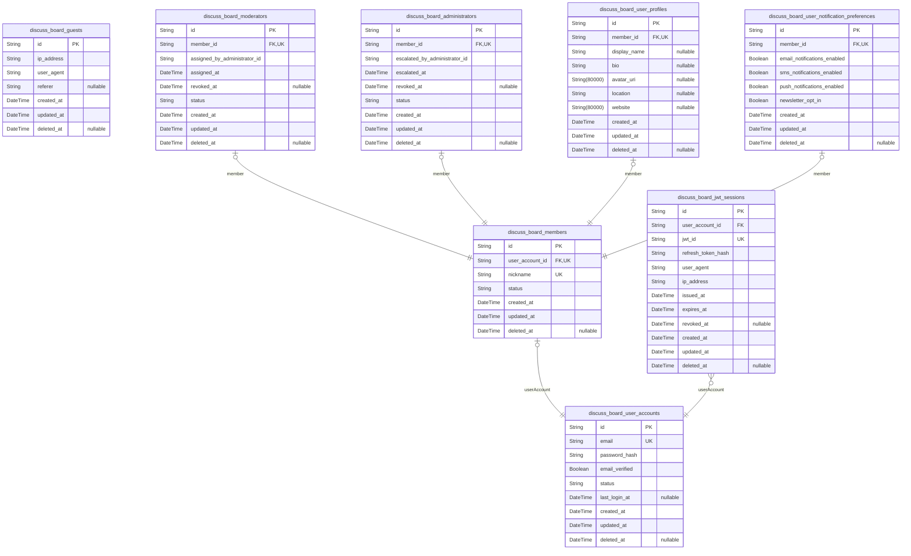

# Prisma Markdown

> Generated by [`prisma-markdown`](https://github.com/samchon/prisma-markdown)

- [Systematic](#systematic)
- [Identity](#identity)
- [Posts](#posts)
- [Comments](#comments)
- [Reactions](#reactions)
- [Moderation](#moderation)
- [NotificationIntegration](#notificationintegration)
- [AuditHistory](#audithistory)

## Systematic

### `discuss_board_settings`

Global system configuration for the discussBoard platform. Holds
platform-wide settings such as max post/comment length, maintenance mode
flag, notification policies, data retention periods, or any feature flag
toggles. Managed exclusively by administrators, sets the foundation for
all application logic and enforcement. Only one row should exist at any
time.

Properties as follows:

- `id`: Primary Key.
- `config_json`
  > JSON string of system-wide configurable options such as ratios, toggle
  > flags, policy versions, and detailed policy parameters.
- `created_at`: Timestamp of when this settings record was created.
- `updated_at`: Timestamp of last update to settings record.

### `discuss_board_forbidden_words`

Catalog of keywords, phrases, or regexes forbidden from user content due
to policy violations (e.g., hate speech, profanity, spam). Used for
filtering post and comment content at creation or update. Managed by
administrators and updated as guideline policies evolve. Each word or
expression is unique and case-insensitive.

Properties as follows:

- `id`: Primary Key.
- `expression`: Forbidden word, phrase, or regex pattern (case-insensitive).
- `description`
  > Administrative description, business rationale, or policy context for
  > this forbidden word or pattern.
- `created_at`: Time this forbidden word or pattern was registered.
- `updated_at`: Last update time for this record.
- `deleted_at`
  > Soft delete flag: time this entry was removed by administrators, if
  > applicable.

### `discuss_board_privacy_logs`

Audit records for all privacy-sensitive actions taken on user data.
Entries document accesses, exports, deletions, and policy updates
impacting user information, with who did it, which data subject,
operation type, outcome, and timestamp. Provides a robust audit trail for
privacy compliance and incident response. References user/account ids in
other tables for traceability, but never stores confidential data
directly.

Properties as follows:

- `id`: Primary Key.
- `actor_user_account_id`
  > Reference to the user account that performed the privacy-related action.
  > [discuss_board_user_accounts.id](#discuss_board_user_accounts).
- `data_subject_user_account_id`
  > Reference to the data subject impacted by the action (could be same as
  > actor, or another user). [discuss_board_user_accounts.id](#discuss_board_user_accounts).
- `action_type`
  > Type of privacy operation (access, export, delete, policy update, consent
  > change, etc.).
- `description`
  > Business context or justification for the privacy operation, including
  > outcome or relevant audit notes.
- `result_status`
  > Result of the privacy action (success, failure, partial). For audit
  > reporting.
- `created_at`: Timestamp when this action was performed (UTC).

### `discuss_board_consent_records`

Stores individual user consent events for privacy, terms of service, or
other legal agreements. Contains who provided consent, policy/document
version, consent action (granted, revoked, updated), and timestamp.
Required for legal defensibility and to fulfill user data rights
requests. Each event is preserved historically—this table acts as an
append-only log.

Properties as follows:

- `id`: Primary Key.
- `user_account_id`
  > User account giving or updating consent. {@link
  > discuss_board_user_accounts.id}.
- `policy_type`
  > Type of policy for which consent is being tracked (e.g. 'privacy_policy',
  > 'terms_of_service', 'marketing_opt_in').
- `policy_version`
  > Version or identifier of the policy/legal document the user is consenting
  > to.
- `consent_action`: What the event represents: (e.g. 'granted', 'revoked', 'updated').
- `description`
  > Optional business notes regarding the consent record, such as rationale
  > or evidence (IP address, device, etc.).
- `created_at`: Timestamp when this consent record/event was created (UTC).

## Identity

### `discuss_board_guests`

Represents unauthenticated or temporary visitors tracked for analytics,
onboarding funnels, and guest-to-member conversion. Does not include any
privileged actions. Linked to analytics pipelines and business event
logs. Not tied to posts or comments directly.

Properties as follows:

- `id`: Primary Key.
- `ip_address`: IP address of the guest user for analytics and security monitoring.
- `user_agent`: User agent string representing the guest's browser/device for analytics.
- `referer`: Origin URL where the guest came from for conversion analysis.
- `created_at`: Timestamp when guest was first observed.
- `updated_at`: Last analytics-update timestamp.
- `deleted_at`: Timestamp if guest data is anonymized for privacy removal.

### `discuss_board_members`

Registered member accounts representing authenticated users with ability
to participate. Each member can have escalation to
moderator/administrator or downgrade. Linked to
discuss_board_user_accounts for authentication and can be tied to
discuss_board_user_profiles.

Properties as follows:

- `id`: Primary Key.
- `user_account_id`: User account for authentication. [discuss_board_user_accounts.id](#discuss_board_user_accounts)
- `nickname`: Member's public display nickname.
- `status`: Current status (active, suspended, banned, etc.).
- `created_at`: Signup timestamp.
- `updated_at`: Last member profile update timestamp.
- `deleted_at`: Timestamp for soft deletion or account anonymization.

### `discuss_board_moderators`

Moderator role accounts, each linked to exactly one member. Grants
enforcement, review, and moderation privileges. Tracks authority
escalation. Has independent status and audit window for
assignment/revocation.

Properties as follows:

- `id`: Primary Key.
- `member_id`
  > Target member account granted moderator rights. {@link
  > discuss_board_members.id}
- `assigned_by_administrator_id`
  > Administrator who granted moderator role. {@link
  > discuss_board_administrators.id}
- `assigned_at`: Moderator assignment timestamp.
- `revoked_at`: Timestamp when moderator role was revoked, if applicable.
- `status`: Moderator role status (active, suspended, revoked).
- `created_at`: Creation timestamp for audit.
- `updated_at`: Update timestamp for auditing changes.
- `deleted_at`: Timestamp for soft deletion/removal from moderator pool.

### `discuss_board_administrators`

Administrator/superuser role accounts, linked to members. Possesses
comprehensive management, escalation, and audit powers. May assign or
revoke other roles (including moderators) and configure global system
settings.

Properties as follows:

- `id`: Primary Key.
- `member_id`: Target member promoted to administrator. [discuss_board_members.id](#discuss_board_members)
- `escalated_by_administrator_id`
  > Administrator who performed the escalation. {@link
  > discuss_board_administrators.id}
- `escalated_at`: Promotion/assignment timestamp.
- `revoked_at`: Timestamp if removed from admin role/privileges revoked.
- `status`: Administrator status (active, resigned, suspended).
- `created_at`: Timestamp of admin role creation for auditing.
- `updated_at`: Timestamp of last admin role update/audit.
- `deleted_at`: Timestamp to support soft delete/audit disablement.

### `discuss_board_user_accounts`

Core authentication/identity records for platform users. Decouples
authentication from role, supporting locked-out or staged accounts, and
multi-role escalation. Used as authoritative linkage for login, JWT
sessions.

Properties as follows:

- `id`: Primary Key.
- `email`: Unique email address identifying the platform user.
- `password_hash`: BCrypt/argon hashed password (never plain text).
- `email_verified`
  > Whether user completed email verification process required for elevated
  > privileges.
- `status`: Account status (pending, active, locked, disabled, etc.).
- `last_login_at`: Timestamp of most recent login/session creation.
- `created_at`: Initial account creation timestamp.
- `updated_at`: Timestamp for credential update (e.g., password change).
- `deleted_at`: Anonymization/removal date for deleted accounts.

### `discuss_board_jwt_sessions`

Tracks active JWT tokens and sessions for user authentication. Used for
session revocation, device management, and refresh flows. Relates to
discuss_board_user_accounts as FK.

Properties as follows:

- `id`: Primary Key.
- `user_account_id`
  > Foreign key to user account that owns this session. {@link
  > discuss_board_user_accounts.id}
- `jwt_id`: JWT unique identifier (jti claim).
- `refresh_token_hash`: Hashed refresh token for this session, for secure revocation.
- `user_agent`: Logged-in device/browser info for management.
- `ip_address`: Origin IP address used at login time.
- `issued_at`: JWT/session creation/issuance time.
- `expires_at`: JWT/session absolute expiration time.
- `revoked_at`: Time the session was forcibly revoked before expiry.
- `created_at`: Session object creation time.
- `updated_at`: Session object last update (device status, etc.).
- `deleted_at`: Date/time if session data was hard-deleted for cleanup or privacy.

### `discuss_board_user_profiles`

Profile metadata table for user display, including avatar, bio, and
optional personalization fields. Tied to a member, managed through
profile-edit UIs, never independently instantiated from business
perspective.

Properties as follows:

- `id`: Primary Key.
- `member_id`
  > Foreign key to the registered member this profile belongs to. {@link
  > discuss_board_members.id}
- `display_name`
  > User's chosen display name for presentation (may override registered
  > nickname).
- `bio`
  > Short biography or introduction written by the user (may include links,
  > hashtags, etc.).
- `avatar_uri`: URI to user-chosen avatar/profile image.
- `location`: Optional location or timezone string for the user.
- `website`: Link to user's personal website (optional).
- `created_at`: When profile object was created.
- `updated_at`: Last update timestamp from user or admin.
- `deleted_at`: Timestamp for profile removal/anonymization.

### `discuss_board_user_notification_preferences`

Stores per-user notification delivery and channel preferences, such as
email/SMS/push, per event-type, etc. Used to manage communication flows
and compliance. Each record points to a member, must be editable via
account UI.

Properties as follows:

- `id`: Primary Key.
- `member_id`
  > Member account whose notification preferences are configured. {@link
  > discuss_board_members.id}
- `email_notifications_enabled`: Whether user receives system email notifications.
- `sms_notifications_enabled`: Whether user receives SMS notifications for critical flows.
- `push_notifications_enabled`: Whether user receives push notifications in mobile/web apps.
- `newsletter_opt_in`: Whether user agrees to receive newsletters and announcements.
- `created_at`: Timestamp when preferences were created.
- `updated_at`: Timestamp when preferences were last updated.
- `deleted_at`: Soft delete timestamp for user opt-out or data privacy action.

## Posts

### `discuss_board_posts`

Central table for user-created posts/topics. Each post belongs to a
member (author), contains a title, body, and can be assigned tags via
discuss_board_post_tags. Enforcement of edit and delete windows is
managed at the application level but tracked for auditing via related
snapshot tables. Post privacy/visibility controls are stored as
business_status. References member as author via user/member table. Used
as the target for comments, reactions, deletion logs, and moderation
actions. Strictly normalized for data integrity.

Properties as follows:

- `id`: Primary Key.
- `author_id`: Author's unique identifier, references [discuss_board_members.id](#discuss_board_members).
- `title`
  > Title of the post, required for identification and search, 5-150 chars
  > enforced at application layer.
- `body`
  > Main text content of the post, required, 10-10,000 chars enforced at
  > application layer.
- `business_status`
  > Post visibility or workflow status (e.g., public, limited, private,
  > locked, under_review). Used by access and moderation logic.
- `created_at`: Creation timestamp (UTC).
- `updated_at`: Last update timestamp (UTC).
- `deleted_at`: Soft delete timestamp, null if not deleted.

### `discuss_board_post_tags`

Assigns tags to posts, representing a junction table for the M:N
relationship between posts and tags (if tags are entity/table-based).
Enforces unique tag per post constraint. Enables topic categorization,
search, and filtering by tag. Referenced in post search/filter endpoints
and analytics.

Properties as follows:

- `id`: Primary Key.
- `post_id`: Linked post's [discuss_board_posts.id](#discuss_board_posts).
- `tag_id`
  > Tag identifier (UUID). A valid tag UUID as defined in the source tag
  > table or system. Relation is not enforced at schema level; see
  > documentation for tag source resolution.
- `created_at`: Assignment timestamp.

### `discuss_board_post_edit_histories`

History and audit trail of post edits for compliance and moderation
review. Captures each point-in-time version of a post, including all
changed content, author, and timestamps. Enables rollback, user view of
edit log, and accountability for all changes. Model is append-only and
never directly modified post-creation.

Properties as follows:

- `id`: Primary Key.
- `post_id`: Original post's [discuss_board_posts.id](#discuss_board_posts).
- `editor_id`
  > User/member who made the edit, references {@link
  > discuss_board_members.id}.
- `edited_title`: Edited title snapshot.
- `edited_body`: Edited body/content snapshot.
- `edit_reason`
  > Optional reason/annotation for edit (e.g., typo fix, clarification
  > update).
- `edit_timestamp`: When the edit occurred (UTC).

### `discuss_board_post_deletion_logs`

Audit log capturing all deletion events for posts (soft or hard). Records
who deleted the post, when, and the reason. Enables regulatory
compliance, investigation, and dispute resolution. Never deleted/updated
after creation; read-only audit record.

Properties as follows:

- `id`: Primary Key.
- `post_id`: Deleted post's [discuss_board_posts.id](#discuss_board_posts).
- `actor_id`
  > Moderator/member/administrator who performed deletion, references
  > existing discuss_board_members or higher privilege role.
- `deletion_timestamp`: When the deletion occurred (UTC).
- `deletion_reason`
  > Business or regulatory reason for deletion, e.g., user request,
  > moderation action, policy violation. For compliance/audit.

## Comments

### `discuss_board_comments`

Stores all comments in the discussion board, supporting nested replies
via parent-child relationships. Each comment references the original
post, its parent comment if a reply, and the authoring member. Business
fields include content, status, edit and delete timestamps, and a lock
flag for moderation or business rule enforcement. Full-text GIN index
supports search. Core to discussion and moderation.

Properties as follows:

- `id`: Primary Key.
- `discuss_board_post_id`: Belonged post's [discuss_board_posts.id](#discuss_board_posts)
- `parent_id`
  > Parent comment's [discuss_board_comments.id](#discuss_board_comments), nullable for
  > top-level comments.
- `author_member_id`: Authoring member's [discuss_board_members.id](#discuss_board_members)
- `content`
  > Content body of the comment. Min 2, max 2000 chars. Subject to moderation
  > and full-text search.
- `depth`
  > Indicates depth of the comment (number of ancestor chain from post root),
  > used for nesting enforcement. Business logic checks value up to max
  > thread depth.
- `is_locked`
  > Flag whether the comment is locked and cannot be edited/deleted,
  > typically due to expired edit window or moderation action.
- `status`
  > Business status of the comment (e.g., 'active', 'under_review',
  > 'deleted'). Used for workflow enforcement and UI display.
- `created_at`: UTC timestamp of comment creation.
- `updated_at`: UTC timestamp of last update/modification.
- `deleted_at`
  > Soft-delete timestamp; null if active, else marks deletion for audit and
  > regulatory purposes.

### `discuss_board_comment_edit_histories`

Tracks all edits for comments. Each record links to its parent comment,
the editing member, and stores the edit snapshot including previous
content, status, and a UTC timestamp. Used for audit history, moderation,
and rollback. Append-only. Never directly user-managed; subsidiary to
comment.

Properties as follows:

- `id`: Primary Key.
- `discuss_board_comment_id`: Target comment's [discuss_board_comments.id](#discuss_board_comments)
- `editor_member_id`: Editing member's [discuss_board_members.id](#discuss_board_members)
- `previous_content`
  > Content of the comment prior to the edit. For audit/history/reversion.
  > Max 2000 chars.
- `previous_status`
  > Value of business status field prior to edit (e.g., 'active',
  > 'under_review', 'deleted').
- `editor_note`
  > Optional note from editor indicating reason for edit, user-visible in
  > audit/history. Max 200 chars.
- `created_at`: UTC timestamp of this edit event (when snapshot was recorded).

### `discuss_board_comment_deletion_logs`

Stores every deletion event for comments, including soft-deletes and hard
deletes. References comment, the deleting actor (who may be author,
moderator, or admin), records deletion reason for compliance and appeals,
and UTC deletion timestamp. Never managed directly by users; subsidiary
log for transparency and audit.

Properties as follows:

- `id`: Primary Key.
- `discuss_board_comment_id`: Target comment's [discuss_board_comments.id](#discuss_board_comments)
- `actor_user_account_id`
  > Deleting actor's user account [discuss_board_user_accounts.id](#discuss_board_user_accounts) (can
  > be author, moderator, or admin) to support all escalation cases.
- `deletion_reason`
  > Enumerates reason for deletion (e.g., 'self_delete',
  > 'moderation_violation', 'admin_enforcement'). Required for audit.
- `actor_note`: Optional note by deleting actor for audit or appeals.
- `deleted_at`
  > UTC timestamp of when deletion occurred. May differ from content's
  > deleted_at for delayed cases.

## Reactions

### `discuss_board_post_reactions`

Represents each individual reaction (like/dislike) made by a member on a
specific post. Ensures exactly one reaction per member-post pair, allows
toggling between reaction types, and supports complete audit trail.
Related directly to [discuss_board_members.id](#discuss_board_members) and {@link
discuss_board_posts.id}. Supports soft-deletion for compliance and
auditability.

Properties as follows:

- `id`: Primary Key.
- `discuss_board_member_id`
  > Reactor member's [discuss_board_members.id](#discuss_board_members). Indicates which member
  > performed the reaction.
- `discuss_board_post_id`: Target post's [discuss_board_posts.id](#discuss_board_posts) which receives the reaction.
- `reaction_type`
  > Type of reaction. Either 'like' or 'dislike'. Business logic restricts to
  > these values.
- `created_at`: Timestamp when the reaction was first created.
- `updated_at`
  > Timestamp for the most recent update to the reaction (toggle or metadata
  > change).
- `deleted_at`
  > Soft delete timestamp; nullable. Set when reaction is logically removed
  > and no longer counted for aggregates.

### `discuss_board_comment_reactions`

Captures each member's explicit like/dislike reaction to a particular
comment. Enforces single reaction per member-comment pair and audit-aware
toggling of reaction. References [discuss_board_members.id](#discuss_board_members) and
[discuss_board_comments.id](#discuss_board_comments). Includes soft-delete pattern for
reversibility and compliance.

Properties as follows:

- `id`: Primary Key.
- `discuss_board_member_id`: Member's [discuss_board_members.id](#discuss_board_members) who reacted to the comment.
- `discuss_board_comment_id`: Target comment's [discuss_board_comments.id](#discuss_board_comments).
- `reaction_type`
  > Type of reaction: 'like' or 'dislike'. Only one value per comment/member.
  > Business logic enforces valid values.
- `created_at`: Timestamp of reaction creation.
- `updated_at`: Timestamp of last modification (for toggling or recovery).
- `deleted_at`
  > Soft delete; nullable. Populated when reaction is not counted in
  > aggregates, supports logical undeletion for audit.

## Moderation

### `discuss_board_content_reports`

Records reports of posts or comments for moderation review. Each record
tracks the reporting user, reported content (post or comment), type of
content, report reason, status, and workflow timestamps. Used by
moderators and administrators to triage, review, and resolve complaints
submitted by members. References actors in user-related tables, and
content in posts/comments. Enables searching all reports, viewing by
content, user, or resolution status. Essential for strict audit trails
and abuse prevention. Supports one-to-many relationships with moderation
actions (an action may resolve multiple reports).

Properties as follows:

- `id`: Primary Key.
- `reporter_member_id`
  > Reporting user's [discuss_board_members.id](#discuss_board_members). References the member
  > who submitted the report.
- `content_post_id`
  > Reported post's [discuss_board_posts.id](#discuss_board_posts). Exactly one of
  > content_post_id or content_comment_id must be non-null. References the
  > reported post, if this report is for a post.
- `content_comment_id`
  > Reported comment's [discuss_board_comments.id](#discuss_board_comments). Exactly one of
  > content_post_id or content_comment_id must be non-null. References the
  > reported comment, if this report is for a comment.
- `content_type`
  > Type of content being reported (e.g., 'post', 'comment'). Required to
  > determine which foreign key applies. Ensures correct content reference
  > and workflow routing.
- `reason`
  > Reporter-supplied reason for the report. Collected from predefined list
  > (spam, harassment, abuse, misinformation) or freeform up to 200
  > characters. Used for workflow triage and full-text search by moderators.
- `status`
  > Current workflow status (pending, under_review, resolved, dismissed,
  > escalated). Used for moderation queue, progress, and reporting.
- `moderation_action_id`
  > ID of the associated moderation action (if resolved). Used for historical
  > workflow, linking to decisions/actions. Nullable—assigned only when
  > resolution occurs.
- `created_at`
  > UTC creation timestamp for the report, required for audit and
  > chronological workflow.
- `updated_at`: UTC last updated timestamp.
- `deleted_at`: UTC deleted timestamp, set if report is soft deleted (for compliance).

### `discuss_board_moderation_actions`

Tracks actionable moderation decisions (e.g., content removal, warning,
user suspension) initiated as the resolution of reports or other
triggers. Includes responsible moderator/admin, target content/user, type
of action, reason, decision narrative, and linkage to appeal if present.
Supports compliance by enabling queries by action type, actor, or
content. All moderation history for audit trails is anchored here. May
reference multiple reports via moderation_action_id in reports.

Properties as follows:

- `id`: Primary Key.
- `moderator_id`
  > Moderator/admin executing the action. [discuss_board_moderators.id](#discuss_board_moderators)
  > or [discuss_board_administrators.id](#discuss_board_administrators).
- `target_member_id`
  > Target user of action (usually the content author). {@link
  > discuss_board_members.id}. Nullable for actions on content only (not
  > directly on a user).
- `target_post_id`: Target post id if action taken on post. [discuss_board_posts.id](#discuss_board_posts).
- `target_comment_id`
  > Target comment id if action taken on comment. {@link
  > discuss_board_comments.id}.
- `appeal_id`
  > ID of the associated appeal if present. Nullable; for business linkage
  > only, not enforced as a FK due to circular dependency concerns. See
  > [discuss_board_appeals.id](#discuss_board_appeals).
- `action_type`
  > Type of moderation action (remove_content, warn, suspend_user, ban_user,
  > escalate, etc). Enables filtering and business logic enforcement for
  > audit and policy.
- `action_reason`
  > Moderator/admin's chosen reason or rationale for action, displayed to
  > target user and for legal/audit review.
- `decision_narrative`
  > Freeform optional narrative describing moderator context/analysis for
  > final decision. Aids transparency, supports appeals/audits.
- `status`
  > Current status (active, reversed, escalated, completed, pending_applied).
  > Used for tracking and workflow management. Historical records remain for
  > all actions.
- `created_at`
  > UTC timestamp for when action was created. Used for audit/order of
  > operations.
- `updated_at`: UTC timestamp of last update.
- `deleted_at`
  > Soft deletion timestamp for removal from active search (audit/compliance
  > only).

### `discuss_board_appeals`

Captures appeals submitted by users regarding moderation actions. Used to
manage re-reviews and escalation workflows, ensuring fair process and
business/legal compliance. Records which action is appealed, appellant
user, status, rationale, and administrative resolution log. Allows
independent search and workflow management, as appeals can traverse
multiple moderation actions or administrators. Supports tracking appeal
lifecycle (pending, in_review, accepted, denied, escalated, closed).
Enables transparency and user trust.

Properties as follows:

- `id`: Primary Key.
- `moderation_action_id`
  > The moderation action being appealed. {@link
  > discuss_board_moderation_actions.id}. Required for linking review chains,
  > audit.
- `appellant_member_id`: The member submitting the appeal. [discuss_board_members.id](#discuss_board_members).
- `appeal_rationale`
  > Freeform rationale or argument provided by the appellant, explaining why
  > the moderation action should be reconsidered. Used by administrators for
  > re-review.
- `status`
  > Current workflow status (pending, in_review, accepted, denied, escalated,
  > closed). Used in queueing, reporting, and managing the appeals process.
- `resolution_notes`
  > Resolution notes entered by the administrator or appellate moderator upon
  > closing the appeal. Documents outcome for further audit or user
  > transparency.
- `created_at`: UTC timestamp when appeal was submitted.
- `updated_at`: UTC timestamp of last update to the appeal record.
- `deleted_at`
  > Soft deleted timestamp, if the appeal is removed from active search (for
  > audit/compliance only).

### `discuss_board_moderation_logs`

Supports fine-grained logging of every important moderation event,
action, escalation step, or workflow update. Enables detailed audit trail
for compliance, transparency, and business process improvement. Logs may
reference specific moderation action, appeal, or content, and capture
actor, event type, details, timestamp. Used exclusively for
system/logical review—not directly managed by end users. Enables strict
normalization and referential integrity. Useful for administrators and
compliance investigators.

Properties as follows:

- `id`: Primary Key.
- `actor_member_id`
  > The user (member, moderator, or administrator) responsible for the logged
  > event. Foreign key to either discuss_board_members,
  > discuss_board_moderators, or discuss_board_administrators depending on
  > context.
- `related_action_id`
  > Associated moderation action. Enables workflow/event traceability. {@link
  > discuss_board_moderation_actions.id}.
- `related_appeal_id`
  > Associated appeal. Links log entry to appeal process where appropriate.
  > [discuss_board_appeals.id](#discuss_board_appeals).
- `related_report_id`
  > Associated report. Enables granular linkage to the report that initiated
  > the workflow. [discuss_board_content_reports.id](#discuss_board_content_reports).
- `event_type`
  > Type of moderation log event (report_received, action_taken,
  > appeal_created, status_update, escalation, etc). Enables search/filter
  > for auditing and performance review.
- `event_details`
  > Optional freeform field for extra detail about the log event. Documenting
  > context may support compliance/governance.
- `created_at`: UTC timestamp for the log event creation for accurate audit trail.
- `deleted_at`
  > Soft deletion timestamp for audit compliance. Soft deleted logs remain
  > for reference, not shown in normal searches.

## NotificationIntegration

### `discuss_board_notifications`

Stores all outbound notification events for discussBoard platform users,
covering email, SMS, push, and in-app notification deliveries. Tracks
delivery status, event type (e.g., reply, moderation, system alerts),
targeted user, message subject/content, and external tracking for
compliance (with references to user account and source event). Enables
searching/filtering notifications per user, event type, or status.
Essential for troubleshooting, analytics, and compliance audits in all
notification delivery workflows. [discuss_board_user_accounts.id](#discuss_board_user_accounts)
is used as the recipient reference.

Properties as follows:

- `id`: Primary Key.
- `user_account_id`
  > Intended notification recipient's [discuss_board_user_accounts.id](#discuss_board_user_accounts)
  > field. Captures which user should receive this notification.
- `source_post_id`
  > Optional reference to source post/event that triggered the notification.
  > Links to [discuss_board_posts.id](#discuss_board_posts) if applicable.
- `event_type`
  > Type of notification event (e.g., reply, moderation, system_alert,
  > password_reset, etc.). Drives user routing and compliance logic.
- `delivery_channel`
  > Notification delivery channel (e.g., email, sms, push, in_app, webhook).
  > Determines integration and delivery workflow.
- `subject`
  > Notification subject line or brief summary. Required for most email/SMS;
  > optional for in-app/push; enables full-text search.
- `body`
  > Notification message content. May be templated, localized, or rendered in
  > markdown/HTML.
- `external_message_id`
  > ID assigned by external delivery platforms (e.g., SMTP, SMS gateway).
  > Enables troubleshooting and compliance verification.
- `delivery_status`
  > Current delivery status (e.g., pending, delivered, failed, bounced,
  > suppressed). Used for retry and compliance workflows.
- `delivery_attempts`: Number of delivery attempts made (for failed or retryable messages).
- `delivered_at`
  > Timestamp of successful delivery, if occurred. Enables delivery
  > tracking/audit.
- `error_message`
  > Detailed error message if delivery failed. Useful for compliance,
  > troubleshooting, and alerting.
- `created_at`: Timestamp when the notification was created in the system (enqueue time).
- `updated_at`
  > Timestamp of last modification to this notification record
  > (status/process/metadata).
- `deleted_at`
  > Timestamp if this notification is soft-deleted (hidden from normal views,
  > retained for audit/compliance).

### `discuss_board_integration_logs`

Logs all key integration events between the discussBoard platform and
external partners (e.g., notification delivery APIs, analytics ingestion,
abuse detection/anti-spam, third-party reporting, partner API exchanges).
Each record captures the integration type, status, payload, user (if
applicable), and delivery metadata. Used for troubleshooting, compliance,
SLA monitoring, external partner audits, and system reliability
analytics. [discuss_board_user_accounts.id](#discuss_board_user_accounts) is optionally included
to relate to a user context.

Properties as follows:

- `id`: Primary Key.
- `user_account_id`
  > Optional user context for the integration event. May reference {@link
  > discuss_board_user_accounts.id}, if the event is user-initiated or
  > user-facing (e.g., user export, notification relay); nullable for
  > system/system-to-system integrations.
- `integration_type`
  > Type/category of integration event (e.g., notification_delivery,
  > analytics, abuse_detection, partner_api, import_export, etc.). Drives
  > business logic and compliance reporting.
- `integration_partner`
  > Integration partner or external service name (e.g., SendGrid, Twilio,
  > GoogleAnalytics, Salesforce, etc.).
- `payload`
  > Raw payload (request/response/metadata) for audit and troubleshooting.
  > Serialized as JSON, XML, etc.
- `integration_status`
  > Current status of integration event (e.g., pending, success, failed,
  > retried, quarantined). Required for monitoring/alerting.
- `external_reference_id`
  > External integration reference ID (assigned by partner, e.g., job ID,
  > transaction ID, message ID); enables cross-system tracing and compliance.
- `triggered_event`
  > Associated business event (e.g., post_created, comment_reported,
  > moderation_action, user_exported). Improves analytics/monitoring
  > granularity.
- `error_message`
  > Detailed error message if the integration failed or was retried. Useful
  > for compliance and technical support.
- `created_at`: Timestamp when integration event was recorded (system UTC).
- `updated_at`: Timestamp of last status update/modification.
- `deleted_at`: Timestamp if event is soft-deleted (retained for audit/compliance).

## AuditHistory

### `discuss_board_global_audit_logs`

Global, cross-entity business audit log for tracking all major actions
and state changes (including user activity, content edits/deletions,
moderation actions, critical admin events, and consent/compliance
changes). Allows compliance audits, forensic analysis, and business
metric tracking. Supports both entity-specific and system-wide events,
referencing the actor (user/admin/moderator) and target object
(table/type/id) polymorphically. Designed for centralized history queries
and external export.

Properties as follows:

- `id`: Primary Key.
- `actor_id`
  > ID of the actor responsible for this event (may reference
  > discuss_board_user_accounts, discuss_board_members,
  > discuss_board_adminstrators, etc.; polymorphic usage, so FK is not
  > enforced).
- `actor_type`
  > Type of actor for this audit event. Examples: 'member', 'moderator',
  > 'administrator', 'guest', or service/automation type.
- `action_category`
  > Business-level category of the audit event. E.g., 'post_edit',
  > 'comment_delete', 'user_login', 'role_escalation', 'moderation_action',
  > 'consent_update', etc.
- `target_table`
  > Target table/entity type for the affected object, e.g.,
  > 'discuss_board_posts', 'discuss_board_comments', 'discuss_board_members',
  > etc.
- `target_id`
  > UUID of the affected object in the target table/entity. Polymorphic—can
  > refer to post/comment/user/settings as needed.
- `event_payload`
  > Optional serialized event details/context (JSON or text) containing
  > pre-/post-state, reason, IP/user-agent, or expanded change info for
  > audit/external export. NULL for events where no further details are
  > captured.
- `event_description`
  > Brief human-readable description of this audit event for API
  > search/export. Example: 'Moderator deleted a comment for violating
  > policy.'
- `created_at`: Time this audit event was recorded (UTC, immutable).
- `deleted_at`
  > Soft delete marker for this audit log record. Used for audit retention;
  > if null, audit entry is active.
