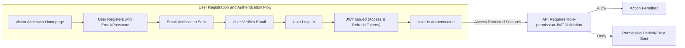

# User Roles and Authentication Requirements for discussionBoard

## 1. User Role Definitions and Hierarchy

### Overview of Defined User Roles
The service defines four explicit user roles. Each is described by its permissions, usage contexts, and restrictions.

| Role         | Description                                                                                                           | Kind           |
|--------------|-----------------------------------------------------------------------------------------------------------------------|----------------|
| visitor      | Unauthenticated users who can browse public discussions but cannot participate or interact beyond viewing and searching. Typically uses read-only features and can view limited public profiles. | guest          |
| user         | Authenticated members who can create, edit, and delete their own posts and comments, participate in voting/polling, and flag inappropriate content. They have standard participation privileges in open forums. | member         |
| moderator    | Experienced members trusted to oversee discussions, moderate content, handle user reports, enforce community guidelines, and manage flagged posts/comments. Can restrict or suspend user accounts for violations. | member         |
| admin        | System administrators with the highest permissions. Can manage users, roles, categories, system-wide settings, oversee all discussions, integrate external APIs, and maintain service compliance and security. | admin          |

### Role Hierarchy
- visitor < user < moderator < admin
- Each higher role inherits all permissions and the responsibilities of roles below it, but with additional access and management capabilities.

## 2. Authentication Flow (JWT, Registration, Login, Session Management)

### General Requirements
- THE discussionBoard SHALL use token-based authentication with JSON Web Tokens (JWT) for all API access control.
- WHEN a user registers or logs in successfully, THE discussionBoard SHALL issue a JWT access token (expiration: 15 mins) and a refresh token (expiration: 14 days).
- THE JWT payload SHALL include: userId, role, permissions array, and issued-at/expiration timestamps.
- IF any access token is found to be expired, THEN THE discussionBoard SHALL deny access and request token refresh.
- WHEN a refresh token is used successfully, THE discussionBoard SHALL issue a new access token and rotate the refresh token.
- WHILE authenticated, THE system SHALL validate JWTs for every protected endpoint before authorizing actions.

### Registration
- WHEN a new user registers, THE discussionBoard SHALL require unique email verification and a password meeting complexity rules (min 10 characters, must include at least one uppercase, numeric, and special character).
- WHEN registration succeeds, THE discussionBoard SHALL assign the 'user' role by default.
- IF registration fails (duplicate email, invalid data), THEN THE discussionBoard SHALL show a specific error message and log the event.

### Login
- WHEN a user provides valid credentials, THE discussionBoard SHALL authenticate using secure password hashing and issue tokens as above.
- IF login fails due to invalid credentials, THEN THE discussionBoard SHALL show a clear error and increment a failed login counter for rate limiting.

### Email Verification
- WHEN a user registers, THE discussionBoard SHALL send a verification link via email.
- IF a user attempts to interact (post, comment, vote) BEFORE verifying, THEN THE discussionBoard SHALL deny the action and prompt for verification.

### Password Reset
- WHEN a user requests password reset, THE discussionBoard SHALL email a single-use, time-limited reset token which expires after 60 minutes.
- IF a reset token is used after expiration, THEN THE discussionBoard SHALL reject with an explicit error.

### Session and Token Management
- THE system SHALL maintain only one active refresh token per device/session per user.
- WHEN a user logs out, THE system SHALL revoke the relevant refresh token immediately.
- IF a user requests logout from all devices, THEN THE system SHALL revoke all refresh tokens for that user.

## 3. Permission Matrix and Access Rules

| Action                                           | visitor | user | moderator | admin |
|--------------------------------------------------|---------|------|-----------|-------|
| Browse public posts, threads, and categories     | ✅      | ✅   | ✅        | ✅    |
| Search content                                  | ✅      | ✅   | ✅        | ✅    |
| Register account                                | ✅      | ❌   | ❌        | ❌    |
| Create new posts                                | ❌      | ✅   | ✅        | ✅    |
| Edit/delete own posts                           | ❌      | ✅   | ✅        | ✅    |
| Comment on posts                                | ❌      | ✅   | ✅        | ✅    |
| Vote on polls or posts                          | ❌      | ✅   | ✅        | ✅    |
| Flag/report content                             | ❌      | ✅   | ✅        | ✅    |
| View user profiles                              | ✅      | ✅   | ✅        | ✅    |
| Edit own profile                                | ❌      | ✅   | ✅        | ✅    |
| Moderate content (edit/delete any post/comment)  | ❌      | ❌   | ✅        | ✅    |
| Handle content reports                          | ❌      | ❌   | ✅        | ✅    |
| Restrict/suspend user accounts                  | ❌      | ❌   | ✅        | ✅    |
| Assign/revoke moderator roles                   | ❌      | ❌   | ❌        | ✅    |
| Manage categories and tags                      | ❌      | ❌   | ❌        | ✅    |
| Configure system-wide settings                  | ❌      | ❌   | ❌        | ✅    |
| Access audit logs and reports                   | ❌      | ❌   | ❌        | ✅    |
| Integrate external APIs                         | ❌      | ❌   | ❌        | ✅    |
| Manage compliance/security                      | ❌      | ❌   | ❌        | ✅    |

#### Permission Rules (EARS Format)
- WHEN a visitor attempts to post, comment, or vote, THEN THE system SHALL deny the action and provide a registration prompt.
- WHEN a user attempts a moderator/admin action, THEN THE system SHALL return an explicit "permission denied" error.
- WHERE a user is suspended, THE system SHALL restrict all write operations and display a suspension notice.
- THE system SHALL always validate permissions based on the JWT role claim for every API endpoint.
- WHEN an admin assigns a moderator role, THE system SHALL update the user's JWT claims after the next login or upon manual token refresh.

## 4. Role-Based Use Cases and Scenarios

### Visitor
- Browses forum, categories, and public profiles without logging in.
- Searches for content and reads posts but is unable to interact, vote, or flag.

### User
- Creates and edits posts in allowed categories after verifying email.
- Comments on existing threads and participates in polls.
- Flags content for review and edits/deletes their own material.
- Receives notifications about thread replies, flags on their content, or account status changes.

### Moderator
- Reviews pending content flags and performs moderation actions: edit, delete, approve, or restrict content.
- Suspends or restricts user accounts for rules violations, with audit trail for each action.
- Efficiently searches, filters, and reviews flagged content across the service.

### Admin
- Manages system-wide configuration, category structures, and API integrations.
- Creates, changes, or revokes user and moderator roles.
- Accesses audit logs and all compliance data for external review.

#### Typical User Authentication Journey (Mermaid Diagram)

## 5. Security and Compliance Requirements

- THE system SHALL enforce HTTPS/TLS at all endpoints handling authentication data or tokens.
- THE system SHALL hash all passwords with an industry standard, adaptive algorithm (e.g., bcrypt, Argon2).
- THE system SHALL never store plaintext user credentials.
- THE system SHALL enforce minimum password/credential complexity on registration and password change.
- THE system SHALL lock out accounts or insert additional challenge after 5 consecutive failed login attempts (rate limiting/timeout for brute force protection).
- THE system SHALL log all authentication, moderator, and admin actions involving access or role changes, and retain those logs for at least 3 years for compliance.
- THE system SHALL allow admins to export access logs for external compliance review.
- THE system SHALL ensure JWT secret keys are securely managed and rotated with strict access controls.
- THE system SHALL automatically expire sessions for all users after 30 days of inactivity, requiring credential re-authentication.

## 6. Role Assignment and Hierarchy Constraints

- WHEN a user is initially created, THE system SHALL assign the 'user' role, unless explicitly set by an admin.
- WHEN a moderator or admin role is requested, THE system SHALL enforce explicit admin approval before role escalation.
- THE system SHALL maintain an explicit record of all role changes, including timestamps, initiating user, and justification for audit purposes.

---

This document provides business requirements only. All technical implementation decisions, including architecture, database design, and API details, belong to developers. This document describes WHAT the system should do, not HOW to build it.