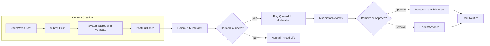

# Introduction and Purpose
This document details the most important usage scenarios, user stories, and core business flows for the discussionBoard political/economic discussion board. It covers standard operations, role-driven activities, and the edge cases that ensure robust, inclusive, and safe community interactions. All stories reflect requirements in natural language and EARS format whenever applicable. This document is suited for product managers and process/business analysts prioritizing fundamental user needs over technical details.

## Key Personas and Roles

### Visitor
- Persona: Unauthenticated individuals browsing the platform
- Key traits: Read-only access, discovery, no engagement
- Needs: Access to public content, ability to search and understand trending topics, observe community tone

### User
- Persona: Registered, authenticated member
- Key traits: Able to contribute, vote, flag, customize experience
- Needs: Seamless participation, content creation, ability to voice opinions, self-moderation

### Moderator
- Persona: Trustworthy member with added responsibilities
- Key traits: Content oversight, user dispute handling, policy enforcement
- Needs: Effective tools for reviewing reports, consistent enforcement mechanisms, audit trails

### Admin
- Persona: System administrator
- Key traits: Full operational access, compliance, platform integrity
- Needs: Configuration, escalated decisions, maintaining service health and compliance

## Primary User Journeys

### Posting (Create, Edit, Delete)
- WHEN a user writes a new post in a topic category, THE system SHALL store and publish the post with user and timestamp metadata.
- WHEN a user edits their post within the editable window (e.g. 30 minutes), THE system SHALL update the content while preserving edit history.
- IF a user deletes their post, THEN THE system SHALL remove it from public view, retain audit trail for moderators, and adjust counts/statistics.
- WHERE posts contain prohibited content (e.g. hate speech, spam), THE system SHALL flag them for moderator review automatically.
- WHILE a thread is locked or archived, THE system SHALL prevent any further postings or edits.
- IF a visitor attempts to create or interact with content, THEN THE system SHALL deny with a login prompt and no data loss.

### Commenting (Add, Respond, Manage)
- WHEN a user submits a comment to a post, THE system SHALL append it to the thread, update discussion state, and trigger notifications as per user settings.
- WHERE comments break community rules, THE system SHALL allow rapid flagging by users, with immediate concealment after exceeding flag threshold.
- IF a user deletes their comment, THEN THE system SHALL make it invisible to others but retain for moderation.
- WHEN a thread is locked, THE system SHALL deny new comment submissions with a user-facing message.

### Voting and Polling
- WHEN a user upvotes or downvotes a post/comment, THE system SHALL update the tally, recalculate rankings, and prevent duplicate votes per identity.
- WHERE posts or comments feature polls, THE system SHALL allow one vote per authenticated user, lock results upon poll closure, and display aggregated outcome.
- IF suspicious voting patterns (e.g. mass votes from one IP) are detected, THEN THE system SHALL flag for review and may temporarily suspend vote count display.

### Reporting/Flagging Content
- WHEN a user flags a post or comment, THE system SHALL record the reason, notify the moderation queue, and take automatic action (conceal, lock) if needed.
- WHERE content is already under review, THE system SHALL indicate status and prevent further user reporting until resolution.
- IF a flagged item is resolved by moderator (approved/rejected), THEN THE system SHALL notify reporters of outcome and update community logs.

## Moderator and Admin Flows

### Moderation Queue and Content Review
- WHEN new content is flagged, THE system SHALL queue it for moderators with associated metadata (user, reason, history).
- WHEN a moderator reviews a flagged item, THE system SHALL display full context, prior actions, and enable decision logging (approve, remove, warn, escalate).
- WHERE repeated offenders are detected, THE system SHALL surface their pattern for moderation attention.
- IF an action is taken, THEN THE system SHALL notify the affected user with reasons and update logs for auditability.

### Enforcement Actions (Suspension, Warning)
- WHEN moderators suspend a user, THE system SHALL immediately revoke their posting and voting privileges, logging the cause and period.
- WHEN a warning is issued to a user, THE system SHALL deliver a message explaining breach and remediation steps.
- IF an appeal is filed, THEN THE system SHALL escalate to admin for review and document final resolution.

### Admin System Controls
- WHEN admins update category structures, THE system SHALL apply changes system-wide, migrate affected posts, and communicate the updates to all users.
- WHEN system-wide compliance or policy changes are made, THE system SHALL display banners or notifications for required acknowledgement by users.
- THE system SHALL enable full export of logs, user actions, and compliance reports for audit purposes.

## Edge Cases and Alternate Paths

### Guest Interactions
- IF a visitor tries to interact beyond browsing (post, comment, vote, report), THEN THE system SHALL prompt for authentication and retain any entered text for later upon login.

### Suspended or Banned Users
- WHILE a user is suspended, THE system SHALL block all participation but allow reading and appeals interface.
- IF a banned user attempts to access the system, THEN THE system SHALL present ban reason and appeal options where relevant.

### Locked or Archived Threads
- WHILE a thread is locked or archived (by moderator/admin), THE system SHALL deny any further contributions but retain all content in read-only mode for transparency.

### High-Volume/Controversial Topics
- WHEN a thread receives a spike in activity or is marked as sensitive, THE system SHALL throttle new posting rates, activate enhanced moderation visibility, and display thread status to users.
- IF the system detects coordinated abuse or bot activity, THEN THE system SHALL activate automatic lockdown on affected threads and alert moderators/admins.

## User Value and Experience
- THE system SHALL ensure transparency by providing feedback on moderation and reporting workflows to all participants.
- WHEN user actions trigger moderation or automated system events, THE system SHALL explain outcomes, status, and escalation paths clearly.
- WHERE community milestones are reached (e.g. post count, engagement), THE system SHALL celebrate and inform the user base for increased engagement.
- THE system SHALL prioritize safety, civil discourse, and inclusivity throughout all touchpoints, ensuring users feel respected and empowered to participate or dissent responsibly.

## Visual Flow Example (Posting and Moderation)

---

All workflows, stories, and requirements in this document focus solely on the behavior, business logic, and user experience drivers. Technical implementation, screen layouts, API definitions, and storage mechanisms are beyond the scope of this analysis.
