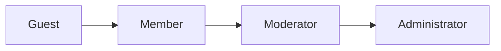

# User Roles and Permissions — Requirements Analysis for discussBoard

## User Role Hierarchy

User roles form a clear escalation chain: Guest → Member → Moderator → Administrator. Privileges and responsibilities increase as users move up this hierarchy; de-escalation (demotion) can occur only via explicit administrative action.

---
## Role Descriptions

### Guest
**Definition:** Any user not authenticated with an account.
- **Capabilities:**
    - View all public posts and comments without restriction.
    - Search and navigate through public content.
- **Limitations:**
    - Cannot create, comment, edit, or delete any content.
    - Cannot interact (like/dislike, report, etc.) with any content.
    - Must register or log in for participation beyond browsing.
    - No access to account management or personalization.

### Member
**Definition:** Authenticated, registered users.
- **Capabilities:**
    - Create posts and comments (including replies).
    - Edit and delete own posts/comments within system-defined time window.
    - Like/dislike, and report inappropriate content.
    - Manage own account settings and passwords.
- **Limitations:**
    - Cannot access or use moderation or administrative features.
    - Cannot edit or delete content not authored by themselves.
    - Actions are subject to community guidelines and platform policies.

### Moderator
**Definition:** Elevated role—users selected to enforce community standards.
- **Capabilities:**
    - View, edit, or delete any post/comment (regardless of author).
    - Access list of all reported content and take decisions.
    - Suspend or ban members (temporary/permanent, within policy).
    - Communicate warnings to users via the platform.
- **Limitations:**
    - Cannot alter site policies or system-wide configurations.
    - Cannot assign or remove moderator or administrator rights.
    - Only administrators can overrule moderator actions in case of dispute.

### Administrator
**Definition:** Super-user with unrestricted platform governance.
- **Capabilities:**
    - All moderator privileges, plus:
        - Management of all user roles, including assigning/revoking moderators.
        - Configuration of platform-wide policies, settings, and maintenance tools.
        - Oversight and auditing of all moderation and administrative action.
- **Limitations:**
    - Bound by platform legal obligations and external regulatory compliance.

---
## Authentication Requirements and Flows

### Core Principles
- THE system SHALL use JWT-based authentication for any API or business function requiring user identification.

### Flows (All Written in EARS Format for Business Clarity)
- WHEN a guest registers, THE system SHALL collect at minimum: unique email, password, and explicit consent to terms.
- WHEN a user confirms their registration, THE system SHALL send a verification email and require verification prior to posting or interacting.
- WHEN a user logs in, THE system SHALL issue JWT access and refresh tokens (access token expires within 15–30 minutes, refresh token within 7–30 days).
- THE system SHALL store tokens in httpOnly cookies by default, but localStorage MAY be additionally offered for specific frontend frameworks if business conditions require.
- WHEN a user requests a password reset, THE system SHALL send a secure, time-limited reset link by email.
- WHEN a user changes their password, THE system SHALL revoke all of that user's existing refresh tokens.
- WHEN a token has expired or is invalid, THE system SHALL return an explicit error and require the user to refresh or re-authenticate.
- WHEN a user logs out, THE system SHALL revoke access and refresh tokens unique to that session.
- WHERE a user or administrator requests, THE system SHALL revoke all of a user's sessions across all devices.
- THE JWT payload issued by the system SHALL include the following business terms: userId, role, and an active array enumerating all permissions for the current session.

---
## Permission Matrix

| Action                                              | Guest | Member | Moderator | Administrator |
|-----------------------------------------------------|:-----:|:------:|:---------:|:-------------:|
| View public posts and comments                      |  ✅   |   ✅   |    ✅     |      ✅       |
| Search posts and comments                           |  ✅   |   ✅   |    ✅     |      ✅       |
| Register an account                                 |  ✅   |   ❌   |    ❌     |      ❌       |
| Login                                               |  ✅   |   ❌   |    ❌     |      ❌       |
| Create post/comment                                 |  ❌   |   ✅   |    ✅     |      ✅       |
| Edit/delete own post/comment                        |  ❌   |   ✅   |    ✅     |      ✅       |
| Like/dislike content                                |  ❌   |   ✅   |    ✅     |      ✅       |
| Report content                                      |  ❌   |   ✅   |    ✅     |      ✅       |
| Edit/delete any post/comment                        |  ❌   |   ❌   |    ✅     |      ✅       |
| Suspend/ban user                                    |  ❌   |   ❌   |    ✅     |      ✅       |
| Assign/revoke moderator/admin role                  |  ❌   |   ❌   |    ❌     |      ✅       |
| Change site-wide policy or configuration            |  ❌   |   ❌   |    ❌     |      ✅       |
| Manage own account                                  |  ❌   |   ✅   |    ✅     |      ✅       |
| Access moderation tools                             |  ❌   |   ❌   |    ✅     |      ✅       |
| Perform system maintenance                          |  ❌   |   ❌   |    ❌     |      ✅       |

---
## Role-based Access and Limitations (Business Logic, EARS Format)

### Universal Rules
- THE system SHALL enforce every access-control and permission boundary strictly as defined in the permission matrix above.

### Protection Against Unauthorized Access
- WHEN a guest attempts to perform any member-only, moderator-only, or admin-only function, THE system SHALL deny access and return a clear error message (HTTP 401/403, with descriptive rationale).
- WHEN a member tries to perform moderator or admin actions, THE system SHALL block the attempt and return an explanatory error (authorization failure).
- WHEN a moderator tries to perform administrator-only functions, THE system SHALL deny access and audit the event.

### Token and Session Management
- WHEN a user's JWT token is invalid or expired, THE system SHALL require token refresh or re-login before further interaction.
- WHEN a member is suspended or banned, THE system SHALL block login and block all content interaction features (with clear explanation shown to the user).
- WHERE an administrator alters user privileges or access (assigns or revokes moderator/admin), THE system SHALL log this event and notify the affected user.

### Escalation Rules
- WHEN a member is promoted to moderator, THE system SHALL allow only administrators to assign the new role explicitly.
- WHEN moderator or administrator actions affect content or user status (e.g., deletion, suspension), THE system SHALL deliver notifications outlining the reason and consequences.
- IF two or more moderators attempt to action the same content/user in conflicting ways, THEN THE system SHALL record both actions and defer to administrator arbitration, with all event details logged.

### Business-driven Restrictions
- WHERE a role's permissions change, THE system SHALL require fresh JWT issuance and update all session caches immediately.
- THE system SHALL ensure all permission checks occur server-side and are not modifiable by client-side users.

---
## Additional Business Requirements and Compliance (JWT)
- THE system SHALL utilize JWT (JSON Web Token) for all API authentication involving user-specific data or actions.
- THE JWT access token SHALL expire between 15–30 minutes from issuance; refresh tokens SHALL expire between 7–30 days.
- THE system SHALL invalidate refresh tokens globally on password change or upon explicit session revocation request.
- THE JWT payload SHALL include userId, role, and a permissions array mapped to the current session’s privileges.

---
## Summary
THE discussBoard platform defines clear, business-driven boundaries for each user role, strictly controls action-privilege mapping, and enforces escalation only via authorized administrative action. Access control is implemented with JWT, including session- and business-events-driven revocation strategies. All access boundaries, permission rules, and escalation mechanics are documented above in EARS and business terms for backend implementation.

To further reference feature-specific behaviors, see the [Core Functional Requirements Document](./04-core-functional-requirements.md), [Moderation and Enforcement](./06-moderation-and-enforcement.md), and [Security and Privacy Requirements](./07-security-and-privacy-requirements.md).
