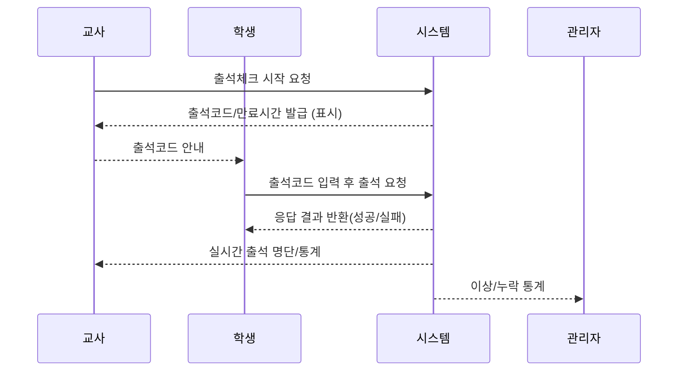

# 출석체크 전체 플로우 문서

본 문서는 출석체크 서비스의 전체 흐름을 명확하게 설명합니다. 교사가 출석을 시작하여 학생들이 코드로 출석을 응답하고, 관리 체계로 기록/검증되는 일련의 프로세스를 다룹니다.

---

## 1. 출석체크 플로우 개요

출석체크는 교사가 출석을 개시하여 학생이 고유 출석 코드를 입력해 응답하고, 시스템이 그 내역을 저장·검증하는 프로세스입니다.

**주요 참여자:**
- 교사(출석 개시/관리)
- 학생(출석 응답)
- 관리자(이상 감지/통계)
- 시스템(코드 발급·검증/데이터 저장)

## 2. 플로우 상세 단계

### 2.1 교사 출석 시작
- 교사 로그인 후, 대시보드에서 특정 수업 출석체크 버튼 클릭
- 시스템이 해당 수업 출석Key(랜덤 6자리 코드 등)를 1회성으로 생성
- 출석코드는 화면에 보여지고, 유효 시간(예: 5~10분)이 함께 안내됨

### 2.2 코드 전달
- 교사는 화면의 출석코드를 구두/게시등으로 학생에게 안내
- 비대면의 경우, LMS/채팅 등 안전한 경로나 자동 알림을 통해 전송될 수 있음(추가 구현 시 고려)

### 2.3 학생 출석 응답
- 학생은 지정된 출석 페이지 접속, 본인의 정보(소셜로그인 등) 확인
- 출석코드 입력 후 '출석하기' 버튼 클릭
- 시스템이 입력값 및 학생 정보를 DB에 기록

### 2.4 코드 검증 및 처리
- 코드 유효성(정확성, 만료시간 여부, 중복 응답 등) 검증
- 성공 시 출석 인정, 실패 시 사용자에게 오류 안내(코드오류, 만료 등)

### 2.5 결과 확인
- 교사는 실시간으로 출석 결과(참여 명단, 시간, 누락/지각자 등) 확인
- 관리자는 전체 이력 및 통계 분석 가능

## 3. 예외처리 및 보안 고려사항
- 출석코드 유효시간 내 재사용 불가
- 동일 학생의 중복 제출 방지 로직
- 코드 예측 방지(강력한 난수 활용)
- 외부 공유 방지(추가 보안정책, 로그 분석 등)
- 시스템 장애 시, 관리자 수동 처리 경로 확보

## 4. 전체 플로우 ASCII 다이어그램

## 5. 확장 및 참고 문서
- [04_attendance_teacher_dashboard.md](./04_attendance_teacher_dashboard.md)
- [05_attendance_parent_notification.md](./05_attendance_parent_notification.md)
- [06_attendance_admin_page.md](./06_attendance_admin_page.md)

---

이 문서는 추후 실 서비스 내규, 세부 정책 변화에 따라 업데이트될 수 있습니다.