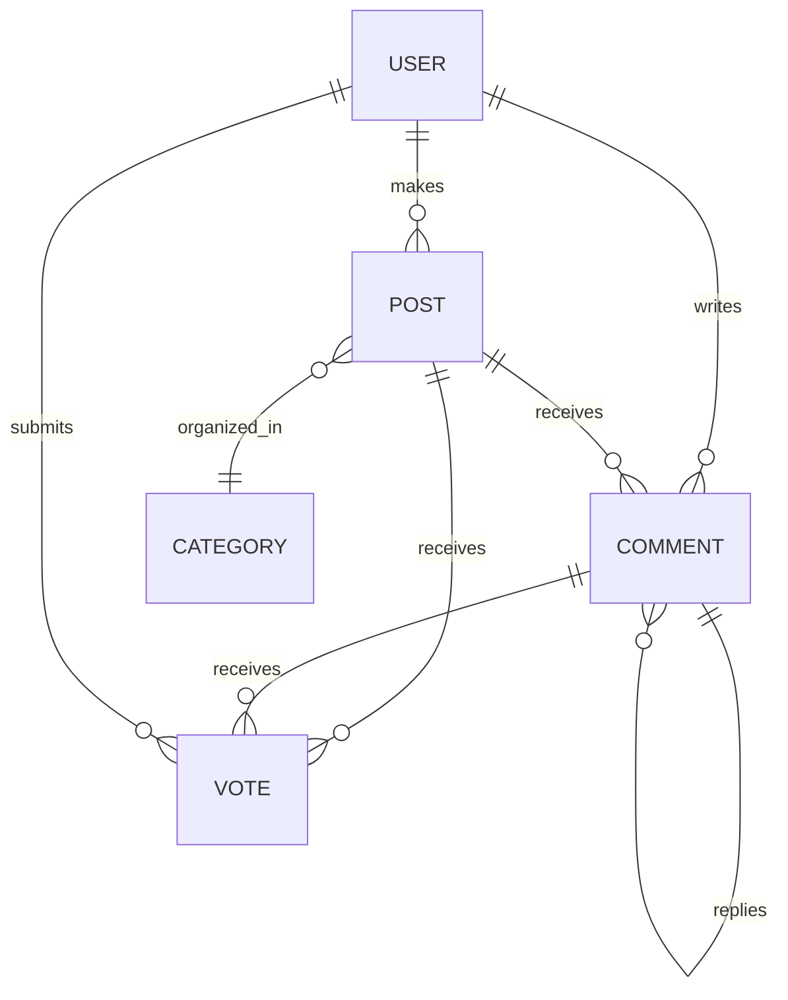

# Data Structure and Business Rules for Political/Economic Discussion Board

---

## Overview
This section describes how the key information and rules that enable a robust, user-focused political/economic discussion board are structured. The explanations are intended for a general audience with no technical background. No design or implementation details are included, focusing solely on the organization and logic that would shape the platform.

## 1. Core Data Entities
The discussion board revolves around several main types of information (“data entities”). These define what kinds of things exist in the system and how they are related. The main entities are:

- **User:** An individual participating on the board (as reader, poster, or moderator)
- **Post:** A discussion topic or article submitted by a user
- **Comment:** A reply or discussion made in response to a post or another comment
- **Category:** Broad topics (e.g., politics, economics, international affairs) under which posts are organized
- **Vote:** An indication of support or disagreement with posts or comments

### Entity Table
| Entity     | Description                          | Main Attributes                 |
|------------|--------------------------------------|---------------------------------|
| User       | A registered board member            | Username, email, role, status   |
| Post       | New topic or article                 | Title, content, author, time, category, vote tally |
| Comment    | Response to post/comment             | Content, author, time, parent post/comment, vote tally |
| Category   | Topic area for organization          | Name, description               |
| Vote       | User feedback on posts/comments      | Voter, target (post/comment), value (+1 or -1) |

## 2. Relationships and Data Flow
- A **User** can create many **Posts** and **Comments**.
- Each **Post** belongs to one **Category**, and each **Comment** is linked to a **Post** or another **Comment**.
- A **Post** or **Comment** can have multiple **Votes** from different **Users**.

### Example Relationship Diagram

## 3. Business Rules
Business rules are guidelines and requirements that keep the board fair, informative, and secure.

### 3.1 Posting and Commenting
- Only registered users can create posts or comments.
- Posts must be assigned to a category.
- Comments can be placed on posts or as replies to other comments.
- Editing and deleting posts or comments is limited to their original authors (within a time window, if enforced).

### 3.2 Voting System
- All registered users can vote (upvote or downvote) on posts and comments.
- Each user is allowed only one vote per post or comment.
- Vote tallies are visible and help users find useful or popular discussions.

### 3.3 Moderation and User Roles
- Roles include: regular users, moderators, and administrators.
- Moderators can remove posts/comments that violate policies (e.g., personal attacks, hate speech).
- Repeated rule-breaking may result in warnings, temporary suspensions, or bans.

### 3.4 Content Organization
- Categories are managed by administrators, ensuring posts fit the board’s focus.
- Users can suggest new categories for consideration.

### 3.5 Privacy and Security
- Email addresses and private data are not publicly visible.
- Passwords and sensitive information remain protected.
- Users must accept the terms and rules before joining.

## 4. Example Scenario
A new user joins and chooses their area of interest, such as "Economics." They post a discussion about inflation. Other users reply, ask questions, and upvote insightful comments. Moderators remove off-topic or rule-breaking content.

## 5. Key Takeaways
- The platform encourages respectful and insightful debate on political and economic topics.
- Rules and structures ensure fair participation, content quality, and a safe environment.
- The board is organized for easy navigation, with user-driven voting to highlight quality discussions.

[Return to Table of Contents](./00_toc.md)
