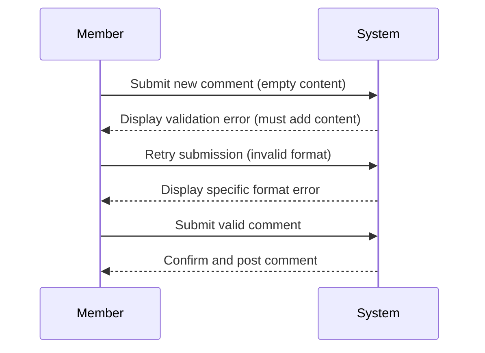
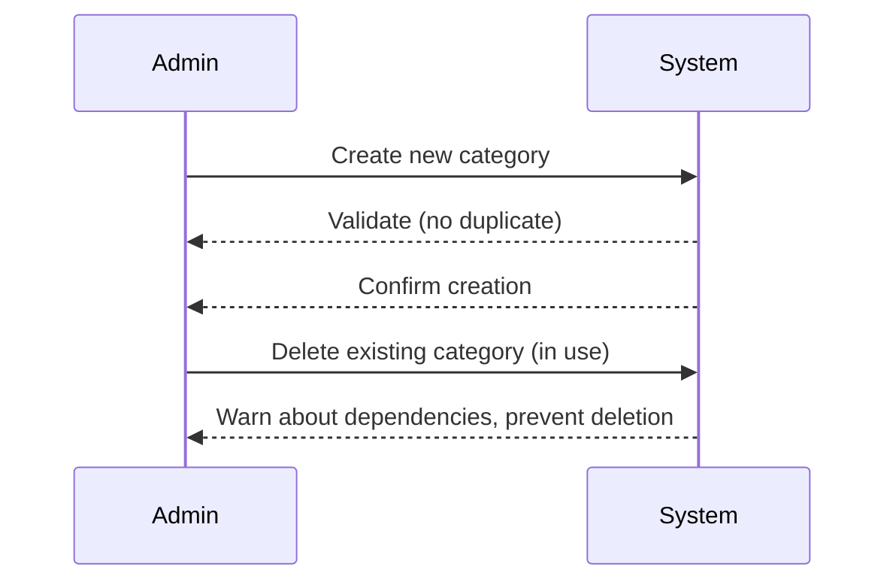

# Discussion Board – User Journeys and Use Cases

## Overview
This document details the core user journeys and functional use cases for the Discussion Board system. It is designed to ensure that all stakeholders clearly understand how different users interact with the system and what requirements govern these interactions, making development reliable, testable, and user-oriented.

---

## Table of Contents
1. User Journeys by Role  
   1.1 Guest  
   1.2 Member  
   1.3 Moderator  
   1.4 Admin  
2. Functional Use Cases Table  
3. Detailed Use Case Narratives  
4. Acceptance Criteria  
5. Example System Flows (Mermaid Diagrams)  
6. Roles & Permissions  
7. Features & Workflow

---

## 1. User Journeys by Role

### 1.1 Guest
A guest is an unauthenticated user browsing the board for the first time.
- Scenario: Upon arriving, the guest can view public posts, topics, and thread lists. WHEN a guest attempts to comment or like a post, THEN THE system SHALL prompt for registration or login.
- Edge Case: IF a guest tries to access a private topic, THEN THE system SHALL display an access denied message with registration suggestion.
- Error Handling: IF network latency prevents loading posts, THEN THE system SHALL display a friendly error message and retry option.

### 1.2 Member
A member is a registered user with full participation privileges.
- Scenario: WHEN a member registers successfully, THEN THE system SHALL redirect them to the main feed and enable content contribution.
- Typical Flow: Members create threads, post replies, upvote/downvote, edit their content, and report posts.
- Edge Case: IF a member submits an empty or invalid post, THEN THE system SHALL validate input and block submission, highlighting errors.
- Error Handling: IF session expires mid-edit, THEN THE system SHALL warn the user and prompt re-authentication.
- Example: Member posts code snippet; formatting is preserved and code is syntax-highlighted (WHERE code block is detected, THE system SHALL format with syntax highlighting).

### 1.3 Moderator
Moderators are community stewards entrusted with content curation powers.
- Scenario: WHEN a flagged post appears in the moderation queue, THEN THE system SHALL notify all online moderators.
- Typical Flow: Moderator reviews flagged content, issues warnings to members, edits or removes posts, manages user bans, and can close threads.
- Edge Case: IF two moderators simultaneously attempt to resolve the same report, THEN THE system SHALL prevent race conditions by locking the record until resolved.
- Error Handling: IF an unauthorized moderator attempts to escalate a case beyond their clearance, THEN THE system SHALL deny the action and log the attempt.
- Example: Moderator diff-checks an edited post before approving restoration.

### 1.4 Admin
Admins manage configuration, categories, and have audit capabilities.
- Scenario: WHEN an admin creates a new discussion category, THEN THE system SHALL validate for duplicates and establish the category across the platform.
- Typical Flow: Admin assigns or revokes moderator privileges, configures discussion hierarchies, monitors analytics, and manages system-wide notices.
- Edge Case: IF two admins simultaneously edit category names, THEN THE system SHALL queue and apply changes sequentially, logging all modifications.
- Error Handling: IF an admin tries to delete a category in use, THEN THE system SHALL require confirmation, show affected topics, and block deletion if dependencies exist.
- Example: Admin reviews audit trail of moderator actions via dashboard.

---

## 2. Functional Use Cases Table
| Use Case              | Role        | Description                                                                                 | EARS Requirement                                                       |
|-----------------------|-------------|---------------------------------------------------------------------------------------------|------------------------------------------------------------------------|
| Browse Topics         | Guest/Member| View public topics and threads.                                                             | THE system SHALL display available topics and threads.                 |
| Register & Login      | Guest       | Create account or login to access features.                                                 | WHEN a guest registers, THE system SHALL create a user account.        |
| Post Thread/Comment   | Member      | Submit a new topic or reply to a thread.                                                    | WHEN a member posts, THE system SHALL append content under topic.      |
| Edit/Delete Own Post  | Member      | Update or remove one’s contribution.                                                        | WHEN a member edits/deletes, THE system SHALL update/remove post.      |
| Report Content        | Member      | Flag inappropriate posts for review.                                                        | WHEN a member reports, THE system SHALL queue for moderation.          |
| Moderate Content      | Moderator   | Review, edit, or remove inappropriate content.                                              | WHEN flagged content is reviewed, THE system SHALL allow resolve.      |
| Manage Users/Roles    | Admin       | Assign/revoke moderator, ban users, view activity logs.                                     | WHEN an admin updates roles, THE system SHALL apply permissions.       |
| Manage Categories     | Admin       | Add, modify, or delete topic categories.                                                    | WHEN an admin changes categories, THE system SHALL update structure.   |
| View Analytics        | Admin       | Access platform usage, engagement statistics, and audit logs.                               | WHEN an admin requests analytics, THE system SHALL show relevant data. |

---

## 3. Detailed Use Case Narratives
### Browse Topics (Guest/Member)
- Positive Flow: User lands on the board, sees organized categories and threads, and clicks into a topic where posts appear in order. Paging and sorting apply based on preferences.
- Negative Flow: Network failure prompts error page with retry; unauthorized access (private topic) returns access denied.

### Register & Login (Guest)
- Positive Flow: Guest enters valid details, passes CAPTCHA, verifies email, and is logged in. Session created, redirected to main feed.
- Negative Flow: Already-used email triggers error and disables further input until resolved.

### Post Thread/Comment (Member)
- Positive Flow: Member enters content, preview renders, and submit posts immediately.
- Negative Flow: Posting blank message triggers validation error; session expiration requires re-login; repeated failed attempts lock posting.

### Edit/Delete Own Post (Member)
- Positive Flow: Member edits post in place; changes saved, post version updated.
- Negative Flow: Unauthorized edits (e.g., to others’ posts) are denied, and an error is shown.

### Report Content (Member)
- Positive Flow: Member reports an abusive comment, which is instantly queued for moderation with reference and evidence.
- Negative Flow: Duplicate reports from same user are blocked with a notice.

### Moderate Content (Moderator)
- Positive Flow: Moderator sees all pending reports, reviews evidence, issues a warning, and deletes infringing post.
- Negative Flow: Attempted action on resolved report is denied; audit log notes action.

### Manage Users/Roles (Admin)
- Positive Flow: Admin assigns a moderator, logs the change.
- Negative Flow: Admin attempts to ban non-existent user; action is blocked with notification.

### Manage Categories (Admin)
- Positive Flow: Admin adds new topic, which appears for all users instantly.
- Negative Flow: Removing an in-use category prompts dependencies warning.

### View Analytics (Admin)
- Positive Flow: Admin accesses stats dashboard.
- Negative Flow: Data query fails; admin is shown troubleshooting steps.

---

## 4. Acceptance Criteria
- THE system SHALL ensure guests cannot interact beyond browsing public content.
- WHEN a user attempts prohibited actions, THE system SHALL provide clear feedback.
- WHEN a member posts, THE system SHALL confirm success or display errors, specifying the cause.
- IF duplicate content is submitted, THEN THE system SHALL block submission and indicate duplication.
- WHEN moderation occurs, THE system SHALL log all actions with timestamps and actor information.
- IF network/service outages prevent actions, THEN THE system SHALL display status and recovery options.
- WHEN admins alter roles/categorization, THE system SHALL update relevant privileges and display results.
- IF inappropriate escalation occurs (e.g., a moderator tries admin-only actions), THEN THE system SHALL block and log attempt.
- WHEN analytics are requested, THE system SHALL render up-to-date insights or feedback on data issues.

---

## 5. Example System Flows (Mermaid Diagrams)

### Member Fails Content Submission

### Admin Manages Categories

---

## 6. Roles & Permissions
Four primary roles govern the discussion board:
- **Admin:** Full access, can manage users, roles, categories, and view analytics. They may assign or revoke moderator privileges, configure all board settings, and intervene at any operational level.
- **Moderator:** Trusted members with powers to review, edit, remove content, resolve user reports, manage user warnings/bans (within limits), and help maintain community order.
- **Member:** Registered users who can create threads, comment, edit or delete their own posts, report content, and engage with others.
- **Guest:** Unauthenticated users limited to browsing public content, unable to interact without registration.
Permissions matrix governs feature access for each role, ensuring system integrity and proper escalation paths.

---

## 7. Features & Workflow
The discussion board boasts:
- **Topic & Category Management:** Hierarchical organization, with admins empowered for structural changes.
- **Posting & Commenting:** Feature-rich editor, real-time preview, markdown/code formatting, edit history.
- **Moderation Tools:** Flagged-content queues, batch actions, moderation logs, evidence attachment for reports.
- **User & Role Management:** Admins can promote/demote moderators, ban/unban users, and audit actions.
- **Analytics & Reporting:** Insights for engagement, trending topics, moderation efficiency, and retention.
- **Security & Error Handling:** Role-based access, input validation, detailed error messages, audit trails for sensitive actions.
Workflow connects these features via logical progressions: guests become members, members contribute and report, moderators curate, and admins oversee and refine system operations.