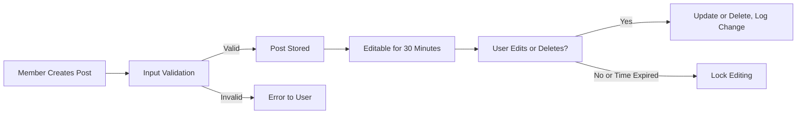

# Core Functional Requirements for discussBoard

This document defines core business requirements for the discussBoard platform (a political/economic discussion community), focusing on posts, comments, reactions, content visibility, editing, deletion, and related business logic. All requirements use the EARS format for clarity and precision. Target audience: backend developers.

## 1. Overview of Core Features

discussBoard is a role-based community where users discuss political and economic topics.
Key features include:
- Posting articles (topics, questions, opinions)
- Commenting and replying
- Content reactions (like/dislike, report)
- Granular content visibility based on user role
- Controlled editing and deletion windows for posts/comments

The system enforces strict business rules for trust, civility, and quality of discourse.

## 2. Posts (Create, Edit, Delete, View)

### Posting Requirements
- WHEN a member submits a post, THE system SHALL accept text content (min 10 chars; max 10,000 chars).
- WHEN a post is submitted, THE system SHALL allow a title (min 5 chars; max 150 chars) and optional tags (up to 5, 20 chars each).
- WHERE a post is submitted, THE system SHALL prevent posting empty or whitespace-only content.
- WHERE a post includes forbidden words (defined in admin settings), THE system SHALL reject the post.
- WHILE the author is not suspended or banned, THE system SHALL permit post creation.
- IF system detects duplicate post content from same user within 5 minutes, THEN THE system SHALL reject with an error.

### Editing and Deletion Windows
- WHEN a member creates a post, THE system SHALL allow editing/deletion within 30 minutes of posting.
- IF the editing window (30 minutes) expires, THEN THE system SHALL lock the post for further edits/deletions for members (moderators/admins retain this power).
- WHEN a member edits a post, THE system SHALL log edit history with a UTC timestamp and allow users to view prior versions.
- WHEN a member deletes a post, THE system SHALL mark the post as 'deleted' and remove content from all views, but retain an audit record accessible to moderators/admins.
- IF a post is deleted, THEN THE system SHALL soft-delete all its associated comments for regulatory/compliance purposes.

### Viewing Requirements
- THE system SHALL allow all users (including guests) to view public posts unless restricted by privacy or policy flags.
- WHEN a post is flagged private or limited, THE system SHALL enforce role-based restrictions defined in section 5.
- WHEN a post is under moderation review or locked, THE system SHALL show a status banner to users and restrict further actions.

#### Post Business Rules Table
| Rule                                        | Member | Moderator | Administrator |
|----------------------------------------------|--------|-----------|---------------|
| Can create posts                             | ✅     | ✅        | ✅            |
| Can edit own post (30 mins)                  | ✅     | ✅        | ✅            |
| Can delete own post (30 mins)                | ✅     | ✅        | ✅            |
| Can edit/delete any post (after 30 mins)     | ❌     | ✅        | ✅            |
| View all non-private posts                   | ✅     | ✅        | ✅            |
| View private posts                           | ❌     | Where permitted | ✅        |

### Mermaid Diagram: Post Creation & Editing Process

## 3. Comments and Replies

- WHEN a member views a post, THE system SHALL allow adding comments or direct replies to comments.
- WHERE a comment is created, THE system SHALL require text content (min 2 chars; max 2,000 chars).
- WHERE a comment includes forbidden or abusive language, THE system SHALL reject submission.
- WHEN a comment is posted, THE system SHALL support nested replies up to 3 levels deep.
- WHERE excessive reply chaining is detected (>3 levels), THE system SHALL prevent further replies on that branch.
- WHEN a member edits or deletes their comment, THE system SHALL apply an edit/delete window of 15 minutes from posting.
- WHEN a comment is edited, THE system SHALL record edit history and disclose 'edited' status to viewers.
- WHEN a comment is deleted, THE system SHALL soft-delete the comment, replace content with 'Deleted', and keep audit log for moderators/admins.
- WHEN a post is deleted, THE system SHALL recursively delete its comments.

#### Comment Permissions Table
| Permission                             | Guest | Member | Moderator | Administrator |
|-----------------------------------------|-------|--------|-----------|---------------|
| View comments                          | ✅    | ✅     | ✅        | ✅            |
| Add comments                           | ❌    | ✅     | ✅        | ✅            |
| Edit/delete own (15 min)                | ❌    | ✅     | ✅        | ✅            |
| Edit/delete any (after 15 mins)         | ❌    | ❌     | ✅        | ✅            |

## 4. Reactions (Like/Dislike/Report)

- WHEN a member views a post or comment, THE system SHALL allow a single like or dislike per item, per user.
- WHERE a member has already reacted, THE system SHALL allow toggling (undo/redo) between like/dislike or removing their reaction.
- WHEN a guest attempts to react, THE system SHALL prompt guest to login/register.
- WHEN a reaction is received, THE system SHALL increment/decrement the corresponding like/dislike count atomically.
- THE system SHALL display aggregate counts (likes/dislikes) for each post/comment visible to all readers.
- WHERE a post or comment is reported, THE system SHALL require specifying a reason (predefined list or custom text up to 200 chars).
- WHEN a member reports content, THE system SHALL accept only one report per user per content item.
- WHEN a content item is reported, THE system SHALL notify moderators immediately for review per moderation policy.
- IF a user attempts to spam reports (over 5 submissions per hour), THEN THE system SHALL temporarily restrict further reports with an error.

## 5. Content Visibility/Access Rules

- THE system SHALL mark all new posts/comments as public unless flagged otherwise by the author or moderators.
- WHERE content is flagged (private/limited), THE system SHALL enforce restrictions:
  - Private to author only: only author can view/edit
  - Limited audience: visible to members/moderators/administrators but not guests
  - Moderators/Administrators can override restrictions as needed for policy/code compliance.
- WHEN content is locked due to moderation, THE system SHALL block further reactions, comments, or edits.

### Access Rights Matrix
| Content Type          | Guest | Member | Moderator | Administrator |
|----------------------|-------|--------|-----------|---------------|
| Public post/comment  | ✅    | ✅     | ✅        | ✅            |
| Limited post/comment | ❌    | ✅     | ✅        | ✅            |
| Private (author)     | ❌    | Only author | ✅   | ✅            |
| Locked/under review  | Banner/view only | Banner/view only | ✅ | ✅ |

## 6. Editing and Deletion Windows

- WHEN a member submits a post, THE system SHALL allow editing and deletion for 30 minutes from posting.
- WHEN a member submits a comment, THE system SHALL allow editing and deletion for 15 minutes from posting.
- WHERE a member attempts to edit/delete after the window, THE system SHALL deny the action with a specific error and suggest contacting a moderator for exceptional cases.
- WHERE a moderator or administrator edits/deletes any post/comment, THE system SHALL record the action in audit history, including before/after content, responsible user, and UTC timestamp.

## 7. Error Handling Scenarios

- IF system rejects a post or comment due to forbidden words, size limits, or duplicate detection, THEN THE system SHALL provide a human-readable error specifying the issue.
- IF a guest attempts restricted actions (post, comment, react), THEN THE system SHALL show a login/register prompt.
- IF network or backend errors occur, THEN THE system SHALL display a generic error and recommend retrying.
- IF content is locked or under review, THEN THE system SHALL clearly indicate its status and prevent further actions as per visibility rules.

## 8. Performance and User Experience

- WHEN a user creates, edits, deletes, comments, or reacts, THE system SHALL process the action and reflect UI changes within 2 seconds in 95% of cases.
- THE system SHALL not lose or duplicate any content/reaction due to concurrent actions or rapid repeated requests.

## 9. Audit, History, and Recovery

- WHEN any moderator/administrator edits or deletes content, THE system SHALL keep a full audit log record (pre/post content, user, timestamp).
- WHEN an edit history is viewed, THE system SHALL only allow moderators/administrators to restore prior versions; members can only view history of their own items.

------