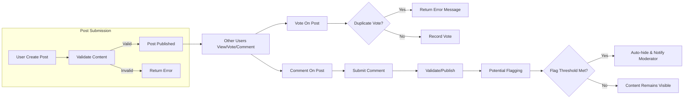

# Functional Requirements for Political/Economic Discussion Board

## General Functional Scope

THE discussionBoard SHALL allow authenticated users to create, read, update, and delete posts on political and economic topics.
THE discussionBoard SHALL support threads and hierarchical comments for structured discussions.
THE discussionBoard SHALL differentiate access and features based on user roles (visitor, user, moderator, admin).
THE discussionBoard SHALL maintain an audit log of all post/comment CRUD (Create, Read, Update, Delete) actions for compliance and moderation traceability.
THE discussionBoard SHALL record all voting, flagging, and moderation actions with user, timestamp, and reason where applicable.

## Post and Comment Management

### Post Creation / Editing / Deletion
WHEN a user submits a new post, THE discussionBoard SHALL validate presence of title, description/body, and topic/category.
WHEN a user edits their own post, THE discussionBoard SHALL restrict editing to within 24 hours of initial post creation or allow editing if no comments exist.
IF a post is edited after receiving comments, THEN THE discussionBoard SHALL require moderator review before publishing the edited version.
WHEN a user deletes their own post, THE discussionBoard SHALL soft-delete the post (retain for auditing, hide from public view).
IF a moderator/admin deletes a post, THEN THE discussionBoard SHALL record the action and reason, and irreversibly remove the post from user access after audit retention.

### Commenting
WHEN a user views a post, THE discussionBoard SHALL allow users to reply with comments.
WHEN a user submits a comment, THE discussionBoard SHALL validate the comment body exists and does not exceed 1,000 characters.
WHEN a user deletes their comment, THE discussionBoard SHALL soft-delete the comment, retaining it for moderation but hiding it from thread display.
WHEN a moderator deletes a comment, THE discussionBoard SHALL retain deletion reason in the audit log.

### Threading and Replies
THE discussionBoard SHALL enable nesting of comments up to five levels (configurable), with visual hierarchy preserved in API payloads.
WHEN maximum nesting is reached, THE discussionBoard SHALL prompt users to reply at the thread root or at an allowable level.

## Voting and Polling Operations

WHEN a post or comment is eligible for voting, THE discussionBoard SHALL allow authenticated users to cast a single upvote or downvote per item.
IF a user attempts duplicate voting, THEN THE discussionBoard SHALL deny the action and return a business error indicating prior participation.
THE discussionBoard SHALL maintain aggregate vote counts, and expose upvoted status in response payloads for authenticated users.
THE discussionBoard SHALL prevent users from voting on their own posts or comments.

### Polls
WHEN a post is created with a poll, THE discussionBoard SHALL support single- and multiple-choice polls, specifying allowed options at creation.
THE discussionBoard SHALL restrict poll participation to authenticated users, recording who voted and their selected choices.
WHEN a poll ends by time/closure, THE discussionBoard SHALL disallow further voting and expose results to all users.

## Content Flagging and Moderation

WHEN a user flags a post/comment as inappropriate, spam, or abusive, THE discussionBoard SHALL require the user to select a valid report reason.
WHEN content is flagged, THE discussionBoard SHALL notify moderators for review and restrict further visibility if the flagged count exceeds a threshold (configurable).
WHEN a moderator reviews flagged content, THE discussionBoard SHALL allow actions: approve, remove, warn, or escalate.
WHEN content is removed by moderator/admin, THE discussionBoard SHALL notify the original author and record action/reason in the audit log.
WHEN flagged content is reinstated after review, THE discussionBoard SHALL reset its flagged state and notify the reporting users with the review outcome.
THE discussionBoard SHALL support automatic hiding of posts/comments that exceed a flag threshold while under review.

## Personalization and Notification Functions

WHEN a user subscribes to a topic/category or follows a post, THE discussionBoard SHALL notify the user upon relevant new content or replies.
WHEN a user receives replies, votes, or moderator actions affecting their content, THE discussionBoard SHALL generate a notification within 1 second of the event.
WHERE a user has enabled email or push notifications, THE discussionBoard SHALL deliver event-based notifications through the user’s registered channel.
THE discussionBoard SHALL allow users to manage notification preferences and unsubscribe from non-mandatory alerts at any time.
THE discussionBoard SHALL provide a notification center listing the latest 50 actions affecting the user, sorted newest first.

## Search and Discovery Features

THE discussionBoard SHALL support keyword-based search across all public posts and comments, ranked by relevance.
WHEN search input is empty, THE discussionBoard SHALL return trending/topics posts as suggestions.
WHEN a user searches within a category or tag, THE discussionBoard SHALL filter results to include only matching posts or comments.
WHEN a visitor (unauthenticated user) performs a search, THE discussionBoard SHALL limit visibility to public content only.
THE discussionBoard SHALL enable sorting of search results by relevance, date, or popularity.

## Permission Matrix by Role

| Feature/Action                       | Visitor | User | Moderator | Admin |
|--------------------------------------|---------|------|-----------|-------|
| View public posts/comments           |   ✅    |  ✅  |    ✅     |   ✅  |
| Search content                       |   ✅    |  ✅  |    ✅     |   ✅  |
| Create posts/comments                |   ❌    |  ✅  |    ✅     |   ✅  |
| Edit/delete own posts/comments       |   ❌    |  ✅  |    ✅     |   ✅  |
| Upvote/downvote                      |   ❌    |  ✅  |    ✅     |   ✅  |
| Participate in polls                 |   ❌    |  ✅  |    ✅     |   ✅  |
| Flag content for moderation          |   ❌    |  ✅  |    ✅     |   ✅  |
| Review/act on flagged content        |   ❌    |  ❌  |    ✅     |   ✅  |
| Remove/restore posts/comments        |   ❌    |  ❌  |    ✅     |   ✅  |
| Send/revoke warnings                 |   ❌    |  ❌  |    ✅     |   ✅  |
| Manage users and roles               |   ❌    |  ❌  |    ❌     |   ✅  |
| Manage categories/system settings    |   ❌    |  ❌  |    ❌     |   ✅  |
| Access audit/moderation logs         |   ❌    |  ❌  |    ✅     |   ✅  |

## Error Handling (Unwanted Behavior/EARS)

IF a user submits invalid content (missing title, excessive length, etc.), THEN THE discussionBoard SHALL return an error specifying all input violations.
IF a user attempts unauthorized action (posting as visitor, moderating without permission), THEN THE discussionBoard SHALL return an error with a business-level code for access denied.
IF an action cannot be completed due to system limits (nesting, flag threshold, voting frequency), THEN THE discussionBoard SHALL return a specific business error, describing the limitation and suggested next step.
IF a content operation fails for technical reasons (e.g., data store unavailable), THEN THE discussionBoard SHALL expose a generic error informing user to retry, without leaking internal failure details.

## Performance Requirements (EARS)

WHEN a user posts or comments, THE discussionBoard SHALL respond with success or error within 2 seconds.
WHEN a user accesses search, THE discussionBoard SHALL deliver results within 1 second for typical queries (<1,000 matches).
WHILE a moderator/admin is reviewing flagged content, THE discussionBoard SHALL lock the item for other moderation actions to prevent conflicts.
WHEN a notification event occurs, THE discussionBoard SHALL add the notification to the user’s center within 1 second.

## Additional Validation and Business Rules

THE discussionBoard SHALL prohibit duplicate posts within the same category, defined as same title and body within a 24-hour window.
IF a post/comment is found to violate community standards or applicable law, THEN THE discussionBoard SHALL allow admin removal without prior notice.
WHERE legal removal (takedown) requests exist, THE discussionBoard SHALL ensure compliance and record action for audit.

## Mermaid Diagram: Core Post-Comment-Vote-Flag Flow

# End of Document
