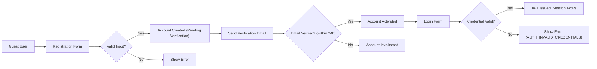
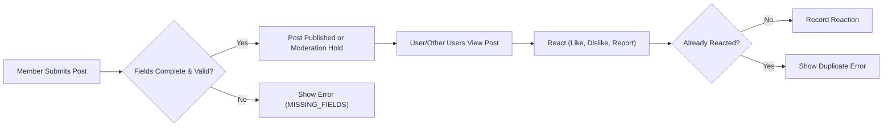
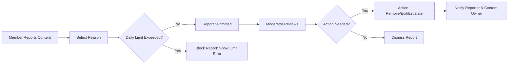

# User Journey and Flow Specification for Political/Economic Discussion Board

## 1. Introduction and Scope
This document defines the step-by-step flows for all core user activities in the discussBoard service, from entry and account creation to daily participation, content moderation, and account management. It focuses on business logic, role-based decision points, EARS-formatted requirements, and error/recovery handling, providing a direct blueprint for backend development.

## 2. User Registration and Login Journey

### 2.1 Registration
- WHEN a guest elects to register, THE system SHALL present a registration form that collects email, password, and optional display name.
- WHEN a user submits a registration, THE system SHALL validate that the email is unique and properly formatted, and the password meets minimum security criteria.
- IF the email is already registered, THEN THE system SHALL display an error and block continuation.
- IF the password does not meet complexity rules, THEN THE system SHALL display an error explaining the rules.
- WHEN the form validates, THE system SHALL create a pending account, send a verification email, and require activation before login.
- IF email verification is not completed within 24 hours, THEN THE system SHALL invalidate the pending account and require re-registration.

### 2.2 Login
- WHEN a member submits credentials, THE system SHALL authenticate by matching email and password against active accounts.
- IF authentication fails, THEN THE system SHALL deny access and provide an error code AUTH_INVALID_CREDENTIALS.
- WHEN authentication succeeds, THE system SHALL issue a JWT access token (15–30min) and refresh token (7–30 days), and record the login session.
- WHEN a user attempts login repeatedly (>5 failures in 10min), THE system SHALL temporarily block further attempts (rate-limiting, e.g., 15min cooldown).

### 2.3 Password Recovery
- WHEN a member requests a password reset, THE system SHALL send a secure reset email if the email exists in the system, without disclosing registration status.
- WHEN a user successfully resets the password, THE system SHALL invalidate all previous sessions and require re-authentication.

### 2.4 Logout
- WHEN a logged-in user initiates logout, THE system SHALL terminate the session by invalidating the current access token only.
- WHEN a user requests global logout, THE system SHALL invalidate all tokens for that user.

## 3. Posting and Interacting Workflow

### 3.1 Creating Posts
- WHEN a member submits a post, THE system SHALL validate required fields (title, content, category).
- IF required fields are missing, THEN THE system SHALL reject post creation with error MISSING_FIELDS.
- WHEN a post is valid, THE system SHALL immediately publish it to the relevant category unless moderation holds apply (see Moderation Flow).

### 3.2 Editing and Deletion
- WHEN a member edits or deletes their own post within the editable window (e.g., 30min), THE system SHALL permit the action.
- WHERE the edit window has expired, THE system SHALL deny further changes and display a message EDIT_WINDOW_EXPIRED.
- WHEN a member deletes a post, THE system SHALL mark it as deleted, remove it from public feeds, and record the action for audit.
- WHEN a moderator or administrator deletes a post, THE system SHALL log the reason and notify the post owner where possible.

### 3.3 Browsing and Searching
- THE system SHALL display posts to guest and member users according to content visibility and access rules defined in core requirements.
- WHEN a user searches for posts, THE system SHALL return the most relevant results within 2 seconds for standard queries.

### 3.4 Reactions
- WHEN a logged-in user reacts (like/dislike, report) to a post, THE system SHALL validate that the user has not already performed the same reaction on this content.
- IF a duplicate reaction is attempted, THEN THE system SHALL deny it and inform the user.
- THE system SHALL record all reactions along with user, timestamp, and content ID for audit and analytics.

## 4. Commenting and Replying Workflow

### 4.1 Creating Comments/Replies
- WHEN a member submits a comment or reply on a post, THE system SHALL validate length (max 500 chars) and sanitize content for policy violations.
- IF the comment is empty or exceeds the limit, THEN THE system SHALL return an error explaining the violation.
- WHEN validation passes, THE system SHALL publish the comment and notify the post owner if notifications are enabled.

### 4.2 Editing and Deletion
- WHEN a user edits or deletes their own comment/reply within the allowed time (e.g., 15min), THE system SHALL permit the change.
- WHERE the window has expired, THE system SHALL deny further edits/deletions.
- Moderators and administrators SHALL be able to remove any comment or reply as part of enforcement.

## 5. Reporting Content and Moderation Flow

### 5.1 Reporting
- WHEN a member reports a post or comment, THE system SHALL require a reason/category for the report (e.g., spam, abuse, off-topic).
- THE system SHALL limit the number of active reports per user per day to prevent spam (e.g., max 10/day).
- THE system SHALL notify moderators/admins in real time of new reports and flag content for review.

### 5.2 Moderation
- WHEN a moderator reviews a report, THE system SHALL present all related history and allow for content action (delete, edit, dismiss, escalate).
- WHEN a moderator or admin takes action, THE system SHALL notify the affected user(s) of the action and reasoning where applicable.
- IF a member is suspended or banned, THEN THE system SHALL record duration, reason, and notify the member per policy.
- WHEN a report is found false or abusive, THE system SHALL log an infraction against the reporting user and, after repeated offenses (e.g., 3+ in 30 days), temporarily suspend reporting privileges.

## 6. User Settings Management Journey

### 6.1 Account Information
- WHEN a member views their settings, THE system SHALL display current profile information, notification preferences, and account activity logs.
- WHEN a member updates their email, THE system SHALL require re-verification before changes take effect.
- WHEN a member changes their password, THE system SHALL require the current password (unless performing recovery via email), and invalidate all sessions upon completion.

### 6.2 Privacy and Consent
- WHEN a user requests account deletion, THE system SHALL confirm the request, explain data retention and deletion timelines, and process the request within 7 days.
- THE system SHALL allow members to export their data in a machine-readable format.

## 7. Error Handling and Recovery Scenarios
- IF user inputs are invalid or incomplete, THEN THE system SHALL present specific error messages and NOT generic failures.
- IF the backend or network is unavailable, THEN THE system SHALL display a clear notification and allow retry when back online.
- IF a banned user attempts to log in or post, THEN THE system SHALL deny access and provide a ban reason and expiry date.
- THE system SHALL log all critical errors and user actions for audit and support investigation.

## 8. Mermaid Diagrams for Key Flows

### 8.1 Registration and Login Flow

### 8.2 Posting & Interaction

### 8.3 Content Reporting & Moderation

## 9. Developer Note
> *Developer Note: This document focuses solely on business requirements and user scenarios. All technical implementation details, including API and database specifications, are at the discretion of the development team.*
