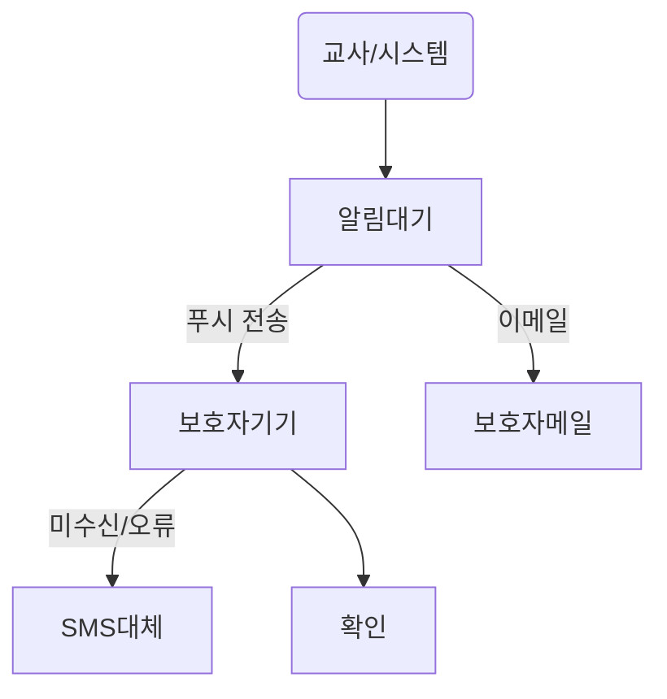

# 출결 부모 알림 시스템 안내

## 개요
출결 부모 알림 시스템은 학생의 등교·결석·조퇴 등 출결 정보를 신속하게 보호자에게 전달하여 학교·가정 간의 실시간 소통을 실현합니다. 본 시스템은 각종 출결 현황 발생 시 보호자에게 다양한 방식의 알림을 제공하며, 운영자의 설정과 교사의 출결 입력에 맞춰 자동화된 프로세스를 갖춥니다. 체계적인 알림 관리와 개인정보 보호정책을 준수하며 학교 현장의 효율성을 개선하고 학부모의 신뢰도를 높입니다.

## 알림 방식 및 전달 옵션
출결 알림은 다음과 같은 다양한 방식으로 전송됩니다.

- **모바일 앱 푸시 알림**: 보호자가 등록한 공식 앱으로 실시간 출결 메시지 발송. (예: "홍길동 학생이 07월 09일 정상적으로 등교했습니다.")
  - *발송 실패 시*: 3회까지 자동 재시도, 이후 SMS로 대체 안내
- **문자(SMS/LMS)**: 앱 설치가 없는 경우 혹은 푸시 발송 장애/실패 시 대체 발송. 문자 내용에 출결 종류, 일시, 사유 등을 명시.
  - *예시메시지*: "[학교알림] 김철수 학생이 07/09 결석하였습니다. 사유: 가정 사정."
- **이메일**: 특이사항 발생 시나 일반 출결 현황 요약(일간/주간)용으로 전송 가능. ※ 형식 및 내용 설정은 관리자 영역 참고
- **환경설정 옵션**: 보호자 개인별 선호 채널 설정(앱-문자-이메일 순 자동화/개별 지정)

| 알림 방식 | 실시간성 | 커스터마이즈 | 예외처리 | 주요 활용 |
|:----:|:------:|:----------:|:--------:|:---------:|
| 푸시알림 | ★★★★★ | O | 장애시 SMS 전환 | 등교/조퇴 알림 |
| SMS | ★★★★☆ | △ | 크레딧 소진/번호 오류시 관리자 알림 | 결석/긴급상황 |
| 이메일 | ★★★☆☆ | O | 스팸메일함 체크 유의 | 요약 리포트 |

### 예외 및 경고 케이스
- 잘못된 번호/차단번호로 인해 발송 실패 시 교사·관리자에게 자동 로그
- 동일 출결 상태의 반복적 알림은 1일 1회로 제한(스팸 방지)
- 보호자의 알림 수신 거부 의사가 명확할 경우, 전체 데이터 암호화 및 발송 중단 처리

## 주요 사용자 시나리오
### 가상 사례 1: 정상 등교
1. 교사가 출석 체크 → 시스템 즉시 앱 푸시로 보호자에게 “정상 등교” 메시지 전송
2. 보호자는 푸시 클릭 후 상세 내역 및 등교 시간 확인 → 학교에 감사 메시지 등록(선택)

### 가상 사례 2: 결석 처리
1. 결석 입력 시 사유 명시(교사 직접·시스템 자동)
2. 보호자에게 SMS 및 앱 푸시로 동시 알림 → 수신 시 앱에서 결석 사유 확인 및 출결 정정 요청 가능(관리자 승인 필요)

### 가상 사례 3: 조퇴/긴급 변경
- 조퇴 입력 시, 보호자에게 긴급 우선순위로 푸시 및 SMS 동시 발송 → 보호자가 즉시 확인 후 학교로 전화 문의 접수

## 알림 흐름도

각 단계별 전송 내역은 교사용 대시보드와 관리자 페이지에 통합 로그로 기록됩니다.

## 관리자 및 교사용 알림 통합 기능
- 교사는 대시보드 내 “알림 발송 이력”·“실시간 출결 상태” 제공
  - 미확인 건 목록 및 1회 재발송 기능
  - 보호자의 알림 도달 여부(아이콘, 발송 결과 등 색상 구분)
  - 학생별 출결정정 요청 내역 확인 및 승인·거부 처리
- 관리자는 알림 환경설정(알림채널, 발송 스케줄, 메시지 서식), 통계 추적 및 월별 알림 발송 내역 집계가능

## 개인정보 보호 및 보안 정책
- **법적 준수**: 정보통신망법 및 개인정보보호법 등 국내법 근거 엄격 준수
- **동의 방식**: 학부모 서비스 최초 가입 시 명시적 개인정보 수집/이용 동의 획득, 언제든 철회 가능
- **암호화**: 출결 데이터 및 보호자 연락처·이메일 등은 AES256 방식으로 저장/전송
- **접근로그 관리**: 알림 전송 및 데이터 접근 내역은 최대 3년까지 별도 보관, 관리자/감사전용 로그 조회 기능 제공
- **내부 점검/감사 프로세스**: 정기적 모의침해테스트, 접근권한 관리 평가, 보안 패치 이력 기록

> **유의사항:** 휴대전화 번호 변경·이메일 오입력 시 즉시 보정 기능 제공, 다자녀 학부모의 경우 여러 학생 알림 통합 관리 메뉴 안내

## FAQ
- **Q: 알림이 수신되지 않을 때 어떻게 하나요?**  
A: 앱 내 “알림 기록”에서 미수신건 확인 및 직접 재전송 가능. 문제 지속 시 관리자에게 문의하세요.
- **Q: 보호자가 알림 채널을 바꿀 수 있나요?**  
A: “내 정보” 메뉴에서 알림 수신 방법을 자유롭게 변경 가능, 설정값은 즉시 적용됩니다.
- **Q: 알림 내용(메시지)를 개별적으로 변경 가능한가요?**  
A: 관리자의 ‘메시지 서식 설정’ 메뉴, 교사용 ‘개별 메시지 추가’ 기능이 지원됩니다.

## 향후 기능 확장 계획
- 챗봇 기반 보호자 문의 답변 및 자동상담 연동
- 이중 인증(2FA) 통한 보호자 신원 확인 절차
- 가정통신문 등 기타 생활정보 통합 알림 서비스 개발 예정

## 참고 문서
- [교사용 대시보드 안내](./04_attendance_teacher_dashboard.md)
- [관리자 설정 페이지](./06_attendance_admin_page.md)
- [소셜 로그인 및 인증](./07_attendance_auth_social_login.md)

---

### 교사용 대시보드 안내
교사용 대시보드는 학생 출결 현황 확인, 출석 체크/정정, 개별 또는 전체 보호자 알림 발송, 미확인 건 관리 등이 가능한 통합 업무 플랫폼입니다. 출결 입력 후 각 학생별 발송 현황(알림 성공/실패)이 실시간으로 표시되며, 필요 시 알림 재발송 버튼을 활용할 수 있습니다. 대시보드에서는 일별/월별 누적 통계, 결석·조퇴 학생 리스트 열람, 알림 이력(발송 내역, 수신결과 등)까지 한눈에 관리할 수 있습니다.

예시 흐름:
1. 출석 체크(일괄/개별)
2. 결과 저장 시 자동 알림(보호자별 표시)
3. 이력 탭에서 “미수신/오류” 추적 및 재발송
4. 필요 시 사유 입력 및 보호자 문의 대응

### 관리자 설정 페이지
관리자 페이지에서는 전체 출결 알림 서비스의 기본 정책 및 환경설정을 종합적으로 관리합니다. 주요 기능은 다음과 같습니다.
- 알림 채널(푸시, 문자, 이메일) 순서/활성화 설정
- 메시지 서식(기본/특이 사항) 커스터마이즈
- 발송 스케줄(즉시/시간 지정/지연 발송) 설정
- 전체 알림 통계 대시보드, 개별 발송 이력 열람
- 개인정보 접근권한 관리, 접근로그 감사 기능

관리자는 각 학교/학급별 정책 세분화, 보호자 알림 수신 동의 현황 모니터링, 시스템 점검 및 공지 알림 기능을 수행할 수 있습니다.

### 소셜 로그인 및 인증
학부모 및 교직원의 편의성과 데이터 보안을 위해 소셜 로그인을 통합 지원합니다. 보호자는 주요 포털·메신저(예: 카카오, 네이버, Google 등)로 간편 로그인 가능하며, 첫 로그인 시 신분 확인(학생 정보 매칭) 절차를 거칩니다. 인증 절차는 다음과 같습니다.

- 소셜 ID와 학교 출결 DB의 보호자-학생 매칭 검증
- 최초 로그인시 개인정보 이용 동의 후 출결 알림 서비스 연결
- 다자녀 보호자의 경우, 전체 자녀 출결정보를 계정 하나로 통합 관리 지원
- 네트워크 장애시 대체 인증(문자 인증 번호 발송 등) 제공

로그인과 인증 기록은 관리자 페이지 내 모든 접속 이력 및 권한 부여 내역에 자동 집계되며, 정기적 로그 점검과 비인가 접근 차단 정책이 적용됩니다.
