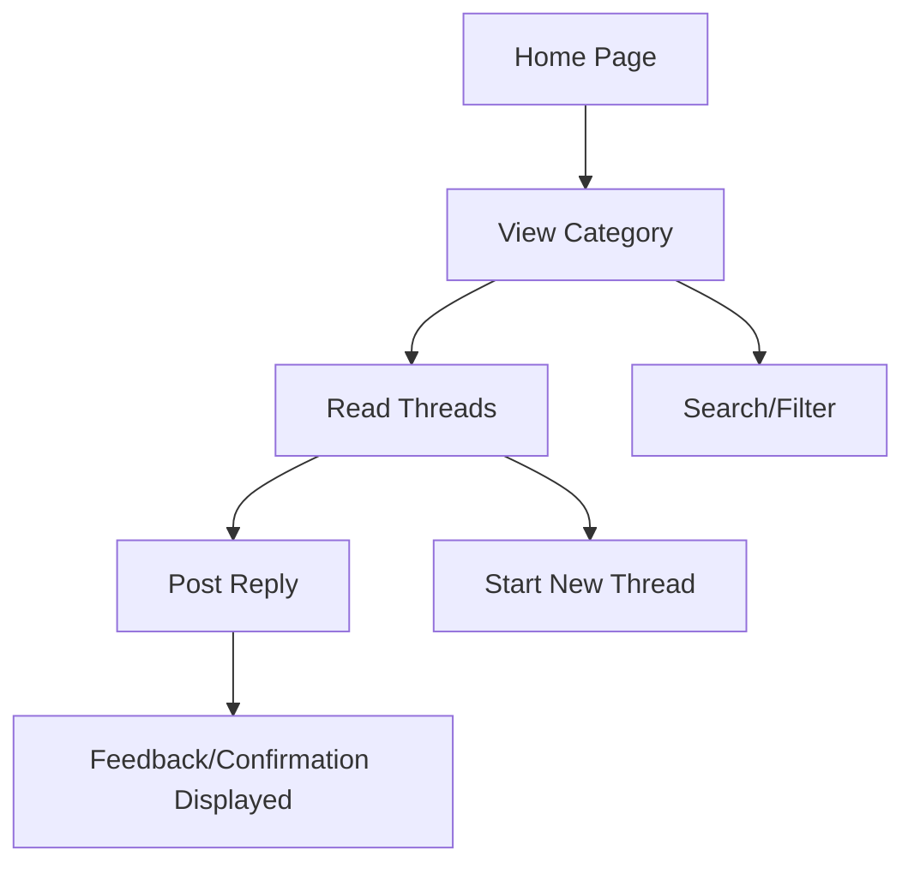

# Discussion Board UI/UX Overview

## Overview
This document presents the key UI (User Interface) and UX (User Experience) principles necessary to ensure the discussion board is intuitive, accessible, and enjoyable for a public audience. The goal is to reduce barriers to participation, encourage constructive engagement, and ensure inclusivity.

## Objectives
- Increase accessibility and usability for users of diverse backgrounds
- Promote community engagement and respectful discourse
- Minimize learning curve and cognitive load for new users
- Ensure mobile and desktop compatibility (responsive design)
- Adhere to accessibility standards (WCAG 2.1)

## Core UI/UX Principles

1. **Clarity & Simplicity**
   - Organize primary actions (e.g., posting, commenting, reacting) in prominent, easy-to-find locations.
   - Use concise labels and familiar icons for actions such as "Reply," "Edit," and "Report."
   - Consistent color and typography to distinguish posts, replies, and system messages.

2. **Intuitive Navigation**
   - Persistent navigation menu with clear access to Home, Categories, Profile, and Help sections.
   - Breadcrumbs or navigation aids to enable users to trace their steps and return easily.

3. **Accessibility**
   - Support full keyboard navigation and screen reader compatibility.
   - Ensure color contrast and font scalability for visually impaired users.
   - Accessible forms with clear error feedback.

4. **Responsive & Adaptive Layouts**
   - Mobile-first design with adaptive layouts for tablets and desktops.
   - Touch-friendly controls for mobile devices; avoid hover-dependent interactions.

5. **User Guidance and Feedback**
   - Display contextual tips for first-time users (e.g., tooltips for formatting options).
   - Real-time feedback on actions (e.g., posting, editing, uploading attachments).
   - Confirmations for potentially destructive actions (e.g., deleting a post).

6. **Encouraging Positive Behavior**
   - Visually highlight official moderator messages and pinned posts.
   - Simple, visible reporting tools for inappropriate content.
   - Badges or recognition for constructive community contributions.

## Sample User Flow Diagram

## Non-Functional Considerations
- Fast loading times, especially for thread lists and main pages
- Localized interfaces for internationalization
- Privacy-first data handling (minimal personal info displayed by default)

## Next Steps
Further UI wireframes and detailed component specifications are addressed in related documents. For content moderation, see [04_discussion_board_content_moderation_policy.md]. For role management, see [03_discussion_board_user_roles_permissions.md].
