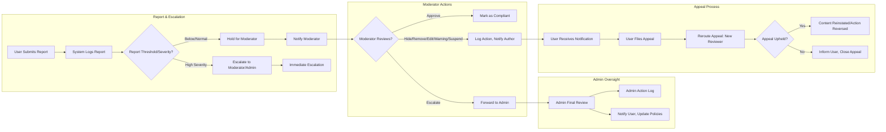

# Moderation and Enforcement Requirements for Political/Economic Discussion Board

## Introduction
This document specifies the moderation policies, workflows, escalation logic, and enforcement mechanisms of the discussBoard platform. It provides detailed, actionable business requirements, using EARS (Easy Approach to Requirements Syntax) format where applicable, focusing on fairness, transparency, and robust enforcement. The aim is to enable backend developers to implement moderation and enforcement features that support a healthy political/economic discourse environment.

## Content Reporting and Escalation
Moderation begins with user-driven reporting and may escalate to moderator and administrator review. Clarity in triggers and business logic for escalation is essential for trust and reliability.

### Reporting Triggers
- WHEN a member or guest views a post or comment, THE system SHALL present a visible option to report inappropriate or rule-violating content.
- WHEN a user submits a content report, THE system SHALL record the report reason (from a defined list: spam, harassment, misinformation, hate speech, off-topic, etc.), reporter identity (if authenticated), content ID, and timestamp.
- WHEN content receives N reports (where N is defined by policy, e.g. 3 reports within 24 hours), THE system SHALL escalate the content to moderator review.
- WHERE a report severity is high (e.g., contains hate speech or credible threats), THE system SHALL escalate the report immediately, bypassing normal thresholds.
- WHEN a user abuses reporting (submits X false reports in Y time), THEN THE system SHALL restrict further reports by that user for a defined period and notify moderation.

### Escalation Logic
- WHEN a report is submitted, THE system SHALL notify the appropriate moderator, categorized by topic, language, or region as applicable.
- WHERE no moderator responds within Z hours, THE system SHALL escalate unresolved reports to an administrator.

## Moderator Actions
Moderators hold responsibility for content review and community well-being. Their powers and processes are strictly bounded by business rules for transparency and accountability.

### Review Process
- WHEN a moderator reviews a reported content item, THE system SHALL display all relevant information, including report history, reporter notes, and past moderation actions.
- WHEN reviewing, THE system SHALL allow moderators to take one or more of the following actions:
  - Approve content as compliant
  - Temporarily hide content for further review
  - Edit content (redact or block offensive portions)
  - Remove content deemed violative
  - Issue a warning to the content author
  - Suspend the content author’s posting/commenting rights temporarily (with reason logged)
  - Forward or escalate to administrator if unsure or outside moderator scope
- WHEN a moderator acts, THE system SHALL require a reason to be selected or entered and log all actions with moderator identity, timestamp, original action, and rationale.
- WHERE a content item is edited or removed, THE system SHALL notify the original author of the action and its rationale.
- WHERE a moderator abuses privileges (e.g., excessive or wrongful takedowns), THE system SHALL flag the behavior to administrators for audit.

### Documentation and Logging
- THE system SHALL maintain a complete moderation log accessible to administrators and, where appropriate, users (for their own content).
- WHEN a user requests a log of all moderation actions on their content, THE system SHALL provide a complete record, subject to privacy and legal limitations.

## Admin Oversight
Administrators serve as final arbiters for content and community issues, oversee moderator performance, and intervene in exceptional cases.

### Escalation Paths
- WHEN an escalated report or moderator request reaches an administrator, THE system SHALL notify the administrator with all related context and allow final action (approve, remove, ban, etc.).
- WHEN moderation logs indicate patterns of abuse or failure, THE system SHALL alert administrators for investigation.

### Administrator Actions
- Administrators may: reinstate removed content, permanently remove problematic content, rescind or extend user suspensions, demote moderators, or adjust platform policies as needed.
- ALL administrator actions SHALL be logged with reasons and visible to an internal audit log.

## Appeals and Feedback Mechanisms
A fair platform must give users the means to appeal moderation and enforcement decisions, fostering trust and transparency.

### Appeals Process
- WHEN a user’s post, comment, or account is affected by moderation, THE system SHALL notify the user and present a clear path to appeal.
- WHEN an appeal is filed, THE system SHALL route it to an independent (non-involved) moderator or administrator for re-review.
- THE system SHALL inform the user of the outcome of their appeal, including rationale.
- THE system SHALL allow a limited number of appeals per item to prevent abuse but guarantee at least one appeal per incident.

### Feedback and Transparency
- WHEN a moderation event occurs, THE system SHALL provide affected users with clear, concise feedback (action taken, reason, applicable rules/policies).
- THE system SHALL provide analytics and public transparency reports (number of reports, removals, appeals, outcomes, etc.) on a regular basis, with personally identifying information anonymized.

## User Roles & Permission Integration (reference)
- Only users with "moderator" or "administrator" roles may take enforcement actions.
- "Members" may report, appeal, and view moderation results for their content but cannot moderate others.
- "Guests" may only report or view public moderation statistics.
- Role boundaries and permissions are governed by the [User Roles and Permissions](./03-user-roles-and-permissions.md) documentation.

## Error Handling and Performance Requirements
- IF a moderation action fails (e.g., system unavailable, conflicting actions), THEN THE system SHALL notify the moderator/administrator, explain the cause, and log the event for support intervention.
- WHEN users submit reports or appeals, THE system SHALL confirm submission within 1 second.
- WHEN moderators or administrators perform actions, THE system SHALL update all affected records (logs, notifications, content status) within 2 seconds.
- WHEN viewing moderation or appeal logs, THE system SHALL return results within 3 seconds for standard queries (≤1,000 records).

## Moderation Workflow Diagram

## Linkage to Related Documents
- Permissions and detailed role logic: See [User Roles and Permissions](./03-user-roles-and-permissions.md)
- Core feature requirements and user actions: See [Core Functional Requirements](./04-core-functional-requirements.md)
- Security, Privacy, and User Flows: See respective documentation.

