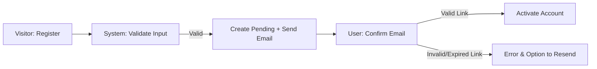
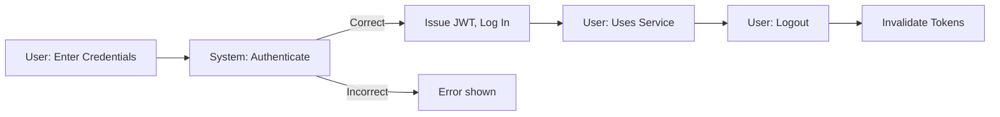
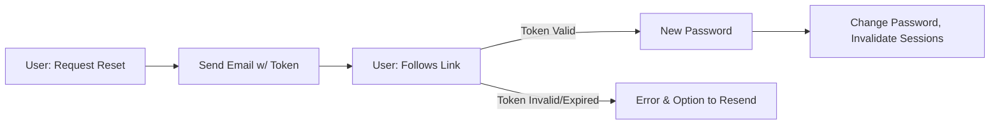
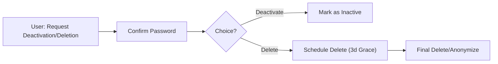

## 1. Registration and Verification

New users, identified as visitors, initiate the onboarding process to become authenticated users possessing the 'user' role. Registration business requirements are as follows:

- WHEN a visitor submits the registration form, THE system SHALL validate that the email is unique, the username is unique, and that the password complies with the password policy (minimum 8 characters, at least 1 number, 1 letter, and 1 special character).
- WHEN registration input validation fails, THE system SHALL prevent further processing and display a specific error message for each invalid field.
- WHEN all inputs pass validation, THE system SHALL register a pending user account and send a verification email containing a secure, single-use token.
- WHEN the verification email is sent, THE system SHALL display confirmation to the user and allow resending the verification email if needed.
- WHEN the user clicks the verification link within 24 hours, THE system SHALL activate the account, assign the 'user' role, and enable login.
- IF the verification link is expired or invalid, THEN THE system SHALL prevent activation, provide a detailed error and a mechanism to resend the verification email.
- IF registration is attempted with a duplicate email or username, THEN THE system SHALL return a field-level validation error and log the event for audit.
- THE system SHALL hash all user passwords using a secure, adaptive algorithm.
- THE system SHALL record all registration attempts, successful and failed, by timestamp, IP address, and result for audit/compliance.

## 2. Login and Logout

Authenticated access is managed through role-verified JWT. Requirements for login/logout are:

- WHEN a user submits login credentials (email/username and password), THE system SHALL validate their correctness using stored credentials and allow login if the account is active and verified.
- IF credentials are invalid, THEN THE system SHALL deny login and return a field-level error.
- IF three consecutive failures occur, THEN THE system SHALL lockout login attempts from the same IP or account for 5 minutes and notify the user.
- WHEN login is successful, THE system SHALL issue an access token (JWT, expiration ≤ 30 minutes) and a refresh token (expiration ≤ 30 days).
- THE JWT payload SHALL include userId, current role, and permissions array.
- WHEN the user logs out, THE system SHALL immediately revoke the active refresh token for the device/session.
- WHEN a logout from all devices is requested, THE system SHALL revoke every refresh token for the user.
- THE system SHALL provide audit logs for all authentication, login, and logout events for compliance.
- WHEN a user is banned, suspended, or deleted, THE system SHALL block action and display the reason during login attempt.
- WHEN a session expires, THE system SHALL prompt for re-authentication.
- WHEN an admin or moderator forcibly logs a user out (for violation, compliance, etc.), THE system SHALL immediately revoke tokens and display a notification upon next login.

## 3. Password Reset/Recovery

Users may recover credentials through a secure, rate-limited process. Requirements:

- WHEN a user completes the forgot password form, THE system SHALL generate a secure, single-use, time-bound token and email a reset link (expiration 1 hour).
- WHEN the token is used within its validity, THE system SHALL allow the user to set a new password, validated per password policy.
- IF the reset token is expired or invalid, THEN THE system SHALL deny reset and provide error and resending options.
- THE system SHALL enforce a maximum of five reset requests per email/user per hour.
- IF a password reset is performed, THEN THE system SHALL revoke all existing tokens and sessions.
- THE system SHALL provide no indication of account existence for unregistered emails during reset.
- WHEN a password change occurs, THE system SHALL log the change event, IP, and user for audit.

## 4. Session Management and Token Refresh

Stateless session management uses JWTs for secure, role-verified access:
- WHEN a user logs in, THE system SHALL issue access/refreshtokens as defined above.
- WHEN an access token expires and a valid refresh token is presented, THE system SHALL generate and return a new access token and rotate the refresh token.
- IF the refresh token is missing, reused, expired, or compromised, THEN THE system SHALL require full login and revoke all tokens.
- WHEN a user is promoted, demoted, suspended, or reactivated, THE system SHALL immediately invalidate all prior tokens and require re-authentication.
- The JWT SHALL always include up-to-date role/permission claims and expiration timestamps.
- THE system SHALL allow only one active refresh token per device/session per user.

## 5. Account Deletion/Deactivation

Authenticated users may deactivate (temporary) or delete (permanent, irreversible) their accounts:

- WHEN a deactivation is requested, THE system SHALL require password confirmation and mark the account as inactive, denying future login until reactive.
- WHEN deletion is requested, THE system SHALL require confirmation, schedule deletion after a 3-day grace period, and notify the user by email.
- WHEN deletion is confirmed post-grace, THE system SHALL anonymize or erase user data in compliance with policy/law.
- IF a deleted or deactivated user attempts login, THEN THE system SHALL deny access and show a contextual message.
- THE system SHALL process data erasure requests according to applicable data privacy laws and business retention policy.

## 6. User Flow Diagrams (Mermaid)

### Registration and Verification

### Login/Logout

### Password Recovery

### Account Deletion/Deactivation

## 7. Error Handling and Performance Requirements

- IF registration, login, reset, or verification fail due to invalid or expired inputs, THEN THE system SHALL return a clear, actionable business error and advice.
- WHEN an action is successful, THE system SHALL respond within 2 seconds for registration, 1.5 seconds for login, and 2 seconds for password/reset operations under normal load.
- WHERE errors are not user-correctable (e.g., service outage), THE system SHALL show a non-technical message and log all technical details for admin review.
- WHEN repeated errors or anomalies (multiple reset attempts, inconsistent token use, etc.) are detected, THE system SHALL limit further actions, log the activity, and alert admins for investigation.
- THE system SHALL report and log all failed authentication or registration attempts for anomaly detection, audit, and compliance records.

## 8. Out-of-Scope Clarification

This document provides comprehensive business requirements for registration, authentication, password recovery, session management, and account lifecycle. It deliberately excludes interface design, API formats, technology stacks, database schemas, or implementation specifics.

All technical implementation, infrastructure, and data structure decisions are at the discretion of the development team. This document describes what the system SHALL do from a business perspective, not how it is built.