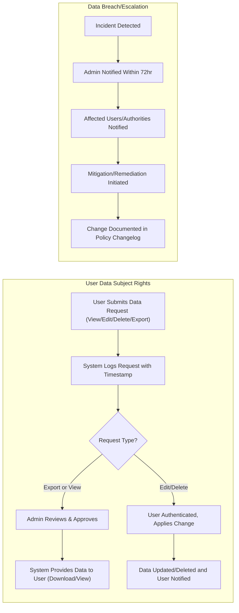

# Security and Privacy Requirements for discussBoard

## User Data Privacy

### Core Privacy Requirements
- THE discussBoard SHALL treat all user information (including account data, posts, comments, reactions, moderation logs, reports, and IP addresses) as sensitive data, subject to strict privacy rules.
- THE discussBoard SHALL collect and process only data strictly necessary for core platform functionality.
- WHERE the service supports optional features (e.g., profile pictures, bios), THE discussBoard SHALL collect this data strictly with explicit user consent and provide a way to remove such optional data.
- THE discussBoard SHALL allow users to view all data stored about them, including profile, posts, comments, and moderation history.
- WHEN a user deletes their account, THE discussBoard SHALL remove or pseudonymize all personal identifiers within 30 days, except those legally required to be retained (e.g., for legal investigation or abuse).
- IF a user requests data deletion or export, THEN THE discussBoard SHALL provide downloadable, human-readable files with all their data within 14 days.
- WHEN a user corrects or updates their information, THE discussBoard SHALL apply changes across all active content displays and history where legally permitted.
- WHERE a user is banned or restricted, THE discussBoard SHALL retain only information necessary for ongoing moderation and compliance, with all other data removed or anonymized after sanction expiry as per policy.

### Data Minimization and Transparency
- THE discussBoard SHALL publish a clear privacy policy detailing what data is collected, how it is used, who can access it, and user rights.
- THE discussBoard SHALL NOT use personal data for advertising or third-party analytics unless users have opted in explicitly.
- WHEN user data is shared with any external service provider, THE discussBoard SHALL require written agreements with equivalent privacy safeguards.

## Consent and Terms Management

### User Consent
- WHEN a guest registers as a member, THE discussBoard SHALL require clear agreement to the Terms of Use and Privacy Policy.
- WHEN a user submits any personal information or content, THE discussBoard SHALL obtain explicit, informed consent specifying what data will be public, what will remain private, and how it will be used.
- WHERE the user is under age of majority according to their jurisdiction, THE discussBoard SHALL require parental or guardian consent for registration and clearly restrict certain features.
- THE discussBoard SHALL allow users to withdraw consent for data processing at any time, explaining the consequences (e.g., certain features may become unavailable).
- WHEN users update consent settings, THE discussBoard SHALL act on changes immediately, revoking access to restricted data/processing without delay.
- THE discussBoard SHALL keep audit logs of consent (who consented, for what, at what time) for legal record-keeping, accessible only by administrators for compliance verification.

### Terms Change and Notification
- WHEN the Privacy Policy or Terms of Use change, THE discussBoard SHALL notify all users (members, moderators, administrators) and require re-consent upon next login or significant action.
- THE discussBoard SHALL provide a changelog history for all policy updates, available for user review.

## Security Measures (Conceptual)

### Access Control and Accountability
- THE discussBoard SHALL implement role-based access to all sensitive user data:
  - Guest: Can only view public posts and discussions; cannot access any personal data of others.
  - Member: May access their own data and publically shared information (posts, reactions, limited profile data of others), but not sensitive moderation/admin actions or metadata.
  - Moderator: Can access content flagged for review, limited user data relevant to cases under review, and logs of moderation actions performed by themselves.
  - Administrator: Can access all data and all moderation/admin logs for legal or compliance reasons.
- IF an unauthorized role attempts to access restricted data, THEN THE discussBoard SHALL deny access and generate an internal security alert.

### Logging and Monitoring
- THE discussBoard SHALL keep detailed logs of all access to sensitive user data and critical system events (logins, data exports, moderation actions, permission changes, etc.), accessible only to administrators.
- THE discussBoard SHALL monitor for abnormal or suspicious activity (e.g., rapid account creation, multiple failed logins, data export requests, abnormal moderator/admin actions) and alert administrators within 10 minutes of detection.
- THE discussBoard SHALL allow only authorized administrators to review and manage audit logs.

### Encryption and Data Protection (Conceptual)
- THE discussBoard SHALL store all personal data in encrypted form, ensuring it cannot be easily accessed or reconstructed if breached.
- THE discussBoard SHALL enforce HTTPS for all data transmissions involving user information, posts, credentials, or moderation activity.
- THE discussBoard SHALL ensure password reset, account deletion, and data export flows use additional verification to prevent unauthorized requests.

## Response to Violations and Breaches

### Incident Response and User Notification
- WHEN a data breach or security incident involving personal data is detected, THE discussBoard SHALL notify affected users (via email or on-platform message) and relevant authorities, if applicable, within 72 hours of detection.
- THE discussBoard SHALL provide users with specific guidance on actions to take (e.g., password reset, monitoring for fraud), along with a summary of the nature and scope of the breach.
- THE discussBoard SHALL log all actions taken during and after a breach for audit and compliance purposes.
- THE discussBoard SHALL review and update security practices after any significant incident, with updates documented in a visible changelog.

### Breach Escalation, Investigation, and Remediation
- WHEN a serious policy or legal violation is detected (e.g., unauthorized access to user data, significant cyberattack, or repeated policy abuses by moderators/administrators), THE discussBoard SHALL escalate to administrators for immediate investigation.
- THE discussBoard SHALL suspend involved user accounts during investigation, restrict further data access, and provide a secure reporting channel for affected users to raise concerns.
- THE discussBoard SHALL implement a post-incident review process for all moderators/administrators involved in handling security/privacy violations.
- THE discussBoard SHALL keep affected data segregated and inaccessible to non-authorized entities during investigation.

## Mermaid Diagram: User Data Request & Breach Notification Workflow

## Error Handling and Audit
- IF a user attempts an unauthorized data access or export, THEN THE discussBoard SHALL reject the request, show an error message, and log the attempt for audit.
- IF a user reports a security/privacy concern, THEN THE discussBoard SHALL provide a confirmation message and route the report to administrators within 1 hour.
- THE discussBoard SHALL provide clear, actionable user-facing error or notification messages for all rejected requests involving privacy/security, avoiding technical jargon.
- THE discussBoard SHALL display the time and reason for rejected/moderated requests in the user’s activity log where applicable.

## Compliance and Adaptation
- THE discussBoard SHALL conduct periodic (at least annual) policy reviews for privacy and data protection, updating policies as regulations evolve.
- THE discussBoard SHALL document changes to privacy/security commitments and make such updates clearly visible to all users.

---

This requirements document provides detailed business rules for security, privacy, user consent, compliance, and incident response, and delegates all technical implementation (how encryption, logging, authentication, infrastructure, and data retention are enacted) to backend developers as per organizational and jurisdictional standards.

