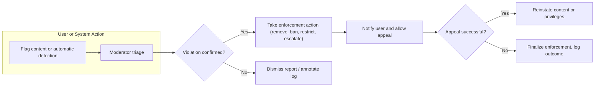

# Business Rules and Community Guidelines for Political/Economic Discussion Board

## Community Standards

### Purpose and Core Principles
THE discussionBoard SHALL provide a politically/economically neutral, respectful, inclusive, and evidence-based forum for discussion and knowledge-sharing.

THE discussionBoard SHALL hold all content and users to standards of factual accuracy, basic civility, and respect for legal/ethical norms.

WHEN users participate, THE discussionBoard SHALL promote open-minded debate without tolerance for hate speech, targeted harassment, or personal attacks.

### Code of Conduct (EARS Format)
- THE discussionBoard SHALL require all users to:
  - Refrain from personal insults, discriminatory language, and aggressive behavior.
  - Support factual assertions or controversial claims with reputable sources where possible.
  - Respect the privacy and anonymity of other users.
  - Avoid posting spam, advertising, or content unrelated to the forum’s topics.
- WHEN content is flagged or reported, THE discussionBoard SHALL require moderators to review and act within 24 hours.

### Inclusivity and Accessibility
- THE discussionBoard SHALL support diverse user backgrounds (political, economic, national, cultural, and linguistic).
- WHERE posts/comments cover sensitive or marginalized issues, THE discussionBoard SHALL apply heightened moderation scrutiny and extra protection for vulnerable groups.

## Posting and Commenting Rules

### Content Creation and Management
- WHEN a user creates a post or comment, THE discussionBoard SHALL validate the submission against a prohibited content list (hate speech, threats, misinformation, doxxing, copyright violations, illegal material).
- WHERE posts or comments are edited, THE discussionBoard SHALL record the edit history and enable moderators and admins to review past versions.
- IF a user seeks to delete their content, THEN THE discussionBoard SHALL anonymize or remove it except where legal retention is mandated.
- THE discussionBoard SHALL set comment length (min 1 character, max 3,000) and post title/description limits.
- IF content is excessively off-topic or deliberately derails a thread, THEN THE discussionBoard SHALL allow moderators/admins to archive or restrict it.
- WHEN a user is banned or suspended, THEN THE discussionBoard SHALL prevent content posting and commenting for the duration.

### Flagging, Editing, and Takedown
- WHEN a post or comment is flagged, THE discussionBoard SHALL notify moderators and require triage.
- WHEN moderator action is taken, THE discussionBoard SHALL log the action with responsible actor and timestamp (for auditability).
- IF content is found to violate standards, THEN THE discussionBoard SHALL allow moderators/admins to remove, redact, or annotate the material, and notify the user (with rights to appeal as applicable).

## Moderation Criteria and Procedures

### Moderator Scope
- THE discussionBoard SHALL empower moderators to act on any violating content, manage user reports, mediate disputes, and escalate to admins as required.
- WHERE content is escalated, THE discussionBoard SHALL require admin sign-off before permanent takedown or bans exceeding 30 days.

### Review and Enforcement (EARS)
- WHEN a moderator receives a report, THE discussionBoard SHALL require a response/decision within 24 hours or less.
- WHERE automated abuse detection triggers occur, THE discussionBoard SHALL require moderator or admin review before punitive action is finalized.
- IF multiple reports or high-severity violations occur, THEN THE discussionBoard SHALL lock further responses on the thread (rate-limiting, posting freeze).

### Appeals
- WHEN disciplinary action is taken, THE discussionBoard SHALL provide the affected user with a clear explanation and the opportunity for one appeal.
- IF an appeal is denied, THEN THE discussionBoard SHALL finalize the enforcement and record the resolution in a moderation log.

## Voting/Poll Manipulation Prevention

### Fairness Safeguards
- THE discussionBoard SHALL monitor for coordinated voting, spam/bot manipulation, and vote brigading via behavioral analytics and rate-limits (e.g., max votes per user/hour).
- WHERE suspicious voting patterns are detected, THE discussionBoard SHALL require manual moderator or admin review of the affected content.
- IF a user is found to be using multiple accounts to rig voting, THEN THE discussionBoard SHALL suspend the accounts and nullify the affected votes.
- WHEN poll results are published, THE discussionBoard SHALL include transparency statements about potential anomalies or moderation intervention.

## Legal and Ethical Considerations

### Compliance
- THE discussionBoard SHALL comply with all applicable laws (e.g., defamation, copyright, hate speech, privacy).
- WHERE jurisdictionally required, THE discussionBoard SHALL age-gate users or restrict access to certain threads/topics.
- IF law enforcement or court orders are received, THEN THE discussionBoard SHALL cooperate as required, within the scope of applicable regulations.

### Data and Privacy
- THE discussionBoard SHALL respect user privacy, not display personal details (emails, IP addresses, offline IDs) publicly, and permit users to delete or anonymize their accounts fully (subject to business/record retention needs).
- WHERE disturbing, graphic, or triggering content is involved, THE discussionBoard SHALL require warning labels and optional click-throughs (content warnings).

### Ethical Principles
- THE discussionBoard SHALL proactively discourage astroturfing, covert lobbying, and inauthentic amplification of viewpoints.
- THE discussionBoard SHALL require all political/economic organizations to declare affiliation when posting in any official capacity.

## Enforcement and Auditability
- THE discussionBoard SHALL maintain a complete log of moderation/administrative actions (action, actor, target, timestamp, and rationale).
- THE discussionBoard SHALL allow business stakeholders periodic access to compliance, incident, and audit reports.

## Diagram: Moderation and Rule Enforcement Flow

## Success Criteria
- THE discussionBoard SHALL publish all key business rules and guidelines to a permanently available public page.
- THE discussionBoard SHALL update and version these rules on a quarterly basis or in response to legal/best-practice changes.

For more details on technical enforcement and user roles, see the [User Roles and Authentication Requirements](./02-user-roles-and-authentication.md) and [Functional Requirements Document](./04-functional-requirements.md).