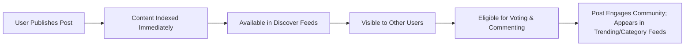
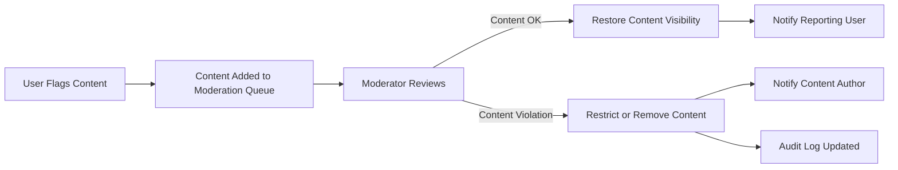

# Data Flow and Event Lifecycle for the discussionBoard Platform

## 1. Introduction

This document aims to define—in business terms—the complete lifecycle of data and system events for the discussionBoard, a political/economic discussion board. It is intended for the development team to understand how platform information is published, flows between users and system processes, what user-visible events exist, and how overall community engagement is measured and promoted.

## 2. Information Publishing and Discovery

- THE discussionBoard SHALL allow authenticated users to create posts that include text, optional media attachments, and tags.
- WHEN a post is published, THE discussionBoard SHALL make it discoverable in public feeds, category pages, and user profiles according to content visibility permissions.
- THE discussionBoard SHALL allow all visitors to browse and search public posts and comments, regardless of authentication status. Search results SHALL reflect access permissions.
- THE discussionBoard SHALL allow posts to be organized by categories, topics, and trending themes based on recent engagement.
- Posts and comments SHALL be indexed immediately on submission for visibility in discovery components.
- WHEN posts are edited or deleted by their authors (within allowed window), THE discussionBoard SHALL update or remove them from all relevant views in real time.
- IF a post is flagged or locked by moderators/admins, THEN THE discussionBoard SHALL restrict its discovery and include appropriate explanatory messages to users encountering it.

## 3. User Activity Events

### Posting and Commenting
- WHEN a registered user submits a new post, THE discussionBoard SHALL log the timestamp, author, and post metadata as a business event.
- WHEN a user comments on any post, THE discussionBoard SHALL associate and timestamp the comment as a child event of the referenced post.
- WHEN a user edits or deletes their post/comment (subject to retention rules), THE discussionBoard SHALL log the event and update platform displays accordingly.

### Voting and Polling
- WHEN a user participates in a vote or poll, THE discussionBoard SHALL record the action and update vote tallies instantly.
- THE discussionBoard SHALL prevent duplicate voting using user identity or session checks for each poll.

### Flagging and Reporting
- WHEN a user flags content (post or comment), THE discussionBoard SHALL record this activity and add the flagged content to a moderation review queue.
- IF a flagged item reaches a predetermined threshold, THEN THE discussionBoard SHALL automatically restrict its visibility and notify moderators.

### Moderation and Admin
- WHEN moderators/admins take an action (approve, suspend, escalate, delete), THE discussionBoard SHALL log the action, timestamp, responsible party, and context for auditability.
- IF a moderator restricts or suspends an account, THEN THE discussionBoard SHALL update the state of all related content and future actions appropriately.

## 4. Notification and Alert Triggers

- WHEN a user's post receives a reply, vote, or is flagged, THE discussionBoard SHALL notify the post's author depending on configured notification preferences.
- WHEN moderators take action on user-reported or user-authored content, THE discussionBoard SHALL notify all affected users, providing clear context and any available appeals options.
- WHEN significant system or policy changes occur, THE discussionBoard SHALL distribute system-wide alerts to affected user groups (users, moderators, admins).
- Users MAY personalize notification preferences, but legal/critical alerts SHALL always be delivered.

### Summary Table: Notification Triggers
| Trigger Event                 | Recipients            | Notification Channel(s)       |
|-------------------------------|----------------------|-------------------------------|
| New comment on user post      | Post author          | In-app, email (per setting)   |
| Post flagged                  | Post author/mods     | In-app, email (per setting)   |
| Moderator/admin action        | Relevant users       | In-app, email, dashboard      |
| Direct mention/tag            | Mentioned user       | In-app                        |
| System policy change          | All users/admins     | In-app, required banner/email |

## 5. Archiving and Retention Policies

- THE discussionBoard SHALL allow users to delete their own posts and comments, subject to retention and audit policies.
- WHEN a post/comment is deleted, THE discussionBoard SHALL de-list it from public views, but retain audit records for a minimum compliance period (e.g., 90 days) according to policy.
- WHEN a post/comment reaches the end of its active lifecycle, THE discussionBoard SHALL archive the content for long-term retention or statistics.
- Content flagged for legal, abuse, or policy reasons SHALL be retained based on compliance and platform regulations.
- User activity (creation, edits, deletions, reports, moderation events) SHALL be auditable for system integrity and dispute resolution.

## 6. Community Engagement Metrics

- THE discussionBoard SHALL track daily and monthly active users (DAU/MAU), new post/comment creation, voting activity, reporting/flagging events, and moderator/admin interventions as key engagement metrics.
- WHEN users participate in discussions, votes, or report content, THE discussionBoard SHALL increment relevant engagement counters for analytics.
- THE discussionBoard SHALL measure user retention, post reach (views), and response times to user actions (e.g., comment replies, moderation responses).
- Regular reports and dashboards SHALL be available for admins to monitor engagement health and identify trends in activity or abuse.
- Persistent low engagement posts/threads MAY be considered for algorithmic archiving or added promotion in discovery.

## 7. Mermaid Diagrams

### Information Flow (Publishing & Discovery)

### Event Lifecycle (Moderation & Notification)

## 8. Conclusion

The discussionBoard platform supports a lifecycle in which information is rapidly published, discovered, and acted upon through posting, commenting, voting, and reporting events. Key user and moderation actions trigger notifications designed to keep all parties engaged and informed, while archiving and retention policies ensure regulatory compliance and business continuity. Community engagement is measured through participation, content reach, and actions taken, enabling data-driven improvements over time. This business requirements framework leaves technical design and implementation details to the development team.