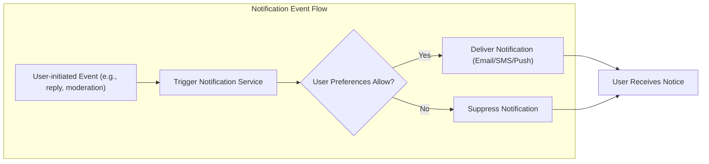
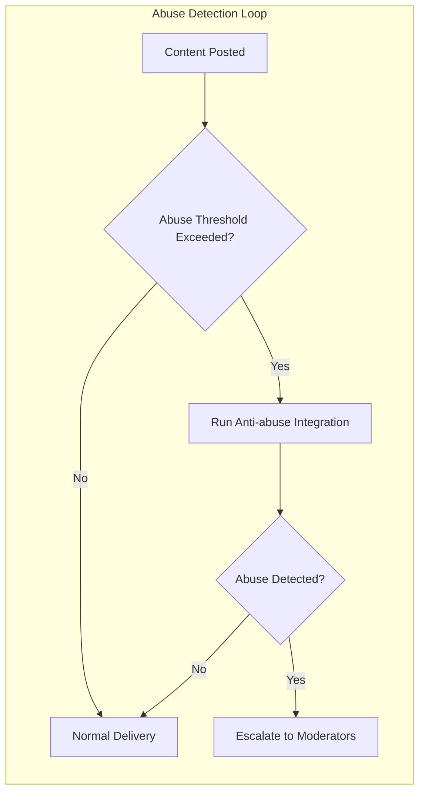

# External Integrations Requirements for Political/Economic Discussion Board

## Introduction
This document specifies the business requirements, business logic, and user-facing scenarios for all external integrations supporting the discussBoard service. Integrations in scope include notifications (email, SMS), analytics, abuse detection, and partner APIs. Requirements are stated for backend implementation in EARS format wherever possible, always in business terms with a focus on reliability, privacy, and compliance. No technology choices or vendor names are included.

## Notification Services

### Email Notifications
- WHEN a user registers a new account, THE discussBoard SHALL send a welcome email with account activation instructions.
- WHEN a member requests a password reset, THE discussBoard SHALL send a password reset email containing a secure, time-limited link.
- WHEN a member receives a direct reply to their post or comment and has not disabled notifications, THE discussBoard SHALL notify the user by email.
- WHEN moderators or administrators issue a warning, ban, or other disciplinary action, THE discussBoard SHALL send a notification email to the affected member with details of the action.

### SMS/Push Notifications
- WHERE mobile phone numbers are provided and user opts in, THE discussBoard SHALL send SMS notifications for critical events (e.g., account changes, urgent moderation actions).
- WHEN a mobile app exists, THE discussBoard SHALL send push notifications for replies, mentions, or direct messages, provided user preferences permit.

### Notification Routing and Frequency
- THE discussBoard SHALL support per-user notification preferences enabling users to opt in, opt out, or customize delivery channels for each event type.
- IF a user disables a notification type, THEN THE discussBoard SHALL suppress those notifications for that user.
- WHERE excessive notification delivery is detected (e.g., more than 3 posts/comments from same thread in 10 minutes), THE discussBoard SHALL batch subsequent notifications into a digest within 15 minutes.

### User Notification Preferences
- THE discussBoard SHALL enable all authenticated users to review and update their notification preferences via account settings.
- WHEN a user changes their email, phone number, or channel preferences, THE discussBoard SHALL immediately update notification routing to reflect that change.

## Analytics and Metrics

### Event Tracking
- THE discussBoard SHALL log core user actions, including user registration, successful logins, post creation, comment creation, reactions, content reports, and moderation actions.
- WHEN significant actions occur (such as account creation or content moderation), THE discussBoard SHALL record event metadata relevant to business analytics (user role, timestamp, context of action).

### Engagement and Usage Metrics
- THE discussBoard SHALL aggregate anonymized metrics for daily/weekly/monthly active users (DAU/WAU/MAU), post/comment/reaction volumes, and report rates.
- WHEN patterns indicating increased engagement or sudden drop-off are detected, THE discussBoard SHALL flag these events for analysis by administrators.

### Privacy and Data Handling
- IF a user requests analytics data erasure as part of account deletion, THEN THE discussBoard SHALL delete or anonymize all tracked events linked to that user within 48 hours.
- WHERE analytics integrations exist, THE discussBoard SHALL ensure that no personal data is sent to third-party analytics without user consent and data minimization.

## Abuse Detection and Mitigation

### Anti-abuse Tool Integrations
- WHEN content submission exceeds defined thresholds for frequency (e.g., more than 5 posts or 10 comments per hour), THE discussBoard SHALL trigger anti-abuse checks (e.g., bot detection, content analysis).
- WHERE partner anti-abuse systems are integrated, THE discussBoard SHALL forward content or behavioral data flagged as suspicious for automated review.
- IF abuse is detected (e.g., via third-party, algorithmic, or manual reports), THEN THE discussBoard SHALL escalate the incident for moderator or administrator intervention and log the full event chain.

### Automated Moderation Support
- THE discussBoard SHALL support hooks for automated moderation (e.g., profanity filtering, spam detection) via external systems, subject to role-based rules (e.g., moderators may override recommendations).
- WHEN a moderation action is taken as a result of automated detection, THE discussBoard SHALL notify the relevant user and document the specific triggering reason.

### Reporting and Feedback Loops
- WHEN a member or moderator reports potentially abusive content, THE discussBoard SHALL confirm receipt of the report to the reporter via their preferred notification channel.
- THE discussBoard SHALL keep a full audit trail of actions taken in response to abuse or policy violations, accessible by moderators and administrators.

## APIs and Partner Integrations

### Supported External APIs
- WHERE integration is permitted by policy, THE discussBoard SHALL support sending or receiving data from trusted external services for the purpose of enhancing features such as social sign-in, content enrichment, or notifications.
- WHEN an external partner requests data sharing, THE discussBoard SHALL require explicit user consent and compliance with all privacy settings.

### Data Import/Export and Compliance
- THE discussBoard SHALL enable users to export their posts, comments, and account data in a machine-readable format, triggered solely by user request.
- WHEN a user requests data import from a trusted partner service, THE discussBoard SHALL prompt for re-authentication and provide status updates until completion or failure.
- IF an integration fails or is interrupted, THEN THE discussBoard SHALL report error status to the user and allow retry or issue support ticket instructions.

### Third-party Partner Workflows
- THE discussBoard SHALL maintain an allowlist of verified external partners authorized for integration.
- WHERE workflows require partner coordination (e.g., cross-site moderation, shared anti-abuse lists), THE discussBoard SHALL log all actions and respect ticketing/escalation protocols as defined by policy.

## Integration Error Handling and Recovery
- IF notification delivery to an external service fails (e.g., email not sent, SMS rejected), THEN THE discussBoard SHALL retry up to three times within 24 hours and log all failures.
- IF persistent integration errors occur, THEN THE discussBoard SHALL notify administrators by internal alert and provide a summary log.
- THE discussBoard SHALL allow users to view recent integration-related failures and contact support.

## Business Compliance Considerations
- THE discussBoard SHALL ensure all integrations comply with applicable data protection and privacy laws (e.g., user consent, right to erasure, restrictions on international transfers).
- WHERE integration requires personal data transfer, THE discussBoard SHALL require minimum necessary data only, and prompt for user consent unless exempted by law.

## Summary of Integration Responsibilities by Role

| Action/Integration                | Guest | Member | Moderator | Administrator |
|-----------------------------------|:-----:|:------:|:---------:|:-------------:|
| Receive system notifications      |   ❌  |   ✅   |    ✅     |      ✅       |
| Send abuse reports                |   ❌  |   ✅   |    ✅     |      ✅       |
| Access analytics dashboard        |   ❌  |   ❌   |    ✅     |      ✅       |
| Configure integration settings    |   ❌  |   ❌   |    ❌     |      ✅       |
| Manage user notification prefs    |   ❌  |   ✅   |    ✅     |      ✅       |
| Approve/authorize partner APIs    |   ❌  |   ❌   |    ❌     |      ✅       |

## Diagrams and Workflows

# End of Document
