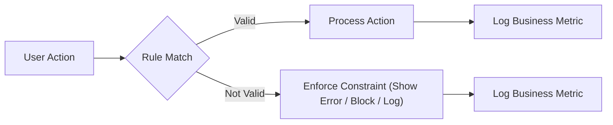

# Business Rules and Metrics for Political/Economic Discussion Board

## General Business Rules

- THE platform SHALL serve as an open forum for respectful, informed political and economic debate and discussion.
- THE platform SHALL provide clearly stated community guidelines that all users must follow.
- THE platform SHALL prioritize civil discourse and prohibit ad hominem attacks, hate speech, incitement to violence, and misinformation, as defined by site policies.
- THE platform SHALL support fair access for all users within their assigned roles (guest, member, moderator, administrator).
- WHEN users violate community standards, THE system SHALL escalate moderation actions according to violation severity and user history.
- WHERE posts or comments are reported multiple times or by moderators, THE system SHALL temporarily restrict visibility pending review.
- THE platform SHALL maintain transparency in moderation with clear feedback to both reporters and users subject to action.
- THE system SHALL enforce role-based access so that only permitted actions are visible and executable at any point.
- THE platform SHALL encourage constructive feedback, fact-based argumentation, and refraining from personal information disclosures beyond what is necessary for account operation.

## Validation and Constraint Logic

### Account Management
- WHEN users register, THE system SHALL validate that emails comply with RFC 5322 and are globally unique.
- WHEN members create passwords, THE system SHALL require a minimum of 10 characters including at least one uppercase, one lowercase, one number, and one special character.
- IF email verification is incomplete after 24 hours, THEN THE system SHALL restrict posting and commenting functions until verification is complete.
- WHEN users repeatedly fail login attempts (5 within 10 minutes), THE system SHALL temporarily lock the account for 15 minutes.
- IF a user is banned or suspended, THEN THE system SHALL prevent login, posting, commenting, and account modification for the suspension duration.
- WHERE a user requests account deletion, THE system SHALL require confirmation and permanently redact personal data within 30 days, except data needed for legal compliance.
- WHEN a user requests a password reset, THE system SHALL verify user ownership via email confirmation BEFORE permitting new password entry.

### Posts and Comments
- WHEN a member creates a post, THE system SHALL require a title (minimum 8 characters, maximum 120), body content (minimum 50, maximum 10,000 characters), and assign a unique post ID.
- WHEN a member edits a post or comment, THE system SHALL permit editing only within 30 minutes of original submission.
- WHERE edits occur, THE system SHALL maintain a visible edit log to other users.
- WHEN posts or comments are deleted by their authors, THE system SHALL permanently remove the content from public view but retain a record for moderation for 90 days.
- IF a post or comment is reported more than 3 times within 24 hours, THEN THE system SHALL immediately flag content for moderator review and restrict further interaction.
- WHEN a member adds a comment, THE system SHALL require a minimum of 3 and maximum of 1,000 characters.
- IF posts or comments contain prohibited media (e.g., violent, graphic, or illegal content as defined in guidelines), THEN THE system SHALL prevent upload and alert moderators.
- IF duplicate posts (same content within 5 minutes) are submitted, THEN THE system SHALL notify the user and block additional posting.
- WHERE users repeatedly submit spam or unsolicited links, THE system SHALL restrict posting privileges for 24 hours and escalate for moderator review.

### Moderation and Reporting
- WHEN a moderator receives a report, THE system SHALL display all related history for the reported content and user.
- THE system SHALL record all moderation actions with timestamps, responsible moderator, action taken, and rationale, and retain these logs for 365 days for audit.
- IF a moderator or administrator reverses a moderation action, THEN THE system SHALL notify the affected user and provide a reason.
- THE system SHALL cap moderator-initiated bans to 30 days unless escalated to an administrator for indefinite or extended suspension.
- WHERE multiple moderators disagree on an action, THE system SHALL escalate resolution to an administrator.
- IF a user files an appeal after a moderation action, THEN THE system SHALL provide a formal appeal interface and record the outcome.

### Miscellaneous Platform Constraints
- THE system SHALL automatically filter and block vulgarity and known slurs using a regularly updated keyword list prior to post or comment publication.
- WHEN server load or API response time exceeds 2 seconds, THE system SHALL display a generic system busy message and queue non-critical requests.
- WHERE DDoS or automated attack signatures are detected, THE system SHALL temporarily restrict registration, posting, and commenting while displaying appropriate system status notifications.
- THE system SHALL adhere to legal requirements for user data retention, copyright, and content takedown on valid requests (see [Security and Privacy Requirements](./07-security-and-privacy-requirements.md)).

## KPIs and Metrics for Success

- THE platform SHALL track and report the following metrics as part of weekly and monthly business reviews:
  - Daily Active Users (DAU), Weekly Active Users (WAU), and Monthly Active Users (MAU)
  - Average session duration and pages per session
  - Post and comment creation rates per user segment (guest-to-member conversion, member retention)
  - Moderator and administrative intervention rates
  - Time to resolution for reported content (average and 95th percentile)
  - Number and outcome of moderation appeals
  - Churn (number and rate of permanent account deletions per period)
  - Community guideline compliance rate (ratio of reported content to total content)
  - Incident rates for rule violations, spam, and inappropriate content
  - Engagement score (aggregate weighted score of likes/dislikes/comments per post)

- THE system SHALL provide ongoing metric dashboards with configurable date ranges and segment filters to administrators and product managers.
- WHERE anomalous trends (e.g., sudden spike in reports or churn) are detected, THE system SHALL notify relevant administrators with suggested follow-up actions.
- THE platform SHALL make anonymized metrics available for periodic external publishing, ensuring compliance with privacy rules.

## Visualizations

## References and Consistency
- For security, privacy, and legal obligation business rules, see the [Security and Privacy Requirements](./07-security-and-privacy-requirements.md).
- Role-based access logic is detailed in the [User Roles and Permissions Specification](./03-user-roles-and-permissions.md).
- Moderation process flows are further documented in the [Moderation and Enforcement Policy](./06-moderation-and-enforcement.md).
- For definition of DAU/WAU/MAU and retention calculation, refer to [Non-Functional Requirements](./08-non-functional-requirements.md).

