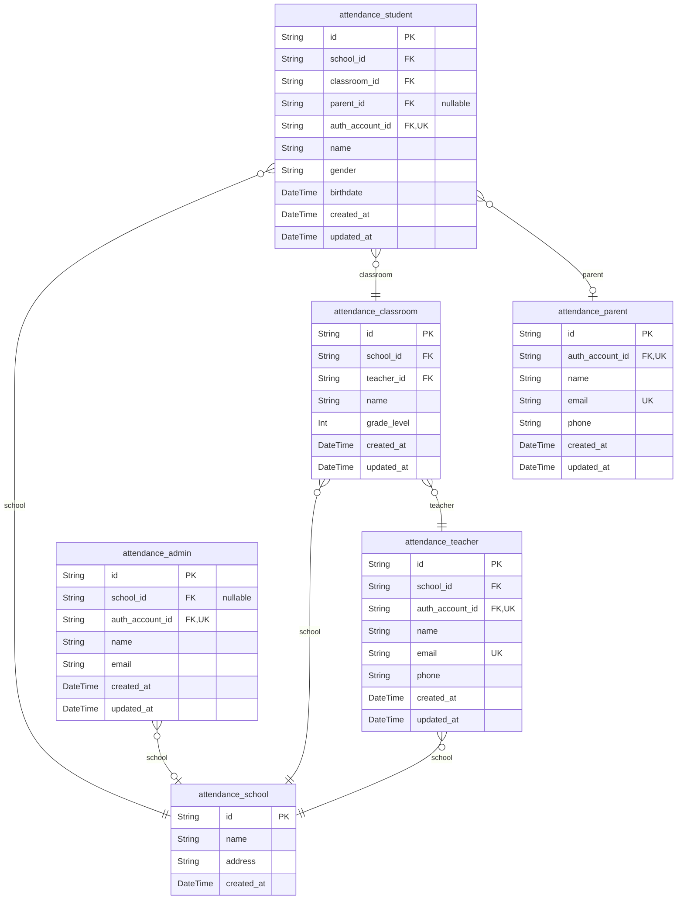
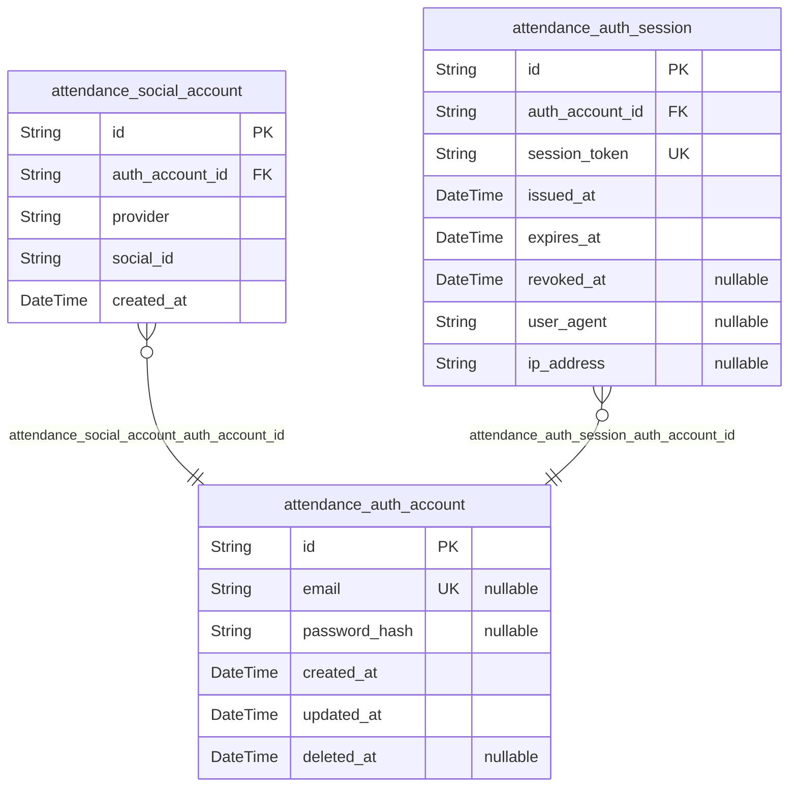
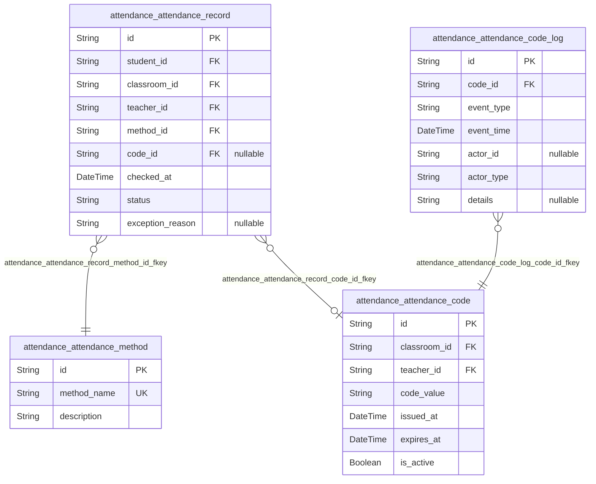
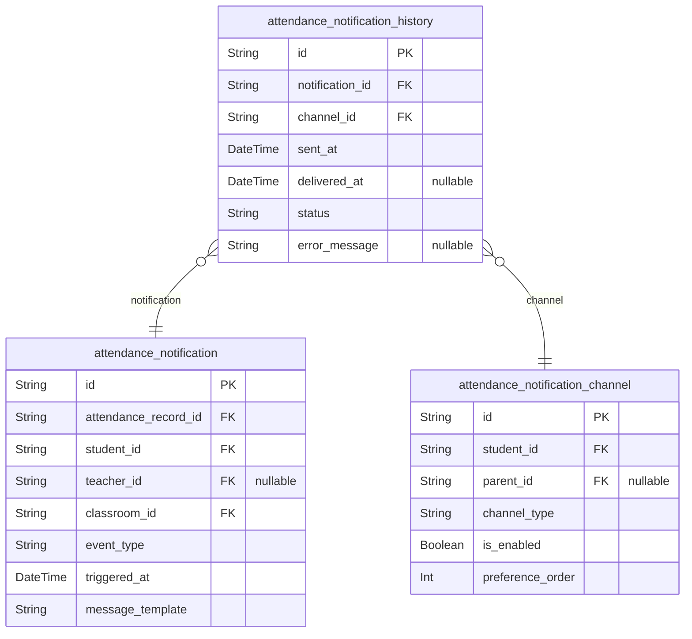
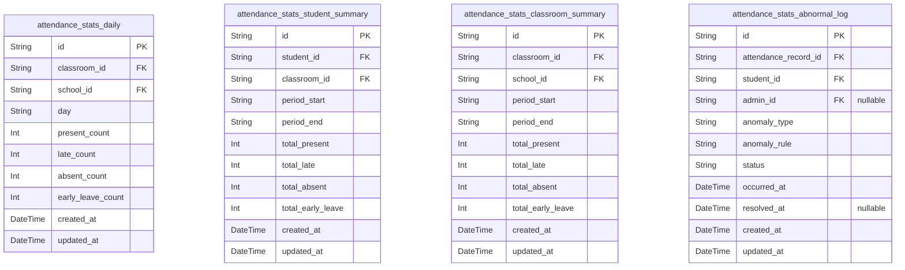
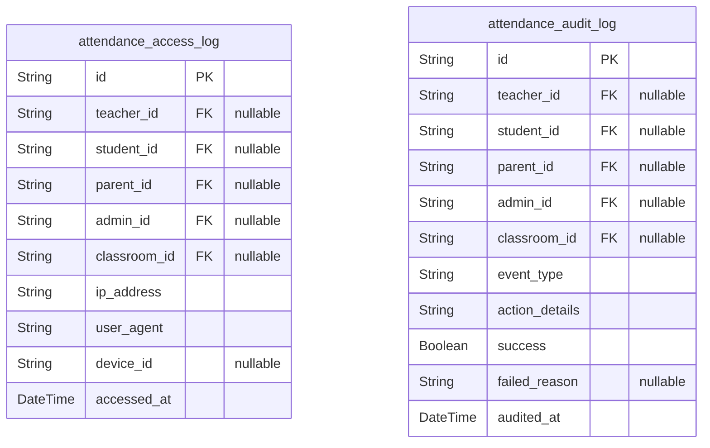

# Prisma Markdown

> Generated by [`prisma-markdown`](https://github.com/samchon/prisma-markdown)

- [AttendanceCore](#attendancecore)
- [AttendanceAuth](#attendanceauth)
- [Attendance](#attendance)
- [AttendanceNotification](#attendancenotification)
- [AttendanceStatsDashboard](#attendancestatsdashboard)
- [AttendanceAuditLog](#attendanceauditlog)

## AttendanceCore

### `attendance_teacher`

[Teacher Entity] - Implements the teacher role (02_attendance_user_roles.md 3.1, 3.4). Core info for faculty with attendance management privileges. Strict 3NF: atomic, normalized, all references via FKs, with audit and unique constraints for email, and TPT-style auth reference.

Properties as follows:

- `id`: [Primary Key] - Unique teacher identifier. Used for all references/joins.
- `school_id`: [School Foreign Key] - Links to attendance_school. 3NF, required.
- `auth_account_id`: [Auth Account FK] - 1:1 with attendance_auth_account. Role/account separation for security.
- `name`: [Teacher Name] - Atomic, normalized. No derived values.
- `email`: [Teacher Email] - Unique contact, atomic, not calculated.
- `phone`: [Phone] - Direct contact, fully normalized.
- `created_at`: [Created At] - Record creation timestamp for audit.
- `updated_at`: [Updated At] - Modification timestamp for audit.

### `attendance_student`

[Student Entity] - Implements the normalized student role (02_attendance_user_roles.md 3.2). Only atomic fields and foreign keys. Never use derived or denormalized student statistics in this table.

Properties as follows:

- `id`: [Primary Key] - Unique student identifier.
- `school_id`: [School Foreign Key] - Reference to attendance_school. Required, 3NF.
- `classroom_id`: [Classroom Foreign Key] - Student's assigned class. 3NF, required.
- `parent_id`: [Parent Foreign Key] - Many students:one parent. Nullable for orphans/imports.
- `auth_account_id`: [Auth Account FK] - 1:1 mapping to attendance_auth_account. No duplication.
- `name`: [Student Name] - Atomic. Do not concatenate or calculate.
- `gender`: [Gender] - Normalized, atomic string field ("male"/"female").
- `birthdate`: [Birthdate] - ISO datetime, atomic, not aggregated. For stats/age calc elsewhere.
- `created_at`: [Created At] - Student record timestamp for audits.
- `updated_at`: [Updated At] - Audit timestamp for record changes.

### `attendance_parent`

[Parent Entity] - Implements the guardian/parent role (02_attendance_user_roles.md 3.3). All data atomic, no denormalization. Parent mapped to one or more students, with atomic contact and strict FK for login account.

Properties as follows:

- `id`: [Primary Key] - Parent/guardian identity, referenced by students.
- `auth_account_id`: [Auth Account FK] - 1:1 parent authentication mapping.
- `name`: [Parent Name] - Guardian full name, atomic.
- `email`: [Email] - Unique, atomic for notifications.
- `phone`: [Phone] - Direct, atomic for alerts/SMS.
- `created_at`: [Created At] - Audit for addition/linkage.
- `updated_at`: [Updated At] - Info change audit.

### `attendance_admin`

[Admin Entity] - Implements the administrator/official/inspector (02_attendance_user_roles.md 3.4/3.5). All info atomic/normalized. Reference to school is nullable to allow super-admins. Strict 1:1 login account linkage.

Properties as follows:

- `id`: [Primary Key] - Unique admin/official identifier.
- `school_id`: [School Foreign Key] - Admin's school/responsibility. Nullable for system/global admin.
- `auth_account_id`: [Auth Account FK] - 1:1 with attendance_auth_account. Required for audit integrity.
- `name`: [Admin Name] - Atomic, for contact/logging.
- `email`: [Admin Email] - For contact, atomic, not derived.
- `created_at`: [Created At] - Audit for admin creation.
- `updated_at`: [Updated At] - Audit for admin changes.

### `attendance_school`

[School Entity] - Implements school/unit reference (design intro & anchor table). Atomic fields for school identification/address, used as FK for other entities. Never contains denormalized stats.

Properties as follows:

- `id`: [Primary Key] - School identifier.
- `name`: [School Name] - Atomic, normalized for directory/search.
- `address`: [School Address] - Complete address, atomic single field.
- `created_at`: [Created At] - School record creation, audit only.

### `attendance_classroom`

[Classroom Entity] - School/class grouping (anchor for rosters, stats). 3NF, atomic: no summary/calculation fields. Lead teacher required via FK for accountability.

Properties as follows:

- `id`: [Primary Key] - Classroom identifier.
- `school_id`: [School Foreign Key] - 3NF, classroom's school owner.
- `teacher_id`: [Lead Teacher FK] - Responsible teacher. 3NF, required (not derived from class roster).
- `name`: [Classroom Name] - Label for class listing/selection, atomic.
- `grade_level`: [Grade Level] - Integer grade for grouping/stats. Normalized.
- `created_at`: [Created At] - Classroom creation time.
- `updated_at`: [Updated At] - Record update time.

## AttendanceAuth

### `attendance_social_account`

[OAuth2/Social Account Mapping] - This implements the social login integration requirement from the requirements analysis (see '소셜 로그인 및 사용자 역할별 이용 흐름', '07_attendance_auth_social_login.md').

Handles external identity linkage (Google, Naver, etc.) with strict separation from core attendance/role tables. Maintains full 3NF by storing only atomic fields, no denormalized or computed values. 

For example, when a student logs in with a Google or Naver account, the external provider/user key and internal auth user are mapped here.

Key relationships: Must be connected to attendance_auth_account via auth_account_id. There is no direct connection to role-specific tables (teacher/student/parent/admin) for normalization. Special behaviors: Each (provider, social_id) pair is globally unique, and each auth_account_id may have multiple social accounts for cross-platform linking.

Properties as follows:

- `id`: [Primary Key] - Implements the requirement for system-wide unique identification. Uniquely identifies a single social account link. Atomic, non-derivable, auto-generated UUID.
- `auth_account_id`: [Authentication Account FK] - Links to the local core authentication account that this social account is mapped to. Ensures strict 3NF, never storing redundant user data.
- `provider`: [Social Provider Name] - Implements the '인증 제공자 종류' requirement. Stores provider key (e.g. 'google', 'naver', 'kakao'). Only atomic provider keys, never human readable names.
- `social_id`: [Provider-side User ID] - The unique identity issued by the external provider. Implements the external identity mapping requirement without redundancy, strictly atomic.
- `created_at`: [Linkage Timestamp] - Records the link creation UTC time (membership via social account). For evidence, never update or delete, only append new link if needed.

### `attendance_auth_account`

[Authentication Account] - This implements core authentication/account management from multiple requirements (see '소셜 로그인 및 인증 연동 설계', '07_attendance_auth_social_login.md').

Purpose: Represents a single login identity, potentially linked to one or more user roles (student/teacher/parent/admin) but is not itself a 'user' table. Stays in full 3NF by not containing denormalized role or profile data. For example, a parent may have multiple social logins mapped in attendance_social_account but still have one core login account here.

Key relationships: Links to role-specific tables (attendance_teacher, attendance_student, attendance_parent, attendance_admin) via FKs FROM those tables, never the other way. Special behaviors: Email is only used for communication/identification if local login is supported. Soft deletion via deleted_at, never hard delete.

Properties as follows:

- `id`: [Primary Key] - Implements unique identity across all authentication schemas.
- `email`: [Email] - Optional field for local auth/notification. Must be unique if specified. Null for pure social logins.
- `password_hash`: [Password Hash] - Implements local account login. Null for accounts only using social login. Always store hashed, never cleartext.
- `created_at`: [Creation Timestamp] - When the authentication account was created. Never updated.
- `updated_at`: [Last Updated Time] - For profile info or recovery. Update whenever account details change. For evidence/audit.
- `deleted_at`: [Soft Delete Marker] - When account is deactivated/marked deleted. Null = active; non-null = no login permitted. Keeps history for audit evidence.

### `attendance_auth_session`

[Session Token Management] - This implements OAuth2 session/static/token management (see 'API 인증 및 권한', '08_attendance_api_design.md').

Purpose: Tracks live/issued authentication sessions (JWTs, scopes, expiration). 3NF by not including calculated/denormalized fields (e.g. profile email, role, permissions).

For example, upon login, a session token is issued and tracked here, with linkage to auth_account_id. Used for forced invalidation or JWT refresh flows.

Key relationships: Linked to attendance_auth_account via FK, for query of active/inactive sessions per account. Special behaviors: On logoff, session is marked as revoked_at instead of hard deletion for audit chain. 

Properties as follows:

- `id`: [Primary Key] - Unique identifier of the auth session. Required for linking sessions for audit purposes, strict 3NF; atomic.
- `auth_account_id`: [FK: Auth Account] - Links session to login identity. For example, querying all sessions for a given account. Not unique (1:N).
- `session_token`: [Session Token] - Persisted JWT or opaque token. Atomic and strictly not reused in multiple records. Never denormalized profile or calculated data.
- `issued_at`: [Issue Time] - UTC creation of the session. Never updated.
- `expires_at`: [Expire Time] - When the token or session is no longer valid. Value set according to OAuth2 flow. Never calculated in table, only stored.
- `revoked_at`: [Revoke Time] - Non-null when session is explicitly ended (logout, forced expire, etc.). Null means active session. Do not delete for audit.
- `user_agent`: [User Agent Info] - Optional: Stores string identifying device or client info for session context. Useful for audit. 3NF compliant, atomic field only.
- `ip_address`: [IP Address] - Optional: Source IP of session creation. Needed for anomaly detection, audit. Never stores other calculated network info.

## Attendance

### `attendance_attendance_record`

Attendance Record - This implements tracking each student's attendance submission for all required classes/sessions, fulfilling the requirement for verifiable and auditable attendance management as described in the documentation (see attendance check flow, teacher dashboard requirements).

This table maintains a normalized, atomic log of all individual attendance checks, each with explicit references to students, teachers, classrooms, and attendance codes (if code-based). 3NF is upheld by ensuring all non-key attributes are fully dependent on the attendance record's identity, with no derived or calculated data. Example: Each submission (present, late, absent, leave) with its metadata and linked code is recorded here for query, audit, and reporting.

Key relationships: Links to students (attendance_student), classes (attendance_classroom), teachers (attendance_teacher), attendance methods (attendance_attendance_method), and attendance codes (attendance_attendance_code, optional).
Special behaviors: All changes (corrections, exceptions) result in a new record or a state change, never mutation in place. No duplicate attendance for the same student/session is allowed (enforced by unique index).

Properties as follows:

- `id`: Unique primary key for each attendance record entry. Implements requirement for uniqueness and auditability. Atomic and canonical - no semantic meaning. Example: Used as main reference in logs/audit.
- `student_id`: Linked attendance_student.id - Which student this record represents. Fulfills the need to query per-student attendance for dashboards, parent notifications, etc. Maintains 3NF by using atomic FK. Always required.
- `classroom_id`: Linked attendance_classroom.id - The class/lesson this attendance is for. Implements requirement to support per-class reporting and entrance filtering. Maintains normalized relationships.
- `teacher_id`: Linked attendance_teacher.id - Teacher responsible for the attendance check. Needed for audit trails, permission checks, dashboard. Maintains normalized structure.
- `method_id`: Linked attendance_attendance_method.id - The method the student used to check attendance (code, QR, manual, API, etc.), realizing the system's need to track how attendance was registered. Required, normalized to support method lookups and stats.
- `code_id`: Linked attendance_attendance_code.id (Nullable) - If attendance was submitted using a code, this references the code used, fulfilling the audit and fraud prevention requirement. Optional as not all sessions may use code-based attendance.
- `checked_at`: The timestamp when the student checked in (local TZ). Implements need for audit, lateness/absence resolution. Normalized and atomic. Example: Used for attendance time window checks.
- `status`: Attendance status (e.g., present, late, absent, leave). Implements the business need for granular tracking. Normalized - valid options constrained via application/business layer. Example: 'present', 'late'.
- `exception_reason`: Free text; optional reason for abnormal status (if any). Ex: "Sick leave note from parent". Implements exception tracking requirement as per teacher/admin needs. 3NF: No encoding, just atomic explanatory string.

### `attendance_attendance_code`

Attendance Code - This table realizes the requirement for randomly generated, per-session attendance codes to be distributed by teachers and used by students (see attendance check flow and code-based authentication requirement).

Fully normalized: each code record is atomic, generated for only one classroom & session, no extra calculated fields. For example, prevents code reuse and enables auditability.

Key relationships: Linked to classroom (attendance_classroom), teacher (attendance_teacher). Snapshots/audit handled via code log table.

Properties as follows:

- `id`: Primary key. Uniquely identifies each attendance code generated. Atomic, normalized (no semantic encoding).
- `classroom_id`: FK to attendance_classroom. The class this code is issued for. Required for context, per requirements (teacher dashboard, stats). 3NF compliance: atomic value.
- `teacher_id`: FK to attendance_teacher. Teacher who created this code. Needed for audit and fraud prevention (and per teacher dashboard). 3NF by reference.
- `code_value`: Attendance code value (e.g., 'K8F9Z4'). Implements the actual code distributed to students. Constrained at application level (capital alphanum, fixed length per requirement). 3NF - no encoding, atomic.
- `issued_at`: Issuing time (when created by teacher/dash/API). Needed for audit, stats dashboard, validation window. Example: Used for checking code validity period.
- `expires_at`: Timestamp when this code expires and becomes invalid. Business-driven requirement for fraud/liability. No calculation here (which is done at app/backend level).
- `is_active`: Flag set true if code is currently valid, false if expired or revoked. Implements business logic of code lifecycle.

### `attendance_attendance_code_log`

Attendance Code Log - Implements the audit/snapshot pattern for attendance code creation and usage. Required for both technical and legal audit (who made, who used, when, and from where), per system requirements for auditability, fraud tracing, and compliance.

Each entry is atomic, attached to a specific attendance code. 3NF compliance ensured by FK and atomic fields; all calculated/aggregated data in materialized view tables only.

Key relationships: Linked to the attendance_attendance_code it logs.

Special behavior: Immutable log. New record per event.
Example usage: Logging all access, creation, use attempts, and state changes to code (issued, used, expired, revoked, etc.).

Properties as follows:

- `id`: Primary key. Uniquely identifies each code log event. Enables chronological and entity-specific log queries. Atomic pointer.
- `code_id`: FK to attendance_attendance_code. Exactly which code this event is related to. 3NF: Only FK, no encoding.
- `event_type`: Event type (issued, used, expired, revoked, failure, etc.). Implements business need for distinguishing code lifecycle and possible abnormal usage. Normalized and atomic.
- `event_time`: Timestamp for when this event occurred (code creation/use/expire). Needed for indisputable audit. 3NF: atomic time point.
- `actor_id`: UUID of the actor who triggered the event (could be teacher, student, system). Implements actor traceability per audit requirement. Cast/foreign key checks managed at application level, since polymorphic.
- `actor_type`: Who or what type initiated (teacher, student, admin, system process). Required for full trace. 3NF. Example: 'student'.
- `details`: Optional free text for contextual event note (e.g.: IP, device info, error trace). Useful for advanced audit/troubleshooting. Null when none.

### `attendance_attendance_method`

Attendance Method Master - Implements the normalization of all possible mechanisms by which attendance is recorded, per the requirements to enable dynamic addition/processing of new attendance types without disrupting the core data model and for analytics (teacher dashboard, admin stats).

This is a static/master data table holding the canonical list of valid attendance check methods (e.g., code input, QR scan, manual teacher entry, API, NFC). 3NF: only atomic fields.

Key relationships: Referenced from attendance_attendance_record for query, UI, and analytics.
Special behaviors: Application layer manages allowed method list and expansion.
Example: Used to normalize 'method_id' in other tables.

Properties as follows:

- `id`: PK. Canonical ID of the method. Ensures normalization & referential integrity.
- `method_name`: Display label / code for method (e.g. "CODE", "QR", "MANUAL"). Atomic value fulfilling 3NF. Used in UI/config. Example usage: show available methods in teacher dashboard.
- `description`: Explanation of what this method means or how it works. Fulfills need for self-described method catalog/master table. Example: '6-digit random code input by student on web/mobile.'

## AttendanceNotification

### `attendance_notification`

[Attendance Notification] - This implements requirements from '학부모 알림 서비스', '관리자/교사 실시간 통지', and '학생 출석 이벤트 발생 시 알림 자동 발송' in the requirements document.

This table acts as the master record for all scheduled or triggered notifications sent to parents, admins, or other interested parties related to attendance events (출석, 지각, 결석, 조퇴, 등). Maintains full 3NF normalization by separating channel-specific, delivery, and logging details to related tables. For example, when a student's attendance is recorded, a record is created here, traceably triggering one or more outbound notifications via allowed channels.

Key relationships: Linked to attendance_notification_channel for channel management, attendance_notification_history for delivery logging, and foreign keys referencing the event source (attendance_record, student, etc.).
Special behaviors: Only stores normalized trigger/event data, never caches actual delivery results—those are kept in the history table.

Properties as follows:

- `id`
  > [PK] - Implements unique identification for each notification event.
  > Globally unique identifier for tracking and referencing attendance-related notifications. Ensures normalization and system-wide traceability.
  > For example, used as a foreign key in notification channels and history records.
- `attendance_record_id`
  > [FK] - Implements linkage to the attendance event that caused this notification.
  > Links back to the student's attendance record so full audit trail is retained.
  > For example, notification references a specific student's daily check-in/absence event.
- `student_id`
  > [FK] - References attendance_student.
  > Specifies which student this notification relates to. Maintains 3NF by not duplicating student attributes here; join as needed.
  > For example, so parent notifications are correctly directed.
- `teacher_id`
  > [FK] - References attendance_teacher.
  > Who triggered the event/notification (if applicable). Maintains 3NF by not duplicating teacher details.
  > Useful for teacher-determined notifications or exception notes.
- `classroom_id`
  > [FK] - References attendance_classroom.
  > Facilitates filtering/group notification by classroom context. Maintains normalization.
  > For example: Notifications related to whole class events.
- `event_type`
  > [Event Type] - Implements notification event typing.
  > Enumerates triggers such as 'present', 'late', 'absent', 'leave'. Maintains normalization by not duplicating status logic elsewhere.
  > For example: 'present' when a student checks in on time.
- `triggered_at`
  > [Triggered Timestamp] - When this notification event was generated.
  > Ensures auditability and sequential event tracking.
  > For example: Record created at the moment attendance is submitted.
- `message_template`
  > [Message Template] - Stores the notification template used for this event.
  > Does not store actual sent message (see history table). Maintains normalization.
  > For example: A message like '홍길동 학생이 정상 출석하였습니다.' with placeholders.

### `attendance_notification_channel`

[Attendance Notification Channel] - Implements requirements for '선호 채널 설정', '알림 방식(앱푸시/SMS/이메일 등) 관리', and '보호자별/학생별 알림 경로 분리 관리' from the requirements document.

This model manages the available notification delivery channels (push, sms, email, etc.), user-specific preferences, and active/disable settings for outbound messaging. Maintains full 3NF by relating to student, parent, and notification tables without duplicating recipient or contact data.

Key relationships: References student, parent, and notification tables for proper channel delivery. Does not store message delivery results (see history).
Special behaviors: Only the facts about allowed or preferred channels are kept here; status/results are always kept in the history table.

Properties as follows:

- `id`
  > [PK] - Unique identifier for each channel binding.
  > Enables reliable foreign key referencing and traceability across the system.
  > For example, maps each channel preference to notifications and history tables.
- `student_id`
  > [FK] - References attendance_student, to route per-student preferences.
  > Maintains normalized storage of channel logic without duplicating student or parent info.
  > Allows lookups of a student's preferred notification channel.
- `parent_id`
  > [FK] - References attendance_parent, maps to legal guardians/recipients.
  > For multi-child parents, allows consolidation of notification channel entries per student.
  > Does not duplicate parent contact—always join on FK.
- `channel_type`
  > [Channel Type] - Defines the type of channel (app_push, sms, email, etc).
  > Enumerates all supported outbound notification patterns. Maintains normalization by not embedding channel behavior.
  > For example: 'app_push', 'sms', 'email'.
- `is_enabled`
  > [Is Enabled] - Whether this channel is currently active for this (student, parent).
  > For example, app_push can be disabled by parent, sms left enabled.
- `preference_order`
  > [Preference Order] - Rank or fallback order for channels when multiple are available.
  > Lower value = higher priority. Used for automated failover logic.
  > For example, 1 for app, 2 for sms, 3 for email.

### `attendance_notification_history`

[Attendance Notification History] - Implements requirements from '알림 이력 관리', '성공/실패 전송 로그', '관리자/교사 피드백', and '발송 결과 데이터 감시 및 분석' in the requirements document.

This table logs every actual delivery attempt or result per notification and channel, supporting full audit trails, troubleshooting, analytics, and operational reporting. It enforces full normalization by never duplicating notification or channel info, instead referencing via FKs.

Key relationships: Ties to attendance_notification (event), attendance_notification_channel (route/preference), and provides outcome context for analysis/dashboards.
Special behaviors: Marks full status lifecycle: pending, delivered, failed, retried, etc. Never includes user message bodies, only references templates/notification ids.

Properties as follows:

- `id`
  > [PK] - Uniquely identifies each delivery log entry.
  > Allows tracking, troubleshooting, and reporting per notification delivery attempt.
  > For example, one notification can have several attempts/rows per channel.
- `notification_id`
  > [FK] - Links to attendance_notification.
  > Matches each history record to the exact event/notification it logs. Maintains strict 3NF.
- `channel_id`
  > [FK] - Links to attendance_notification_channel.
  > Allows each attempt/result row to be tied to its delivery channel context. Strictly normalized.
- `sent_at`
  > [Sent Timestamp] - Timestamp message was sent or attempted.
  > Supports auditability and analytics.
- `delivered_at`
  > [Delivered Timestamp] - When delivery was confirmed by provider or feedback API.
  > May be null if not delivered.
- `status`
  > [Status] - Status of this attempt: 'pending', 'delivered', 'failed', 'retried', etc.
  > Maintains normalization by never caching per-notification status elsewhere. Example: 'delivered', 'failed', 'pending'.
- `error_message`
  > [Error Message] - Stores provider or system error reason if delivery failed (nullable).
  > Never exposes user data. Normalized: no templated message is included.
  > For example, the reported reason by SMS API or system ('invalid phone', 'timeout', etc').

## AttendanceStatsDashboard

### `attendance_stats_daily`

[Daily Attendance Statistics] - Implements the requirement for daily classroom and school-level attendance summaries (admin/teacher dashboards, period exports) as described in the requirement analysis.

Business purpose: Tracks attendance outcomes (present, late, absent, early leave counts) for each classroom and school for a given day. No detailed student-level data, strictly day-level aggregates only. Maintains 3NF by making sure no per-student details or pre-calculated roll-ups outside the denominated statistics. Used for powering summary dashboards and exportable daily reports for teachers/admins.

Key relationships: FK to classroom (required) and school (required).
Special behaviors: One and only one record per classroom+day. Periodic upsert allowed. No denormalized/cached subrecords.

Usage example: Used in dashboard charts, daily reporting, period-over-period comparisons.

Properties as follows:

- `id`: [Primary Key] - Unique identifier for this daily classroom/school statistic row. Always atomic, guarantees uniqueness by row.
- `classroom_id`: [Classroom Reference] - FK to classroom. Ensures stats are specific to a classroom, not global. Required.
- `school_id`: [School Reference] - FK to school. Provides option to aggregate/partition stats by institution. Required.
- `day`: [Target Day] - The date string (YYYY-MM-DD) for this statistics row. Always atomic. For filtering/aggregation.
- `present_count`: [Present Count] - Number of present students. Must match attendance record aggregation result. No duplication.
- `late_count`: [Late Count] - Number of late students. Atomic, no duplication.
- `absent_count`: [Absent Count] - Number of absentees for the day.
- `early_leave_count`: [Early Leave Count] - Number of students with early leave (if supported), atomic and normalized.
- `created_at`: [Created At Timestamp] - Row creation time (auditing).
- `updated_at`: [Updated At Timestamp] - Last modification time (auditing).

### `attendance_stats_student_summary`

[Student Period Summary Stats] - Implements the requirement for summary dashboards of student-centric attendance aggregation within teacher/student and risk-detection portals.

Business purpose: Tracks per-student attendance statistics per term/period (e.g., a semester or month). Maintains strict normalization: each record is for (student, period), not by day; never duplicates per-attendance details. Used for summary dashboards, risk analysis, student historical queries.

Key relationships: FK to student (required), classroom (required).
Special behaviors: Each summary is (student, period), recomputed on record changes.

Usage example: Answers queries like "student X, semester 1, present: 27, late: 2, absent: 1" and populates risk-detection views.

Properties as follows:

- `id`: [Primary Key] - Unique summary for (student, period).
- `student_id`: [Student Reference] - FK to the student. Ensures all stats are per student. Required.
- `classroom_id`: [Classroom Reference] - FK to the student's main classroom for the period. Required.
- `period_start`: [Period Start Date] - First day of aggregation (YYYY-MM-DD, atomic, not nullable).
- `period_end`: [Period End Date] - Last day of aggregation (YYYY-MM-DD, atomic, not nullable).
- `total_present`: [Total Present] - Days present in period.
- `total_late`: [Total Late] - Days late in period.
- `total_absent`: [Total Absent] - Days absent in period.
- `total_early_leave`: [Total Early Leave] - Days with early leave. Atomic, not nullable.
- `created_at`: [Created At Timestamp] - Row creation time for provenance.
- `updated_at`: [Updated At Timestamp] - Last modification time for provenance.

### `attendance_stats_classroom_summary`

[Classroom Period Summary Stats] - Implements the class-by-class, per-period aggregate statistics needed for power dashboards, ranking, reporting, and period-based monitoring by admin/teacher.

Business purpose: Aggregates attendance statistics for a classroom within a fixed period (e.g. semester, month). Strict normalization: one record per (classroom, period). Powers dashboard summary tables, quick health views, or exports. No per-student duplication inside each summary.

Key relationships: FK to classroom (required), school (required).
Special behaviors: Each record is (classroom, period). Always recalculated from normalized records.

Usage example: Allows, e.g., "Class 1: Total 80 student-days, Present 75, Late 2, Absent 1, Early Leave 2" over a semester.

Properties as follows:

- `id`: [Primary Key] - Unique summary for (classroom, period).
- `classroom_id`: [Classroom Reference] - FK to classroom. Required, normalizes aggregation to exact class.
- `school_id`: [School Reference] - FK to school. Extra aggregation support for admin, mandatory.
- `period_start`: [Summary Start Date] - Beginning day of summary period (YYYY-MM-DD).
- `period_end`: [Summary End Date] - Final day covered by this period (YYYY-MM-DD).
- `total_present`: [Total Present] - Present count for classroom/period.
- `total_late`: [Total Late] - Late count for classroom/period.
- `total_absent`: [Total Absent] - Absence count for classroom/period.
- `total_early_leave`: [Total Early Leave] - Early leave count for class/period.
- `created_at`: [Created At Timestamp] - Creation time for auditing.
- `updated_at`: [Updated At Timestamp] - Modification time for auditing.

### `attendance_stats_abnormal_log`

[Abnormal Attendance Log] - Implements anomaly detection and auditability as required for admin/teacher monitoring and reporting.

Business purpose: Records all detected anomalies for a specific attendance record and student. 3NF: strictly FK-driven per event, never duplicates record or student Meta. Supports dashboard lists of "problematic patterns" (frequent absentees, suspicious codes), and audit history of handling/resolution per anomaly instance.

Key relationships: FK to attendance record (required), student (required), admin (optional - who flagged/resolved event).
Special behaviors: Multiple logs per attendance. Status field allows open/closed/in_review. All timestamps atomic.

Usage example: Used for daily audit logs, anomaly dashboard widgets, risk analysis features.

Properties as follows:

- `id`: [Primary Key] - Unique anomaly log. Each row is a single anomaly instance.
- `attendance_record_id`: [Attendance Record Reference] - FK to the atom-level attendance record that this anomaly log is attached to.
- `student_id`: [Student Reference] - FK to student involved in anomaly.
- `admin_id`: [Admin Reference] - FK to admin who manually tagged/resolved anomaly. Optional (nullable if anomaly unresolved or system-detected only).
- `anomaly_type`: [Anomaly Type] - Label (duplicate, location_mismatch, code_invalid, etc). Required for audit/search. Normalized, not nullable.
- `anomaly_rule`: [Detection Rule] - Mechanism/rule which detected anomaly (e.g., code reuse, location mismatch, late submission). Not nullable.
- `status`: [Status] - Workflow: open, closed, in_review. Not nullable. (Enum enforced at business logic.)
- `occurred_at`: [Detected At] - When this anomaly was first detected. Not nullable.
- `resolved_at`: [Resolved At] - When status changed to closed (nullable).
- `created_at`: [Log Created At] - Provenance/audit.
- `updated_at`: [Last Updated At] - Audit trail for log changes.

## AttendanceAuditLog

### `attendance_access_log`

[System access logs] - This implements the system access/audit trail requirement from the compliance and security section (admin/authority monitoring, user action logging) in the attendance requirement analysis.

Records all user and admin access to the attendance system for security audit, compliance, and traceability. This table stores each access event with session/user/account/classroom reference, IP, device, agent, and timestamp. Maintains strict 3NF normalization by storing only atomic log facts.

For example, used to track every time an admin or teacher accesses a dashboard, or a parent/guardian checks attendance alerts. Used for internal compliance and for audits (e.g. police, educational authorities).

Key relationships: references user-type accounts, classroom (optional), and records detailed metadata of access events.
Special behaviors: immutable row; never update/delete for auditability. May be large/requires archiving/partitioning for long-term retention.

Properties as follows:

- `id`: [Primary key] - Implements unique identification for each access event. All access log rows have a globally unique id for audit traceability. Always in the 'id' field for normalization and reference. For example, log line ID for reviewing access history.
- `teacher_id`: [Teacher reference] - Links access event to teacher role, if performed by a teacher. Null if not relevant. Normalizes who performed the access for auditing by role. For example, a teacher opening the class dashboard. Nullable: admin/parent access.
- `student_id`: [Student reference] - Links access event to student, if performed by a student. Null if not relevant. Maintains normalization by only referencing, never duplicating user data. For example, a student checks their attendance log. Nullable: teacher/parent access.
- `parent_id`: [Parent reference] - Links access event to a parent, if performed by parent/guardian. Null if not relevant. Ensures normalization and distinct role link. For example, a parent viewing notification dashboard. Nullable except for parent access.
- `admin_id`: [Admin reference] - If the access was by an admin/authority. Always normalized – records only UUID, never duplicated info. Null if not relevant. For example, an admin reviewing logs. Nullable for non-admin roles.
- `classroom_id`: [Classroom reference] - Optionally links this access to a classroom context if relevant (e.g., teacher opens a class dashboard). Null if not relevant. Maintains strict normalization – never duplicating classroom data, only referencing. For example, viewing attendance for a specific class.
- `ip_address`: [IP Address] - Captures remote IP address from which the user accessed the system. Implements regulatory and audit requirements for traceability by IP. For example, used in suspicious access investigations. Maintains normalization as atomic string. Non-null.
- `user_agent`: [User Agent] - User's browser/device client agent string at access time. For device and environment forensics/audit. Maintains normalization by storing the agent string atomically. For example, 'Mozilla/5.0...'. Non-null.
- `device_id`: [Device ID or fingerprint] - Optionally, the device/fingerprint associated with this access action (if available). Implements device tracking/auditability. Maintains 3NF normalization by being an atomic string. Nullable: not all accesses have unique fingerprint.
- `accessed_at`: [Access timestamp] - The exact timestamp of the access event, in UTC. Implements requirement for access event ordering and full audit trace. Maintains normalization (atomic datetime, non-duplicated). For example, can sort by access time for investigations. Non-null.

### `attendance_audit_log`

[Critical action audit log] - Implements the requirement to keep a secure, normalized record of all key/sensitive actions (modifications, exports, setting changes, account modifications) as cited in admin/authority oversight in requirements.

Stores per-event audit logs of entity changes, policy updates, sensitive data accesses, major system exports, and more. Fully normalized (3NF); NO derived data or redundancy, all foreign keys reference atomic records (users, admin, affected classroom or record if relevant).

For example: an admin changes attendance policy, a teacher bulk-modifies attendance, an export/download of all attendance. Used for security, compliance, and incident response. NEVER stores pre-calculated or denormalized data.

Key relationships: referenced user/admin/parent/teacher (action performer), classroom (if applicable), and atomic log details.
Special behaviors: append-only (never updated/deleted); used for legal and regulatory audits.

Properties as follows:

- `id`: [Primary key] - Uniquely identifies every audit event. Implements atomic row identity for each action. For example, for referencing an audit trail or incident report. Non-null, strictly unique.
- `teacher_id`: [Teacher reference] - Actor if the action was performed by a teacher. Null otherwise. Maintains normalization, enables per-teacher audits (e.g., edits own students).
- `student_id`: [Student reference] - Actor if the event was done by a student (e.g., requests own attendance edit). Nullable for other roles/actions. Normalization enforced.
- `parent_id`: [Parent reference] - Actor if audit event performed by parent/guardian (e.g., notification request/view). Nullable for other roles. Maintains 3NF.
- `admin_id`: [Admin reference] - Used if the audit event was performed by admin/authority. Null for non-admin. Maintains normalized structure (FK linkage, role separation).
- `classroom_id`: [Classroom reference] - Links to classroom context if the event relates to a classroom (e.g., attendance export, bulk policy change). Nullable if not relevant. Normalization via FK only.
- `event_type`: [Event type] - Describes the kind of action being audited: e.g. 'attendance_edit', 'policy_update', 'data_export', etc. Implements requirement for granular action logs. Fully normalized as atomic string, reinforced by documentation/examples but not enums (for extensibility). E.g.: 'policy_update', 'student_added', 'bulk_export'.
- `action_details`: [Action details] - Atomic short/medium text description of the action performed. E.g., 'Updated attendance for 3B class 2025-07-09', or info about export/file path/policy json. Implements transparency and accountability requirement. Normalized (not JSON, not aggregate); if detailed object, store as reference elsewhere.
- `success`: [Action result flag] - Indicates if the critical action completed successfully (true/false). Implements requirement to track failed attempts and all audit flows. Maintains normalization. For example, 'false' if export failed due to permission error.
- `failed_reason`: [Failure reason] - Supplies additional description or code for failure event IF (and only if) the action failed. Nullable for success, non-null if success==false. 3NF with atomic narrative for compliance. For example, 'Permission denied'. Null if not failed.
- `audited_at`: [Audit event timestamp] - Exact UTC datetime event was logged. Implements requirement for chronological forensic trail of critical actions. Maintains normalization; for example, used in timeline incident investigations.
